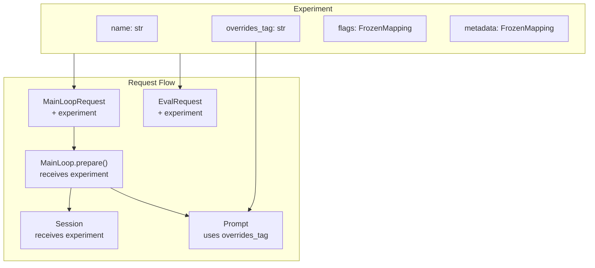

# Experiments Specification

## Purpose

Enable systematic evaluation of agent behavior variants through named experiments.
An experiment bundles a prompt overrides tag with feature flags, allowing
coordinated changes to both prompt content and runtime behavior for A/B testing,
optimization runs, and controlled rollouts.

## Guiding Principles

- **Single source of variance**: One experiment definition controls all dimensions
- **Immutable configuration**: Experiments are frozen snapshots, not mutable state
- **Request-level binding**: Experiments flow through requests, not global state
- **Composable with existing systems**: Leverages prompt overrides infrastructure
- **Evaluation-first design**: Experiments are the primary unit of eval comparison



## Core Types

### Experiment

An immutable bundle of experimental configuration:

```python
@FrozenDataclass()
class Experiment:
    """Named configuration variant for systematic evaluation.

    Bundles a prompt overrides tag with feature flags, enabling coordinated
    changes to prompt content and runtime behavior for A/B testing.

    Attributes:
        name: Unique identifier for this experiment (e.g., "baseline",
            "v2-concise-prompts", "aggressive-tool-use").
        overrides_tag: Tag for prompt overrides resolution. Maps to files in
            `.weakincentives/prompts/overrides/{ns}/{key}/{tag}.json`.
            Defaults to "latest" if not specified.
        flags: Feature flags controlling runtime behavior. Keys are flag names,
            values are flag settings. Agent implementations check these flags
            to conditionally enable features.
        owner: Optional owner identifier (e.g., email, username) for tracking
            who created or is responsible for this experiment.
        description: Optional human-readable description of what this experiment
            tests or changes.
    """

    name: str
    overrides_tag: str = "latest"
    flags: Mapping[str, object] = field(default_factory=dict)
    owner: str | None = None
    description: str | None = None

    def with_flag(self, key: str, value: object) -> "Experiment":
        """Return new experiment with flag added/updated."""
        return replace(self, flags={**self.flags, key: value})

    def with_tag(self, tag: str) -> "Experiment":
        """Return new experiment with different overrides tag."""
        return replace(self, overrides_tag=tag)

    def get_flag(self, key: str, default: T = None) -> T:
        """Get flag value with optional default."""
        return self.flags.get(key, default)

    def has_flag(self, key: str) -> bool:
        """Check if flag is set (any value including False/None)."""
        return key in self.flags
```

### Sentinel Experiments

```python
# Baseline experiment with no overrides or flags
BASELINE = Experiment(name="baseline", overrides_tag="latest")

# Control experiment for A/B tests (explicit name for clarity)
CONTROL = Experiment(name="control", overrides_tag="latest")
```

## Request Integration

### MainLoopRequest

Extended to include optional experiment:

```python
@FrozenDataclass()
class MainLoopRequest[UserRequestT]:
    """Request for MainLoop execution with optional constraints."""

    request: UserRequestT
    budget: Budget | None = None
    deadline: Deadline | None = None
    resources: Mapping[type[object], object] | None = None
    experiment: Experiment | None = None  # NEW
    request_id: UUID = field(default_factory=uuid4)
    created_at: datetime = field(default_factory=lambda: datetime.now(UTC))
```

### EvalRequest

Extended to include required experiment for evaluation:

```python
@dataclass(slots=True, frozen=True)
class EvalRequest[InputT, ExpectedT]:
    """Request to evaluate a sample under an experiment.

    The experiment field is required for eval requests to ensure every
    evaluation is associated with a specific experimental configuration.
    """

    sample: Sample[InputT, ExpectedT]
    experiment: Experiment  # REQUIRED for evals
    request_id: UUID = field(default_factory=uuid4)
    created_at: datetime = field(default_factory=lambda: datetime.now(UTC))
```

### EvalResult

Extended to include experiment reference:

```python
@dataclass(slots=True, frozen=True)
class EvalResult:
    """Result for one sample under an experiment."""

    sample_id: str
    experiment_name: str  # NEW: Links result to experiment
    score: Score
    latency_ms: int
    error: str | None = None
```

## MainLoop Integration

### Prepare Signature

The `prepare` method receives the experiment to configure prompt and session:

```python
class MainLoop[UserRequestT, OutputT](ABC):
    @abstractmethod
    def prepare(
        self,
        request: UserRequestT,
        *,
        experiment: Experiment | None = None,
    ) -> tuple[Prompt[OutputT], Session]:
        """Prepare prompt and session for the given request.

        Args:
            request: The user request to process.
            experiment: Optional experiment configuration. When provided,
                implementations should:
                1. Use experiment.overrides_tag for prompt construction
                2. Pass experiment to session for tracking
                3. Check experiment.flags for behavior changes

        Returns:
            Configured prompt and session tuple.
        """
        ...
```

### Implementation Pattern

```python
class CodeReviewLoop(MainLoop[ReviewRequest, ReviewResult]):
    def __init__(
        self,
        *,
        adapter: ProviderAdapter[ReviewResult],
        dispatcher: ControlDispatcher,
        overrides_store: PromptOverridesStore | None = None,
    ) -> None:
        super().__init__(adapter=adapter, dispatcher=dispatcher)
        self._overrides_store = overrides_store
        self._template = PromptTemplate[ReviewResult](
            ns="reviews",
            key="code-review",
            sections=[...],
        )

    def prepare(
        self,
        request: ReviewRequest,
        *,
        experiment: Experiment | None = None,
    ) -> tuple[Prompt[ReviewResult], Session]:
        # Determine overrides tag from experiment or default
        overrides_tag = (
            experiment.overrides_tag if experiment else "latest"
        )

        # Create prompt with experiment's overrides tag
        prompt = Prompt(
            self._template,
            overrides_store=self._overrides_store,
            overrides_tag=overrides_tag,
        ).bind(ReviewParams.from_request(request))

        # Create session with experiment reference
        session = Session(
            dispatcher=self._dispatcher,
            tags={"loop": "code-review"},
        )

        # Seed session with experiment for tracking
        if experiment:
            session[Experiment].seed(experiment)

        # Check feature flags for behavior changes
        if experiment and experiment.get_flag("verbose_logging"):
            session[LogLevel].seed(LogLevel.DEBUG)

        return prompt, session
```

### Execute Flow

The execute method passes experiment to prepare:

```python
def _execute(
    self,
    request_event: MainLoopRequest[UserRequestT],
    *,
    heartbeat: Heartbeat | None = None,
) -> tuple[PromptResponse[OutputT], Session]:
    # Pass experiment to prepare
    prompt, session = self.prepare(
        request_event.request,
        experiment=request_event.experiment,
    )

    # ... rest of execution unchanged
```

## EvalLoop Integration

### Configuration

```python
@FrozenDataclass()
class EvalLoopConfig:
    """Configuration for EvalLoop execution defaults."""

    lease_extender: LeaseExtenderConfig | None = None
    default_experiment: Experiment | None = None  # NEW: Fallback if not in request
```

### Execution

EvalLoop passes the experiment from request to MainLoop:

```python
def _evaluate_sample(
    self,
    request: EvalRequest[InputT, ExpectedT],
) -> EvalResult:
    sample = request.sample
    experiment = request.experiment
    start = time.monotonic()

    # Execute with experiment context
    response, session = self._loop.execute(
        sample.input,
        experiment=experiment,
        heartbeat=self._heartbeat,
    )
    latency_ms = int((time.monotonic() - start) * 1000)

    # ... scoring logic ...

    return EvalResult(
        sample_id=sample.id,
        experiment_name=experiment.name,
        score=score,
        latency_ms=latency_ms,
    )
```

## Feature Flags

### Common Flag Patterns

```python
# Boolean flags
experiment = Experiment(
    name="verbose-mode",
    flags={"verbose_logging": True, "debug_tools": True},
)

# Numeric flags
experiment = Experiment(
    name="aggressive-retry",
    flags={"max_retries": 5, "retry_delay_ms": 100},
)

# String flags
experiment = Experiment(
    name="alt-model",
    flags={"model_override": "gpt-4o-mini"},
)

# Composite flags
experiment = Experiment(
    name="custom-behavior",
    flags={
        "tool_policy": {"allow": ["search", "read"], "deny": ["write"]},
        "budget_multiplier": 1.5,
    },
)
```

### Flag Checking in Handlers

```python
def prepare(
    self,
    request: Request,
    *,
    experiment: Experiment | None = None,
) -> tuple[Prompt[Output], Session]:
    prompt = Prompt(self._template)

    # Check flag with default
    max_retries = (
        experiment.get_flag("max_retries", 3)
        if experiment else 3
    )

    # Check boolean flag
    if experiment and experiment.get_flag("enable_caching"):
        prompt = prompt.bind(resources={Cache: Cache()})

    # Check flag existence (flag might be False)
    if experiment and experiment.has_flag("model_override"):
        model = experiment.get_flag("model_override")
        # ... use alternate model

    return prompt, Session(dispatcher=self._dispatcher)
```

## Session Tracking

### Seeding Pattern

```python
def prepare(
    self,
    request: Request,
    *,
    experiment: Experiment | None = None,
) -> tuple[Prompt[Output], Session]:
    session = Session(dispatcher=self._dispatcher)

    if experiment:
        # Seed experiment into session for tracking
        session[Experiment].seed(experiment)

    return Prompt(self._template), session
```

### Session-Aware Evaluation

Evaluators can access experiment from session:

```python
def experiment_matches(expected_name: str) -> SessionEvaluator[Any, Any]:
    """Assert the sample ran under the expected experiment."""
    def evaluate(output: Any, expected: Any, session: SessionView) -> Score:
        experiment = session[Experiment].latest()
        if experiment is None:
            return Score(value=0.0, passed=False, reason="No experiment in session")
        passed = experiment.name == expected_name
        return Score(
            value=1.0 if passed else 0.0,
            passed=passed,
            reason=f"experiment={experiment.name}, expected={expected_name}",
        )
    return evaluate
```

## Dataset Submission

### Per-Experiment Submission

```python
def submit_dataset_with_experiment(
    dataset: Dataset[InputT, ExpectedT],
    experiment: Experiment,
    requests: Mailbox[EvalRequest[InputT, ExpectedT]],
) -> None:
    """Submit all samples with a specific experiment."""
    for sample in dataset:
        requests.send(EvalRequest(sample=sample, experiment=experiment))
```

### Multi-Experiment Submission

```python
def submit_experiments(
    dataset: Dataset[InputT, ExpectedT],
    experiments: Sequence[Experiment],
    requests: Mailbox[EvalRequest[InputT, ExpectedT]],
) -> int:
    """Submit dataset under multiple experiments for comparison.

    Returns total number of requests submitted.
    """
    count = 0
    for experiment in experiments:
        for sample in dataset:
            requests.send(EvalRequest(sample=sample, experiment=experiment))
            count += 1
    return count
```

## Result Aggregation

### EvalReport Extensions

```python
@dataclass(slots=True, frozen=True)
class EvalReport:
    """Aggregate evaluation results with experiment breakdown."""

    results: tuple[EvalResult, ...]

    def by_experiment(self) -> dict[str, tuple[EvalResult, ...]]:
        """Group results by experiment name."""
        groups: dict[str, list[EvalResult]] = {}
        for result in self.results:
            groups.setdefault(result.experiment_name, []).append(result)
        return {k: tuple(v) for k, v in groups.items()}

    def pass_rate_by_experiment(self) -> dict[str, float]:
        """Compute pass rate for each experiment."""
        rates = {}
        for name, results in self.by_experiment().items():
            successful = [r for r in results if r.error is None]
            if successful:
                rates[name] = sum(1 for r in successful if r.score.passed) / len(successful)
            else:
                rates[name] = 0.0
        return rates

    def mean_score_by_experiment(self) -> dict[str, float]:
        """Compute mean score for each experiment."""
        scores = {}
        for name, results in self.by_experiment().items():
            successful = [r for r in results if r.error is None]
            if successful:
                scores[name] = sum(r.score.value for r in successful) / len(successful)
            else:
                scores[name] = 0.0
        return scores

    def compare_experiments(
        self,
        baseline: str,
        treatment: str,
    ) -> ExperimentComparison:
        """Compare two experiments statistically."""
        by_exp = self.by_experiment()
        baseline_results = by_exp.get(baseline, ())
        treatment_results = by_exp.get(treatment, ())
        return ExperimentComparison(
            baseline_name=baseline,
            treatment_name=treatment,
            baseline_results=baseline_results,
            treatment_results=treatment_results,
        )


@dataclass(slots=True, frozen=True)
class ExperimentComparison:
    """Statistical comparison between two experiments."""

    baseline_name: str
    treatment_name: str
    baseline_results: tuple[EvalResult, ...]
    treatment_results: tuple[EvalResult, ...]

    @property
    def baseline_pass_rate(self) -> float:
        successful = [r for r in self.baseline_results if r.error is None]
        if not successful:
            return 0.0
        return sum(1 for r in successful if r.score.passed) / len(successful)

    @property
    def treatment_pass_rate(self) -> float:
        successful = [r for r in self.treatment_results if r.error is None]
        if not successful:
            return 0.0
        return sum(1 for r in successful if r.score.passed) / len(successful)

    @property
    def pass_rate_delta(self) -> float:
        """Treatment pass rate minus baseline pass rate."""
        return self.treatment_pass_rate - self.baseline_pass_rate

    @property
    def relative_improvement(self) -> float | None:
        """Percentage improvement over baseline. None if baseline is 0."""
        if self.baseline_pass_rate == 0:
            return None
        return self.pass_rate_delta / self.baseline_pass_rate
```

## Usage Examples

### Basic A/B Test

```python
from weakincentives.evals import (
    Dataset, EvalLoop, Experiment, BASELINE,
    submit_experiments, collect_results,
)

# Define experiments
baseline = BASELINE
treatment = Experiment(
    name="concise-prompts",
    overrides_tag="v2-concise",
    flags={"max_response_tokens": 500},
    owner="alice@example.com",
    description="Test shorter, more direct prompt phrasing",
)

# Load dataset
dataset = Dataset.load(Path("qa.jsonl"), str, str)

# Submit under both experiments
submit_experiments(dataset, [baseline, treatment], requests)

# Run workers and collect results
eval_loop.run(max_iterations=len(dataset) * 2)
report = collect_results(results, expected_count=len(dataset) * 2)

# Compare
comparison = report.compare_experiments("baseline", "concise-prompts")
print(f"Baseline pass rate: {comparison.baseline_pass_rate:.1%}")
print(f"Treatment pass rate: {comparison.treatment_pass_rate:.1%}")
print(f"Delta: {comparison.pass_rate_delta:+.1%}")
```

### Feature Flag Experiment

```python
# Test different tool policies
conservative = Experiment(
    name="conservative-tools",
    flags={"tool_policy": "conservative", "max_tool_calls": 3},
)

aggressive = Experiment(
    name="aggressive-tools",
    flags={"tool_policy": "aggressive", "max_tool_calls": 10},
)

submit_experiments(dataset, [conservative, aggressive], requests)
```

### Prompt Optimization Workflow

```python
from weakincentives.contrib.overrides import LocalPromptOverridesStore

# Seed baseline overrides
store = LocalPromptOverridesStore()
store.seed(prompt, tag="baseline")

# Create variant
store.copy_tag(
    ns=prompt.descriptor.ns,
    prompt_key=prompt.descriptor.key,
    from_tag="baseline",
    to_tag="variant-1",
)

# Edit variant via store.store() or direct JSON editing

# Run comparison
baseline_exp = Experiment(name="baseline", overrides_tag="baseline")
variant_exp = Experiment(name="variant-1", overrides_tag="variant-1")

submit_experiments(dataset, [baseline_exp, variant_exp], requests)
```

### Multi-Dimensional Experiment

```python
# Test combinations of prompt + flags
experiments = [
    Experiment(name="baseline", overrides_tag="latest"),
    Experiment(name="v2-prompts", overrides_tag="v2"),
    Experiment(name="v2-prompts+caching", overrides_tag="v2", flags={"enable_cache": True}),
    Experiment(name="v2-prompts+verbose", overrides_tag="v2", flags={"verbose": True}),
]

submit_experiments(dataset, experiments, requests)
report = collect_results(results, expected_count=len(dataset) * len(experiments))

# Analyze all variants
for name, rate in report.pass_rate_by_experiment().items():
    print(f"{name}: {rate:.1%}")
```

## Storage Layout

Experiments themselves are not persisted—they're defined in code and passed
through requests. The prompt overrides they reference are persisted:

```
.weakincentives/
  prompts/
    overrides/
      {ns}/
        {prompt_key}/
          latest.json      # Default overrides
          baseline.json    # Baseline experiment tag
          v2-concise.json  # Treatment experiment tag
          variant-1.json   # Another variant
```

## Invariants

1. **Experiment names are unique within an eval run**: Results are grouped by
   `experiment_name`; duplicates would conflate results.

1. **Overrides tags must exist**: If `experiment.overrides_tag` references a
   non-existent tag, prompt rendering falls back to source content (no override
   applied). This is silent—check tag existence explicitly if needed.

1. **Flags are not validated**: Flag names and values are arbitrary. Invalid
   flags are silently ignored unless implementations explicitly check them.

1. **Experiments are immutable**: Use `with_flag()` and `with_tag()` to create
   modified copies rather than mutating.

1. **EvalRequest requires experiment**: Unlike MainLoopRequest where experiment
   is optional (for backward compatibility), EvalRequest requires an experiment
   to ensure all eval results are attributable.

## Backward Compatibility

MainLoopRequest.experiment is optional with None default. Existing code that
doesn't use experiments continues to work:

```python
# Old code still works
dispatcher.dispatch(MainLoopRequest(request=my_request))

# New code can specify experiment
dispatcher.dispatch(MainLoopRequest(
    request=my_request,
    experiment=Experiment(name="test", overrides_tag="v2"),
))
```

MainLoop implementations should handle `experiment=None` gracefully:

```python
def prepare(
    self,
    request: Request,
    *,
    experiment: Experiment | None = None,
) -> tuple[Prompt[Output], Session]:
    # Safe handling of None experiment
    overrides_tag = experiment.overrides_tag if experiment else "latest"
    # ...
```

## Related Specifications

- `specs/PROMPT_OPTIMIZATION.md` - Override system that experiments reference
- `specs/EVALS.md` - Evaluation framework that experiments enable
- `specs/MAIN_LOOP.md` - MainLoop integration for experiment execution
- `specs/RUN_CONTEXT.md` - Execution metadata (orthogonal to experiments)
- `specs/SESSIONS.md` - Session tracking for experiment observability

## Relationship to RunContext

`Experiment` and `RunContext` are orthogonal concepts that can be used together:

| Concept | Purpose | Answers |
|---------|---------|---------|
| `Experiment` | Configuration variant | "Which prompt/flags are being tested?" |
| `RunContext` | Execution metadata | "Where/when/how is this running?" |

Both can be specified on `MainLoopRequest`:

```python
request = MainLoopRequest(
    request=my_request,
    experiment=Experiment(name="v2-prompts", overrides_tag="v2"),
    run_context=RunContext(trace_id="trace-abc", worker_id="worker-1"),
)
```

`Experiment` affects prompt rendering and agent behavior. `RunContext` provides
correlation IDs for tracing and debugging. Neither depends on the other.
