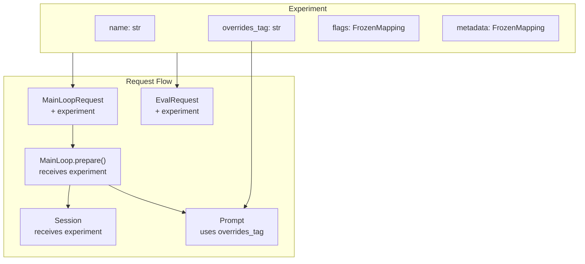

# Experiments Specification

## Purpose

Enable systematic evaluation of agent behavior variants through named experiments.
An experiment bundles a prompt overrides tag with feature flags, allowing
coordinated changes to both prompt content and runtime behavior for A/B testing,
optimization runs, and controlled rollouts.

## Guiding Principles

- **Single source of variance**: One experiment definition controls all dimensions
- **Immutable configuration**: Experiments are frozen snapshots, not mutable state
- **Request-level binding**: Experiments flow through requests, not global state
- **Composable with existing systems**: Leverages prompt overrides infrastructure
- **Evaluation-first design**: Experiments are the primary unit of eval comparison



## Core Types

### Experiment

An immutable bundle of experimental configuration:

```python
@FrozenDataclass()
class Experiment:
    """Named configuration variant for systematic evaluation.

    Bundles a prompt overrides tag with feature flags, enabling coordinated
    changes to prompt content and runtime behavior for A/B testing.

    Attributes:
        name: Unique identifier for this experiment (e.g., "baseline",
            "v2-concise-prompts", "aggressive-tool-use").
        overrides_tag: Tag for prompt overrides resolution. Maps to files in
            `.weakincentives/prompts/overrides/{ns}/{key}/{tag}.json`.
            Defaults to "latest" if not specified.
        flags: Feature flags controlling runtime behavior. Keys are flag names,
            values are flag settings. Agent implementations check these flags
            to conditionally enable features.
        owner: Optional owner identifier (e.g., email, username) for tracking
            who created or is responsible for this experiment.
        description: Optional human-readable description of what this experiment
            tests or changes.
    """

    name: str
    overrides_tag: str = "latest"
    flags: Mapping[str, object] = field(default_factory=dict)
    owner: str | None = None
    description: str | None = None

    def with_flag(self, key: str, value: object) -> "Experiment":
        """Return new experiment with flag added/updated."""
        return replace(self, flags={**self.flags, key: value})

    def with_tag(self, tag: str) -> "Experiment":
        """Return new experiment with different overrides tag."""
        return replace(self, overrides_tag=tag)

    def get_flag(self, key: str, default: T = None) -> T:
        """Get flag value with optional default."""
        return self.flags.get(key, default)

    def has_flag(self, key: str) -> bool:
        """Check if flag is set (any value including False/None)."""
        return key in self.flags
```

### Sentinel Experiments

```python
# Baseline experiment with no overrides or flags
BASELINE = Experiment(name="baseline", overrides_tag="latest")

# Control experiment for A/B tests (explicit name for clarity)
CONTROL = Experiment(name="control", overrides_tag="latest")
```

## Request Integration

### MainLoopRequest

Extended to include optional experiment:

```python
@FrozenDataclass()
class MainLoopRequest[UserRequestT]:
    """Request for MainLoop execution with optional constraints."""

    request: UserRequestT
    budget: Budget | None = None
    deadline: Deadline | None = None
    resources: Mapping[type[object], object] | None = None
    experiment: Experiment | None = None  # NEW
    request_id: UUID = field(default_factory=uuid4)
    created_at: datetime = field(default_factory=lambda: datetime.now(UTC))
```

### EvalRequest

Extended to include required experiment for evaluation:

```python
@dataclass(slots=True, frozen=True)
class EvalRequest[InputT, ExpectedT]:
    """Request to evaluate a sample under an experiment.

    The experiment field is required for eval requests to ensure every
    evaluation is associated with a specific experimental configuration.
    """

    sample: Sample[InputT, ExpectedT]
    experiment: Experiment  # REQUIRED for evals
    request_id: UUID = field(default_factory=uuid4)
    created_at: datetime = field(default_factory=lambda: datetime.now(UTC))
```

### EvalResult

Extended to include experiment reference:

```python
@dataclass(slots=True, frozen=True)
class EvalResult:
    """Result for one sample under an experiment."""

    sample_id: str
    experiment_name: str  # NEW: Links result to experiment
    score: Score
    latency_ms: int
    error: str | None = None
```

## MainLoop Integration

### Prepare Signature

The `prepare` method receives the experiment to configure prompt and session:

```python
class MainLoop[UserRequestT, OutputT](ABC):
    @abstractmethod
    def prepare(
        self,
        request: UserRequestT,
        *,
        experiment: Experiment | None = None,
    ) -> tuple[Prompt[OutputT], Session]:
        """Prepare prompt and session for the given request.

        Args:
            request: The user request to process.
            experiment: Optional experiment configuration. When provided,
                implementations should:
                1. Use experiment.overrides_tag for prompt construction
                2. Pass experiment to session for tracking
                3. Check experiment.flags for behavior changes

        Returns:
            Configured prompt and session tuple.
        """
        ...
```

### Implementation Pattern

MainLoop implementations integrate experiments in `prepare()`:

| Integration Point | Pattern | Example |
|-------------------|---------|---------|
| **Prompt overrides** | Extract `overrides_tag` from experiment and pass to `Prompt()` constructor | `Prompt(template, overrides_tag=experiment.overrides_tag)` |
| **Session tracking** | Seed experiment into session slice for observability | `session[Experiment].seed(experiment)` |
| **Feature flags** | Check `experiment.flags` to conditionally modify behavior | `if experiment.get_flag("verbose"): ...` |

The base `MainLoop._execute()` automatically passes the experiment from the request
to `prepare()`, so implementations only need to handle it in their `prepare()` method.

**Reference implementation**: See `CodeReviewLoop.prepare()` in
`code_reviewer_example.py` for a complete example (lines 266-290).

### Backward Compatibility

The `experiment` parameter defaults to `None`, so existing implementations continue
to work:

```python
# Old signature still works
def prepare(self, request: Request) -> tuple[Prompt, Session]:
    ...

# New signature adds optional parameter
def prepare(self, request: Request, *, experiment: Experiment | None = None) -> tuple[Prompt, Session]:
    overrides_tag = experiment.overrides_tag if experiment else "latest"
    ...
```

## Feature Flags

### Design

Feature flags allow runtime behavior changes without code modifications. Flags are
arbitrary key-value pairs checked by agent implementations:

| Flag Type | Example | Usage |
|-----------|---------|-------|
| **Boolean** | `{"verbose_logging": True}` | Enable/disable features |
| **Numeric** | `{"max_retries": 5}` | Tune thresholds |
| **String** | `{"model_override": "gpt-4o-mini"}` | Switch variants |
| **Composite** | `{"tool_policy": {"allow": ["read"]}}` | Structured config |

### Access Pattern

```python
# Get flag with default
max_retries = experiment.get_flag("max_retries", 3) if experiment else 3

# Check boolean flag
if experiment and experiment.get_flag("enable_caching"):
    # ... enable feature

# Check flag existence (handles False/None values)
if experiment and experiment.has_flag("model_override"):
    model = experiment.get_flag("model_override")
```

**Important**: Flags are not validated. Invalid flag names are silently ignored
unless implementations explicitly check them.

## Session Tracking

Experiments can be seeded into sessions for observability and evaluation:

```python
if experiment:
    session[Experiment].seed(experiment)
```

Session-aware evaluators can then inspect which experiment a session ran under:

```python
def experiment_matches(expected_name: str) -> SessionEvaluator[Any, Any]:
    """Assert the sample ran under the expected experiment."""
    def evaluate(output: Any, expected: Any, session: SessionView) -> Score:
        experiment = session[Experiment].latest()
        passed = experiment is not None and experiment.name == expected_name
        return Score(value=1.0 if passed else 0.0, passed=passed)
    return evaluate
```

## EvalLoop Integration

### Configuration

EvalLoop can specify a default experiment for requests that don't provide one:

```python
@FrozenDataclass()
class EvalLoopConfig:
    """Configuration for EvalLoop execution defaults."""

    lease_extender: LeaseExtenderConfig | None = None
    default_experiment: Experiment | None = None  # Fallback if not in request
```

### Execution

EvalLoop passes the experiment from `EvalRequest` to MainLoop and includes the
experiment name in `EvalResult` for downstream aggregation. See
`EvalLoop._evaluate_sample()` implementation for details.

## Dataset Submission Patterns

### Single Experiment

Submit all samples under one experiment:

```python
for sample in dataset:
    mailbox.send(EvalRequest(sample=sample, experiment=experiment))
```

### Multi-Experiment (A/B Testing)

Submit the same dataset under multiple experiments for comparison:

```python
def submit_experiments(
    dataset: Dataset[InputT, ExpectedT],
    experiments: Sequence[Experiment],
    requests: Mailbox[EvalRequest[InputT, ExpectedT]],
) -> int:
    """Submit dataset under multiple experiments.

    Returns total number of requests submitted (len(dataset) * len(experiments)).
    """
    count = 0
    for experiment in experiments:
        for sample in dataset:
            requests.send(EvalRequest(sample=sample, experiment=experiment))
            count += 1
    return count
```

Helper utilities for dataset submission are provided in `weakincentives.evals`.

## Result Aggregation

### EvalReport Extensions

`EvalReport` provides methods to group and compare results by experiment:

```python
@dataclass(slots=True, frozen=True)
class EvalReport:
    """Aggregate evaluation results with experiment breakdown."""

    results: tuple[EvalResult, ...]

    def by_experiment(self) -> dict[str, tuple[EvalResult, ...]]:
        """Group results by experiment name."""
        ...

    def pass_rate_by_experiment(self) -> dict[str, float]:
        """Compute pass rate for each experiment."""
        ...

    def mean_score_by_experiment(self) -> dict[str, float]:
        """Compute mean score for each experiment."""
        ...

    def compare_experiments(
        self,
        baseline: str,
        treatment: str,
    ) -> ExperimentComparison:
        """Compare two experiments statistically."""
        ...
```

### ExperimentComparison

```python
@dataclass(slots=True, frozen=True)
class ExperimentComparison:
    """Statistical comparison between two experiments."""

    baseline_name: str
    treatment_name: str
    baseline_results: tuple[EvalResult, ...]
    treatment_results: tuple[EvalResult, ...]

    @property
    def baseline_pass_rate(self) -> float:
        """Pass rate for baseline experiment."""
        ...

    @property
    def treatment_pass_rate(self) -> float:
        """Pass rate for treatment experiment."""
        ...

    @property
    def pass_rate_delta(self) -> float:
        """Treatment pass rate minus baseline pass rate."""
        ...

    @property
    def relative_improvement(self) -> float | None:
        """Percentage improvement over baseline. None if baseline is 0."""
        ...
```

## Common Workflows

### Basic A/B Test

1. Define baseline and treatment experiments
1. Submit dataset under both experiments using `submit_experiments()`
1. Run EvalLoop to process all requests
1. Collect results into `EvalReport`
1. Use `report.compare_experiments()` to compute deltas

### Feature Flag Experiment

1. Create experiments with different flag values
1. In `MainLoop.prepare()`, check flags and modify behavior accordingly
1. Submit and evaluate as above

### Prompt Optimization

1. Seed baseline overrides to `PromptOverridesStore`
1. Create variant tags (copy/modify override files)
1. Create experiments pointing to different tags
1. Submit dataset under all experiment variants
1. Compare results to identify best-performing prompts

See `specs/PROMPTS.md` for detailed override workflow.

## Storage Layout

Experiments themselves are not persisted—they're defined in code and passed
through requests. The prompt overrides they reference are persisted:

```
.weakincentives/
  prompts/
    overrides/
      {ns}/
        {prompt_key}/
          latest.json      # Default overrides
          baseline.json    # Baseline experiment tag
          v2-concise.json  # Treatment experiment tag
          variant-1.json   # Another variant
```

## Invariants

1. **Experiment names are unique within an eval run**: Results are grouped by
   `experiment_name`; duplicates would conflate results.

1. **Overrides tags must exist**: If `experiment.overrides_tag` references a
   non-existent tag, prompt rendering falls back to source content (no override
   applied). This is silent—check tag existence explicitly if needed.

1. **Flags are not validated**: Flag names and values are arbitrary. Invalid
   flags are silently ignored unless implementations explicitly check them.

1. **Experiments are immutable**: Use `with_flag()` and `with_tag()` to create
   modified copies rather than mutating.

1. **EvalRequest requires experiment**: Unlike MainLoopRequest where experiment
   is optional (for backward compatibility), EvalRequest requires an experiment
   to ensure all eval results are attributable.

1. **Experiment equality is value-based**: Two experiments with identical fields
   are considered equal, even if constructed separately.

## Relationship to RunContext

`Experiment` and `RunContext` are orthogonal concepts that can be used together:

| Concept | Purpose | Answers |
|---------|---------|---------|
| `Experiment` | Configuration variant | "Which prompt/flags are being tested?" |
| `RunContext` | Execution metadata | "Where/when/how is this running?" |

Both can be specified on `MainLoopRequest`:

```python
request = MainLoopRequest(
    request=my_request,
    experiment=Experiment(name="v2-prompts", overrides_tag="v2"),
    run_context=RunContext(trace_id="trace-abc", worker_id="worker-1"),
)
```

`Experiment` affects prompt rendering and agent behavior. `RunContext` provides
correlation IDs for tracing and debugging. Neither depends on the other.

## Related Specifications

- **`specs/PROMPTS.md`** - Override system that experiments reference
  via `overrides_tag`. Covers override storage, seeding, and rendering.

- **`specs/EVALS.md`** - Evaluation framework using experiments as the primary unit
  of comparison. Covers datasets, evaluators, and EvalLoop.

- **`specs/MAIN_LOOP.md`** - MainLoop orchestration and `prepare()` method where
  experiments are applied to prompts and sessions.

- **`specs/RUN_CONTEXT.md`** - Execution metadata (orthogonal to experiments).

- **`specs/SESSIONS.md`** - Session tracking for experiment observability.
  Experiments can be seeded into sessions as a slice.

## Migration Notes

Existing code without experiment support continues to work:

```python
# Old code - still works
dispatcher.dispatch(MainLoopRequest(request=my_request))

# New code - with experiment
dispatcher.dispatch(MainLoopRequest(
    request=my_request,
    experiment=Experiment(name="test", overrides_tag="v2"),
))
```

MainLoop implementations should add the `experiment` parameter to their `prepare()`
method signature with a default of `None`, then handle it gracefully:

```python
def prepare(
    self,
    request: Request,
    *,
    experiment: Experiment | None = None,
) -> tuple[Prompt[Output], Session]:
    # Safe handling of None experiment
    overrides_tag = experiment.overrides_tag if experiment else "latest"
    prompt = Prompt(self._template, overrides_tag=overrides_tag)

    session = Session(dispatcher=self._dispatcher)
    if experiment:
        session[Experiment].seed(experiment)

    return prompt, session
```

This allows incremental adoption without breaking existing code.
