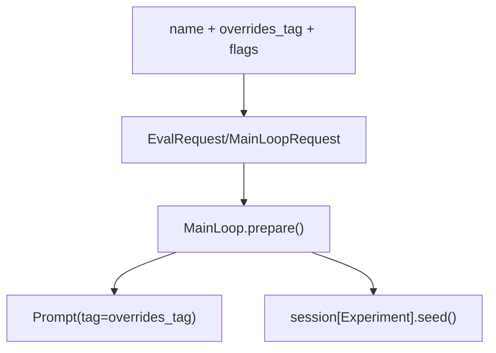

# Experiments Specification

Named configuration variants for A/B testing: prompt overrides tags + feature flags.

**Source:** `src/weakincentives/experiments.py`

## Principles

- **Single source of variance**: One experiment controls all dimensions
- **Request-level binding**: Flows through requests, not global state
- **Evaluation-first**: Primary unit of eval comparison



## Experiment

**Definition:** `experiments.py:Experiment`

```python
Experiment(
    name: str,
    overrides_tag: str = "latest",
    flags: Mapping[str, object] = {},
    owner: str | None = None,
    description: str | None = None,
)
```

| Method | Purpose |
|--------|---------|
| `with_flag(key, value)` | New experiment with flag |
| `with_tag(tag)` | New experiment with different tag |
| `get_flag(key, default)` | Get flag value |
| `has_flag(key)` | Check flag existence |

## Request Integration

```python
MainLoopRequest(request=..., experiment=experiment)  # Optional
EvalRequest(sample=..., experiment=experiment)       # Required
```

## MainLoop Integration

```python
def prepare(self, request, *, experiment: Experiment | None = None):
    overrides_tag = experiment.overrides_tag if experiment else "latest"
    prompt = Prompt(template, overrides_tag=overrides_tag)
    session = Session(...)
    if experiment:
        session[Experiment].seed(experiment)
    return prompt, session
```

## Feature Flags

| Type | Example |
|------|---------|
| Boolean | `{"verbose": True}` |
| Numeric | `{"max_retries": 5}` |
| String | `{"model": "gpt-4o-mini"}` |

## Result Aggregation

```python
report.by_experiment()           # Group by experiment name
report.pass_rate_by_experiment() # Per-experiment metrics
report.compare_experiments(baseline, treatment)  # Statistical comparison
```

## Invariants

- Experiment names unique within eval run
- Missing overrides tags fall back silently
- Flags are not validated (ignore invalid)
- EvalRequest requires experiment (MainLoopRequest optional)
