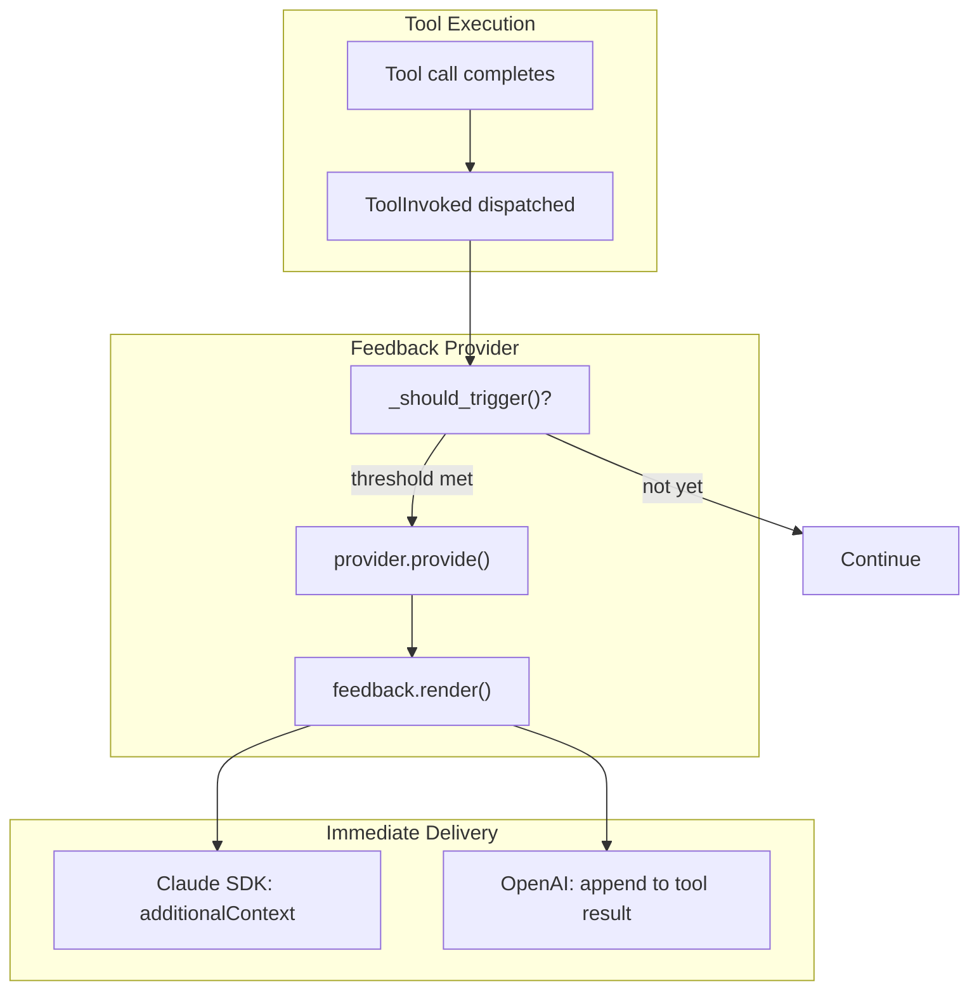

# Feedback Provider Specification

## Purpose

Feedback providers deliver ongoing feedback about agent progress during
unattended execution. Unlike tool policies that gate individual calls,
providers analyze patterns over time and inject feedback into the agent's
context. This enables soft course-correction without hard intervention.

## Guiding Principles

- **Immediate delivery**: Feedback is injected as additional context
  immediately after tool execution via hook response.
- **Non-blocking feedback**: Providers produce guidance, not gates. The agent
  decides how to respond.
- **Resource access**: Providers have access to session state and prompt
  resources via `FeedbackContext`, mirroring `ToolContext`.

## Architecture



## Core Types

### FeedbackProvider Protocol

```python
class FeedbackProvider(Protocol):
    """Protocol for programmatic feedback about agent progress."""

    @property
    def name(self) -> str:
        """Unique identifier for this provider."""
        ...

    def should_run(
        self,
        session: Session,
        *,
        context: FeedbackContext,
    ) -> bool:
        """Determine if provider should produce feedback."""
        ...

    def provide(
        self,
        session: Session,
        *,
        context: FeedbackContext,
    ) -> Feedback:
        """Analyze trajectory and produce feedback."""
        ...
```

### Feedback

```python
@dataclass(frozen=True)
class Feedback:
    """Structured feedback from a feedback provider."""

    provider_name: str
    summary: str
    observations: tuple[Observation, ...] = ()
    suggestions: tuple[str, ...] = ()
    severity: Literal["info", "caution", "warning"] = "info"
    timestamp: datetime = field(default_factory=datetime.utcnow)
    call_index: int = 0

    def render(self) -> str:
        """Render as concise text for context injection."""
        lines = [
            f"[Feedback - {self.provider_name}]",
            "",
            self.summary,
        ]

        if self.observations:
            lines.append("")
            for obs in self.observations:
                lines.append(f"• {obs.category}: {obs.description}")

        if self.suggestions:
            lines.append("")
            for suggestion in self.suggestions:
                lines.append(f"→ {suggestion}")

        return "\n".join(lines)
```

### Observation

```python
@dataclass(frozen=True)
class Observation:
    """Single observation about the agent's trajectory."""

    category: str
    description: str
    evidence: str | None = None
```

### FeedbackContext

Mirrors `ToolContext` for resource access:

```python
@dataclass(frozen=True)
class FeedbackContext:
    """Context provided to feedback providers.

    Provides access to session state and prompt resources, mirroring the
    ToolContext interface for consistency.
    """

    session: Session
    prompt: PromptProtocol[Any]
    deadline: Deadline | None = None

    @property
    def resources(self) -> PromptResources:
        """Access resources from the prompt's resource context."""
        return self.prompt.resources

    @property
    def filesystem(self) -> Filesystem | None:
        """Return the filesystem resource, if available."""
        return self.resources.get_optional(Filesystem)

    @property
    def last_feedback(self) -> Feedback | None:
        """Most recent feedback, if any."""
        return self.session[Feedback].latest()

    @property
    def tool_call_count(self) -> int:
        """Total tool calls in session."""
        return len(self.session[ToolInvoked].all())

    def tool_calls_since_last_feedback(self) -> int:
        """Number of tool calls since last feedback."""
        last = self.last_feedback
        if last is None:
            return self.tool_call_count
        return self.tool_call_count - last.call_index

    def recent_tool_calls(self, n: int) -> Sequence[ToolInvoked]:
        """Retrieve the N most recent tool invocations."""
        records = self.session[ToolInvoked].all()
        return records[-n:] if len(records) >= n else records
```

## Configuration

### FeedbackTrigger

```python
@dataclass(frozen=True)
class FeedbackTrigger:
    """Conditions that trigger provider execution."""

    every_n_calls: int | None = None
    every_n_seconds: float | None = None
```

Triggers are OR'd together: if either condition is met, the provider runs.

### FeedbackProviderConfig

```python
@dataclass(frozen=True)
class FeedbackProviderConfig:
    """Configuration for a feedback provider."""

    provider: FeedbackProvider
    trigger: FeedbackTrigger
```

## Prompt Integration

Feedback providers are declared on the prompt template, following the same
pattern as policies:

```python
template = PromptTemplate[OutputType](
    ns="my-agent",
    key="main",
    sections=[...],
    policies=[ReadBeforeWritePolicy()],
    feedback_providers=[
        FeedbackProviderConfig(
            provider=DeadlineFeedback(),
            trigger=FeedbackTrigger(every_n_seconds=30),
        ),
    ],
)
```

The `Prompt` class exposes the configured providers:

```python
@property
def feedback_providers(self) -> tuple[FeedbackProviderConfig, ...]:
    """Return feedback providers configured on this prompt."""
    return self.template.feedback_providers
```

Adapters access providers from the prompt rather than receiving them as
constructor arguments. This keeps configuration centralized and consistent
with how policies are managed.

## Integration: Claude Agent SDK

The provider runs in the `PostToolUse` hook and returns feedback via
`additionalContext`. This mirrors how task completion feedback is delivered.

```python
async def post_tool_use_hook(
    input_data: Any,
    tool_use_id: str | None,
    sdk_context: Any,
) -> dict[str, Any]:
    # ... existing ToolInvoked dispatch ...

    # Run feedback providers from prompt
    prompt = hook_context.prompt
    feedback_context = FeedbackContext(
        session=hook_context.session,
        prompt=prompt,
        deadline=hook_context.deadline,
    )
    feedback_text = run_feedback_providers(
        providers=prompt.feedback_providers,
        context=feedback_context,
        session=hook_context.session,
    )

    if feedback_text:
        return {
            "hookSpecificOutput": {
                "hookEventName": "PostToolUse",
                "additionalContext": feedback_text,
            }
        }

    return {}
```

## Integration: OpenAI Adapter

For the OpenAI adapter, feedback is appended to the tool result message:

```python
def execute_tool_call(
    *,
    context: ToolExecutionContext,
    tool_call: ProviderToolCall,
) -> tuple[ToolInvoked, ToolResult[SupportsToolResult]]:
    """Execute tool call with feedback provider support."""

    with tool_execution(context=context, tool_call=tool_call) as outcome:
        invocation = dispatch_tool_invocation(context=context, outcome=outcome)

    # Run feedback providers from prompt
    feedback_context = FeedbackContext(
        session=context.session,
        prompt=context.prompt,
        deadline=context.deadline,
    )
    feedback_text = run_feedback_providers(
        providers=context.prompt.feedback_providers,
        context=feedback_context,
        session=context.session,
    )

    if feedback_text and outcome.result.message:
        outcome.result = replace(
            outcome.result,
            message=f"{outcome.result.message}\n\n{feedback_text}",
        )

    return invocation, outcome.result
```

## Shared Provider Runner

Both adapters use shared helpers for provider execution:

```python
def run_feedback_providers(
    *,
    providers: Sequence[FeedbackProviderConfig],
    context: FeedbackContext,
    session: Session,
) -> str | None:
    """Run providers and return rendered feedback if triggered."""

    for config in providers:
        if _should_trigger(config.trigger, context):
            if config.provider.should_run(session, context=context):
                feedback = config.provider.provide(session, context=context)
                feedback = replace(feedback, call_index=context.tool_call_count)
                session[Feedback].append(feedback)
                return feedback.render()

    return None


def _should_trigger(trigger: FeedbackTrigger, context: FeedbackContext) -> bool:
    """Check if any trigger condition is met."""

    if trigger.every_n_calls:
        if context.tool_calls_since_last_feedback() >= trigger.every_n_calls:
            return True

    if trigger.every_n_seconds:
        last = context.last_feedback
        if last:
            elapsed = (datetime.utcnow() - last.timestamp).total_seconds()
            if elapsed >= trigger.every_n_seconds:
                return True
        else:
            return True  # No previous feedback

    return False
```

## Built-in Provider: DeadlineFeedback

Reports remaining time until deadline. Default trigger: every 30 seconds.

```python
@dataclass(frozen=True)
class DeadlineFeedback:
    """Report remaining time until deadline."""

    warning_threshold_seconds: float = 120  # 2 minutes

    @property
    def name(self) -> str:
        return "Deadline"

    def should_run(self, session: Session, *, context: FeedbackContext) -> bool:
        return context.deadline is not None

    def provide(self, session: Session, *, context: FeedbackContext) -> Feedback:
        remaining = context.deadline.remaining().total_seconds()

        if remaining <= 0:
            return Feedback(
                provider_name=self.name,
                summary="You have reached the time deadline.",
                suggestions=("Wrap up immediately.",),
                severity="warning",
            )

        summary = f"You have {self._format_duration(remaining)} remaining."
        suggestions: tuple[str, ...] = ()
        severity: Literal["info", "caution", "warning"] = "info"

        if remaining <= self.warning_threshold_seconds:
            severity = "warning"
            suggestions = (
                "Prioritize completing critical remaining work.",
                "Consider summarizing progress and remaining tasks.",
            )

        return Feedback(
            provider_name=self.name,
            summary=summary,
            suggestions=suggestions,
            severity=severity,
        )

    def _format_duration(self, seconds: float) -> str:
        if seconds < 60:
            return f"{int(seconds)} seconds"
        elif seconds < 3600:
            minutes = int(seconds / 60)
            return f"{minutes} minute{'s' if minutes != 1 else ''}"
        else:
            return f"{seconds / 3600:.1f} hours"
```

## Example Output

When injected via `additionalContext`:

```
[Feedback - Deadline]

You have 8 minutes remaining.
```

Warning (< 2 minutes):

```
[Feedback - Deadline]

You have 90 seconds remaining.

→ Prioritize completing critical remaining work.
→ Consider summarizing progress and remaining tasks.
```

## State Management

| Slice | Purpose | Mutation |
|-------|---------|----------|
| `ToolInvoked` | Tool invocation log (existing) | Append via dispatch |
| `Feedback` | Feedback history | Append after provider runs |

The `Feedback` slice provides history for trigger calculations and debugging.
Immediate delivery happens via hook response.

```python
session[Feedback].all()
# [Feedback(..., call_index=10), Feedback(..., call_index=40), ...]

session[Feedback].latest()
# Feedback(provider_name="Deadline", call_index=40, ...)
```

## Design Decisions

### Why immediate delivery via hook response?

1. **Single prompt architecture**: WINK has one prompt that runs continuously.
   No outer workflow to inject context between turns.
1. **Mirrors task completion**: Task completion checker uses `additionalContext`
   for immediate feedback.
1. **No prompt rebuilding**: Feedback injects without re-rendering.

### Why store in slice if delivered immediately?

1. **Trigger state**: Need to know when last feedback occurred
1. **Debugging**: Feedback history aids troubleshooting

### Why no escalation?

Budget exhaustion provides the backstop for unattended agents.

## Limitations

- **Single provider per check**: First matching provider wins
- **Synchronous**: Providers block tool completion briefly
- **Text feedback**: Agent interprets natural language guidance

## Future Providers

Potential extensions (out of scope):

- **StallDetector**: Repeated tool calls, read-write thrashing
- **ErrorCascadeDetector**: Consecutive failures
- **DriftDetector**: Working on unrelated files
