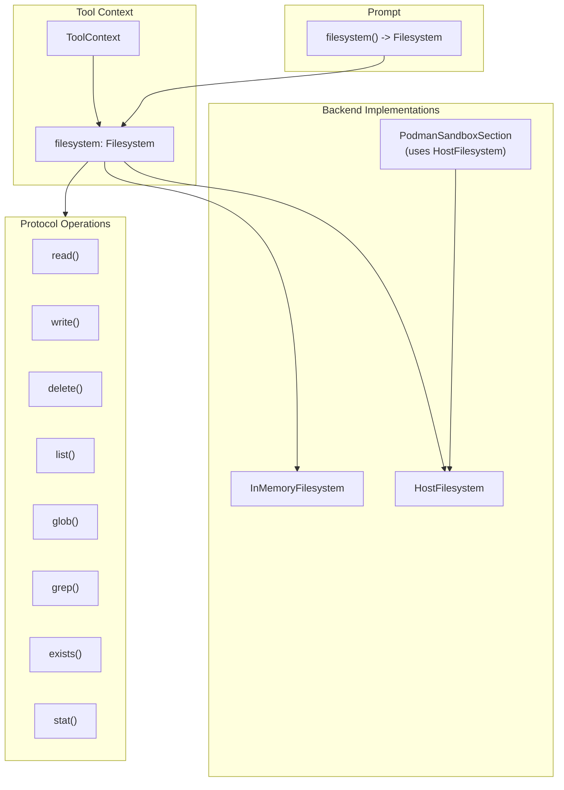
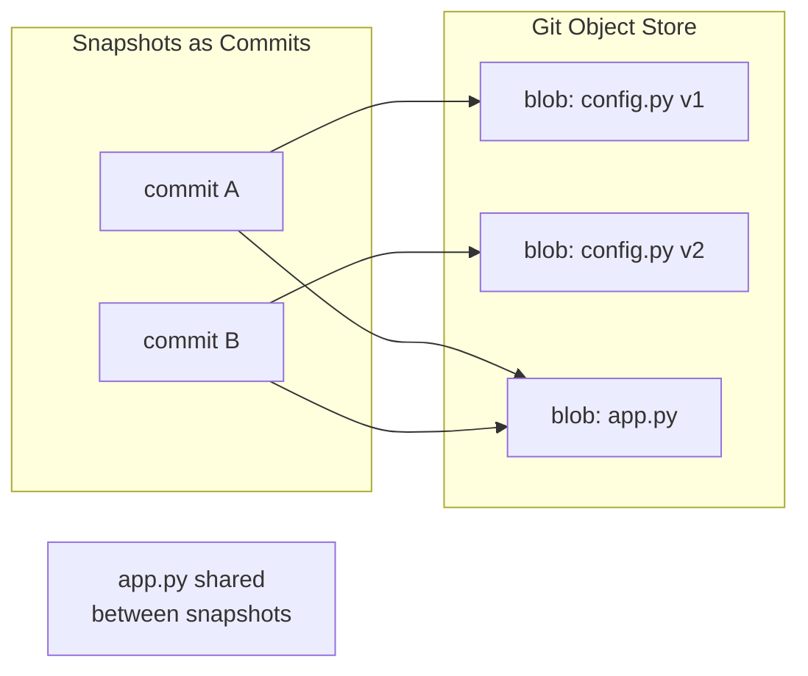

# Filesystem Protocol Specification

## Purpose

This specification defines a unified `Filesystem` protocol that tools access
through `ToolContext`. The protocol abstracts over workspace backends
(in-memory VFS, Podman containers, host filesystem) so tool handlers can
perform file operations without coupling to a specific storage implementation.

## Guiding Principles

- **Single access pattern**: Tools use one protocol regardless of backend.
- **Context-scoped**: The filesystem instance lives on `ToolContext` and
  `Prompt`, not global state.
- **Immutable snapshots**: Read operations return immutable data; writes go
  through the protocol and may be journaled.
- **Backend-managed state**: Backends manage their own persistence; no session
  slice coupling.
- **Backend-agnostic tools**: Tool handlers call `context.filesystem.*` and
  remain portable across workspace types.



## Protocol Definition

### Result Types

```python
from typing import Protocol, Literal
from collections.abc import Sequence
from datetime import datetime

class FileStat(Protocol):
    """Metadata for a file or directory."""

    @property
    def path(self) -> str: ...

    @property
    def is_file(self) -> bool: ...

    @property
    def is_directory(self) -> bool: ...

    @property
    def size_bytes(self) -> int: ...

    @property
    def created_at(self) -> datetime | None: ...

    @property
    def modified_at(self) -> datetime | None: ...


class FileEntry(Protocol):
    """Directory listing entry."""

    @property
    def name(self) -> str: ...

    @property
    def path(self) -> str: ...

    @property
    def is_file(self) -> bool: ...

    @property
    def is_directory(self) -> bool: ...


class GlobMatch(Protocol):
    """Result from glob operations."""

    @property
    def path(self) -> str: ...

    @property
    def is_file(self) -> bool: ...


class GrepMatch(Protocol):
    """Result from grep operations."""

    @property
    def path(self) -> str: ...

    @property
    def line_number(self) -> int: ...

    @property
    def line_content(self) -> str: ...

    @property
    def match_start(self) -> int: ...

    @property
    def match_end(self) -> int: ...


class ReadResult(Protocol):
    """Content returned from text read operations."""

    @property
    def content(self) -> str: ...

    @property
    def path(self) -> str: ...

    @property
    def total_lines(self) -> int: ...

    @property
    def offset(self) -> int: ...

    @property
    def limit(self) -> int: ...

    @property
    def truncated(self) -> bool: ...


class ReadBytesResult(Protocol):
    """Content returned from binary read operations."""

    @property
    def content(self) -> bytes: ...

    @property
    def path(self) -> str: ...

    @property
    def size_bytes(self) -> int: ...

    @property
    def offset(self) -> int: ...

    @property
    def limit(self) -> int: ...

    @property
    def truncated(self) -> bool: ...


class WriteResult(Protocol):
    """Confirmation of a write operation."""

    @property
    def path(self) -> str: ...

    @property
    def bytes_written(self) -> int: ...

    @property
    def mode(self) -> Literal["create", "overwrite", "append"]: ...
```

### Filesystem Protocol

```python
class Filesystem(Protocol):
    """Unified filesystem protocol for workspace operations."""

    # --- Read Operations ---

    def read(
        self,
        path: str,
        *,
        offset: int = 0,
        limit: int | None = None,
        encoding: str = "utf-8",
    ) -> ReadResult:
        """Read file content as text with optional pagination.

        Args:
            path: Relative path from workspace root.
            offset: Line number to start reading (0-indexed).
            limit: Maximum lines to return. None means backend default.
            encoding: Text encoding. Only "utf-8" is guaranteed.

        Raises:
            FileNotFoundError: Path does not exist.
            IsADirectoryError: Path is a directory.
            PermissionError: Read access denied.
        """
        ...

    def read_bytes(
        self,
        path: str,
        *,
        offset: int = 0,
        limit: int | None = None,
    ) -> ReadBytesResult:
        """Read file content as raw bytes with optional pagination.

        This is the recommended method for copying files, as it preserves
        binary content exactly without encoding/decoding overhead.

        Args:
            path: Relative path from workspace root.
            offset: Byte offset to start reading (0-indexed).
            limit: Maximum bytes to return. None means read entire file.

        Raises:
            FileNotFoundError: Path does not exist.
            IsADirectoryError: Path is a directory.
            PermissionError: Read access denied.
        """
        ...

    def exists(self, path: str) -> bool:
        """Check if a path exists."""
        ...

    def stat(self, path: str) -> FileStat:
        """Get metadata for a path.

        Raises:
            FileNotFoundError: Path does not exist.
        """
        ...

    def list(self, path: str = ".") -> Sequence[FileEntry]:
        """List directory contents.

        Args:
            path: Directory to list. Defaults to root.

        Raises:
            FileNotFoundError: Path does not exist.
            NotADirectoryError: Path is a file.
        """
        ...

    def glob(
        self,
        pattern: str,
        *,
        path: str = ".",
    ) -> Sequence[GlobMatch]:
        """Match files by glob pattern.

        Args:
            pattern: Glob pattern (e.g., "**/*.py").
            path: Base directory for matching.

        Returns:
            Matching paths sorted by path.
        """
        ...

    def grep(
        self,
        pattern: str,
        *,
        path: str = ".",
        glob: str | None = None,
        max_matches: int | None = None,
    ) -> Sequence[GrepMatch]:
        """Search file contents by regex.

        Args:
            pattern: Regular expression pattern.
            path: Base directory for search.
            glob: Optional file filter pattern.
            max_matches: Limit total matches returned.

        Returns:
            Matches sorted by (path, line_number).
        """
        ...

    # --- Write Operations ---

    def write(
        self,
        path: str,
        content: str,
        *,
        mode: Literal["create", "overwrite", "append"] = "overwrite",
        create_parents: bool = True,
    ) -> WriteResult:
        """Write text content to a file.

        Args:
            path: Relative path from workspace root.
            content: UTF-8 text content.
            mode: Write behavior.
                - "create": Fail if file exists.
                - "overwrite": Replace existing content.
                - "append": Add to end of file.
            create_parents: Create parent directories if missing.

        Raises:
            FileExistsError: mode="create" and file exists.
            FileNotFoundError: Parent directory missing and create_parents=False.
            PermissionError: Write access denied.
            ValueError: Content exceeds backend limits.
        """
        ...

    def write_bytes(
        self,
        path: str,
        content: bytes,
        *,
        mode: Literal["create", "overwrite", "append"] = "overwrite",
        create_parents: bool = True,
    ) -> WriteResult:
        """Write raw bytes to a file.

        This is the recommended method for copying files, as it preserves
        binary content exactly without encoding/decoding overhead.

        Args:
            path: Relative path from workspace root.
            content: Raw byte content.
            mode: Write behavior.
                - "create": Fail if file exists.
                - "overwrite": Replace existing content.
                - "append": Add to end of file.
            create_parents: Create parent directories if missing.

        Raises:
            FileExistsError: mode="create" and file exists.
            FileNotFoundError: Parent directory missing and create_parents=False.
            PermissionError: Write access denied.
            ValueError: Content exceeds backend limits.
        """
        ...

    def delete(
        self,
        path: str,
        *,
        recursive: bool = False,
    ) -> None:
        """Delete a file or directory.

        Args:
            path: Path to delete.
            recursive: If True, delete directories and contents.

        Raises:
            FileNotFoundError: Path does not exist.
            IsADirectoryError: Path is directory and recursive=False.
            PermissionError: Delete access denied.
        """
        ...

    def mkdir(
        self,
        path: str,
        *,
        parents: bool = True,
        exist_ok: bool = True,
    ) -> None:
        """Create a directory.

        Args:
            path: Directory path to create.
            parents: Create parent directories if missing.
            exist_ok: Don't raise if directory exists.

        Raises:
            FileExistsError: Path exists and exist_ok=False.
            FileNotFoundError: Parent missing and parents=False.
        """
        ...

    # --- Metadata ---

    @property
    def root(self) -> str:
        """Workspace root path (may be "/" for virtual filesystems)."""
        ...

    @property
    def read_only(self) -> bool:
        """True if write operations are disabled."""
        ...
```

## ToolContext Integration

### Updated ToolContext

```python
@dataclass(slots=True, frozen=True)
class ToolContext:
    """Immutable container exposing prompt execution state to handlers."""

    prompt: PromptProtocol[Any]
    rendered_prompt: RenderedPromptProtocol[Any] | None
    adapter: ProviderAdapterProtocol[Any]
    session: SessionProtocol
    deadline: Deadline | None = None
    budget_tracker: BudgetTracker | None = None
    filesystem: Filesystem | None = None  # New field
```

### Handler Usage Pattern

Tool handlers access the filesystem through `context.filesystem`:

```python
def read_file_handler(
    params: ReadFileParams,
    *,
    context: ToolContext,
) -> ToolResult[ReadFileResult]:
    if context.filesystem is None:
        return ToolResult(
            message="No filesystem available in this context.",
            value=None,
            success=False,
        )

    try:
        result = context.filesystem.read(
            params.path,
            offset=params.offset,
            limit=params.limit,
        )
    except FileNotFoundError:
        return ToolResult(
            message=f"File not found: {params.path}",
            value=None,
            success=False,
        )

    return ToolResult(
        message=f"Read {result.total_lines} lines from {result.path}",
        value=ReadFileResult(
            content=result.content,
            path=result.path,
            truncated=result.truncated,
        ),
    )
```

## Section Ownership

The `Filesystem` instance is owned by the workspace section that provides file
tools. Sections implementing `WorkspaceSection` expose their filesystem via the
`filesystem` property.

### WorkspaceSection Protocol

```python
class WorkspaceSection(Protocol):
    """Section that provides filesystem access."""

    @property
    def filesystem(self) -> Filesystem:
        """Return the filesystem managed by this section."""
        ...
```

### Section Implementation Pattern

Workspace sections create and manage their filesystem instance:

```python
class VfsToolsSection(MarkdownSection[_VfsSectionParams]):
    """Prompt section providing virtual filesystem tools."""

    def __init__(
        self,
        *,
        mounts: Sequence[HostMount] = (),
        allowed_host_roots: Sequence[os.PathLike[str] | str] = (),
        accepts_overrides: bool = False,
    ) -> None:
        self._filesystem = InMemoryFilesystem()

        # Hydrate from host mounts
        for mount in mounts:
            self._filesystem.hydrate_from_host(
                mount,
                allowed_roots=allowed_host_roots,
            )

        # Build tool suite bound to this filesystem
        tools = self._build_tools()
        super().__init__(...)

    @property
    def filesystem(self) -> Filesystem:
        """Return the filesystem managed by this section."""
        return self._filesystem
```

## Prompt Integration

### Prompt.filesystem() Method

The `Prompt` class exposes a `filesystem()` method that locates the workspace
section in the template and returns its filesystem. This provides convenient
access without requiring callers to navigate the section tree.

```python
class Prompt(Generic[OutputT]):
    def filesystem(self) -> Filesystem | None:
        """Return the filesystem from the workspace section, if present.

        Searches the template's section tree for a section implementing
        WorkspaceSection and returns its filesystem property.

        Returns None if no workspace section exists in the template.
        """
        section = self._find_workspace_section()
        if section is None:
            return None
        return section.filesystem

    def _find_workspace_section(self) -> WorkspaceSection | None:
        """Locate the workspace section in the template tree."""
        for section in self.template.sections:
            if isinstance(section, WorkspaceSection):
                return section
            # Recursively search children
            found = self._search_children(section)
            if found is not None:
                return found
        return None
```

### Adapter Propagation

Adapters construct `ToolContext` with the filesystem from the prompt:

```python
def _build_tool_context(
    self,
    prompt: Prompt[OutputT],
    rendered: RenderedPrompt[OutputT],
    session: SessionProtocol,
) -> ToolContext:
    return ToolContext(
        prompt=prompt,
        rendered_prompt=rendered,
        adapter=self,
        session=session,
        deadline=rendered.deadline,
        filesystem=prompt.filesystem(),  # Propagate from workspace section
    )
```

## Backend Implementations

The filesystem protocol is implemented by multiple backends, each optimized for
different workspace strategies. All backends implement the same protocol,
ensuring tools remain portable.

| Backend | Description | Implementation |
|---------|-------------|----------------|
| **InMemoryFilesystem** | Session-scoped in-memory storage with structural sharing for snapshots. State is managed internally by the backend without session slice coupling. Supports hydration from host mounts at initialization. | `src/weakincentives/filesystem/inmemory.py` |
| **HostFilesystem** | Sandboxed access to a host directory with path validation. Uses git for copy-on-write snapshots, storing the git repository outside the workspace root to prevent agent access. | `src/weakincentives/filesystem/host.py` |
| **PodmanSandboxSection** | Containerized workspace tools using an overlay directory on the host that is bind-mounted into containers. Internally uses `HostFilesystem` rooted at the overlay path, with git-based snapshots. | `src/weakincentives/contrib/tools/podman.py` |

### Design Characteristics

All backends share these characteristics:

- **Exception mapping**: Map internal errors to standard Python exceptions
  (`FileNotFoundError`, `PermissionError`, etc.)
- **Path normalization**: Normalize and validate paths relative to workspace root
- **Limit enforcement**: Enforce backend-specific limits on file size, path depth,
  and operation results
- **Read-only mode**: Support read-only flag to prevent modifications

### PodmanSandboxSection Architecture

`PodmanSandboxSection` manages an overlay directory that serves as the workspace
root. This directory is:

1. Created on the host filesystem at initialization
2. Hydrated with host mounts (files copied in eagerly)
3. Bind-mounted into containers at `/workspace`
4. Backed by a `HostFilesystem` instance for protocol compliance

This design ensures:
- Filesystem operations work before containers are started
- Changes persist across container restarts
- Both host and container have consistent filesystem views
- Snapshots capture the full workspace state

Implementation: `src/weakincentives/contrib/tools/podman.py`

## Limits

Backends enforce their own limits. Recommended defaults:

| Limit | Value | Notes |
| ------------------ | ------------ | ------------------------- |
| Max file size | 48,000 chars | Per write operation |
| Max path depth | 16 segments | Prevents deep nesting |
| Max segment length | 80 chars | Per path component |
| Default read limit | 2,000 lines | Pagination default |
| Max grep matches | 1,000 | Prevents runaway searches |

## Error Handling

### Exception Mapping

All backends map internal errors to standard Python exceptions:

| Backend Error | Python Exception |
| ------------------- | -------------------- |
| File not found | `FileNotFoundError` |
| Path is directory | `IsADirectoryError` |
| Path is file | `NotADirectoryError` |
| Access denied | `PermissionError` |
| File exists | `FileExistsError` |
| Invalid content | `ValueError` |
| Backend unavailable | `RuntimeError` |

### Tool Handler Pattern

```python
def my_handler(params: Params, *, context: ToolContext) -> ToolResult[Result]:
    fs = context.filesystem
    if fs is None:
        return ToolResult(message="No filesystem available", value=None, success=False)

    try:
        # Filesystem operations
        result = fs.read(params.path)
    except FileNotFoundError:
        return ToolResult(message=f"File not found: {params.path}", value=None, success=False)
    except PermissionError as e:
        return ToolResult(message=str(e), value=None, success=False)

    return ToolResult(message="Success", value=Result(...))
```

## Filesystem Snapshots

Filesystem snapshots capture the state of a workspace at a point in time,
enabling rollback after failed tool invocations or exploratory changes.

### Guiding Principles

- **Session-storable**: Snapshots are frozen dataclasses that can be stored in
  session state and serialized.
- **Git-based COW**: Use git's content-addressed storage for copy-on-write
  semantics on disk-backed filesystems.
- **Tool-invocation granularity**: Snapshots are taken between tool calls; we
  do not track sub-operation changes.
- **External git storage**: Git repositories are stored outside the workspace
  root to prevent agents from accessing or modifying snapshot internals.

### FilesystemSnapshot Dataclass

The snapshot is a frozen dataclass suitable for session storage:

```python
@dataclass(slots=True, frozen=True)
class FilesystemSnapshot:
    """Immutable capture of filesystem state, storable in session."""

    snapshot_id: UUID
    created_at: datetime
    commit_ref: str  # Git commit hash (for disk) or version ID (for memory)
    root_path: str   # Filesystem root at snapshot time
    git_dir: str | None = None  # External git directory (for HostFilesystem)
    tag: str | None = None  # Optional human-readable label
```

The `commit_ref` field stores a git commit hash for `HostFilesystem`, or an
internal version identifier for `InMemoryFilesystem`. The `git_dir` field
enables cross-session restore when filesystem instances are recreated.

### SnapshotableFilesystem Protocol

```python
class SnapshotableFilesystem(Filesystem, Protocol):
    """Filesystem that supports snapshot and restore operations."""

    def snapshot(self, *, tag: str | None = None) -> FilesystemSnapshot:
        """Capture current filesystem state.

        Args:
            tag: Optional human-readable label for the snapshot.

        Returns:
            Immutable snapshot that can be stored in session state.
        """
        ...

    def restore(self, snapshot: FilesystemSnapshot) -> None:
        """Restore filesystem to a previous snapshot.

        Args:
            snapshot: The snapshot to restore.

        Raises:
            SnapshotRestoreError: Restore failed (e.g., incompatible snapshot).
        """
        ...
```

### Git-Based Copy-on-Write

Git provides natural copy-on-write semantics through content-addressed storage.
When files are unchanged between snapshots, they share the same blob objects.
This is the unified strategy for all disk-backed filesystems.



**Why Git:**

- **Content-addressed**: Identical files share storage automatically
- **Portable**: Works on any filesystem without special kernel support
- **Well-understood**: Standard tooling for inspection and debugging
- **Atomic commits**: Snapshot creation is atomic

### Implementation Strategies

#### InMemoryFilesystem

Uses Python's structural sharing via frozen dictionaries. Each snapshot freezes
the current file dictionary using `types.MappingProxyType`, preserving string
references. Only modified files allocate new memory. The `commit_ref` is an
internal version number (e.g., `mem-1`, `mem-2`).

Implementation: `src/weakincentives/filesystem/inmemory.py`

#### HostFilesystem

Uses git to manage snapshots. The git repository is stored **outside** the
workspace root in a temporary directory (e.g., `/tmp/wink-git-abc12345`) to
prevent agents from accessing or modifying snapshot internals. Git commands use
`--git-dir` and `--work-tree` flags to separate storage from workspace. The
`snapshot()` method stages all changes and creates a commit. The `restore()`
method uses `git reset --hard` followed by `git clean -xfd` for strict rollback.

Implementation: `src/weakincentives/filesystem/host.py`

#### PodmanSandboxSection

Delegates to its internal `HostFilesystem` on the overlay directory. Since the
overlay is bind-mounted into containers, git commits capture the workspace
state as seen by both host and container. Changes made by containerized tools
are captured when `snapshot()` is called.

Implementation: `src/weakincentives/contrib/tools/podman.py`

### Session Integration

`FilesystemSnapshot` is designed for session storage:

```python
# Register reducer for filesystem snapshots
session[FilesystemSnapshot].register(FilesystemSnapshot, append_all)

# Create and store snapshot
fs_snapshot = filesystem.snapshot(tag="before-refactor")
session[FilesystemSnapshot].append(fs_snapshot)

# Later: retrieve and restore
snapshots = session[FilesystemSnapshot].all()
filesystem.restore(snapshots[-1])
```

For coordinated session and filesystem restore:

```python
def rollback_to(
    session: Session,
    session_snapshot: Snapshot,
    filesystem: SnapshotableFilesystem,
) -> None:
    """Restore both session state and filesystem."""
    # Find the filesystem snapshot from that session state
    fs_snapshots = session_snapshot.slices.get(FilesystemSnapshot, ())
    if fs_snapshots:
        filesystem.restore(fs_snapshots[-1])

    # Restore session state
    session.restore(session_snapshot)
```

### Error Handling

```python
class SnapshotError(WinkError, RuntimeError):
    """Base class for snapshot errors."""


class SnapshotRestoreError(SnapshotError):
    """Failed to restore from snapshot."""
```

### Usage Example

```python
from weakincentives.filesystem import HostFilesystem

# Create filesystem with snapshot support
fs = HostFilesystem(_root="/workspace/project")

# Initial state
fs.write("config.py", "DEBUG = True")
snapshot_v1 = fs.snapshot(tag="initial")

# Make changes
fs.write("config.py", "DEBUG = False")
fs.write("tests.py", "import pytest")
snapshot_v2 = fs.snapshot(tag="with-tests")

# Rollback to initial state
fs.restore(snapshot_v1)
assert fs.read("config.py").content == "DEBUG = True"
assert not fs.exists("tests.py")

# Restore to modified state
fs.restore(snapshot_v2)
assert fs.read("config.py").content == "DEBUG = False"
assert fs.exists("tests.py")
```

### Snapshot Limitations

- **Git dependency**: Disk-backed snapshots require git to be installed
- **No partial restore**: Restore is all-or-nothing for the entire workspace
- **Tool-level granularity**: Sub-operation changes within a tool invocation
  are not tracked

## Testing

### Protocol Compliance

Backend implementations must pass the `FilesystemProtocolTests` suite, which
validates all protocol methods including read/write operations, error handling,
path normalization, and pagination behavior. The test suite uses abstract
factory methods so concrete backends can be tested against the same contract.

Test suite: `tests/test_filesystem/test_protocol_compliance.py`

### Mock Filesystem

For unit testing tools without a real backend, use `MockFilesystem` which
records method calls and allows pre-configured responses. This test double
enables fast, isolated tool handler tests.

Implementation: `tests/helpers/mock_filesystem.py`

### Integration Tests

Integration tests verify host mounts, containerized execution, and snapshot
restore across session boundaries. These tests use temporary directories and
may spawn containers.

Test location: `tests/test_filesystem/`

## Binary File Support

The filesystem protocol supports both text and binary operations:

- **`read()` / `write()`**: Text operations using UTF-8 encoding. Use for
  source code, configuration files, and other text content.
- **`read_bytes()` / `write_bytes()`**: Binary operations without encoding.
  Use for copying files, images, compiled binaries, and other binary content.

For file copying, always prefer `read_bytes()` / `write_bytes()` as they
preserve content exactly without encoding overhead or potential data loss.

## Limitations

- **No symlinks**: Symbolic links are not followed by default.
- **No permissions model**: Beyond read-only flag, no Unix-style permissions.
- **Single-threaded**: Backends are not thread-safe; use one per session.
- **No streaming**: Large files are loaded entirely into memory.
- **Path normalization**: Backends normalize paths; original casing may not be
  preserved.

## Usage Example

```python
from weakincentives.prompt import Prompt, PromptTemplate, MarkdownSection
from weakincentives.contrib.tools import VfsToolsSection, HostMount

# Build prompt with workspace section
# The section owns and manages its filesystem
vfs_section = VfsToolsSection(
    mounts=(
        HostMount(host_path="src/", include_glob=("*.py",)),
        HostMount(host_path="docs/", include_glob=("*.md",)),
    ),
    allowed_host_roots=("/path/to/project",),
)

template = PromptTemplate(
    ns="agents/coder",
    key="edit-files",
    sections=[
        MarkdownSection(
            title="Instructions",
            key="instructions",
            template="Edit files as requested.",
        ),
        vfs_section,
    ],
)

prompt = Prompt(template)

# Access filesystem via prompt (delegates to workspace section)
fs = prompt.filesystem()
assert fs is vfs_section.filesystem  # Same instance

# Pre-populate or inspect before evaluation
fs.write("scratch/notes.txt", "Working notes...")
assert fs.exists("src/main.py")  # Hydrated from host mount

# During evaluation, tools receive the same filesystem via context
# context.filesystem.read("src/main.py") works in tool handlers
```
