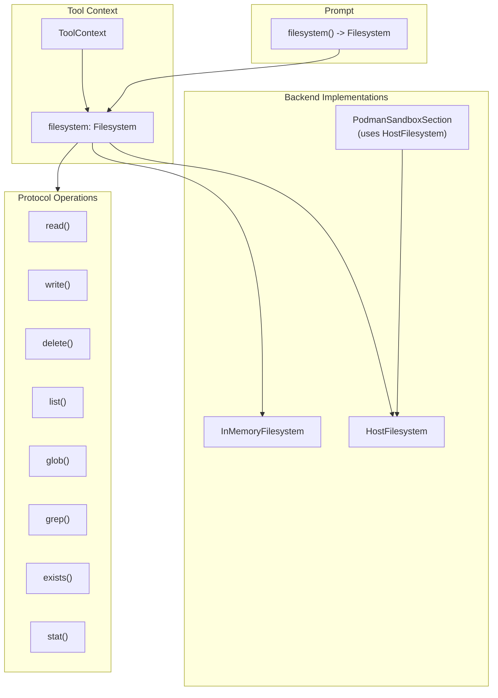
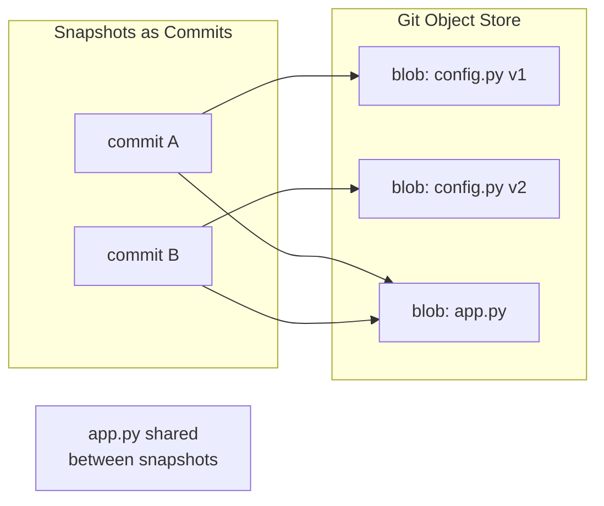

# Filesystem Protocol Specification

## Purpose

This specification defines a unified `Filesystem` protocol that tools access
through `ToolContext`. The protocol abstracts over workspace backends
(in-memory VFS, Podman containers, host filesystem) so tool handlers can
perform file operations without coupling to a specific storage implementation.

## Guiding Principles

- **Single access pattern**: Tools use one protocol regardless of backend.
- **Context-scoped**: The filesystem instance lives on `ToolContext` and
  `Prompt`, not global state.
- **Immutable snapshots**: Read operations return immutable data; writes go
  through the protocol and may be journaled.
- **Backend-managed state**: Backends manage their own persistence; no session
  slice coupling.
- **Backend-agnostic tools**: Tool handlers call `context.filesystem.*` and
  remain portable across workspace types.



## Protocol Definition

### Filesystem Protocol

```python
from typing import Protocol, Literal
from collections.abc import Sequence
from datetime import datetime

class FileStat(Protocol):
    """Metadata for a file or directory."""

    @property
    def path(self) -> str: ...

    @property
    def is_file(self) -> bool: ...

    @property
    def is_directory(self) -> bool: ...

    @property
    def size_bytes(self) -> int: ...

    @property
    def created_at(self) -> datetime | None: ...

    @property
    def modified_at(self) -> datetime | None: ...


class FileEntry(Protocol):
    """Directory listing entry."""

    @property
    def name(self) -> str: ...

    @property
    def path(self) -> str: ...

    @property
    def is_file(self) -> bool: ...

    @property
    def is_directory(self) -> bool: ...


class GlobMatch(Protocol):
    """Result from glob operations."""

    @property
    def path(self) -> str: ...

    @property
    def is_file(self) -> bool: ...


class GrepMatch(Protocol):
    """Result from grep operations."""

    @property
    def path(self) -> str: ...

    @property
    def line_number(self) -> int: ...

    @property
    def line_content(self) -> str: ...

    @property
    def match_start(self) -> int: ...

    @property
    def match_end(self) -> int: ...


class ReadResult(Protocol):
    """Content returned from read operations."""

    @property
    def content(self) -> str: ...

    @property
    def path(self) -> str: ...

    @property
    def total_lines(self) -> int: ...

    @property
    def offset(self) -> int: ...

    @property
    def limit(self) -> int: ...

    @property
    def truncated(self) -> bool: ...


class WriteResult(Protocol):
    """Confirmation of a write operation."""

    @property
    def path(self) -> str: ...

    @property
    def bytes_written(self) -> int: ...

    @property
    def mode(self) -> Literal["create", "overwrite", "append"]: ...


class Filesystem(Protocol):
    """Unified filesystem protocol for workspace operations."""

    # --- Read Operations ---

    def read(
        self,
        path: str,
        *,
        offset: int = 0,
        limit: int | None = None,
        encoding: str = "utf-8",
    ) -> ReadResult:
        """Read file content with optional pagination.

        Args:
            path: Relative path from workspace root.
            offset: Line number to start reading (0-indexed).
            limit: Maximum lines to return. None means backend default.
            encoding: Text encoding. Only "utf-8" is guaranteed.

        Raises:
            FileNotFoundError: Path does not exist.
            IsADirectoryError: Path is a directory.
            PermissionError: Read access denied.
        """
        ...

    def exists(self, path: str) -> bool:
        """Check if a path exists."""
        ...

    def stat(self, path: str) -> FileStat:
        """Get metadata for a path.

        Raises:
            FileNotFoundError: Path does not exist.
        """
        ...

    def list(self, path: str = ".") -> Sequence[FileEntry]:
        """List directory contents.

        Args:
            path: Directory to list. Defaults to root.

        Raises:
            FileNotFoundError: Path does not exist.
            NotADirectoryError: Path is a file.
        """
        ...

    def glob(
        self,
        pattern: str,
        *,
        path: str = ".",
    ) -> Sequence[GlobMatch]:
        """Match files by glob pattern.

        Args:
            pattern: Glob pattern (e.g., "**/*.py").
            path: Base directory for matching.

        Returns:
            Matching paths sorted by path.
        """
        ...

    def grep(
        self,
        pattern: str,
        *,
        path: str = ".",
        glob: str | None = None,
        max_matches: int | None = None,
    ) -> Sequence[GrepMatch]:
        """Search file contents by regex.

        Args:
            pattern: Regular expression pattern.
            path: Base directory for search.
            glob: Optional file filter pattern.
            max_matches: Limit total matches returned.

        Returns:
            Matches sorted by (path, line_number).
        """
        ...

    # --- Write Operations ---

    def write(
        self,
        path: str,
        content: str,
        *,
        mode: Literal["create", "overwrite", "append"] = "overwrite",
        create_parents: bool = True,
    ) -> WriteResult:
        """Write content to a file.

        Args:
            path: Relative path from workspace root.
            content: UTF-8 text content.
            mode: Write behavior.
                - "create": Fail if file exists.
                - "overwrite": Replace existing content.
                - "append": Add to end of file.
            create_parents: Create parent directories if missing.

        Raises:
            FileExistsError: mode="create" and file exists.
            FileNotFoundError: Parent directory missing and create_parents=False.
            PermissionError: Write access denied.
            ValueError: Content exceeds backend limits.
        """
        ...

    def delete(
        self,
        path: str,
        *,
        recursive: bool = False,
    ) -> None:
        """Delete a file or directory.

        Args:
            path: Path to delete.
            recursive: If True, delete directories and contents.

        Raises:
            FileNotFoundError: Path does not exist.
            IsADirectoryError: Path is directory and recursive=False.
            PermissionError: Delete access denied.
        """
        ...

    def mkdir(
        self,
        path: str,
        *,
        parents: bool = True,
        exist_ok: bool = True,
    ) -> None:
        """Create a directory.

        Args:
            path: Directory path to create.
            parents: Create parent directories if missing.
            exist_ok: Don't raise if directory exists.

        Raises:
            FileExistsError: Path exists and exist_ok=False.
            FileNotFoundError: Parent missing and parents=False.
        """
        ...

    # --- Metadata ---

    @property
    def root(self) -> str:
        """Workspace root path (may be "/" for virtual filesystems)."""
        ...

    @property
    def read_only(self) -> bool:
        """True if write operations are disabled."""
        ...

    @property
    def mount_point(self) -> str | None:
        """Virtual mount point prefix for path normalization.

        When set (e.g., "/workspace"), absolute paths like "/workspace/file.txt"
        are interpreted as "file.txt" relative to the workspace root. This
        allows models to use absolute paths that match container working
        directories while the underlying filesystem uses relative paths.

        Returns None if no mount point is configured (default behavior).
        """
        ...
```

## ToolContext Integration

### Updated ToolContext

```python
@dataclass(slots=True, frozen=True)
class ToolContext:
    """Immutable container exposing prompt execution state to handlers."""

    prompt: PromptProtocol[Any]
    rendered_prompt: RenderedPromptProtocol[Any] | None
    adapter: ProviderAdapterProtocol[Any]
    session: SessionProtocol
    deadline: Deadline | None = None
    budget_tracker: BudgetTracker | None = None
    filesystem: Filesystem | None = None  # New field
```

### Handler Usage

```python
def read_file_handler(
    params: ReadFileParams,
    *,
    context: ToolContext,
) -> ToolResult[ReadFileResult]:
    if context.filesystem is None:
        return ToolResult(
            message="No filesystem available in this context.",
            value=None,
            success=False,
        )

    try:
        result = context.filesystem.read(
            params.path,
            offset=params.offset,
            limit=params.limit,
        )
    except FileNotFoundError:
        return ToolResult(
            message=f"File not found: {params.path}",
            value=None,
            success=False,
        )

    return ToolResult(
        message=f"Read {result.total_lines} lines from {result.path}",
        value=ReadFileResult(
            content=result.content,
            path=result.path,
            truncated=result.truncated,
        ),
    )
```

## Section Ownership

The `Filesystem` instance is owned by the workspace section that provides file
tools. Sections implementing `WorkspaceSection` expose their filesystem via the
`filesystem` property.

### WorkspaceSection Protocol

```python
class WorkspaceSection(Protocol):
    """Section that provides filesystem access."""

    @property
    def filesystem(self) -> Filesystem:
        """Return the filesystem managed by this section."""
        ...
```

### Section Implementation

```python
class VfsToolsSection(MarkdownSection[_VfsSectionParams]):
    """Prompt section providing virtual filesystem tools."""

    def __init__(
        self,
        *,
        mounts: Sequence[HostMount] = (),
        allowed_host_roots: Sequence[os.PathLike[str] | str] = (),
        accepts_overrides: bool = False,
    ) -> None:
        self._filesystem = InMemoryFilesystem()

        # Hydrate from host mounts
        for mount in mounts:
            self._filesystem.hydrate_from_host(
                mount,
                allowed_roots=allowed_host_roots,
            )

        # Build tool suite bound to this filesystem
        tools = self._build_tools()
        super().__init__(...)

    @property
    def filesystem(self) -> Filesystem:
        """Return the filesystem managed by this section."""
        return self._filesystem
```

## Prompt Integration

### Prompt.filesystem() Method

The `Prompt` class exposes a `filesystem()` method that locates the workspace
section in the template and returns its filesystem. This provides convenient
access without requiring callers to navigate the section tree.

```python
class Prompt(Generic[OutputT]):
    def filesystem(self) -> Filesystem | None:
        """Return the filesystem from the workspace section, if present.

        Searches the template's section tree for a section implementing
        WorkspaceSection and returns its filesystem property.

        Returns None if no workspace section exists in the template.
        """
        section = self._find_workspace_section()
        if section is None:
            return None
        return section.filesystem

    def _find_workspace_section(self) -> WorkspaceSection | None:
        """Locate the workspace section in the template tree."""
        for section in self.template.sections:
            if isinstance(section, WorkspaceSection):
                return section
            # Recursively search children
            found = self._search_children(section)
            if found is not None:
                return found
        return None
```

### Adapter Propagation

Adapters construct `ToolContext` with the filesystem from the prompt:

```python
def _build_tool_context(
    self,
    prompt: Prompt[OutputT],
    rendered: RenderedPrompt[OutputT],
    session: SessionProtocol,
) -> ToolContext:
    return ToolContext(
        prompt=prompt,
        rendered_prompt=rendered,
        adapter=self,
        session=session,
        deadline=rendered.deadline,
        filesystem=prompt.filesystem(),  # Propagate from workspace section
    )
```

## Backend Implementations

### InMemoryFilesystem

Session-scoped in-memory storage. State is managed internally by the backend.

```python
@dataclass(slots=True)
class InMemoryFilesystem:
    """In-memory filesystem implementation."""

    _files: dict[str, _InMemoryFile] = field(default_factory=dict)
    _directories: set[str] = field(default_factory=set)
    _read_only: bool = False
    _mount_point: str | None = None

    @property
    def root(self) -> str:
        return "/"

    @property
    def read_only(self) -> bool:
        return self._read_only

    @property
    def mount_point(self) -> str | None:
        return self._mount_point

    def read(self, path: str, *, offset: int = 0, limit: int | None = None, encoding: str = "utf-8") -> ReadResult:
        normalized = self._normalize_path(path)
        if normalized not in self._files:
            raise FileNotFoundError(path)
        file = self._files[normalized]
        lines = file.content.splitlines(keepends=True)
        # ... pagination logic
        return _InMemoryReadResult(...)

    def write(self, path: str, content: str, *, mode: Literal["create", "overwrite", "append"] = "overwrite", create_parents: bool = True) -> WriteResult:
        if self._read_only:
            raise PermissionError("Filesystem is read-only")
        # ... write logic
        return _InMemoryWriteResult(...)

    # ... remaining methods
```

### PodmanSandboxSection

`PodmanSandboxSection` provides containerized workspace tools. It manages an
overlay directory on the host that is bind-mounted into the Podman container.
Filesystem operations use a `HostFilesystem` instance rooted at the overlay
path, with a mount point set to `/workspace` so that paths like
`/workspace/file.txt` are correctly interpreted as relative paths.

```python
class PodmanSandboxSection(MarkdownSection[_PodmanSectionParams]):
    """Prompt section providing containerized workspace tools."""

    def __init__(
        self,
        *,
        session: Session,
        config: PodmanSandboxConfig | None = None,
    ) -> None:
        config = config or PodmanSandboxConfig()
        self._session = session
        self._image = config.image

        # Create overlay directory for bind-mounting into container
        self._overlay_path = self._overlay_root / str(self._session.session_id)
        self._overlay_path.mkdir(parents=True, exist_ok=True)

        # Hydrate host mounts into overlay eagerly
        for mount in self._resolved_mounts:
            self._copy_mount_into_overlay(overlay=self._overlay_path, mount=mount)

        # Use HostFilesystem rooted at overlay with /workspace mount point
        self._filesystem = HostFilesystem(
            _root=str(self._overlay_path),
            _mount_point="/workspace",
        )
        ...

    @property
    def filesystem(self) -> Filesystem:
        """Return the filesystem managed by this section."""
        return self._filesystem
```

The overlay directory is bind-mounted into the container at `/workspace`. When
agents write files via filesystem tools, those changes appear both on the host
(in the overlay) and inside the container. This design ensures filesystem
operations work before a container is started and persist across container
restarts.

### HostFilesystem

Provides sandboxed access to a host directory with path restrictions.

```python
@dataclass(slots=True)
class HostFilesystem:
    """Filesystem backed by a host directory with path restrictions."""

    _root: str
    _read_only: bool = False
    _mount_point: str | None = None

    @property
    def root(self) -> str:
        return self._root

    @property
    def read_only(self) -> bool:
        return self._read_only

    @property
    def mount_point(self) -> str | None:
        return self._mount_point

    def _resolve_path(self, path: str) -> Path:
        """Resolve a relative path to an absolute path within root.

        Raises:
            PermissionError: If resolved path escapes root directory.
        """
        root_path = Path(self._root).resolve()
        if not path or path in {".", "/"}:
            return root_path
        candidate = (root_path / path).resolve()
        try:
            _ = candidate.relative_to(root_path)
        except ValueError:
            raise PermissionError(f"Path escapes root directory: {path}") from None
        return candidate

    def read(self, path: str, **kwargs) -> ReadResult:
        resolved = self._resolve_path(path)
        # ... standard file read
        return _HostReadResult(...)

    # ... remaining methods
```

## Limits

Backends enforce their own limits. Recommended defaults:

| Limit | Value | Notes |
| ------------------ | ------------ | ------------------------- |
| Max file size | 48,000 chars | Per write operation |
| Max path depth | 16 segments | Prevents deep nesting |
| Max segment length | 80 chars | Per path component |
| Default read limit | 2,000 lines | Pagination default |
| Max grep matches | 1,000 | Prevents runaway searches |

## Error Handling

### Exception Mapping

All backends map internal errors to standard Python exceptions:

| Backend Error | Python Exception |
| ------------------- | -------------------- |
| File not found | `FileNotFoundError` |
| Path is directory | `IsADirectoryError` |
| Path is file | `NotADirectoryError` |
| Access denied | `PermissionError` |
| File exists | `FileExistsError` |
| Invalid content | `ValueError` |
| Backend unavailable | `RuntimeError` |

### Tool Handler Pattern

```python
def my_handler(params: Params, *, context: ToolContext) -> ToolResult[Result]:
    fs = context.filesystem
    if fs is None:
        return ToolResult(message="No filesystem available", value=None, success=False)

    try:
        # Filesystem operations
        result = fs.read(params.path)
    except FileNotFoundError:
        return ToolResult(message=f"File not found: {params.path}", value=None, success=False)
    except PermissionError as e:
        return ToolResult(message=str(e), value=None, success=False)

    return ToolResult(message="Success", value=Result(...))
```

## Testing

### Protocol Compliance

Backend implementations must pass the `FilesystemProtocolTests` suite:

```python
class FilesystemProtocolTests:
    """Abstract test suite for Filesystem implementations."""

    @abstractmethod
    def create_filesystem(self) -> Filesystem:
        """Factory method for the filesystem under test."""
        ...

    def test_read_nonexistent_raises(self):
        fs = self.create_filesystem()
        with pytest.raises(FileNotFoundError):
            fs.read("does_not_exist.txt")

    def test_write_and_read_roundtrip(self):
        fs = self.create_filesystem()
        fs.write("test.txt", "hello world")
        result = fs.read("test.txt")
        assert result.content == "hello world"

    # ... comprehensive test coverage
```

### Mock Filesystem

For unit testing tools without a real backend:

```python
class MockFilesystem:
    """Test double for filesystem operations."""

    def __init__(self, files: dict[str, str] | None = None):
        self._files = files or {}
        self.read_calls: list[str] = []
        self.write_calls: list[tuple[str, str]] = []

    def read(self, path: str, **kwargs) -> ReadResult:
        self.read_calls.append(path)
        if path not in self._files:
            raise FileNotFoundError(path)
        return MockReadResult(content=self._files[path], path=path)

    # ... other methods
```

## Usage Example

```python
from weakincentives.prompt import Prompt, PromptTemplate, MarkdownSection
from weakincentives.contrib.tools import VfsToolsSection, HostMount

# Build prompt with workspace section
# The section owns and manages its filesystem
vfs_section = VfsToolsSection(
    mounts=(
        HostMount(host_path="src/", include_glob=("*.py",)),
        HostMount(host_path="docs/", include_glob=("*.md",)),
    ),
    allowed_host_roots=("/path/to/project",),
)

template = PromptTemplate(
    ns="agents/coder",
    key="edit-files",
    sections=[
        MarkdownSection(
            title="Instructions",
            key="instructions",
            template="Edit files as requested.",
        ),
        vfs_section,
    ],
)

prompt = Prompt(template)

# Access filesystem via prompt (delegates to workspace section)
fs = prompt.filesystem()
assert fs is vfs_section.filesystem  # Same instance

# Pre-populate or inspect before evaluation
fs.write("scratch/notes.txt", "Working notes...")
assert fs.exists("src/main.py")  # Hydrated from host mount

# During evaluation, tools receive the same filesystem via context
# context.filesystem.read("src/main.py") works in tool handlers
```

## Filesystem Snapshots

Filesystem snapshots capture the state of a workspace at a point in time,
enabling rollback after failed tool invocations or exploratory changes.

### Guiding Principles

- **Session-storable**: Snapshots are frozen dataclasses that can be stored in
  session state and serialized.
- **Git-based COW**: Use git's content-addressed storage for copy-on-write
  semantics on disk-backed filesystems.
- **Tool-invocation granularity**: Snapshots are taken between tool calls; we
  do not track sub-operation changes.
- **External git storage**: Git repositories are stored outside the workspace
  root to prevent agents from accessing or modifying snapshot internals.

### FilesystemSnapshot Dataclass

The snapshot is a frozen dataclass suitable for session storage:

```python
@dataclass(slots=True, frozen=True)
class FilesystemSnapshot:
    """Immutable capture of filesystem state, storable in session."""

    snapshot_id: UUID
    created_at: datetime
    commit_ref: str  # Git commit hash (for disk) or version ID (for memory)
    root_path: str   # Filesystem root at snapshot time
    git_dir: str | None = None  # External git directory (for HostFilesystem)
    tag: str | None = None  # Optional human-readable label
```

The `commit_ref` field stores a git commit hash for `HostFilesystem` (including
when used by `PodmanSandboxSection`), or an internal version identifier for
`InMemoryFilesystem`.

The `git_dir` field stores the path to the external git repository for
`HostFilesystem`, enabling cross-session restore when the filesystem instance
is recreated.

### SnapshotableFilesystem Protocol

```python
class SnapshotableFilesystem(Filesystem, Protocol):
    """Filesystem that supports snapshot and restore operations."""

    def snapshot(self, *, tag: str | None = None) -> FilesystemSnapshot:
        """Capture current filesystem state.

        Args:
            tag: Optional human-readable label for the snapshot.

        Returns:
            Immutable snapshot that can be stored in session state.
        """
        ...

    def restore(self, snapshot: FilesystemSnapshot) -> None:
        """Restore filesystem to a previous snapshot.

        Args:
            snapshot: The snapshot to restore.

        Raises:
            SnapshotRestoreError: Restore failed (e.g., incompatible snapshot).
        """
        ...
```

### Git-Based Copy-on-Write

Git provides natural copy-on-write semantics through content-addressed storage.
When files are unchanged between snapshots, they share the same blob objects.
This is the unified strategy for all disk-backed filesystems.



**Why Git:**

- **Content-addressed**: Identical files share storage automatically
- **Portable**: Works on any filesystem without special kernel support
- **Well-understood**: Standard tooling for inspection and debugging
- **Atomic commits**: Snapshot creation is atomic

### InMemoryFilesystem Implementation

For in-memory filesystems, we use Python's structural sharing rather than git:

```python
@dataclass(slots=True)
class InMemoryFilesystem:
    """In-memory filesystem with snapshot support via structural sharing."""

    _files: dict[str, _InMemoryFile]
    _directories: set[str]
    _snapshots: dict[str, _InMemoryState]  # commit_ref -> frozen state
    _version: int = 0

    def snapshot(self, *, tag: str | None = None) -> FilesystemSnapshot:
        """Capture state by freezing current dict references."""
        self._version += 1
        commit_ref = f"mem-{self._version}"

        # Freeze current state (O(n) dict copy, but values are shared refs)
        frozen_state = _InMemoryState(
            files=types.MappingProxyType(dict(self._files)),
            directories=frozenset(self._directories),
        )
        self._snapshots[commit_ref] = frozen_state

        return FilesystemSnapshot(
            snapshot_id=uuid4(),
            created_at=datetime.now(UTC),
            commit_ref=commit_ref,
            root_path="/",
            tag=tag,
        )

    def restore(self, snapshot: FilesystemSnapshot) -> None:
        """Restore from frozen state."""
        if snapshot.commit_ref not in self._snapshots:
            raise SnapshotRestoreError(f"Unknown snapshot: {snapshot.commit_ref}")

        frozen = self._snapshots[snapshot.commit_ref]
        self._files = dict(frozen.files)  # Mutable copy, shared values
        self._directories = set(frozen.directories)
```

File content strings are shared between the active filesystem and snapshots.
Only modified files allocate new memory.

### HostFilesystem Implementation

The host filesystem uses git to manage snapshots. The git repository is stored
**outside** the workspace root to prevent agents from accessing or modifying
the snapshot internals. By default, a temporary directory is created using
Python's `tempfile.mkdtemp()` (e.g., `/tmp/wink-git-abc12345`).

```python
@dataclass(slots=True)
class HostFilesystem:
    """Host filesystem with git-based snapshots."""

    _root: str
    _read_only: bool = False
    _mount_point: str | None = None
    _git_initialized: bool = False
    _git_dir: str | None = None  # External git directory path

    def _run_git(
        self,
        args: Sequence[str],
        *,
        check: bool = True,
        text: bool = False,
    ) -> subprocess.CompletedProcess[str] | subprocess.CompletedProcess[bytes]:
        """Run git command with external git-dir and work-tree."""
        cmd = [
            "git",
            f"--git-dir={self._git_dir}",
            f"--work-tree={self._root}",
            *args,
        ]
        return subprocess.run(cmd, cwd=self._root, check=check, capture_output=True, text=text)

    def _ensure_git(self) -> None:
        """Initialize git repository if needed."""
        if self._git_initialized:
            return

        # Create external git directory if not specified
        needs_init = False
        if self._git_dir is None:
            self._git_dir = tempfile.mkdtemp(prefix="wink-git-")
            needs_init = True

        git_path = Path(self._git_dir)
        if not git_path.exists():
            git_path.mkdir(parents=True, exist_ok=True)
            needs_init = True

        if needs_init:
            # Initialize bare repository in external directory
            subprocess.run(["git", "init", "--bare"], cwd=self._git_dir, check=True, capture_output=True)
            # Configure for snapshot use
            subprocess.run(["git", "--git-dir", self._git_dir, "config", "user.email", "wink@localhost"], check=True, capture_output=True)
            subprocess.run(["git", "--git-dir", self._git_dir, "config", "user.name", "WINK Snapshots"], check=True, capture_output=True)
        self._git_initialized = True

    def snapshot(self, *, tag: str | None = None) -> FilesystemSnapshot:
        """Create snapshot as a git commit."""
        self._ensure_git()

        # Stage all changes
        self._run_git(["add", "-A"])

        # Commit (allow empty for idempotent snapshots)
        message = tag or f"snapshot-{datetime.now(UTC).isoformat()}"
        self._run_git(["commit", "-m", message, "--allow-empty", "--no-gpg-sign"], check=False)

        # Get commit hash
        result = self._run_git(["rev-parse", "HEAD"], text=True)
        commit_ref = str(result.stdout).strip()

        return FilesystemSnapshot(
            snapshot_id=uuid4(),
            created_at=datetime.now(UTC),
            commit_ref=commit_ref,
            root_path=self._root,
            git_dir=self._git_dir,
            tag=tag,
        )

    def restore(self, snapshot: FilesystemSnapshot) -> None:
        """Restore to a git commit."""
        # Use git_dir from snapshot if available
        if snapshot.git_dir is not None and self._git_dir is None:
            self._git_dir = snapshot.git_dir

        self._ensure_git()

        # Hard reset to the commit (restores tracked files)
        result = self._run_git(["reset", "--hard", snapshot.commit_ref], check=False, text=True)
        if result.returncode != 0:
            raise SnapshotRestoreError(f"Failed to restore snapshot: {result.stderr}")

        # Remove untracked files and directories for strict rollback
        # -x removes ignored files too for full restore
        self._run_git(["clean", "-xfd"], check=False)

    def cleanup(self) -> None:
        """Remove the external git directory.

        Call this when the filesystem is no longer needed to clean up
        the snapshot storage. Safe to call multiple times.
        """
        if self._git_dir is not None and Path(self._git_dir).exists():
            shutil.rmtree(self._git_dir)
            self._git_initialized = False

    @property
    def git_dir(self) -> str | None:
        """External git directory path, if initialized."""
        return self._git_dir
```

**Key design points:**

- The git repository is a **bare repository** initialized with `git init --bare`
- All git commands use `--git-dir` and `--work-tree` flags to separate storage
  from workspace
- The `cleanup()` method removes the external git directory when no longer needed
- Snapshots include `git_dir` to enable cross-session restore
- The `restore()` method can use `git_dir` from a snapshot if the filesystem
  instance doesn't have one set

### PodmanSandboxSection Snapshots

`PodmanSandboxSection` uses the same git strategy via its internal
`HostFilesystem` on the overlay directory. Since the overlay directory is
bind-mounted into the container, git commits capture the workspace state as
seen by both the host and container.

```python
class PodmanSandboxSection:
    """Podman section with git-based overlay snapshots."""

    def __init__(self, ...):
        # Overlay directory is a HostFilesystem with git snapshots
        self._overlay_path = self._create_overlay()
        self._filesystem = HostFilesystem(
            _root=str(self._overlay_path),
            _mount_point="/workspace",
        )

    def snapshot(self, *, tag: str | None = None) -> FilesystemSnapshot:
        """Snapshot the overlay directory via git."""
        return self._filesystem.snapshot(tag=tag)

    def restore(self, snapshot: FilesystemSnapshot) -> None:
        """Restore overlay directory from git commit."""
        self._filesystem.restore(snapshot)
```

**Granularity note**: Container modifications between tool invocations are
captured when `snapshot()` is called. Changes made during a tool invocation
are not tracked at finer granularity—this is intentional, as tool-invocation
boundaries are the meaningful restore points.

### Session Integration

`FilesystemSnapshot` is a frozen dataclass designed for session storage:

```python
# Register reducer for filesystem snapshots
session[FilesystemSnapshot].register(FilesystemSnapshot, append_all)

# Create and store snapshot
fs_snapshot = filesystem.snapshot(tag="before-refactor")
session[FilesystemSnapshot].append(fs_snapshot)

# Later: retrieve and restore
snapshots = session[FilesystemSnapshot].all()
filesystem.restore(snapshots[-1])
```

For coordinated session and filesystem restore:

```python
def rollback_to(
    session: Session,
    session_snapshot: Snapshot,
    filesystem: SnapshotableFilesystem,
) -> None:
    """Restore both session state and filesystem."""
    # Find the filesystem snapshot from that session state
    fs_snapshots = session_snapshot.slices.get(FilesystemSnapshot, ())
    if fs_snapshots:
        filesystem.restore(fs_snapshots[-1])

    # Restore session state
    session.restore(session_snapshot)
```

### Error Handling

```python
class SnapshotError(WinkError, RuntimeError):
    """Base class for snapshot errors."""


class SnapshotRestoreError(SnapshotError):
    """Failed to restore from snapshot."""
```

### Usage Example

```python
from weakincentives.contrib.tools.filesystem_host import HostFilesystem

# Create filesystem with snapshot support
fs = HostFilesystem(_root="/workspace/project")

# Initial state
fs.write("config.py", "DEBUG = True")
snapshot_v1 = fs.snapshot(tag="initial")

# Make changes
fs.write("config.py", "DEBUG = False")
fs.write("tests.py", "import pytest")
snapshot_v2 = fs.snapshot(tag="with-tests")

# Rollback to initial state
fs.restore(snapshot_v1)
assert fs.read("config.py").content == "DEBUG = True"
assert not fs.exists("tests.py")

# Restore to modified state
fs.restore(snapshot_v2)
assert fs.read("config.py").content == "DEBUG = False"
assert fs.exists("tests.py")
```

### Limitations

- **Git dependency**: Disk-backed snapshots require git to be installed
- **Text files only**: Git works best with UTF-8 text (binary files work but
  don't benefit from delta compression)
- **No partial restore**: Restore is all-or-nothing for the entire workspace
- **Tool-level granularity**: Sub-operation changes within a tool invocation
  are not tracked

## Limitations

- **UTF-8 only**: Binary files are not supported.
- **No symlinks**: Symbolic links are not followed by default.
- **No permissions model**: Beyond read-only flag, no Unix-style permissions.
- **Single-threaded**: Backends are not thread-safe; use one per session.
- **No streaming**: Large files are loaded entirely into memory.
- **Path normalization**: Backends normalize paths; original casing may not be
  preserved.
