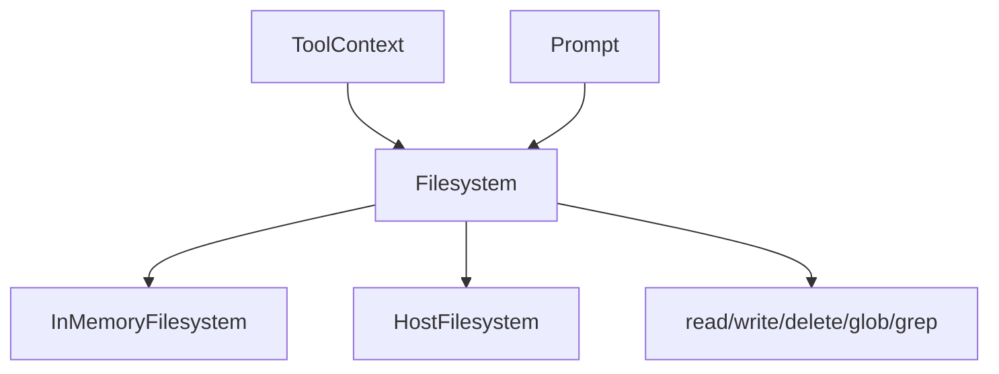

# Filesystem Protocol Specification

Unified filesystem protocol for workspace backends accessed via `ToolContext`.

**Source:** `src/weakincentives/filesystem/`

## Principles

- **Single access pattern**: Tools use one protocol regardless of backend
- **Context-scoped**: Lives on `ToolContext` and `Prompt`
- **Backend-managed state**: No session slice coupling



## Filesystem Protocol

**Definition:** `filesystem/_protocol.py`

| Method | Purpose |
|--------|---------|
| `read(path, offset, limit)` | Text with pagination |
| `read_bytes(path, offset, limit)` | Binary content |
| `write(path, content, mode)` | Text write |
| `write_bytes(path, content, mode)` | Binary write |
| `delete(path, recursive)` | Remove file/directory |
| `exists(path)` | Check existence |
| `stat(path)` | Get metadata |
| `list(path)` | Directory listing |
| `glob(pattern, path)` | Pattern matching |
| `grep(pattern, path)` | Content search |
| `mkdir(path, parents)` | Create directory |

## Result Types

```python
ReadResult(content, path, total_lines, offset, limit, truncated)
WriteResult(path, bytes_written, mode)
FileStat(path, is_file, is_directory, size_bytes, created_at, modified_at)
GlobMatch(path, is_file)
GrepMatch(path, line_number, line_content)
```

## Backends

| Backend | Description |
|---------|-------------|
| `InMemoryFilesystem` | Session-scoped, structural sharing |
| `HostFilesystem` | Sandboxed host access, git snapshots |
| `PodmanSandboxSection` | Container overlay via HostFilesystem |

## Snapshots

**Protocol:** `SnapshotableFilesystem`

```python
snapshot = fs.snapshot(tag="before-refactor")
fs.restore(snapshot)
```

Git-based COW for disk-backed filesystems.

## Limits

| Limit | Default |
|-------|---------|
| Max file size | 48,000 chars |
| Max path depth | 16 segments |
| Default read limit | 2,000 lines |
| Max grep matches | 1,000 |

## Handler Pattern

```python
def handler(params, *, context: ToolContext) -> ToolResult:
    fs = context.filesystem
    if fs is None:
        return ToolResult.error("No filesystem available")
    try:
        result = fs.read(params.path)
    except FileNotFoundError:
        return ToolResult.error(f"File not found: {params.path}")
    return ToolResult.ok(Result(...))
```

## Limitations

- No symlinks by default
- No Unix-style permissions beyond read-only
- Single-threaded (one per session)
- No streaming (files loaded into memory)
