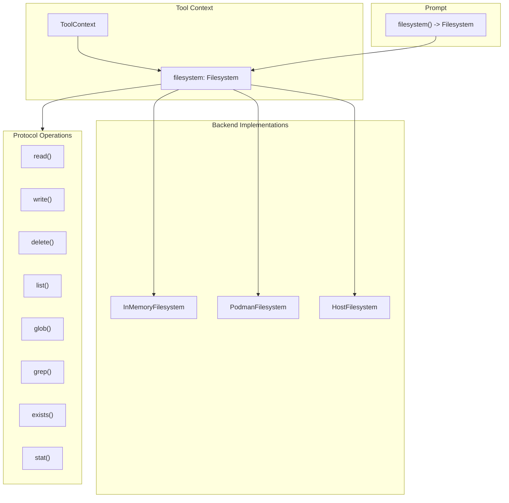

# Filesystem Protocol Specification

## Purpose

This specification defines a unified `Filesystem` protocol that tools access
through `ToolContext`. The protocol abstracts over workspace backends
(in-memory VFS, Podman containers, host filesystem) so tool handlers can
perform file operations without coupling to a specific storage implementation.

## Guiding Principles

- **Single access pattern**: Tools use one protocol regardless of backend.
- **Context-scoped**: The filesystem instance lives on `ToolContext` and
  `Prompt`, not global state.
- **Immutable snapshots**: Read operations return immutable data; writes go
  through the protocol and may be journaled.
- **Backend-managed state**: Backends manage their own persistence; no session
  slice coupling.
- **Backend-agnostic tools**: Tool handlers call `context.filesystem.*` and
  remain portable across workspace types.



## Protocol Definition

### Filesystem Protocol

```python
from typing import Protocol, Literal
from collections.abc import Sequence
from datetime import datetime

class FileStat(Protocol):
    """Metadata for a file or directory."""

    @property
    def path(self) -> str: ...

    @property
    def is_file(self) -> bool: ...

    @property
    def is_directory(self) -> bool: ...

    @property
    def size_bytes(self) -> int: ...

    @property
    def created_at(self) -> datetime | None: ...

    @property
    def modified_at(self) -> datetime | None: ...


class FileEntry(Protocol):
    """Directory listing entry."""

    @property
    def name(self) -> str: ...

    @property
    def path(self) -> str: ...

    @property
    def is_file(self) -> bool: ...

    @property
    def is_directory(self) -> bool: ...


class GlobMatch(Protocol):
    """Result from glob operations."""

    @property
    def path(self) -> str: ...

    @property
    def is_file(self) -> bool: ...


class GrepMatch(Protocol):
    """Result from grep operations."""

    @property
    def path(self) -> str: ...

    @property
    def line_number(self) -> int: ...

    @property
    def line_content(self) -> str: ...

    @property
    def match_start(self) -> int: ...

    @property
    def match_end(self) -> int: ...


class ReadResult(Protocol):
    """Content returned from read operations."""

    @property
    def content(self) -> str: ...

    @property
    def path(self) -> str: ...

    @property
    def total_lines(self) -> int: ...

    @property
    def offset(self) -> int: ...

    @property
    def limit(self) -> int: ...

    @property
    def truncated(self) -> bool: ...


class WriteResult(Protocol):
    """Confirmation of a write operation."""

    @property
    def path(self) -> str: ...

    @property
    def bytes_written(self) -> int: ...

    @property
    def mode(self) -> Literal["create", "overwrite", "append"]: ...


class Filesystem(Protocol):
    """Unified filesystem protocol for workspace operations."""

    # --- Read Operations ---

    def read(
        self,
        path: str,
        *,
        offset: int = 0,
        limit: int | None = None,
        encoding: str = "utf-8",
    ) -> ReadResult:
        """Read file content with optional pagination.

        Args:
            path: Relative path from workspace root.
            offset: Line number to start reading (0-indexed).
            limit: Maximum lines to return. None means backend default.
            encoding: Text encoding. Only "utf-8" is guaranteed.

        Raises:
            FileNotFoundError: Path does not exist.
            IsADirectoryError: Path is a directory.
            PermissionError: Read access denied.
        """
        ...

    def exists(self, path: str) -> bool:
        """Check if a path exists."""
        ...

    def stat(self, path: str) -> FileStat:
        """Get metadata for a path.

        Raises:
            FileNotFoundError: Path does not exist.
        """
        ...

    def list(self, path: str = ".") -> Sequence[FileEntry]:
        """List directory contents.

        Args:
            path: Directory to list. Defaults to root.

        Raises:
            FileNotFoundError: Path does not exist.
            NotADirectoryError: Path is a file.
        """
        ...

    def glob(
        self,
        pattern: str,
        *,
        path: str = ".",
    ) -> Sequence[GlobMatch]:
        """Match files by glob pattern.

        Args:
            pattern: Glob pattern (e.g., "**/*.py").
            path: Base directory for matching.

        Returns:
            Matching paths sorted by path.
        """
        ...

    def grep(
        self,
        pattern: str,
        *,
        path: str = ".",
        glob: str | None = None,
        max_matches: int | None = None,
    ) -> Sequence[GrepMatch]:
        """Search file contents by regex.

        Args:
            pattern: Regular expression pattern.
            path: Base directory for search.
            glob: Optional file filter pattern.
            max_matches: Limit total matches returned.

        Returns:
            Matches sorted by (path, line_number).
        """
        ...

    # --- Write Operations ---

    def write(
        self,
        path: str,
        content: str,
        *,
        mode: Literal["create", "overwrite", "append"] = "overwrite",
        create_parents: bool = True,
    ) -> WriteResult:
        """Write content to a file.

        Args:
            path: Relative path from workspace root.
            content: UTF-8 text content.
            mode: Write behavior.
                - "create": Fail if file exists.
                - "overwrite": Replace existing content.
                - "append": Add to end of file.
            create_parents: Create parent directories if missing.

        Raises:
            FileExistsError: mode="create" and file exists.
            FileNotFoundError: Parent directory missing and create_parents=False.
            PermissionError: Write access denied.
            ValueError: Content exceeds backend limits.
        """
        ...

    def delete(
        self,
        path: str,
        *,
        recursive: bool = False,
    ) -> None:
        """Delete a file or directory.

        Args:
            path: Path to delete.
            recursive: If True, delete directories and contents.

        Raises:
            FileNotFoundError: Path does not exist.
            IsADirectoryError: Path is directory and recursive=False.
            PermissionError: Delete access denied.
        """
        ...

    def mkdir(
        self,
        path: str,
        *,
        parents: bool = True,
        exist_ok: bool = True,
    ) -> None:
        """Create a directory.

        Args:
            path: Directory path to create.
            parents: Create parent directories if missing.
            exist_ok: Don't raise if directory exists.

        Raises:
            FileExistsError: Path exists and exist_ok=False.
            FileNotFoundError: Parent missing and parents=False.
        """
        ...

    # --- Metadata ---

    @property
    def root(self) -> str:
        """Workspace root path (may be "/" for virtual filesystems)."""
        ...

    @property
    def read_only(self) -> bool:
        """True if write operations are disabled."""
        ...
```

## ToolContext Integration

### Updated ToolContext

```python
@dataclass(slots=True, frozen=True)
class ToolContext:
    """Immutable container exposing prompt execution state to handlers."""

    prompt: PromptProtocol[Any]
    rendered_prompt: RenderedPromptProtocol[Any] | None
    adapter: ProviderAdapterProtocol[Any]
    session: SessionProtocol
    deadline: Deadline | None = None
    budget_tracker: BudgetTracker | None = None
    filesystem: Filesystem | None = None  # New field
```

### Handler Usage

```python
def read_file_handler(
    params: ReadFileParams,
    *,
    context: ToolContext,
) -> ToolResult[ReadFileResult]:
    if context.filesystem is None:
        return ToolResult(
            message="No filesystem available in this context.",
            value=None,
            success=False,
        )

    try:
        result = context.filesystem.read(
            params.path,
            offset=params.offset,
            limit=params.limit,
        )
    except FileNotFoundError:
        return ToolResult(
            message=f"File not found: {params.path}",
            value=None,
            success=False,
        )

    return ToolResult(
        message=f"Read {result.total_lines} lines from {result.path}",
        value=ReadFileResult(
            content=result.content,
            path=result.path,
            truncated=result.truncated,
        ),
    )
```

## Section Ownership

The `Filesystem` instance is owned by the workspace section that provides file
tools. Sections implementing `WorkspaceSection` expose their filesystem via the
`filesystem` property.

### WorkspaceSection Protocol

```python
class WorkspaceSection(Protocol):
    """Section that provides filesystem access."""

    @property
    def filesystem(self) -> Filesystem:
        """Return the filesystem managed by this section."""
        ...
```

### Section Implementation

```python
class VfsToolsSection(MarkdownSection[_VfsSectionParams]):
    """Prompt section providing virtual filesystem tools."""

    def __init__(
        self,
        *,
        mounts: Sequence[HostMount] = (),
        allowed_host_roots: Sequence[os.PathLike[str] | str] = (),
        accepts_overrides: bool = False,
    ) -> None:
        self._filesystem = InMemoryFilesystem()

        # Hydrate from host mounts
        for mount in mounts:
            self._filesystem.hydrate_from_host(
                mount,
                allowed_roots=allowed_host_roots,
            )

        # Build tool suite bound to this filesystem
        tools = self._build_tools()
        super().__init__(...)

    @property
    def filesystem(self) -> Filesystem:
        """Return the filesystem managed by this section."""
        return self._filesystem
```

## Prompt Integration

### Prompt.filesystem() Method

The `Prompt` class exposes a `filesystem()` method that locates the workspace
section in the template and returns its filesystem. This provides convenient
access without requiring callers to navigate the section tree.

```python
class Prompt(Generic[OutputT]):
    def filesystem(self) -> Filesystem | None:
        """Return the filesystem from the workspace section, if present.

        Searches the template's section tree for a section implementing
        WorkspaceSection and returns its filesystem property.

        Returns None if no workspace section exists in the template.
        """
        section = self._find_workspace_section()
        if section is None:
            return None
        return section.filesystem

    def _find_workspace_section(self) -> WorkspaceSection | None:
        """Locate the workspace section in the template tree."""
        for node in self.template.nodes:
            if isinstance(node.section, WorkspaceSection):
                return node.section
            # Recursively search children
            found = self._search_children(section)
            if found is not None:
                return found
        return None
```

### Adapter Propagation

Adapters construct `ToolContext` with the filesystem from the prompt:

```python
def _build_tool_context(
    self,
    prompt: Prompt[OutputT],
    rendered: RenderedPrompt[OutputT],
    session: SessionProtocol,
) -> ToolContext:
    return ToolContext(
        prompt=prompt,
        rendered_prompt=rendered,
        adapter=self,
        session=session,
        deadline=rendered.deadline,
        filesystem=prompt.filesystem(),  # Propagate from workspace section
    )
```

## Backend Implementations

### InMemoryFilesystem

Session-scoped in-memory storage. State is managed internally by the backend.

```python
@dataclass(slots=True)
class InMemoryFilesystem:
    """In-memory filesystem implementation."""

    _files: dict[str, _InMemoryFile] = field(default_factory=dict)
    _read_only: bool = False

    @property
    def root(self) -> str:
        return "/"

    @property
    def read_only(self) -> bool:
        return self._read_only

    def read(self, path: str, *, offset: int = 0, limit: int | None = None, encoding: str = "utf-8") -> ReadResult:
        normalized = self._normalize_path(path)
        if normalized not in self._files:
            raise FileNotFoundError(path)
        file = self._files[normalized]
        lines = file.content.splitlines(keepends=True)
        # ... pagination logic
        return _InMemoryReadResult(...)

    def write(self, path: str, content: str, *, mode: Literal["create", "overwrite", "append"] = "overwrite", create_parents: bool = True) -> WriteResult:
        if self._read_only:
            raise PermissionError("Filesystem is read-only")
        # ... write logic
        return _InMemoryWriteResult(...)

    # ... remaining methods
```

### PodmanFilesystem

Wraps container file operations via `podman exec`. Owned by
`PodmanSandboxSection`.

```python
@dataclass(slots=True)
class PodmanFilesystem:
    """Filesystem backed by a Podman container."""

    container_id: str
    workdir: str = "/workspace"
    _client: PodmanClient = field(repr=False)

    def read(self, path: str, **kwargs) -> ReadResult:
        full_path = self._resolve_path(path)
        result = self._client.exec(
            self.container_id,
            ["cat", full_path],
        )
        # ... process output
        return _PodmanReadResult(...)

    # ... remaining methods


class PodmanSandboxSection(MarkdownSection[_PodmanSectionParams]):
    """Prompt section providing containerized workspace tools."""

    def __init__(self, *, image: str = "python:3.12-slim", ...) -> None:
        self._container = self._create_container(image)
        self._filesystem = PodmanFilesystem(
            container_id=self._container.id,
            _client=self._client,
        )
        ...

    @property
    def filesystem(self) -> Filesystem:
        return self._filesystem
```

### HostFilesystem

Provides sandboxed access to host directories.

```python
@dataclass(slots=True)
class HostFilesystem:
    """Filesystem backed by host directories with path restrictions."""

    allowed_roots: tuple[Path, ...]
    _read_only: bool = False

    def _validate_path(self, path: str) -> Path:
        resolved = Path(path).resolve()
        for root in self.allowed_roots:
            try:
                resolved.relative_to(root)
                return resolved
            except ValueError:
                continue
        raise PermissionError(f"Path outside allowed roots: {path}")

    def read(self, path: str, **kwargs) -> ReadResult:
        validated = self._validate_path(path)
        # ... standard file read
        return _HostReadResult(...)

    # ... remaining methods
```

## Limits

Backends enforce their own limits. Recommended defaults:

| Limit | Value | Notes |
|-------|-------|-------|
| Max file size | 48,000 chars | Per write operation |
| Max path depth | 16 segments | Prevents deep nesting |
| Max segment length | 80 chars | Per path component |
| Default read limit | 2,000 lines | Pagination default |
| Max grep matches | 1,000 | Prevents runaway searches |

## Error Handling

### Exception Mapping

All backends map internal errors to standard Python exceptions:

| Backend Error | Python Exception |
|---------------|------------------|
| File not found | `FileNotFoundError` |
| Path is directory | `IsADirectoryError` |
| Path is file | `NotADirectoryError` |
| Access denied | `PermissionError` |
| File exists | `FileExistsError` |
| Invalid content | `ValueError` |
| Backend unavailable | `RuntimeError` |

### Tool Handler Pattern

```python
def my_handler(params: Params, *, context: ToolContext) -> ToolResult[Result]:
    fs = context.filesystem
    if fs is None:
        return ToolResult(message="No filesystem available", value=None, success=False)

    try:
        # Filesystem operations
        result = fs.read(params.path)
    except FileNotFoundError:
        return ToolResult(message=f"File not found: {params.path}", value=None, success=False)
    except PermissionError as e:
        return ToolResult(message=str(e), value=None, success=False)

    return ToolResult(message="Success", value=Result(...))
```

## Testing

### Protocol Compliance

Backend implementations must pass the `FilesystemProtocolTests` suite:

```python
class FilesystemProtocolTests:
    """Abstract test suite for Filesystem implementations."""

    @abstractmethod
    def create_filesystem(self) -> Filesystem:
        """Factory method for the filesystem under test."""
        ...

    def test_read_nonexistent_raises(self):
        fs = self.create_filesystem()
        with pytest.raises(FileNotFoundError):
            fs.read("does_not_exist.txt")

    def test_write_and_read_roundtrip(self):
        fs = self.create_filesystem()
        fs.write("test.txt", "hello world")
        result = fs.read("test.txt")
        assert result.content == "hello world"

    # ... comprehensive test coverage
```

### Mock Filesystem

For unit testing tools without a real backend:

```python
class MockFilesystem:
    """Test double for filesystem operations."""

    def __init__(self, files: dict[str, str] | None = None):
        self._files = files or {}
        self.read_calls: list[str] = []
        self.write_calls: list[tuple[str, str]] = []

    def read(self, path: str, **kwargs) -> ReadResult:
        self.read_calls.append(path)
        if path not in self._files:
            raise FileNotFoundError(path)
        return MockReadResult(content=self._files[path], path=path)

    # ... other methods
```

## Usage Example

```python
from weakincentives.prompt import Prompt, PromptTemplate, MarkdownSection
from weakincentives.contrib.tools import VfsToolsSection, HostMount

# Build prompt with workspace section
# The section owns and manages its filesystem
vfs_section = VfsToolsSection(
    mounts=(
        HostMount(host_path="src/", include_glob=("*.py",)),
        HostMount(host_path="docs/", include_glob=("*.md",)),
    ),
    allowed_host_roots=("/path/to/project",),
)

template = PromptTemplate(
    ns="agents/coder",
    key="edit-files",
    sections=[
        MarkdownSection(
            title="Instructions",
            key="instructions",
            template="Edit files as requested.",
        ),
        vfs_section,
    ],
)

prompt = Prompt(template)

# Access filesystem via prompt (delegates to workspace section)
fs = prompt.filesystem()
assert fs is vfs_section.filesystem  # Same instance

# Pre-populate or inspect before evaluation
fs.write("scratch/notes.txt", "Working notes...")
assert fs.exists("src/main.py")  # Hydrated from host mount

# During evaluation, tools receive the same filesystem via context
# context.filesystem.read("src/main.py") works in tool handlers
```

## Limitations

- **UTF-8 only**: Binary files are not supported.
- **No symlinks**: Symbolic links are not followed by default.
- **No permissions model**: Beyond read-only flag, no Unix-style permissions.
- **Single-threaded**: Backends are not thread-safe; use one per session.
- **No streaming**: Large files are loaded entirely into memory.
- **Path normalization**: Backends normalize paths; original casing may not be
  preserved.
