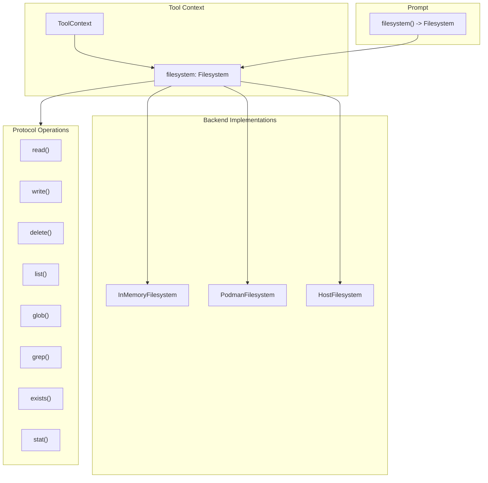
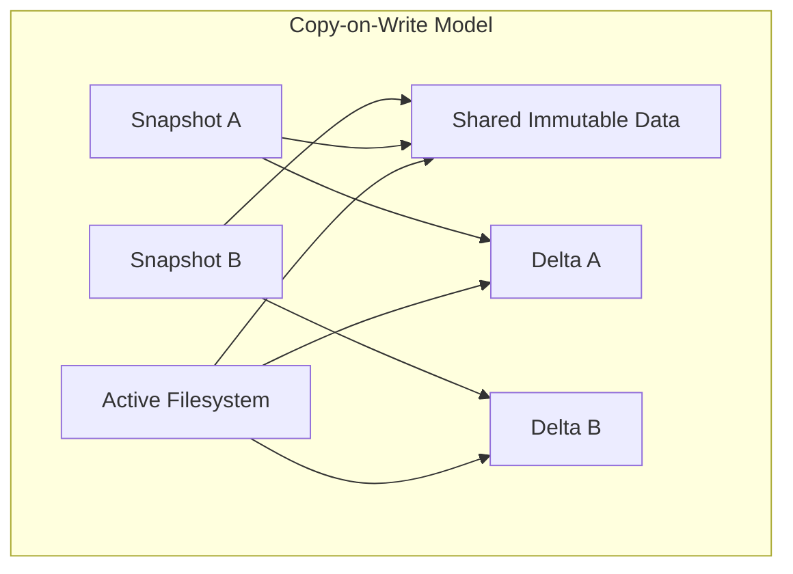
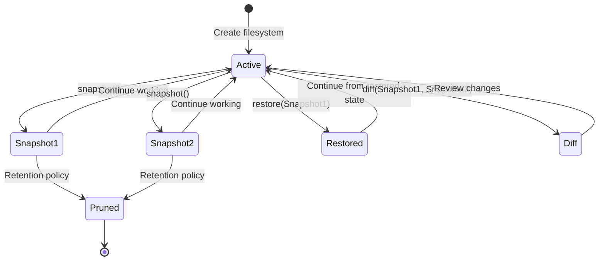

# Filesystem Protocol Specification

## Purpose

This specification defines a unified `Filesystem` protocol that tools access
through `ToolContext`. The protocol abstracts over workspace backends
(in-memory VFS, Podman containers, host filesystem) so tool handlers can
perform file operations without coupling to a specific storage implementation.

## Guiding Principles

- **Single access pattern**: Tools use one protocol regardless of backend.
- **Context-scoped**: The filesystem instance lives on `ToolContext` and
  `Prompt`, not global state.
- **Immutable snapshots**: Read operations return immutable data; writes go
  through the protocol and may be journaled.
- **Backend-managed state**: Backends manage their own persistence; no session
  slice coupling.
- **Backend-agnostic tools**: Tool handlers call `context.filesystem.*` and
  remain portable across workspace types.



## Protocol Definition

### Filesystem Protocol

```python
from typing import Protocol, Literal
from collections.abc import Sequence
from datetime import datetime

class FileStat(Protocol):
    """Metadata for a file or directory."""

    @property
    def path(self) -> str: ...

    @property
    def is_file(self) -> bool: ...

    @property
    def is_directory(self) -> bool: ...

    @property
    def size_bytes(self) -> int: ...

    @property
    def created_at(self) -> datetime | None: ...

    @property
    def modified_at(self) -> datetime | None: ...


class FileEntry(Protocol):
    """Directory listing entry."""

    @property
    def name(self) -> str: ...

    @property
    def path(self) -> str: ...

    @property
    def is_file(self) -> bool: ...

    @property
    def is_directory(self) -> bool: ...


class GlobMatch(Protocol):
    """Result from glob operations."""

    @property
    def path(self) -> str: ...

    @property
    def is_file(self) -> bool: ...


class GrepMatch(Protocol):
    """Result from grep operations."""

    @property
    def path(self) -> str: ...

    @property
    def line_number(self) -> int: ...

    @property
    def line_content(self) -> str: ...

    @property
    def match_start(self) -> int: ...

    @property
    def match_end(self) -> int: ...


class ReadResult(Protocol):
    """Content returned from read operations."""

    @property
    def content(self) -> str: ...

    @property
    def path(self) -> str: ...

    @property
    def total_lines(self) -> int: ...

    @property
    def offset(self) -> int: ...

    @property
    def limit(self) -> int: ...

    @property
    def truncated(self) -> bool: ...


class WriteResult(Protocol):
    """Confirmation of a write operation."""

    @property
    def path(self) -> str: ...

    @property
    def bytes_written(self) -> int: ...

    @property
    def mode(self) -> Literal["create", "overwrite", "append"]: ...


class Filesystem(Protocol):
    """Unified filesystem protocol for workspace operations."""

    # --- Read Operations ---

    def read(
        self,
        path: str,
        *,
        offset: int = 0,
        limit: int | None = None,
        encoding: str = "utf-8",
    ) -> ReadResult:
        """Read file content with optional pagination.

        Args:
            path: Relative path from workspace root.
            offset: Line number to start reading (0-indexed).
            limit: Maximum lines to return. None means backend default.
            encoding: Text encoding. Only "utf-8" is guaranteed.

        Raises:
            FileNotFoundError: Path does not exist.
            IsADirectoryError: Path is a directory.
            PermissionError: Read access denied.
        """
        ...

    def exists(self, path: str) -> bool:
        """Check if a path exists."""
        ...

    def stat(self, path: str) -> FileStat:
        """Get metadata for a path.

        Raises:
            FileNotFoundError: Path does not exist.
        """
        ...

    def list(self, path: str = ".") -> Sequence[FileEntry]:
        """List directory contents.

        Args:
            path: Directory to list. Defaults to root.

        Raises:
            FileNotFoundError: Path does not exist.
            NotADirectoryError: Path is a file.
        """
        ...

    def glob(
        self,
        pattern: str,
        *,
        path: str = ".",
    ) -> Sequence[GlobMatch]:
        """Match files by glob pattern.

        Args:
            pattern: Glob pattern (e.g., "**/*.py").
            path: Base directory for matching.

        Returns:
            Matching paths sorted by path.
        """
        ...

    def grep(
        self,
        pattern: str,
        *,
        path: str = ".",
        glob: str | None = None,
        max_matches: int | None = None,
    ) -> Sequence[GrepMatch]:
        """Search file contents by regex.

        Args:
            pattern: Regular expression pattern.
            path: Base directory for search.
            glob: Optional file filter pattern.
            max_matches: Limit total matches returned.

        Returns:
            Matches sorted by (path, line_number).
        """
        ...

    # --- Write Operations ---

    def write(
        self,
        path: str,
        content: str,
        *,
        mode: Literal["create", "overwrite", "append"] = "overwrite",
        create_parents: bool = True,
    ) -> WriteResult:
        """Write content to a file.

        Args:
            path: Relative path from workspace root.
            content: UTF-8 text content.
            mode: Write behavior.
                - "create": Fail if file exists.
                - "overwrite": Replace existing content.
                - "append": Add to end of file.
            create_parents: Create parent directories if missing.

        Raises:
            FileExistsError: mode="create" and file exists.
            FileNotFoundError: Parent directory missing and create_parents=False.
            PermissionError: Write access denied.
            ValueError: Content exceeds backend limits.
        """
        ...

    def delete(
        self,
        path: str,
        *,
        recursive: bool = False,
    ) -> None:
        """Delete a file or directory.

        Args:
            path: Path to delete.
            recursive: If True, delete directories and contents.

        Raises:
            FileNotFoundError: Path does not exist.
            IsADirectoryError: Path is directory and recursive=False.
            PermissionError: Delete access denied.
        """
        ...

    def mkdir(
        self,
        path: str,
        *,
        parents: bool = True,
        exist_ok: bool = True,
    ) -> None:
        """Create a directory.

        Args:
            path: Directory path to create.
            parents: Create parent directories if missing.
            exist_ok: Don't raise if directory exists.

        Raises:
            FileExistsError: Path exists and exist_ok=False.
            FileNotFoundError: Parent missing and parents=False.
        """
        ...

    # --- Metadata ---

    @property
    def root(self) -> str:
        """Workspace root path (may be "/" for virtual filesystems)."""
        ...

    @property
    def read_only(self) -> bool:
        """True if write operations are disabled."""
        ...

    @property
    def mount_point(self) -> str | None:
        """Virtual mount point prefix for path normalization.

        When set (e.g., "/workspace"), absolute paths like "/workspace/file.txt"
        are interpreted as "file.txt" relative to the workspace root. This
        allows models to use absolute paths that match container working
        directories while the underlying filesystem uses relative paths.

        Returns None if no mount point is configured (default behavior).
        """
        ...
```

## ToolContext Integration

### Updated ToolContext

```python
@dataclass(slots=True, frozen=True)
class ToolContext:
    """Immutable container exposing prompt execution state to handlers."""

    prompt: PromptProtocol[Any]
    rendered_prompt: RenderedPromptProtocol[Any] | None
    adapter: ProviderAdapterProtocol[Any]
    session: SessionProtocol
    deadline: Deadline | None = None
    budget_tracker: BudgetTracker | None = None
    filesystem: Filesystem | None = None  # New field
```

### Handler Usage

```python
def read_file_handler(
    params: ReadFileParams,
    *,
    context: ToolContext,
) -> ToolResult[ReadFileResult]:
    if context.filesystem is None:
        return ToolResult(
            message="No filesystem available in this context.",
            value=None,
            success=False,
        )

    try:
        result = context.filesystem.read(
            params.path,
            offset=params.offset,
            limit=params.limit,
        )
    except FileNotFoundError:
        return ToolResult(
            message=f"File not found: {params.path}",
            value=None,
            success=False,
        )

    return ToolResult(
        message=f"Read {result.total_lines} lines from {result.path}",
        value=ReadFileResult(
            content=result.content,
            path=result.path,
            truncated=result.truncated,
        ),
    )
```

## Section Ownership

The `Filesystem` instance is owned by the workspace section that provides file
tools. Sections implementing `WorkspaceSection` expose their filesystem via the
`filesystem` property.

### WorkspaceSection Protocol

```python
class WorkspaceSection(Protocol):
    """Section that provides filesystem access."""

    @property
    def filesystem(self) -> Filesystem:
        """Return the filesystem managed by this section."""
        ...
```

### Section Implementation

```python
class VfsToolsSection(MarkdownSection[_VfsSectionParams]):
    """Prompt section providing virtual filesystem tools."""

    def __init__(
        self,
        *,
        mounts: Sequence[HostMount] = (),
        allowed_host_roots: Sequence[os.PathLike[str] | str] = (),
        accepts_overrides: bool = False,
    ) -> None:
        self._filesystem = InMemoryFilesystem()

        # Hydrate from host mounts
        for mount in mounts:
            self._filesystem.hydrate_from_host(
                mount,
                allowed_roots=allowed_host_roots,
            )

        # Build tool suite bound to this filesystem
        tools = self._build_tools()
        super().__init__(...)

    @property
    def filesystem(self) -> Filesystem:
        """Return the filesystem managed by this section."""
        return self._filesystem
```

## Prompt Integration

### Prompt.filesystem() Method

The `Prompt` class exposes a `filesystem()` method that locates the workspace
section in the template and returns its filesystem. This provides convenient
access without requiring callers to navigate the section tree.

```python
class Prompt(Generic[OutputT]):
    def filesystem(self) -> Filesystem | None:
        """Return the filesystem from the workspace section, if present.

        Searches the template's section tree for a section implementing
        WorkspaceSection and returns its filesystem property.

        Returns None if no workspace section exists in the template.
        """
        section = self._find_workspace_section()
        if section is None:
            return None
        return section.filesystem

    def _find_workspace_section(self) -> WorkspaceSection | None:
        """Locate the workspace section in the template tree."""
        for section in self.template.sections:
            if isinstance(section, WorkspaceSection):
                return section
            # Recursively search children
            found = self._search_children(section)
            if found is not None:
                return found
        return None
```

### Adapter Propagation

Adapters construct `ToolContext` with the filesystem from the prompt:

```python
def _build_tool_context(
    self,
    prompt: Prompt[OutputT],
    rendered: RenderedPrompt[OutputT],
    session: SessionProtocol,
) -> ToolContext:
    return ToolContext(
        prompt=prompt,
        rendered_prompt=rendered,
        adapter=self,
        session=session,
        deadline=rendered.deadline,
        filesystem=prompt.filesystem(),  # Propagate from workspace section
    )
```

## Backend Implementations

### InMemoryFilesystem

Session-scoped in-memory storage. State is managed internally by the backend.

```python
@dataclass(slots=True)
class InMemoryFilesystem:
    """In-memory filesystem implementation."""

    _files: dict[str, _InMemoryFile] = field(default_factory=dict)
    _directories: set[str] = field(default_factory=set)
    _read_only: bool = False
    _mount_point: str | None = None

    @property
    def root(self) -> str:
        return "/"

    @property
    def read_only(self) -> bool:
        return self._read_only

    @property
    def mount_point(self) -> str | None:
        return self._mount_point

    def read(self, path: str, *, offset: int = 0, limit: int | None = None, encoding: str = "utf-8") -> ReadResult:
        normalized = self._normalize_path(path)
        if normalized not in self._files:
            raise FileNotFoundError(path)
        file = self._files[normalized]
        lines = file.content.splitlines(keepends=True)
        # ... pagination logic
        return _InMemoryReadResult(...)

    def write(self, path: str, content: str, *, mode: Literal["create", "overwrite", "append"] = "overwrite", create_parents: bool = True) -> WriteResult:
        if self._read_only:
            raise PermissionError("Filesystem is read-only")
        # ... write logic
        return _InMemoryWriteResult(...)

    # ... remaining methods
```

### PodmanFilesystem

Wraps container file operations via `podman exec`. Owned by
`PodmanSandboxSection`.

```python
@dataclass(slots=True)
class PodmanFilesystem:
    """Filesystem backed by a Podman container."""

    container_id: str
    workdir: str = "/workspace"
    _client: PodmanClient = field(repr=False)

    def read(self, path: str, **kwargs) -> ReadResult:
        full_path = self._resolve_path(path)
        result = self._client.exec(
            self.container_id,
            ["cat", full_path],
        )
        # ... process output
        return _PodmanReadResult(...)

    # ... remaining methods


class PodmanSandboxSection(MarkdownSection[_PodmanSectionParams]):
    """Prompt section providing containerized workspace tools."""

    def __init__(self, *, image: str = "python:3.12-slim", ...) -> None:
        self._container = self._create_container(image)
        self._filesystem = PodmanFilesystem(
            container_id=self._container.id,
            _client=self._client,
        )
        ...

    @property
    def filesystem(self) -> Filesystem:
        return self._filesystem
```

### HostFilesystem

Provides sandboxed access to a host directory with path restrictions.

```python
@dataclass(slots=True)
class HostFilesystem:
    """Filesystem backed by a host directory with path restrictions."""

    _root: str
    _read_only: bool = False
    _mount_point: str | None = None

    @property
    def root(self) -> str:
        return self._root

    @property
    def read_only(self) -> bool:
        return self._read_only

    @property
    def mount_point(self) -> str | None:
        return self._mount_point

    def _resolve_path(self, path: str) -> Path:
        """Resolve a relative path to an absolute path within root.

        Raises:
            PermissionError: If resolved path escapes root directory.
        """
        root_path = Path(self._root).resolve()
        if not path or path in {".", "/"}:
            return root_path
        candidate = (root_path / path).resolve()
        try:
            _ = candidate.relative_to(root_path)
        except ValueError:
            raise PermissionError(f"Path escapes root directory: {path}") from None
        return candidate

    def read(self, path: str, **kwargs) -> ReadResult:
        resolved = self._resolve_path(path)
        # ... standard file read
        return _HostReadResult(...)

    # ... remaining methods
```

## Limits

Backends enforce their own limits. Recommended defaults:

| Limit | Value | Notes |
|-------|-------|-------|
| Max file size | 48,000 chars | Per write operation |
| Max path depth | 16 segments | Prevents deep nesting |
| Max segment length | 80 chars | Per path component |
| Default read limit | 2,000 lines | Pagination default |
| Max grep matches | 1,000 | Prevents runaway searches |

## Error Handling

### Exception Mapping

All backends map internal errors to standard Python exceptions:

| Backend Error | Python Exception |
|---------------|------------------|
| File not found | `FileNotFoundError` |
| Path is directory | `IsADirectoryError` |
| Path is file | `NotADirectoryError` |
| Access denied | `PermissionError` |
| File exists | `FileExistsError` |
| Invalid content | `ValueError` |
| Backend unavailable | `RuntimeError` |

### Tool Handler Pattern

```python
def my_handler(params: Params, *, context: ToolContext) -> ToolResult[Result]:
    fs = context.filesystem
    if fs is None:
        return ToolResult(message="No filesystem available", value=None, success=False)

    try:
        # Filesystem operations
        result = fs.read(params.path)
    except FileNotFoundError:
        return ToolResult(message=f"File not found: {params.path}", value=None, success=False)
    except PermissionError as e:
        return ToolResult(message=str(e), value=None, success=False)

    return ToolResult(message="Success", value=Result(...))
```

## Testing

### Protocol Compliance

Backend implementations must pass the `FilesystemProtocolTests` suite:

```python
class FilesystemProtocolTests:
    """Abstract test suite for Filesystem implementations."""

    @abstractmethod
    def create_filesystem(self) -> Filesystem:
        """Factory method for the filesystem under test."""
        ...

    def test_read_nonexistent_raises(self):
        fs = self.create_filesystem()
        with pytest.raises(FileNotFoundError):
            fs.read("does_not_exist.txt")

    def test_write_and_read_roundtrip(self):
        fs = self.create_filesystem()
        fs.write("test.txt", "hello world")
        result = fs.read("test.txt")
        assert result.content == "hello world"

    # ... comprehensive test coverage
```

### Mock Filesystem

For unit testing tools without a real backend:

```python
class MockFilesystem:
    """Test double for filesystem operations."""

    def __init__(self, files: dict[str, str] | None = None):
        self._files = files or {}
        self.read_calls: list[str] = []
        self.write_calls: list[tuple[str, str]] = []

    def read(self, path: str, **kwargs) -> ReadResult:
        self.read_calls.append(path)
        if path not in self._files:
            raise FileNotFoundError(path)
        return MockReadResult(content=self._files[path], path=path)

    # ... other methods
```

## Usage Example

```python
from weakincentives.prompt import Prompt, PromptTemplate, MarkdownSection
from weakincentives.contrib.tools import VfsToolsSection, HostMount

# Build prompt with workspace section
# The section owns and manages its filesystem
vfs_section = VfsToolsSection(
    mounts=(
        HostMount(host_path="src/", include_glob=("*.py",)),
        HostMount(host_path="docs/", include_glob=("*.md",)),
    ),
    allowed_host_roots=("/path/to/project",),
)

template = PromptTemplate(
    ns="agents/coder",
    key="edit-files",
    sections=[
        MarkdownSection(
            title="Instructions",
            key="instructions",
            template="Edit files as requested.",
        ),
        vfs_section,
    ],
)

prompt = Prompt(template)

# Access filesystem via prompt (delegates to workspace section)
fs = prompt.filesystem()
assert fs is vfs_section.filesystem  # Same instance

# Pre-populate or inspect before evaluation
fs.write("scratch/notes.txt", "Working notes...")
assert fs.exists("src/main.py")  # Hydrated from host mount

# During evaluation, tools receive the same filesystem via context
# context.filesystem.read("src/main.py") works in tool handlers
```

## Filesystem Snapshots

Filesystem snapshots capture the complete state of a workspace at a point in
time. Snapshots enable rollback, branching exploration, and coordination with
session state management.

### Guiding Principles

- **Immutable captures**: Snapshots are read-only; modifications create new
  snapshots.
- **Backend-appropriate semantics**: Each backend implements snapshots using
  the most efficient mechanism available.
- **Copy-on-write where possible**: Minimize memory and storage overhead by
  sharing unchanged data between snapshots.
- **Session coordination**: Filesystem snapshots integrate with session
  snapshots for unified state management.

### Snapshot Protocol

```python
from typing import Protocol
from datetime import datetime
from uuid import UUID

class FilesystemSnapshot(Protocol):
    """Immutable capture of filesystem state."""

    @property
    def snapshot_id(self) -> UUID:
        """Unique identifier for this snapshot."""
        ...

    @property
    def created_at(self) -> datetime:
        """Timestamp when the snapshot was captured."""
        ...

    @property
    def parent_id(self) -> UUID | None:
        """ID of the parent snapshot, if created from another snapshot."""
        ...

    @property
    def file_count(self) -> int:
        """Number of files in the snapshot."""
        ...

    @property
    def total_bytes(self) -> int:
        """Total size of all files in bytes."""
        ...


class SnapshotableFilesystem(Filesystem, Protocol):
    """Filesystem that supports snapshot operations."""

    def snapshot(self, *, tag: str | None = None) -> FilesystemSnapshot:
        """Capture the current filesystem state.

        Args:
            tag: Optional human-readable label for the snapshot.

        Returns:
            Immutable snapshot of the current state.
        """
        ...

    def restore(self, snapshot: FilesystemSnapshot) -> None:
        """Restore filesystem to a previous snapshot state.

        Args:
            snapshot: The snapshot to restore.

        Raises:
            ValueError: Snapshot is incompatible with this filesystem.
            RuntimeError: Restore operation failed.
        """
        ...

    def diff(
        self,
        base: FilesystemSnapshot,
        target: FilesystemSnapshot | None = None,
    ) -> FilesystemDiff:
        """Compare two snapshots or a snapshot with current state.

        Args:
            base: The base snapshot for comparison.
            target: The target snapshot. If None, compares with current state.

        Returns:
            Diff describing changes between base and target.
        """
        ...

    @property
    def current_snapshot_id(self) -> UUID | None:
        """ID of the snapshot this filesystem was restored from, if any."""
        ...


class FilesystemDiff(Protocol):
    """Changes between two filesystem states."""

    @property
    def added(self) -> tuple[str, ...]:
        """Paths of files added in target."""
        ...

    @property
    def modified(self) -> tuple[str, ...]:
        """Paths of files modified in target."""
        ...

    @property
    def deleted(self) -> tuple[str, ...]:
        """Paths of files deleted in target."""
        ...

    @property
    def unchanged_count(self) -> int:
        """Number of files unchanged between snapshots."""
        ...
```

### Copy-on-Write Semantics

Copy-on-write (COW) minimizes memory and storage overhead by sharing unchanged
data between the active filesystem and its snapshots. The feasibility of true
COW depends on the backend implementation.



#### InMemoryFilesystem: Full COW Support

The in-memory backend achieves COW through immutable data structures and
structural sharing.

**Implementation Strategy:**

```python
@dataclass(slots=True, frozen=True)
class _ImmutableFile:
    """Immutable file content with identity-based sharing."""
    content: str
    created_at: datetime
    modified_at: datetime

    def with_content(self, new_content: str, modified_at: datetime) -> "_ImmutableFile":
        """Create a new file with updated content, preserving created_at."""
        return _ImmutableFile(
            content=new_content,
            created_at=self.created_at,
            modified_at=modified_at,
        )


@dataclass(slots=True, frozen=True)
class InMemoryFilesystemSnapshot:
    """Immutable snapshot sharing data with parent filesystem."""

    snapshot_id: UUID
    created_at: datetime
    parent_id: UUID | None
    tag: str | None
    # Frozen mappings share references with the active filesystem
    files: Mapping[str, _ImmutableFile]
    directories: frozenset[str]

    @property
    def file_count(self) -> int:
        return len(self.files)

    @property
    def total_bytes(self) -> int:
        return sum(len(f.content.encode("utf-8")) for f in self.files.values())
```

**COW Behavior:**

1. **Snapshot creation**: O(1) - creates frozen view of current dict/set
2. **Read after snapshot**: O(1) - reads from shared reference
3. **Write after snapshot**: O(1) amortized - only modified entries are copied
4. **Memory overhead**: Only delta from snapshot consumes additional memory

```python
# Example: COW in action
fs = InMemoryFilesystem()
fs.write("large_file.txt", "x" * 1_000_000)  # 1MB file

snap1 = fs.snapshot()  # O(1), shares reference to large_file

fs.write("small_file.txt", "hello")  # Only new entry allocated
# large_file.txt still shared between fs and snap1

snap2 = fs.snapshot()  # O(1), both files shared
fs.write("large_file.txt", "y" * 1_000_000)  # New allocation for modified file
# snap1 and snap2 still reference original large_file content
```

#### HostFilesystem: Tiered COW Support

The host filesystem backend offers multiple snapshot strategies with varying
COW capabilities, selected based on filesystem support and configuration.

**Strategy Hierarchy:**

```python
class SnapshotStrategy(Enum):
    """Snapshot implementation strategies ordered by preference."""

    REFLINK = "reflink"      # Best: True COW via filesystem reflinks
    GIT = "git"              # Good: Version control with deduplication
    OVERLAY = "overlay"      # Fair: OverlayFS for Linux with privileges
    ARCHIVE = "archive"      # Fallback: Tar archives (no COW)
    COPY = "copy"            # Last resort: Full directory copy (no COW)


@dataclass(slots=True, frozen=True)
class HostFilesystemConfig:
    """Configuration for host filesystem snapshots."""

    snapshot_strategy: SnapshotStrategy | None = None  # Auto-detect if None
    snapshot_dir: str | None = None  # Directory for snapshot storage
    max_snapshots: int = 10  # Maximum retained snapshots
```

**Strategy Details:**

| Strategy | COW | Storage | Speed | Requirements |
|----------|-----|---------|-------|--------------|
| Reflink | True | Minimal | Fast | btrfs, XFS, APFS |
| Git | Partial | Efficient | Medium | Git repository |
| Overlay | True | Minimal | Fast | Linux, root |
| Archive | No | High | Slow | None |
| Copy | No | High | Slow | None |

**Reflink Implementation (True COW):**

```python
def _snapshot_via_reflink(self, dest: Path) -> None:
    """Create snapshot using copy-on-write reflinks."""
    import subprocess

    dest.mkdir(parents=True, exist_ok=True)
    # cp --reflink=always creates COW copies on supported filesystems
    result = subprocess.run(
        ["cp", "-a", "--reflink=always", f"{self._root}/.", str(dest)],
        capture_output=True,
        text=True,
    )
    if result.returncode != 0:
        raise RuntimeError(f"Reflink copy failed: {result.stderr}")
```

**Git Implementation (Deduplicated):**

```python
def _snapshot_via_git(self, tag: str | None) -> HostFilesystemSnapshot:
    """Create snapshot as a git commit."""
    import subprocess

    # Initialize repo if needed
    git_dir = Path(self._root) / ".git"
    if not git_dir.exists():
        subprocess.run(["git", "init"], cwd=self._root, check=True)

    # Stage and commit all changes
    subprocess.run(["git", "add", "-A"], cwd=self._root, check=True)
    message = tag or f"Snapshot {datetime.now(UTC).isoformat()}"
    result = subprocess.run(
        ["git", "commit", "-m", message, "--allow-empty"],
        cwd=self._root,
        capture_output=True,
        text=True,
    )

    # Get commit hash as snapshot ID
    commit_hash = subprocess.run(
        ["git", "rev-parse", "HEAD"],
        cwd=self._root,
        capture_output=True,
        text=True,
        check=True,
    ).stdout.strip()

    return HostFilesystemSnapshot(
        snapshot_id=UUID(int=int(commit_hash[:32], 16)),
        created_at=datetime.now(UTC),
        strategy=SnapshotStrategy.GIT,
        reference=commit_hash,
        # ...
    )
```

#### PodmanFilesystem: Container-Native Snapshots

The Podman backend leverages container and overlay filesystem capabilities
for efficient snapshots.

**Strategy Options:**

1. **Overlay Directory Snapshot**: Copy-on-write via filesystem
2. **Container Checkpoint**: Full container state via CRIU
3. **Container Commit**: Create image from container state

```python
class PodmanSnapshotStrategy(Enum):
    """Snapshot strategies for Podman workspaces."""

    OVERLAY_REFLINK = "overlay_reflink"  # Reflink copy of overlay dir
    OVERLAY_COPY = "overlay_copy"        # Full copy of overlay dir
    CONTAINER_COMMIT = "container_commit"  # podman commit
    CONTAINER_CHECKPOINT = "checkpoint"  # CRIU checkpoint (experimental)


@dataclass(slots=True, frozen=True)
class PodmanFilesystemSnapshot:
    """Snapshot of Podman workspace filesystem state."""

    snapshot_id: UUID
    created_at: datetime
    parent_id: UUID | None
    strategy: PodmanSnapshotStrategy
    # Strategy-specific reference
    overlay_path: str | None = None  # For overlay strategies
    image_id: str | None = None      # For container_commit
    checkpoint_path: str | None = None  # For checkpoint
```

**Overlay Directory Snapshot:**

```python
def _snapshot_overlay(self) -> PodmanFilesystemSnapshot:
    """Snapshot the overlay directory (workspace files only)."""
    snapshot_id = uuid4()
    snapshot_dir = self._snapshot_root / str(snapshot_id)

    # Attempt reflink copy first
    try:
        self._copy_overlay_reflink(self._overlay_path, snapshot_dir)
        strategy = PodmanSnapshotStrategy.OVERLAY_REFLINK
    except (OSError, subprocess.CalledProcessError):
        # Fall back to regular copy
        shutil.copytree(self._overlay_path, snapshot_dir)
        strategy = PodmanSnapshotStrategy.OVERLAY_COPY

    return PodmanFilesystemSnapshot(
        snapshot_id=snapshot_id,
        created_at=datetime.now(UTC),
        parent_id=self._current_snapshot_id,
        strategy=strategy,
        overlay_path=str(snapshot_dir),
    )
```

**Container Commit Snapshot:**

```python
def _snapshot_container_commit(self) -> PodmanFilesystemSnapshot:
    """Create snapshot by committing container to image."""
    snapshot_id = uuid4()
    image_name = f"wink-snapshot-{snapshot_id}"

    # Commit current container state to image
    result = subprocess.run(
        ["podman", "commit", self._container_id, image_name],
        capture_output=True,
        text=True,
        check=True,
    )

    return PodmanFilesystemSnapshot(
        snapshot_id=snapshot_id,
        created_at=datetime.now(UTC),
        parent_id=self._current_snapshot_id,
        strategy=PodmanSnapshotStrategy.CONTAINER_COMMIT,
        image_id=result.stdout.strip(),
    )
```

### Session Integration

Filesystem snapshots coordinate with session snapshots to provide unified
state management. When a session snapshot is created, the associated
filesystem snapshot ID is recorded.

```python
@dataclass(slots=True, frozen=True)
class FilesystemSnapshotRef:
    """Reference to a filesystem snapshot stored in session state."""

    filesystem_key: str  # Key identifying the filesystem (e.g., "vfs.tools")
    snapshot_id: UUID
    backend_type: str  # "in_memory", "host", "podman"


# Session slice for tracking filesystem snapshots
session[FilesystemSnapshotRef].register(FilesystemSnapshotRef, append_all)
```

**Coordinated Snapshot Creation:**

```python
def create_unified_snapshot(
    session: Session,
    filesystem: SnapshotableFilesystem,
    filesystem_key: str,
) -> tuple[Snapshot, FilesystemSnapshot]:
    """Create coordinated session and filesystem snapshots."""

    # Capture filesystem state first
    fs_snapshot = filesystem.snapshot()

    # Record reference in session
    ref = FilesystemSnapshotRef(
        filesystem_key=filesystem_key,
        snapshot_id=fs_snapshot.snapshot_id,
        backend_type=type(filesystem).__name__,
    )
    session[FilesystemSnapshotRef].append(ref)

    # Create session snapshot (includes the reference)
    session_snapshot = session.snapshot()

    return session_snapshot, fs_snapshot
```

**Coordinated Restore:**

```python
def restore_unified_snapshot(
    session: Session,
    filesystem: SnapshotableFilesystem,
    session_snapshot: Snapshot,
    fs_snapshot: FilesystemSnapshot,
) -> None:
    """Restore both session and filesystem from snapshots."""

    # Restore filesystem first (may fail)
    filesystem.restore(fs_snapshot)

    # Then restore session state
    session.rollback(session_snapshot)
```

### Snapshot Lifecycle



### Snapshot Storage and Retention

Backends manage snapshot storage according to configured policies:

```python
@dataclass(slots=True, frozen=True)
class SnapshotRetentionPolicy:
    """Policy for automatic snapshot cleanup."""

    max_count: int = 10          # Maximum snapshots to retain
    max_age_hours: int | None = None  # Maximum age before pruning
    keep_tagged: bool = True     # Preserve tagged snapshots


class SnapshotStore(Protocol):
    """Storage backend for filesystem snapshots."""

    def save(self, snapshot: FilesystemSnapshot) -> None:
        """Persist a snapshot."""
        ...

    def load(self, snapshot_id: UUID) -> FilesystemSnapshot:
        """Retrieve a snapshot by ID."""
        ...

    def list(self) -> Sequence[FilesystemSnapshot]:
        """List all stored snapshots."""
        ...

    def delete(self, snapshot_id: UUID) -> None:
        """Remove a snapshot."""
        ...

    def prune(self, policy: SnapshotRetentionPolicy) -> int:
        """Apply retention policy, return count of pruned snapshots."""
        ...
```

### Error Handling

Snapshot operations can fail due to storage limits, permission issues, or
backend-specific constraints.

```python
class SnapshotError(WinkError, RuntimeError):
    """Base class for snapshot-related errors."""


class SnapshotCreationError(SnapshotError):
    """Failed to create a snapshot."""


class SnapshotRestoreError(SnapshotError):
    """Failed to restore from a snapshot."""


class SnapshotNotFoundError(SnapshotError):
    """Requested snapshot does not exist."""


class SnapshotIncompatibleError(SnapshotError):
    """Snapshot is incompatible with the target filesystem."""
```

### Usage Example

```python
from weakincentives.contrib.tools.filesystem import InMemoryFilesystem

# Create filesystem with snapshot support
fs = InMemoryFilesystem()

# Initial state
fs.write("config.py", "DEBUG = True")
fs.write("app.py", "from config import DEBUG")

# Capture initial state
snapshot_v1 = fs.snapshot(tag="initial")

# Make changes
fs.write("config.py", "DEBUG = False")
fs.write("tests.py", "import pytest")

# Capture modified state
snapshot_v2 = fs.snapshot(tag="with-tests")

# Compare snapshots
diff = fs.diff(snapshot_v1, snapshot_v2)
print(f"Added: {diff.added}")      # ("tests.py",)
print(f"Modified: {diff.modified}")  # ("config.py",)
print(f"Deleted: {diff.deleted}")    # ()

# Rollback to initial state
fs.restore(snapshot_v1)
assert fs.read("config.py").content == "DEBUG = True"
assert not fs.exists("tests.py")

# Restore to modified state
fs.restore(snapshot_v2)
assert fs.read("config.py").content == "DEBUG = False"
assert fs.exists("tests.py")
```

### Implementation Notes

**InMemoryFilesystem:**

- Use `types.MappingProxyType` for frozen dict views
- Share `_ImmutableFile` references between snapshots
- Snapshot creation is O(n) for dict copy but O(1) for content (shared refs)

**HostFilesystem:**

- Auto-detect reflink support via `os.copy_file_range` or test copy
- Git strategy requires `.git` initialization (opt-in)
- Archive strategy creates `.tar.gz` in snapshot directory

**PodmanFilesystem:**

- Prefer overlay directory snapshots for speed
- Container commit useful for full environment capture
- CRIU checkpoints require root and kernel support

### Limitations

- **InMemoryFilesystem**: Snapshots consume memory for modified files
- **HostFilesystem**: Reflinks require filesystem support; fallback is expensive
- **PodmanFilesystem**: Container commits include entire image layer
- **All backends**: Snapshots are local to the process/machine
- **No incremental snapshots**: Each snapshot is self-contained

## Limitations

- **UTF-8 only**: Binary files are not supported.
- **No symlinks**: Symbolic links are not followed by default.
- **No permissions model**: Beyond read-only flag, no Unix-style permissions.
- **Single-threaded**: Backends are not thread-safe; use one per session.
- **No streaming**: Large files are loaded entirely into memory.
- **Path normalization**: Backends normalize paths; original casing may not be
  preserved.
