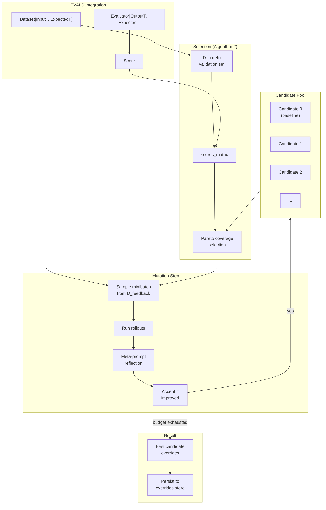

# GEPA Optimizer Specification

## Purpose

Enable automated prompt optimization through **Generalist-to-Expert Prompt
Adaptation (GEPA)**, a population-based evolutionary algorithm that evolves
prompt instructions and examples across multiple target sections. GEPA
integrates with the existing optimizer framework and **EVALS** infrastructure
to provide scored feedback for mutation decisions.

## Guiding Principles

- **Native integration**: GEPA modules map to prompt section paths, leveraging
  existing override stores and session primitives.
- **EVALS-based scoring**: Uses `Dataset`, `Sample`, `Score`, and `Evaluator`
  from the EVALS spec for consistent evaluation.
- **Observable execution**: Rollouts emit standard session events for tracing.
- **Deterministic reproducibility**: Seeded RNG ensures repeatable optimization
  runs.
- **Fail-safe mutations**: Invalid prompt mutations are detected and rejected
  before acceptance.



## Background: The GEPA Algorithm

GEPA optimizes compound LLM systems by maintaining a pool of prompt candidates
and evolving them through reflection-based mutation. The key insight is that
different candidates may specialize on different subsets of the validation data,
so the algorithm maintains **Pareto-optimal specialists** rather than converging
to a single best candidate.

### Algorithm Overview

1. **Initialize** a candidate pool with the baseline prompt configuration
2. **Evaluate** candidates on a small validation subset (D_pareto) using EVALS
3. **Select** a candidate using Pareto coverage (diverse specialists)
4. **Mutate** a module (section) via LLM reflection on feedback from D_feedback
5. **Accept** mutation if minibatch score improves
6. **Repeat** until budget exhausted
7. **Return** best overall candidate

### Optional: System-Aware Merge

The merge extension (Algorithms 3/4 in the paper) recombines improvements from
different candidates by tracking ancestry and selectively merging module
overrides. This is optional and disabled by default.

## EVALS Integration

GEPA uses the primitives from `specs/EVALS.md` for evaluation:

| EVALS Primitive | GEPA Usage |
|-----------------|------------|
| `Sample[InputT, ExpectedT]` | Training/validation examples |
| `Dataset[InputT, ExpectedT]` | Collection of samples split into D_pareto and D_feedback |
| `Score` | Evaluation result with `value`, `passed`, `reason` |
| `Evaluator[OutputT, ExpectedT]` | Scoring function `(output, expected) -> Score` |

### Feedback Generation

GEPA extends the basic `Evaluator` concept with textual feedback for the
meta-prompt. The `FeedbackEvaluator` protocol wraps an evaluator and produces
explanation text:

```python
@dataclass(slots=True, frozen=True)
class RolloutFeedback:
    """Extended evaluation result for GEPA mutation guidance."""

    score: Score           # From EVALS
    feedback: str          # Textual explanation for meta-prompt
    trace_repr: str = ""   # Formatted tool trace
```

```python
class FeedbackEvaluator(Protocol[OutputT, ExpectedT]):
    """Evaluator that provides textual feedback for mutation guidance."""

    def __call__(
        self,
        output: OutputT,
        expected: ExpectedT,
        *,
        session: SessionProtocol,
    ) -> RolloutFeedback: ...
```

### Using EVALS Evaluators

Wrap existing evaluators to add feedback:

```python
def with_feedback(
    evaluator: Evaluator[OutputT, ExpectedT],
    feedback_fn: Callable[[OutputT, ExpectedT, Score], str] | None = None,
) -> FeedbackEvaluator[OutputT, ExpectedT]:
    """Wrap an EVALS evaluator with feedback generation."""

    def evaluate(
        output: OutputT,
        expected: ExpectedT,
        *,
        session: SessionProtocol,
    ) -> RolloutFeedback:
        score = evaluator(output, expected)
        if feedback_fn is not None:
            feedback = feedback_fn(output, expected, score)
        else:
            feedback = score.reason or ("Pass" if score.passed else "Fail")
        return RolloutFeedback(score=score, feedback=feedback)

    return evaluate
```

### LLM-as-Judge for Feedback

For rich textual feedback, use the LLM judge pattern from EVALS with an
extended prompt that requests explanation:

```python
@dataclass(slots=True, frozen=True)
class GepaJudgeOutput:
    """Extended judge output with improvement suggestions."""

    rating: Rating
    reason: str
    suggestions: str  # What should change to improve


def gepa_judge(
    adapter: ProviderAdapter[GepaJudgeOutput],
    criterion: str,
) -> FeedbackEvaluator[str, str]:
    """Create evaluator with detailed feedback for GEPA."""

    def evaluate(
        output: str,
        expected: str,
        *,
        session: SessionProtocol,
    ) -> RolloutFeedback:
        prompt = Prompt(GEPA_JUDGE_TEMPLATE).bind(GepaJudgeParams(
            criterion=criterion,
            output=output,
            expected=expected,
        ))
        response = adapter.evaluate(prompt)
        judge_output = response.output
        return RolloutFeedback(
            score=Score(
                value=RATING_VALUES[judge_output.rating],
                passed=judge_output.rating in PASSING_RATINGS,
                reason=judge_output.reason,
            ),
            feedback=f"{judge_output.reason}\n\nSuggestions: {judge_output.suggestions}",
        )

    return evaluate
```

## Mapping GEPA to Weak Incentives

### Modules as Section Paths

GEPA's "modules" map directly to Weak Incentives **section paths**:

| GEPA Concept | Weak Incentives Primitive |
|--------------|---------------------------|
| Module | Section path `tuple[str, ...]` |
| Module instruction | Section body (via override) |
| Module examples | `ToolExample` / `TaskExample` instances |
| Candidate | Mapping of overrides (section bodies + examples) |
| System trajectory | Session events (`ToolInvoked`, `PromptExecuted`) |

This approach:

- Works with existing override infrastructure
- Allows optimizing multiple sections in one prompt (round-robin)
- Uses section content hashes for staleness detection
- **Extends to example optimization** via new override types

### Examples as First-Class Optimization Targets

Examples are a powerful optimization lever. GEPA treats examples as optimizable
modules alongside instruction text:

| Example Type | Description | Optimization Target |
|--------------|-------------|---------------------|
| `ToolExample` | Single tool invocation demo | description, input, output |
| `TaskExample` | Multi-step trajectory | objective, steps, outcome |
| `TaskExamplesSection` | Container with summary | summary text, child selection |

Multiple `TaskExamplesSection` instances with different summaries enable
**specialist examples** that GEPA can activate/deactivate based on task type.

### Alternative: Multi-Prompt Systems

For compound systems with multiple distinct prompts, a future extension could
treat each prompt template as a module. This requires a `System` abstraction
and is deferred to a later phase.

## Core Extensions

### InMemoryPromptOverridesStore

GEPA maintains many candidate overrides in memory. A new store implementation
avoids filesystem overhead:

```python
class InMemoryPromptOverridesStore(PromptOverridesStore):
    """In-memory override storage for transient candidate populations."""

    def __init__(self) -> None: ...

    def resolve(
        self,
        descriptor: PromptDescriptor,
        tag: str = "latest",
    ) -> PromptOverride | None: ...

    def upsert(
        self,
        descriptor: PromptDescriptor,
        override: PromptOverride,
    ) -> PromptOverride: ...

    def delete(
        self,
        *,
        ns: str,
        prompt_key: str,
        tag: str,
    ) -> None: ...

    def set_section_override(
        self,
        prompt: PromptLike,
        *,
        tag: str = "latest",
        path: tuple[str, ...],
        body: str,
    ) -> PromptOverride: ...

    def seed(
        self,
        prompt: PromptLike,
        *,
        tag: str = "latest",
    ) -> PromptOverride: ...
```

**Implementation notes:**

- Store keyed by `(ns, prompt_key, tag)` tuple
- Thread-safe via lock (candidates evaluated in parallel)
- Same validation as `LocalPromptOverridesStore`

### OverlayPromptOverridesStore

Layer candidate overrides on top of a base store:

```python
class OverlayPromptOverridesStore(PromptOverridesStore):
    """Composite store layering overlay overrides on top of a base store."""

    def __init__(
        self,
        *,
        base: PromptOverridesStore | None,
        overlay: PromptOverridesStore,
    ) -> None: ...
```

**Resolution behavior:**

- `resolve()` merges base and overlay overrides
- Overlay wins for conflicting section paths
- `set_section_override()` writes only to overlay

This enables "candidate = base project overrides + candidate-specific mutations".

### File Locations

```
src/weakincentives/prompt/overrides/
  memory_store.py      # InMemoryPromptOverridesStore
  overlay_store.py     # OverlayPromptOverridesStore
  __init__.py          # Export new stores
```

## Example Override System

GEPA extends the override system to support example mutations. This enables
optimizing the few-shot demonstrations that guide model behavior.

### Example Override Types

```python
@dataclass(slots=True, frozen=True)
class ToolExampleOverride:
    """Override for a single ToolExample attached to a tool."""

    tool_name: str
    example_index: int              # Position in tool.examples tuple
    expected_hash: HexDigest        # Hash of original example
    description: str | None = None  # Override description
    input_json: str | None = None   # Serialized input dataclass
    output_json: str | None = None  # Serialized output dataclass
```

```python
@dataclass(slots=True, frozen=True)
class TaskStepOverride:
    """Override for a single step within a TaskExample."""

    step_index: int
    tool_name: str | None = None           # Override tool reference
    description: str | None = None         # Override step description
    input_json: str | None = None          # Serialized input
    output_json: str | None = None         # Serialized output
```

```python
@dataclass(slots=True, frozen=True)
class TaskExampleOverride:
    """Override for a TaskExample section."""

    expected_hash: HexDigest           # Hash of original TaskExample
    objective: str | None = None       # Override objective text
    outcome_json: str | None = None    # Serialized outcome (str or dataclass)
    step_overrides: dict[int, TaskStepOverride] = field(default_factory=dict)
    # Key is step_index
```

### Extended PromptOverride

The `PromptOverride` dataclass gains two new fields:

```python
@dataclass(slots=True, frozen=True)
class PromptOverride:
    """Runtime replacements for prompt sections validated by an overrides store."""

    ns: str
    prompt_key: str
    tag: str
    sections: dict[tuple[str, ...], SectionOverride] = field(default_factory=dict)
    tool_overrides: dict[str, ToolOverride] = field(default_factory=dict)

    # NEW: Example overrides
    tool_example_overrides: dict[tuple[str, int], ToolExampleOverride] = field(
        default_factory=dict
    )  # Key: (tool_name, example_index)

    task_example_overrides: dict[tuple[str, ...], TaskExampleOverride] = field(
        default_factory=dict
    )  # Key: section_path to TaskExample
```

### Extended Store Protocol

New methods for example manipulation:

```python
class PromptOverridesStore(Protocol):
    # ... existing methods ...

    def set_tool_example_override(
        self,
        prompt: PromptLike,
        *,
        tag: str = "latest",
        tool_name: str,
        example_index: int,
        description: str | None = None,
        input_json: str | None = None,
        output_json: str | None = None,
    ) -> PromptOverride: ...

    def set_task_example_override(
        self,
        prompt: PromptLike,
        *,
        tag: str = "latest",
        path: tuple[str, ...],  # Path to TaskExample section
        objective: str | None = None,
        outcome_json: str | None = None,
        step_overrides: dict[int, TaskStepOverride] | None = None,
    ) -> PromptOverride: ...

    def add_task_example(
        self,
        prompt: PromptLike,
        *,
        tag: str = "latest",
        container_path: tuple[str, ...],  # Path to TaskExamplesSection
        key: str,
        objective: str,
        outcome_json: str,
        steps_json: str,  # Serialized list of TaskStep
    ) -> PromptOverride: ...

    def remove_task_example(
        self,
        prompt: PromptLike,
        *,
        tag: str = "latest",
        path: tuple[str, ...],  # Path to TaskExample to remove
    ) -> PromptOverride: ...
```

### Example Hash Computation

For staleness detection:

```python
def hash_tool_example(example: ToolExample) -> HexDigest:
    """Hash a ToolExample for override validation."""
    canonical = json.dumps({
        "description": example.description,
        "input": dump(example.input),
        "output": dump(example.output),
    }, sort_keys=True)
    return hash_text(canonical)


def hash_task_example(example: TaskExample) -> HexDigest:
    """Hash a TaskExample for override validation."""
    steps_data = [
        {
            "tool_name": step.tool_name,
            "description": step.example.description,
            "input": dump(step.example.input),
            "output": dump(step.example.output),
        }
        for step in example.steps
    ]
    canonical = json.dumps({
        "objective": example.objective,
        "outcome": dump(example.outcome) if not isinstance(example.outcome, str) else example.outcome,
        "steps": steps_data,
    }, sort_keys=True)
    return hash_text(canonical)
```

### Override Application

When rendering a prompt with example overrides:

1. **ToolExample overrides** - Applied during tool schema generation; the
   overridden example replaces the original in the rendered examples list
2. **TaskExample overrides** - Applied during `TaskExample.render()`;
   individual fields merged with originals
3. **Added TaskExamples** - Appended to the container's children during render
4. **Removed TaskExamples** - Filtered out during section traversal

### Validation Rules

- `input_json` and `output_json` must parse to valid dataclass instances
  matching the tool's type parameters
- `outcome_json` must match the prompt's output type (string or dataclass)
- Step indices must be valid (0 to len(steps)-1)
- Hash mismatches log warnings and skip the override (same as section overrides)

## GepaConfig

```python
@dataclass(slots=True, frozen=True)
class GepaConfig(Generic[InputT, OutputT, ExpectedT]):
    """Configuration for GEPA optimization."""

    # Budget and batching
    rollout_budget: int              # Max total rollouts across all iterations
    minibatch_size: int              # Examples per mutation evaluation
    pareto_set_size: int             # Size of D_pareto validation subset

    # Target sections (instruction modules)
    target_section_paths: tuple[tuple[str, ...], ...]

    # Target examples (example modules)
    target_tool_examples: tuple[ToolExampleTarget, ...] = ()
    target_task_examples: tuple[tuple[str, ...], ...] = ()  # Paths to TaskExample sections

    # Dataset (from EVALS)
    dataset: Dataset[InputT, ExpectedT]

    # Scoring (from EVALS, extended with feedback)
    evaluator: FeedbackEvaluator[OutputT, ExpectedT]

    # Input binding
    bind_input: Callable[[InputT], tuple[SupportsDataclass, ...]]

    # Optional formatting hooks
    trace_formatter: TraceFormatter | None = None

    # Hyperparameters
    seed: int = 0
    enable_merge: bool = False  # Enable GEPA+Merge (Algorithm 3/4)

    # Example optimization settings
    enable_example_generation: bool = False  # Allow generating new TaskExamples
    max_task_examples_per_section: int = 5   # Cap on examples per TaskExamplesSection
    example_mutation_rate: float = 0.3       # Probability of mutating examples vs instructions

    # Robustness
    max_feedback_chars: int = 6_000
    max_trace_chars: int = 6_000
    escape_dollar_signs: bool = True  # Escape $ in MarkdownSection bodies

    # Persistence
    persist: bool = True
    persist_scope: PersistenceScope = PersistenceScope.GLOBAL
```

### Example Target Types

```python
@dataclass(slots=True, frozen=True)
class ToolExampleTarget:
    """Identifies a ToolExample for optimization."""

    tool_name: str
    example_index: int  # Index in tool.examples tuple


@dataclass(slots=True, frozen=True)
class Module:
    """A GEPA optimization target."""

    kind: Literal["section", "tool_example", "task_example"]
    path: tuple[str, ...] | None = None        # For sections and task_examples
    tool_target: ToolExampleTarget | None = None  # For tool_examples

    @property
    def is_example(self) -> bool:
        return self.kind in ("tool_example", "task_example")
```

## GepaResult

```python
@dataclass(slots=True, frozen=True)
class GepaResult:
    """Result of GEPA optimization."""

    # Section overrides
    best_section_overrides: dict[tuple[str, ...], str]  # path -> body

    # Example overrides
    best_tool_example_overrides: dict[tuple[str, int], ToolExampleOverride]
    best_task_example_overrides: dict[tuple[str, ...], TaskExampleOverride]
    generated_task_examples: list[GeneratedTaskExample]  # Newly created examples

    # Metrics (using EVALS Score.value)
    best_pareto_mean: float
    scores_matrix: list[list[float]]  # candidates x D_pareto
    ancestry: list[int | None]        # Parent index per candidate
    accepted_mutations: int
    accepted_example_mutations: int
    total_rollouts: int
```

```python
@dataclass(slots=True, frozen=True)
class GeneratedTaskExample:
    """A TaskExample generated during optimization."""

    container_path: tuple[str, ...]  # Path to parent TaskExamplesSection
    key: str
    objective: str
    outcome_json: str
    steps_json: str
```

## GepaOptimizer

```python
class GepaOptimizer(
    BasePromptOptimizer[object, GepaResult],
    Generic[InputT, OutputT, ExpectedT],
):
    """GEPA-based prompt section optimization using EVALS infrastructure."""

    def __init__(
        self,
        context: OptimizationContext,
        config: GepaConfig[InputT, OutputT, ExpectedT],
        *,
        optimizer_config: OptimizerConfig | None = None,
    ) -> None: ...

    def optimize(
        self,
        prompt: Prompt[OutputT],
        *,
        session: SessionProtocol,
    ) -> GepaResult: ...
```

**File location:**

```
src/weakincentives/contrib/optimizers/
  gepa/
    __init__.py
    config.py        # GepaConfig, ToolExampleTarget
    types.py         # RolloutFeedback, RolloutRecord, Module
    feedback.py      # FeedbackEvaluator, with_feedback, gepa_judge
    trace_format.py  # Default formatters
    selection.py     # Algorithm 2 (Pareto selection)
    mutation.py      # Reflection meta-prompt
    merge.py         # Optional Algorithm 3/4
    prompts.py       # Meta-prompt templates
    optimizer.py     # GepaOptimizer
```

## Algorithm Implementation

### Candidate Representation

```python
@dataclass(slots=True, frozen=True)
class Candidate:
    """Internal representation of a GEPA candidate."""

    # Section body overrides
    section_overrides: dict[tuple[str, ...], str]  # section_path -> body

    # Example overrides
    tool_example_overrides: dict[tuple[str, int], ToolExampleOverride] = field(
        default_factory=dict
    )
    task_example_overrides: dict[tuple[str, ...], TaskExampleOverride] = field(
        default_factory=dict
    )
    generated_examples: list[GeneratedTaskExample] = field(default_factory=list)

    parent_index: int | None = None
```

### Dataset Splitting

At initialization, split the EVALS `Dataset` into:

- **D_pareto**: First `pareto_set_size` samples (validation for selection)
- **D_feedback**: Remaining samples (minibatch source for mutation)

```python
def _split_dataset(
    self,
    dataset: Dataset[InputT, ExpectedT],
) -> tuple[tuple[Sample[InputT, ExpectedT], ...], tuple[Sample[InputT, ExpectedT], ...]]:
    samples = dataset.samples
    pareto_size = min(self.config.pareto_set_size, len(samples))
    return samples[:pareto_size], samples[pareto_size:]
```

### Rollout Record

```python
@dataclass(slots=True, frozen=True)
class RolloutRecord(Generic[InputT, ExpectedT]):
    """Complete record of a single evaluation rollout."""

    sample: Sample[InputT, ExpectedT]
    output_repr: str          # Formatted model output
    feedback: RolloutFeedback  # Score + textual feedback
```

### Main Loop (Algorithm 1)

```python
def optimize(self, prompt, *, session):
    # 1. Initialize
    rng = random.Random(self.config.seed)
    D_pareto, D_feedback = self._split_dataset(self.config.dataset)
    candidates = [Candidate(section_overrides={}, parent_index=None)]
    scores_matrix = [self._evaluate_on_pareto(candidates[0], D_pareto)]
    module_idx = 0
    rollouts_used = 0

    # 2. Main loop
    while rollouts_used < self.config.rollout_budget:
        # Select candidate via Pareto coverage
        k = self._select_candidate(scores_matrix, rng)

        # Select module (instruction or example)
        module = self._select_module(rng)

        # Sample minibatch
        minibatch = rng.sample(D_feedback, min(self.config.minibatch_size, len(D_feedback)))

        # Evaluate parent on minibatch
        parent_rollouts = [self._run_rollout(candidates[k], sample) for sample in minibatch]
        rollouts_used += len(parent_rollouts)
        sigma = mean(r.feedback.score.value for r in parent_rollouts)

        # Generate mutation via meta-prompt
        child = self._propose_mutation(candidates[k], module, parent_rollouts, prompt)

        # Evaluate child on same minibatch
        child_rollouts = [self._run_rollout(child, sample) for sample in minibatch]
        rollouts_used += len(child_rollouts)
        sigma_prime = mean(r.feedback.score.value for r in child_rollouts)

        # Accept if improved
        if sigma_prime > sigma:
            candidates.append(child)
            scores_matrix.append(self._evaluate_on_pareto(child, D_pareto))
            rollouts_used += len(D_pareto)

        # Optional: merge step
        if self.config.enable_merge and len(candidates) >= 2:
            self._attempt_merge(candidates, scores_matrix, rng)

    # 3. Return best
    best_idx = self._find_best_candidate(scores_matrix)
    return self._build_result(candidates, scores_matrix, best_idx, rollouts_used)
```

### Pareto Selection (Algorithm 2)

The selection algorithm maintains diversity by sampling candidates that are
Pareto-optimal on different validation examples:

```python
def _select_candidate(
    self,
    scores_matrix: list[list[float]],
    rng: random.Random,
) -> int:
    n_candidates = len(scores_matrix)
    n_examples = len(scores_matrix[0])

    # 1. Find best score per example
    best_per_example = [
        max(scores_matrix[k][i] for k in range(n_candidates))
        for i in range(n_examples)
    ]

    # 2. Build P_star sets (candidates achieving best on each example)
    P_star = [
        {k for k in range(n_candidates) if scores_matrix[k][i] == best_per_example[i]}
        for i in range(n_examples)
    ]

    # 3. Union of all P_star sets
    C = set().union(*P_star)

    # 4. Remove dominated candidates
    C = self._remove_dominated(C, scores_matrix)

    # 5. Compute coverage frequency
    f = {k: sum(1 for p in P_star if k in p) for k in C}

    # 6. Sample proportional to frequency
    total = sum(f.values())
    r = rng.random() * total
    cumulative = 0.0
    for k in sorted(C):  # Sorted for determinism
        cumulative += f[k]
        if cumulative >= r:
            return k
    return max(C)  # Fallback
```

**Dominance check:**

Candidate `a` dominates `b` if:
- `scores[a][i] >= scores[b][i]` for all i
- `scores[a][i] > scores[b][i]` for at least one i

### Rollout Execution

Each rollout creates an isolated session and evaluates the prompt:

```python
def _run_rollout(
    self,
    candidate: Candidate,
    sample: Sample[InputT, ExpectedT],
) -> RolloutRecord[InputT, ExpectedT]:
    # 1. Create isolated session
    rollout_session = Session(tags={"scope": "gepa_rollout"})

    # 2. Clone prompt sections for isolation
    cloned_prompt = self._clone_prompt_for_session(prompt, rollout_session)

    # 3. Build overlay store with candidate overrides
    candidate_store = InMemoryPromptOverridesStore()
    for path, body in candidate.section_overrides.items():
        candidate_store.set_section_override(cloned_prompt, path=path, body=body)

    overlay_store = OverlayPromptOverridesStore(
        base=self._context.overrides_store,
        overlay=candidate_store,
    )

    # 4. Create prompt with overlay store and bind input
    params = self.config.bind_input(sample.input)
    eval_prompt = Prompt(
        cloned_prompt.template,
        overrides_store=overlay_store,
        overrides_tag=self._context.overrides_tag,
    ).bind(*params)

    # 5. Evaluate
    try:
        response = self._context.adapter.evaluate(
            eval_prompt,
            session=rollout_session,
            deadline=self._context.deadline,
        )
        # Use FeedbackEvaluator from config
        feedback = self.config.evaluator(
            response.output,
            sample.expected,
            session=rollout_session,
        )
        # Add trace
        trace_formatter = self.config.trace_formatter or default_trace_formatter
        feedback = RolloutFeedback(
            score=feedback.score,
            feedback=feedback.feedback,
            trace_repr=trace_formatter(rollout_session)[:self.config.max_trace_chars],
        )
    except PromptEvaluationError as exc:
        feedback = RolloutFeedback(
            score=Score(value=0.0, passed=False, reason=str(exc)),
            feedback=f"Evaluation failed: {exc}",
        )
        response = None

    output_repr = dump(response.output) if response and response.output else "<no output>"

    return RolloutRecord(
        sample=sample,
        output_repr=output_repr[:self.config.max_feedback_chars],
        feedback=feedback,
    )
```

### Mutation via Meta-Prompt

The reflection prompt asks the LLM to improve an instruction based on feedback:

````markdown
## Current Instruction

The following instruction is used in a prompt section:

```
{current_body}
```

## Training Examples with Feedback

{for each rollout in rollouts}
### Sample {rollout.sample.id}

**Input:** {rollout.sample.input}

**Expected:** {rollout.sample.expected}

**Output:** {rollout.output_repr}

**Tool Trace:** {rollout.feedback.trace_repr}

**Score:** {rollout.feedback.score.value} ({rollout.feedback.score.passed})

**Feedback:** {rollout.feedback.feedback}

{end for}

## Task

Based on the feedback above, write an improved instruction that addresses the
identified issues. Return ONLY the updated instruction in a fenced block:

```instruction
<your improved instruction here>
```
````

### Module Selection with Examples

The main loop selects between instruction modules and example modules:

```python
def _select_module(self, rng: random.Random) -> Module:
    """Select next module to mutate (instruction or example)."""
    all_modules = self._build_module_list()

    if rng.random() < self.config.example_mutation_rate:
        # Prefer example modules when they exist
        example_modules = [m for m in all_modules if m.is_example]
        if example_modules:
            return rng.choice(example_modules)

    # Round-robin through all modules
    self._module_idx = (self._module_idx + 1) % len(all_modules)
    return all_modules[self._module_idx]
```

## Usage Examples

### Basic: With EVALS exact_match

```python
from pathlib import Path
from weakincentives.contrib.optimizers.gepa import (
    GepaConfig,
    GepaOptimizer,
    with_feedback,
)
from weakincentives.evals import Dataset, exact_match
from weakincentives.optimizers import OptimizationContext
from weakincentives.prompt.overrides import LocalPromptOverridesStore

# Load dataset from JSONL (EVALS format)
dataset = Dataset.load(Path("training_data.jsonl"), str, str)

# Wrap EVALS evaluator with feedback
evaluator = with_feedback(
    exact_match,
    feedback_fn=lambda out, exp, score: (
        "Correct!" if score.passed else f"Expected '{exp}', got '{out}'"
    ),
)

# Configure GEPA
config = GepaConfig(
    rollout_budget=500,
    minibatch_size=4,
    pareto_set_size=10,
    target_section_paths=(
        ("instructions",),
        ("tool-guidance",),
    ),
    dataset=dataset,
    evaluator=evaluator,
    bind_input=lambda question: (QuestionParams(question=question),),
    seed=42,
)

# Run optimization
store = LocalPromptOverridesStore()
context = OptimizationContext(
    adapter=adapter,
    dispatcher=bus,
    overrides_store=store,
    overrides_tag="gepa-v1",
)
optimizer = GepaOptimizer(context, config)
result = optimizer.optimize(prompt, session=session)

print(f"Best Pareto mean: {result.best_pareto_mean}")
print(f"Accepted mutations: {result.accepted_mutations}")
```

### Advanced: With LLM-as-Judge

```python
from weakincentives.contrib.optimizers.gepa import (
    GepaConfig,
    GepaOptimizer,
    gepa_judge,
    ToolExampleTarget,
)
from weakincentives.evals import Dataset, all_of, contains

# Create LLM judge for detailed feedback
judge_adapter: OpenAIAdapter[GepaJudgeOutput] = OpenAIAdapter(model="gpt-4o-mini")

# Combine evaluators
evaluator = all_of(
    with_feedback(contains),
    gepa_judge(judge_adapter, "Response is accurate and complete"),
    gepa_judge(judge_adapter, "Response uses tools appropriately"),
)

# Configure GEPA with example optimization
config = GepaConfig(
    rollout_budget=1000,
    minibatch_size=4,
    pareto_set_size=15,

    # Instruction modules
    target_section_paths=(
        ("instructions",),
        ("tool-guidance",),
    ),

    # Example modules
    target_tool_examples=(
        ToolExampleTarget(tool_name="search_code", example_index=0),
    ),
    target_task_examples=(
        ("task-examples", "security-review"),
    ),

    # Example optimization settings
    enable_example_generation=True,
    max_task_examples_per_section=5,
    example_mutation_rate=0.3,

    dataset=dataset,
    evaluator=evaluator,
    bind_input=lambda inp: (inp,),
    seed=42,
)

optimizer = GepaOptimizer(context, config)
result = optimizer.optimize(prompt, session=session)

print(f"Accepted instruction mutations: {result.accepted_mutations}")
print(f"Accepted example mutations: {result.accepted_example_mutations}")
print(f"Generated new examples: {len(result.generated_task_examples)}")
```

### Programmatic Dataset

```python
from weakincentives.evals import Dataset, Sample

# Build dataset in code
samples = tuple(
    Sample(
        id=str(i),
        input=CodeReviewInput(file_path=path, content=code),
        expected=ExpectedReview(issues=issues),
    )
    for i, (path, code, issues) in enumerate(test_cases)
)
dataset = Dataset(samples=samples)

config = GepaConfig(
    # ...
    dataset=dataset,
    bind_input=lambda inp: (ReviewParams(file=inp.file_path, code=inp.content),),
)
```

## Multiple TaskExamplesSection Patterns

Using multiple `TaskExamplesSection` instances enables **specialist examples**
that GEPA can selectively optimize for different task categories.

### Pattern: Category-Specific Examples

```python
# Define separate example sections for different task categories
security_examples = TaskExamplesSection(
    key="security-examples",
    title="Security Review Examples",
    summary="Examples for security-focused code review tasks.",
    examples=[
        TaskExample(key="sql-injection", objective="Find SQL injection...", ...),
        TaskExample(key="xss-detection", objective="Detect XSS...", ...),
    ],
)

performance_examples = TaskExamplesSection(
    key="performance-examples",
    title="Performance Audit Examples",
    summary="Examples for performance optimization tasks.",
    examples=[
        TaskExample(key="n-plus-one", objective="Find N+1 queries...", ...),
        TaskExample(key="memory-leak", objective="Detect memory leaks...", ...),
    ],
)

template = PromptTemplate(
    ns="agents/reviewer",
    key="code-review",
    sections=[
        instructions_section,
        security_examples,
        performance_examples,
    ],
)
```

### GEPA Optimization of Specialist Examples

Configure GEPA to optimize examples within specific sections:

```python
config = GepaConfig(
    # ...
    target_task_examples=(
        ("security-examples", "sql-injection"),
        ("security-examples", "xss-detection"),
        ("performance-examples", "n-plus-one"),
    ),
    enable_example_generation=True,
    max_task_examples_per_section=3,  # Cap per section
)
```

GEPA may:
- Mutate existing examples to better match training data patterns
- Generate new examples when coverage gaps are detected
- Specialize examples within each section for its category

## Testing Strategy

### Unit Tests

**Selection algorithm (`test_gepa_selection.py`):**

- Known scores_matrix → expected selection distribution
- Dominance pruning correctness
- Edge cases: single candidate, all identical scores

**Mutation parsing (`test_gepa_prompt_parsing.py`):**

- Extract instruction from various response formats
- Dollar sign escaping
- Malformed response handling

**Example mutation parsing (`test_gepa_example_parsing.py`):**

- Parse ToolExample mutation responses
- Parse TaskExample mutation responses
- Parse new TaskExample generation responses
- Handle malformed JSON in example inputs/outputs

**EVALS integration (`test_gepa_evals.py`):**

- `with_feedback` wraps evaluators correctly
- `gepa_judge` produces RolloutFeedback
- Score values flow through correctly

### Integration Tests

**End-to-end with fake adapter (`test_gepa_optimizer.py`):**

```python
def test_gepa_improves_score():
    # Trivial prompt with one optimizable section
    # Fake adapter: returns output based on instruction keyword
    # EVALS evaluator: exact_match wrapped with feedback

    # Assert:
    # - At least one mutation accepted
    # - Final override contains target keyword
    # - Pareto mean improved
```

**Example optimization (`test_gepa_example_optimization.py`):**

```python
def test_gepa_mutates_tool_examples():
    # Prompt with tool that has optimizable example
    # Fake adapter: returns better output when example description
    # contains specific keyword

    # Assert:
    # - Example mutation accepted
    # - Final example override contains keyword

def test_gepa_generates_task_examples():
    # Prompt with TaskExamplesSection
    # Feedback indicating coverage gaps
    # enable_example_generation=True

    # Assert:
    # - At least one new TaskExample generated
    # - Generated example passes validation
    # - Generated example persisted to store
```

### Robustness Tests

- Mutation validation catches rendering errors
- Example type validation (input/output match tool types)
- Truncation respects character limits
- Seeded RNG produces identical results
- Generated examples respect `max_task_examples_per_section`

## Events

GEPA optimization emits events through the context dispatcher:

- `GepaOptimizationStarted` - Configuration and prompt descriptor
- `GepaRolloutCompleted` - Individual rollout with Score
- `GepaMutationProposed` - Before/after content (instruction or example)
- `GepaMutationAccepted` / `GepaMutationRejected` - Acceptance decision
- `GepaExampleGenerated` - New TaskExample created
- `GepaOptimizationCompleted` - Final result summary

## Limitations

- **Synchronous execution**: Rollouts run sequentially (parallelization deferred)
- **Section-path modules only**: Multi-prompt systems require future extension
- **No auto-retry on provider errors**: Errors convert to zero-score feedback
- **Memory growth**: Large candidate pools consume memory (no eviction)
- **Dollar sign escaping**: May interfere with intentional template variables
- **Example type constraints**: Generated examples must match tool type parameters
- **No example removal optimization**: GEPA can add/mutate but not remove examples
- **JSON serialization required**: Example inputs/outputs must be JSON-serializable
- **Alpha stability**: Interfaces may change without backward compatibility
