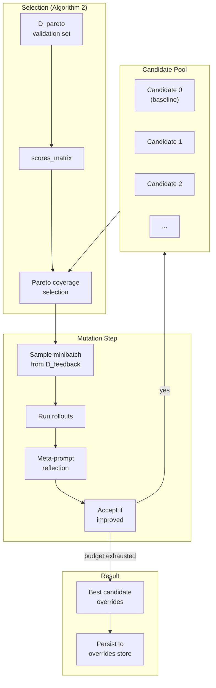

# GEPA Optimizer Specification

## Purpose

Enable automated prompt optimization through **Generalist-to-Expert Prompt
Adaptation (GEPA)**, a population-based evolutionary algorithm that evolves
prompt instructions across multiple target sections. This specification covers
the integration of GEPA into Weak Incentives' existing optimizer framework,
the required core store extensions, and the algorithm implementation.

## Guiding Principles

- **Native integration**: GEPA modules map to prompt section paths, leveraging
  existing override stores and session primitives.
- **Minimal new abstractions**: Extend core stores only where broadly useful;
  algorithm-specific logic lives in contrib.
- **Observable execution**: Rollouts emit standard session events for tracing.
- **Deterministic reproducibility**: Seeded RNG ensures repeatable optimization
  runs.
- **Fail-safe mutations**: Invalid prompt mutations are detected and rejected
  before acceptance.



## Background: The GEPA Algorithm

GEPA optimizes compound LLM systems by maintaining a pool of prompt candidates
and evolving them through reflection-based mutation. The key insight is that
different candidates may specialize on different subsets of the validation data,
so the algorithm maintains **Pareto-optimal specialists** rather than converging
to a single best candidate.

### Algorithm Overview

1. **Initialize** a candidate pool with the baseline prompt configuration
2. **Evaluate** candidates on a small validation subset (D_pareto)
3. **Select** a candidate using Pareto coverage (diverse specialists)
4. **Mutate** a module (section) via LLM reflection on feedback from D_feedback
5. **Accept** mutation if minibatch score improves
6. **Repeat** until budget exhausted
7. **Return** best overall candidate

### Optional: System-Aware Merge

The merge extension (Algorithms 3/4 in the paper) recombines improvements from
different candidates by tracking ancestry and selectively merging module
overrides. This is optional and disabled by default.

## Mapping GEPA to Weak Incentives

### Modules as Section Paths

GEPA's "modules" map directly to Weak Incentives **section paths**:

| GEPA Concept | Weak Incentives Primitive |
|--------------|---------------------------|
| Module | Section path `tuple[str, ...]` |
| Module instruction | Section body (via override) |
| Candidate | Mapping of `path -> override body` |
| System trajectory | Session events (`ToolInvoked`, `PromptExecuted`) |

This approach:

- Works with existing override infrastructure
- Allows optimizing multiple sections in one prompt (round-robin)
- Uses section content hashes for staleness detection

### Alternative: Multi-Prompt Systems

For compound systems with multiple distinct prompts, a future extension could
treat each prompt template as a module. This requires a `System` abstraction
and is deferred to a later phase.

## Core Extensions

### InMemoryPromptOverridesStore

GEPA maintains many candidate overrides in memory. A new store implementation
avoids filesystem overhead:

```python
class InMemoryPromptOverridesStore(PromptOverridesStore):
    """In-memory override storage for transient candidate populations."""

    def __init__(self) -> None: ...

    def resolve(
        self,
        descriptor: PromptDescriptor,
        tag: str = "latest",
    ) -> PromptOverride | None: ...

    def upsert(
        self,
        descriptor: PromptDescriptor,
        override: PromptOverride,
    ) -> PromptOverride: ...

    def delete(
        self,
        *,
        ns: str,
        prompt_key: str,
        tag: str,
    ) -> None: ...

    def set_section_override(
        self,
        prompt: PromptLike,
        *,
        tag: str = "latest",
        path: tuple[str, ...],
        body: str,
    ) -> PromptOverride: ...

    def seed(
        self,
        prompt: PromptLike,
        *,
        tag: str = "latest",
    ) -> PromptOverride: ...
```

**Implementation notes:**

- Store keyed by `(ns, prompt_key, tag)` tuple
- Thread-safe via lock (candidates evaluated in parallel)
- Same validation as `LocalPromptOverridesStore`

### OverlayPromptOverridesStore

Layer candidate overrides on top of a base store:

```python
class OverlayPromptOverridesStore(PromptOverridesStore):
    """Composite store layering overlay overrides on top of a base store."""

    def __init__(
        self,
        *,
        base: PromptOverridesStore | None,
        overlay: PromptOverridesStore,
    ) -> None: ...
```

**Resolution behavior:**

- `resolve()` merges base and overlay overrides
- Overlay wins for conflicting section paths
- `set_section_override()` writes only to overlay

This enables "candidate = base project overrides + candidate-specific mutations".

### File Locations

```
src/weakincentives/prompt/overrides/
  memory_store.py      # InMemoryPromptOverridesStore
  overlay_store.py     # OverlayPromptOverridesStore
  __init__.py          # Export new stores
```

## GEPA Data Types

### Example and Feedback

```python
@dataclass(slots=True, frozen=True)
class GepaExample:
    """A single training/validation example."""

    id: str
    params: tuple[SupportsDataclass, ...]  # Arguments to prompt.bind()
    label: object                           # Ground truth for scoring
```

```python
@dataclass(slots=True, frozen=True)
class RolloutFeedback:
    """Evaluation result for a single rollout."""

    score: float        # Numeric quality signal
    feedback: str       # Textual explanation for meta-prompt
    eval_trace: str | None = None  # Optional test/eval logs
```

```python
@dataclass(slots=True, frozen=True)
class RolloutRecord:
    """Complete record of a single evaluation rollout."""

    example_id: str
    inputs_repr: str      # Formatted input params
    output_repr: str      # Formatted model output
    tool_trace_repr: str  # Formatted tool invocation trace
    feedback: RolloutFeedback
```

### Feedback Function Protocol

```python
class FeedbackFn(Protocol):
    """User-provided scoring and feedback generation."""

    def __call__(
        self,
        example: GepaExample,
        response: PromptResponse[object],
        session: SessionProtocol,
    ) -> RolloutFeedback: ...
```

### Formatting Hooks

```python
class ExampleFormatter(Protocol):
    """Format example inputs/outputs for meta-prompt inclusion."""

    def __call__(
        self,
        example: GepaExample,
        response: PromptResponse[object],
    ) -> tuple[str, str]:  # (inputs_repr, output_repr)
        ...


class TraceFormatter(Protocol):
    """Format tool traces for meta-prompt inclusion."""

    def __call__(
        self,
        session: SessionProtocol,
    ) -> str: ...
```

Default implementations:

- `ExampleFormatter`: JSON dump of params + response text/output
- `TraceFormatter`: Iterate `ToolInvoked` events, render name/params/result

## GepaConfig

```python
@dataclass(slots=True, frozen=True)
class GepaConfig:
    """Configuration for GEPA optimization."""

    # Budget and batching
    rollout_budget: int              # Max total rollouts across all iterations
    minibatch_size: int              # Examples per mutation evaluation
    pareto_set_size: int             # Size of D_pareto validation subset

    # Target sections (modules)
    target_section_paths: tuple[tuple[str, ...], ...]

    # Dataset
    training_examples: Sequence[GepaExample]

    # Scoring
    feedback_fn: FeedbackFn

    # Optional formatting hooks
    example_formatter: ExampleFormatter | None = None
    trace_formatter: TraceFormatter | None = None

    # Hyperparameters
    seed: int = 0
    enable_merge: bool = False  # Enable GEPA+Merge (Algorithm 3/4)

    # Robustness
    max_example_chars: int = 6_000
    max_trace_chars: int = 6_000
    escape_dollar_signs: bool = True  # Escape $ in MarkdownSection bodies

    # Persistence
    persist: bool = True
    persist_scope: PersistenceScope = PersistenceScope.GLOBAL
```

## GepaResult

```python
@dataclass(slots=True, frozen=True)
class GepaResult:
    """Result of GEPA optimization."""

    best_candidate_overrides: dict[tuple[str, ...], str]  # path -> body
    best_pareto_mean: float
    scores_matrix: list[list[float]]  # candidates x D_pareto
    ancestry: list[int | None]        # Parent index per candidate
    accepted_mutations: int
    total_rollouts: int
```

## GepaOptimizer

```python
class GepaOptimizer(BasePromptOptimizer[object, GepaResult]):
    """GEPA-based prompt section optimization."""

    def __init__(
        self,
        context: OptimizationContext,
        config: GepaConfig,
        *,
        optimizer_config: OptimizerConfig | None = None,
    ) -> None: ...

    def optimize(
        self,
        prompt: Prompt[object],
        *,
        session: SessionProtocol,
    ) -> GepaResult: ...
```

**File location:**

```
src/weakincentives/contrib/optimizers/
  gepa/
    __init__.py
    config.py        # GepaConfig, GepaExample
    types.py         # RolloutFeedback, RolloutRecord, protocols
    trace_format.py  # Default formatters
    selection.py     # Algorithm 2 (Pareto selection)
    mutation.py      # Reflection meta-prompt
    merge.py         # Optional Algorithm 3/4
    prompts.py       # Meta-prompt templates
    optimizer.py     # GepaOptimizer
```

## Algorithm Implementation

### Candidate Representation

```python
@dataclass(slots=True, frozen=True)
class Candidate:
    """Internal representation of a GEPA candidate."""

    overrides: dict[tuple[str, ...], str]  # section_path -> body
    parent_index: int | None = None
```

### Dataset Splitting

At initialization, split `training_examples` into:

- **D_pareto**: First `pareto_set_size` examples (validation for selection)
- **D_feedback**: Remaining examples (minibatch source for mutation)

### Main Loop (Algorithm 1)

```python
def optimize(self, prompt, *, session):
    # 1. Initialize
    rng = random.Random(self.config.seed)
    D_pareto, D_feedback = self._split_dataset()
    candidates = [Candidate(overrides={}, parent_index=None)]
    scores_matrix = [self._evaluate_on_pareto(candidates[0], D_pareto)]
    module_idx = 0
    rollouts_used = 0

    # 2. Main loop
    while rollouts_used < self.config.rollout_budget:
        # Select candidate via Pareto coverage
        k = self._select_candidate(scores_matrix, rng)

        # Round-robin module selection
        module_path = self.config.target_section_paths[module_idx]
        module_idx = (module_idx + 1) % len(self.config.target_section_paths)

        # Sample minibatch
        minibatch = rng.sample(D_feedback, min(self.config.minibatch_size, len(D_feedback)))

        # Evaluate parent on minibatch
        parent_rollouts = [self._run_rollout(candidates[k], ex) for ex in minibatch]
        rollouts_used += len(parent_rollouts)
        sigma = mean(r.feedback.score for r in parent_rollouts)

        # Generate mutation via meta-prompt
        current_body = self._get_effective_body(candidates[k], module_path, prompt)
        new_body = self._propose_mutation(current_body, parent_rollouts, module_path)

        # Build child candidate
        child_overrides = dict(candidates[k].overrides)
        child_overrides[module_path] = new_body
        child = Candidate(overrides=child_overrides, parent_index=k)

        # Evaluate child on same minibatch
        child_rollouts = [self._run_rollout(child, ex) for ex in minibatch]
        rollouts_used += len(child_rollouts)
        sigma_prime = mean(r.feedback.score for r in child_rollouts)

        # Accept if improved
        if sigma_prime > sigma:
            candidates.append(child)
            scores_matrix.append(self._evaluate_on_pareto(child, D_pareto))
            rollouts_used += len(D_pareto)

        # Optional: merge step
        if self.config.enable_merge and len(candidates) >= 2:
            self._attempt_merge(candidates, scores_matrix, rng)

    # 3. Return best
    best_idx = self._find_best_candidate(scores_matrix)
    return self._build_result(candidates, scores_matrix, best_idx, rollouts_used)
```

### Pareto Selection (Algorithm 2)

The selection algorithm maintains diversity by sampling candidates that are
Pareto-optimal on different validation examples:

```python
def _select_candidate(
    self,
    scores_matrix: list[list[float]],
    rng: random.Random,
) -> int:
    n_candidates = len(scores_matrix)
    n_examples = len(scores_matrix[0])

    # 1. Find best score per example
    best_per_example = [
        max(scores_matrix[k][i] for k in range(n_candidates))
        for i in range(n_examples)
    ]

    # 2. Build P_star sets (candidates achieving best on each example)
    P_star = [
        {k for k in range(n_candidates) if scores_matrix[k][i] == best_per_example[i]}
        for i in range(n_examples)
    ]

    # 3. Union of all P_star sets
    C = set().union(*P_star)

    # 4. Remove dominated candidates
    C = self._remove_dominated(C, scores_matrix)

    # 5. Compute coverage frequency
    f = {k: sum(1 for p in P_star if k in p) for k in C}

    # 6. Sample proportional to frequency
    total = sum(f.values())
    r = rng.random() * total
    cumulative = 0.0
    for k in sorted(C):  # Sorted for determinism
        cumulative += f[k]
        if cumulative >= r:
            return k
    return max(C)  # Fallback
```

**Dominance check:**

Candidate `a` dominates `b` if:
- `scores[a][i] >= scores[b][i]` for all i
- `scores[a][i] > scores[b][i]` for at least one i

### Mutation via Meta-Prompt

The reflection prompt asks the LLM to improve an instruction based on feedback:

```python
def _propose_mutation(
    self,
    current_body: str,
    rollouts: list[RolloutRecord],
    module_path: tuple[str, ...],
) -> str:
    # Build meta-prompt
    meta_prompt = self._build_meta_prompt(current_body, rollouts)

    # Evaluate via adapter
    response = self._context.adapter.evaluate(
        meta_prompt,
        session=self._create_optimization_session(prompt),
        deadline=self._context.deadline,
    )

    # Parse new instruction from response
    new_body = self._parse_instruction_block(response.text)

    # Sanitize for MarkdownSection compatibility
    if self.config.escape_dollar_signs:
        new_body = self._escape_dollars(new_body, module_path)

    return new_body
```

**Meta-prompt structure:**

````markdown
## Current Instruction

The following instruction is used in a prompt section:

```
{current_body}
```

## Training Examples with Feedback

{for each rollout in rollouts}
### Example {rollout.example_id}

**Input:** {rollout.inputs_repr}

**Output:** {rollout.output_repr}

**Tool Trace:** {rollout.tool_trace_repr}

**Score:** {rollout.feedback.score}

**Feedback:** {rollout.feedback.feedback}

{end for}

## Task

Based on the feedback above, write an improved instruction that addresses the
identified issues. Return ONLY the updated instruction in a fenced block:

```instruction
<your improved instruction here>
```
````

**Parsing:**

1. Find first `` ```instruction `` block
2. Fallback: first `` ``` `` block
3. Fallback: entire response stripped

### System-Aware Merge (Optional)

When `enable_merge=True`, attempt to combine improvements from different
candidates:

```python
def _attempt_merge(
    self,
    candidates: list[Candidate],
    scores_matrix: list[list[float]],
    rng: random.Random,
) -> None:
    # Select two candidates with good performance
    i, j = self._select_merge_pair(scores_matrix, rng)
    if i == j:
        return

    # Find common ancestor
    ancestor_idx = self._find_common_ancestor(candidates, i, j)
    if ancestor_idx is None:
        return

    ancestor = candidates[ancestor_idx]

    # Build merged candidate
    merged_overrides = dict(ancestor.overrides)
    for path in self.config.target_section_paths:
        i_changed = candidates[i].overrides.get(path) != ancestor.overrides.get(path)
        j_changed = candidates[j].overrides.get(path) != ancestor.overrides.get(path)

        if i_changed and not j_changed:
            merged_overrides[path] = candidates[i].overrides.get(path, merged_overrides.get(path))
        elif j_changed and not i_changed:
            merged_overrides[path] = candidates[j].overrides.get(path, merged_overrides.get(path))
        elif i_changed and j_changed:
            # Both changed: pick from higher-scoring candidate
            if mean(scores_matrix[i]) >= mean(scores_matrix[j]):
                merged_overrides[path] = candidates[i].overrides.get(path, merged_overrides.get(path))
            else:
                merged_overrides[path] = candidates[j].overrides.get(path, merged_overrides.get(path))

    # Add merged candidate if novel
    if merged_overrides not in [c.overrides for c in candidates]:
        merged = Candidate(overrides=merged_overrides, parent_index=None)
        candidates.append(merged)
        scores_matrix.append(self._evaluate_on_pareto(merged, D_pareto))
```

## Rollout Execution

Each rollout creates an isolated session and evaluates the prompt:

```python
def _run_rollout(
    self,
    candidate: Candidate,
    example: GepaExample,
) -> RolloutRecord:
    # 1. Create isolated session
    rollout_session = Session(tags={"scope": "gepa_rollout"})

    # 2. Clone prompt sections for isolation
    cloned_prompt = self._clone_prompt_for_session(prompt, rollout_session)

    # 3. Build overlay store with candidate overrides
    candidate_store = InMemoryPromptOverridesStore()
    for path, body in candidate.overrides.items():
        candidate_store.set_section_override(cloned_prompt, path=path, body=body)

    overlay_store = OverlayPromptOverridesStore(
        base=self._context.overrides_store,
        overlay=candidate_store,
    )

    # 4. Create prompt with overlay store
    eval_prompt = Prompt(
        cloned_prompt.template,
        overrides_store=overlay_store,
        overrides_tag=self._context.overrides_tag,
    ).bind(*example.params)

    # 5. Evaluate
    try:
        response = self._context.adapter.evaluate(
            eval_prompt,
            session=rollout_session,
            deadline=self._context.deadline,
        )
        feedback = self.config.feedback_fn(example, response, rollout_session)
    except PromptEvaluationError as exc:
        feedback = RolloutFeedback(
            score=0.0,
            feedback=f"Evaluation failed: {exc}",
        )
        response = None

    # 6. Format trace
    formatter = self.config.example_formatter or default_example_formatter
    trace_formatter = self.config.trace_formatter or default_trace_formatter

    inputs_repr, output_repr = formatter(example, response) if response else ("", "")
    tool_trace_repr = trace_formatter(rollout_session)

    return RolloutRecord(
        example_id=example.id,
        inputs_repr=inputs_repr[:self.config.max_example_chars],
        output_repr=output_repr[:self.config.max_example_chars],
        tool_trace_repr=tool_trace_repr[:self.config.max_trace_chars],
        feedback=feedback,
    )
```

## Trace Formatting

### Default Tool Trace Formatter

```python
def default_trace_formatter(session: SessionProtocol) -> str:
    events = session.select_all(ToolInvoked)
    lines = []
    for event in events:
        lines.append(f"[{event.name}]")
        lines.append(f"  params: {_truncate(dump(event.params), 500)}")
        lines.append(f"  result: {_truncate(str(event.result), 500)}")
    return "\n".join(lines)
```

### Default Example Formatter

```python
def default_example_formatter(
    example: GepaExample,
    response: PromptResponse[object] | None,
) -> tuple[str, str]:
    inputs = dump(example.params) if example.params else "{}"
    if response is None:
        return inputs, "<no response>"
    if response.output is not None:
        output = dump(response.output)
    else:
        output = response.text or "<empty>"
    return inputs, output
```

## Robustness Considerations

### Dollar Sign Handling

`MarkdownSection` uses `string.Template` which treats `$` as special. When
`escape_dollar_signs=True` (default), the optimizer escapes `$` as `$$` in
mutated bodies to prevent rendering failures.

```python
def _escape_dollars(self, body: str, path: tuple[str, ...]) -> str:
    # Escape all $ not part of original placeholders
    # For safety, escape all $ as $$ in optimizer-generated content
    return body.replace("$", "$$")
```

### Validation of Mutations

Before accepting a mutation, validate it renders correctly:

```python
def _validate_mutation(self, prompt: Prompt, candidate: Candidate) -> bool:
    try:
        # Attempt dry-run render
        test_prompt = self._build_prompt_with_overrides(prompt, candidate)
        _ = test_prompt.render(session=Session())
        return True
    except Exception:
        return False
```

Mutations that fail validation are rejected immediately.

### Trace Truncation

Large tool results can overwhelm the meta-prompt. Apply truncation:

- Per-tool result: 500-2000 characters
- Total trace: `max_trace_chars` (default 6000)
- Example inputs/outputs: `max_example_chars` (default 6000)

### Determinism

For reproducibility:

- Use a single `random.Random(seed)` instance
- Stable sort by candidate index when comparing floats
- Deterministic iteration order (sorted keys)

## Persistence

When `persist=True` and the context has an `overrides_store`:

```python
def _persist_result(
    self,
    prompt: Prompt,
    best_candidate: Candidate,
) -> None:
    if not self.config.persist:
        return
    if self._context.overrides_store is None:
        return

    for path, body in best_candidate.overrides.items():
        self._context.overrides_store.set_section_override(
            prompt,
            tag=self._context.overrides_tag,
            path=path,
            body=body,
        )
```

## Usage Example

```python
from weakincentives.contrib.optimizers.gepa import (
    GepaConfig,
    GepaExample,
    GepaOptimizer,
    RolloutFeedback,
)
from weakincentives.optimizers import OptimizationContext, PersistenceScope
from weakincentives.prompt.overrides import LocalPromptOverridesStore

# Define examples
examples = [
    GepaExample(id="1", params=(QueryParams(query="..."),), label=expected_output_1),
    GepaExample(id="2", params=(QueryParams(query="..."),), label=expected_output_2),
    # ... more examples
]

# Define feedback function
def score_response(
    example: GepaExample,
    response: PromptResponse[object],
    session: SessionProtocol,
) -> RolloutFeedback:
    # Compare output to label
    score = compute_similarity(response.output, example.label)
    feedback = generate_feedback(response.output, example.label)
    return RolloutFeedback(score=score, feedback=feedback)

# Configure GEPA
config = GepaConfig(
    rollout_budget=500,
    minibatch_size=4,
    pareto_set_size=10,
    target_section_paths=(
        ("instructions",),
        ("tool-guidance",),
    ),
    training_examples=examples,
    feedback_fn=score_response,
    seed=42,
)

# Create optimizer
store = LocalPromptOverridesStore()
context = OptimizationContext(
    adapter=adapter,
    event_bus=bus,
    overrides_store=store,
    overrides_tag="gepa-v1",
)
optimizer = GepaOptimizer(context, config)

# Run optimization
result = optimizer.optimize(prompt, session=session)

# Inspect result
print(f"Best Pareto mean: {result.best_pareto_mean}")
print(f"Accepted mutations: {result.accepted_mutations}")
print(f"Total rollouts: {result.total_rollouts}")

# Best overrides are persisted to store if persist=True
```

## Testing Strategy

### Unit Tests

**Selection algorithm (`test_gepa_selection.py`):**

- Known scores_matrix → expected selection distribution
- Dominance pruning correctness
- Edge cases: single candidate, all identical scores

**Mutation parsing (`test_gepa_prompt_parsing.py`):**

- Extract instruction from various response formats
- Dollar sign escaping
- Malformed response handling

**Merge algorithm (`test_gepa_merge.py`):**

- Ancestry tracking
- Module-level override selection
- Novel candidate detection

### Integration Tests

**End-to-end with fake adapter (`test_gepa_optimizer.py`):**

```python
def test_gepa_improves_score():
    # Trivial prompt with one optimizable section
    # Fake adapter: returns output based on instruction keyword
    # Feedback: score 1 if keyword present, 0 otherwise

    # Assert:
    # - At least one mutation accepted
    # - Final override contains target keyword
    # - Pareto mean improved
```

**Store integration (`test_gepa_stores.py`):**

- InMemoryPromptOverridesStore CRUD operations
- OverlayPromptOverridesStore merging behavior
- Thread safety under parallel access

### Robustness Tests

- Mutation validation catches rendering errors
- Truncation respects character limits
- Seeded RNG produces identical results

## Events

GEPA optimization emits events through the context event bus:

- `GepaOptimizationStarted` - Configuration and prompt descriptor
- `GepaRolloutCompleted` - Individual rollout feedback
- `GepaMutationProposed` - Before/after instruction text
- `GepaMutationAccepted` / `GepaMutationRejected` - Acceptance decision
- `GepaOptimizationCompleted` - Final result summary

## Limitations

- **Synchronous execution**: Rollouts run sequentially (parallelization deferred)
- **Section-path modules only**: Multi-prompt systems require future extension
- **No auto-retry on provider errors**: Errors convert to zero-score feedback
- **Memory growth**: Large candidate pools consume memory (no eviction)
- **Dollar sign escaping**: May interfere with intentional template variables
- **Alpha stability**: Interfaces may change without backward compatibility
