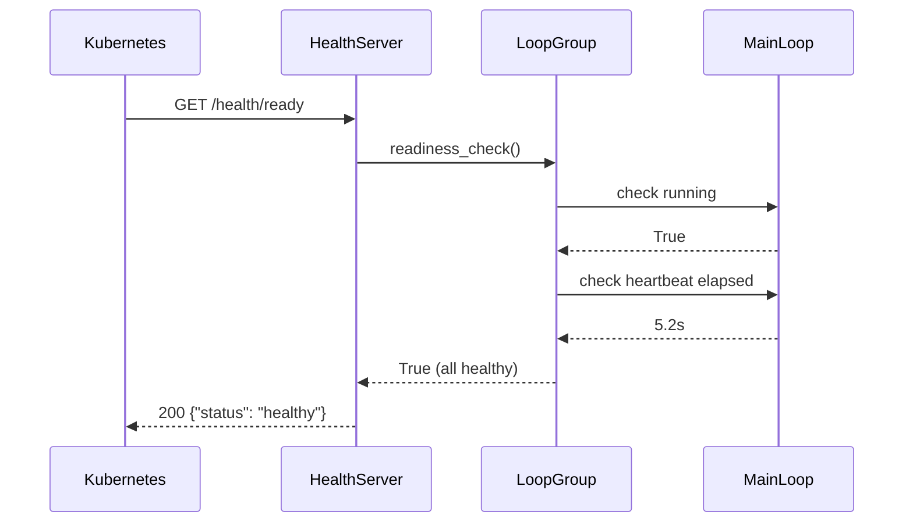
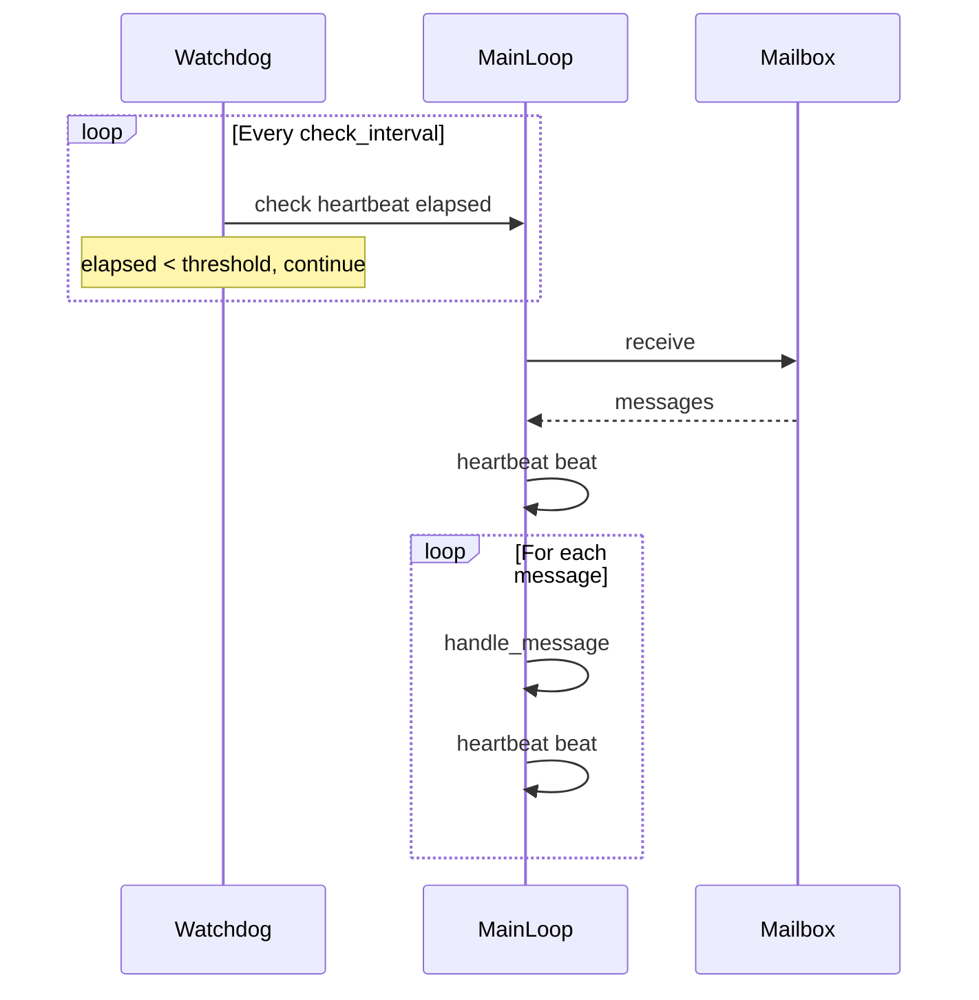
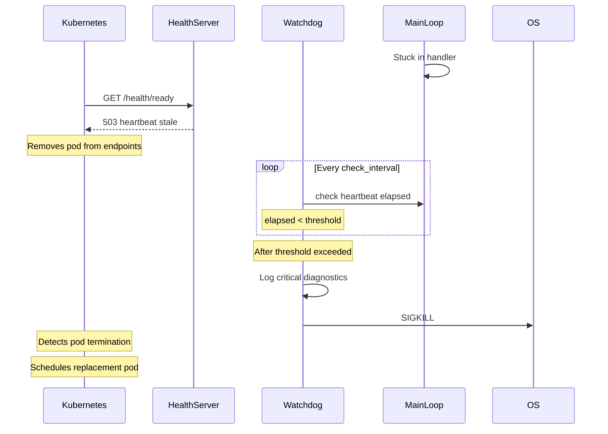

# Health and Monitoring Specification

## Purpose

Enable container orchestrators to manage `LoopGroup` worker processes through
health probes and automatic termination of stuck workers. This spec covers two
complementary mechanisms:

1. **Health endpoints**: HTTP endpoints for Kubernetes liveness and readiness
   probes that expose worker state externally
1. **Watchdog**: Internal monitor that terminates the process when workers
   become unresponsive

Together, these ensure that unhealthy workers are detected promptly and
replaced by the orchestrator.

## Guiding Principles

- **External visibility**: Health endpoints let orchestrators query worker
  state without coupling to internal implementation details
- **Self-healing**: The watchdog terminates stuck processes proactively rather
  than waiting for external timeout expiration
- **Fail fast**: A stuck worker indicates an unrecoverable state. Terminate
  the process rather than attempting complex recovery
- **Heartbeat-based**: Workers prove liveness by updating timestamps. The
  watchdog checks these periodically—no bidirectional protocol required
- **Observable**: Emit structured logs before termination so operators can
  diagnose root causes via log aggregation

## Health Endpoints

### Endpoints

#### GET /health/live

Returns 200 if the process is responsive (liveness probe).

```json
{"status": "healthy"}
```

Use for Kubernetes `livenessProbe`. A failed liveness check causes the
container to be killed and restarted.

#### GET /health/ready

Returns 200 if all loops are running and healthy, 503 otherwise (readiness
probe).

```json
{"status": "healthy"}
```

```json
{"status": "unhealthy"}
```

Use for Kubernetes `readinessProbe`. A failed readiness check removes the pod
from service endpoints but does not restart it.

### HealthServer

Minimal HTTP server using Python stdlib exclusively:

```python
import json
import threading
from http.server import HTTPServer, BaseHTTPRequestHandler
from typing import Callable

class HealthServer:
    """Minimal HTTP server for health probes."""

    def __init__(
        self,
        *,
        host: str = "0.0.0.0",
        port: int = 8080,
        readiness_check: Callable[[], bool] | None = None,
    ) -> None:
        self._host = host
        self._port = port
        self._readiness_check = readiness_check or (lambda: True)
        self._server: HTTPServer | None = None
        self._thread: threading.Thread | None = None

    def start(self) -> None:
        """Start health server in a daemon thread."""
        if self._server is not None:
            return

        readiness = self._readiness_check

        class Handler(BaseHTTPRequestHandler):
            def do_GET(self) -> None:
                if self.path == "/health/live":
                    self._send(200, {"status": "healthy"})
                elif self.path == "/health/ready":
                    ok = readiness()
                    status = "healthy" if ok else "unhealthy"
                    self._send(200 if ok else 503, {"status": status})
                else:
                    self.send_error(404)

            def _send(self, code: int, body: dict) -> None:
                data = json.dumps(body).encode()
                self.send_response(code)
                self.send_header("Content-Type", "application/json")
                self.send_header("Content-Length", str(len(data)))
                self.end_headers()
                self.wfile.write(data)

            def log_message(self, *args) -> None:
                pass  # Suppress request logging

        self._server = HTTPServer((self._host, self._port), Handler)
        self._thread = threading.Thread(
            target=self._server.serve_forever,
            daemon=True,
        )
        self._thread.start()

    def stop(self) -> None:
        """Stop the health server."""
        if self._server is not None:
            self._server.shutdown()
            self._server = None
            self._thread = None

    @property
    def address(self) -> tuple[str, int] | None:
        """Return (host, port) if running."""
        return self._server.server_address if self._server else None
```

## Watchdog

### Heartbeat

Workers signal liveness by calling `heartbeat.beat()` at regular intervals.
The watchdog tracks the last heartbeat time per loop and flags loops that
exceed the stall threshold.

```python
import threading
import time
from dataclasses import dataclass, field

@dataclass(slots=True)
class Heartbeat:
    """Thread-safe heartbeat tracker for a single loop."""

    _last_beat: float = field(default_factory=time.monotonic)
    _lock: threading.Lock = field(default_factory=threading.Lock)

    def beat(self) -> None:
        """Record a heartbeat. Called by the worker loop."""
        with self._lock:
            self._last_beat = time.monotonic()

    def elapsed(self) -> float:
        """Seconds since last heartbeat."""
        with self._lock:
            return time.monotonic() - self._last_beat
```

### Watchdog

The watchdog runs in a dedicated daemon thread, periodically checking all
registered heartbeats. When any loop exceeds the stall threshold, the watchdog
logs diagnostic information and terminates the process.

```python
import logging
import os
import signal
import threading
from collections.abc import Sequence

logger = logging.getLogger(__name__)

class Watchdog:
    """Monitors loop heartbeats and terminates on stall.

    The watchdog runs in a daemon thread. If any monitored loop fails to
    heartbeat within the stall threshold, the process is terminated via
    SIGKILL to ensure immediate exit regardless of stuck threads.

    Example:
        heartbeats = [Heartbeat() for _ in loops]
        watchdog = Watchdog(heartbeats, stall_threshold=60.0)
        watchdog.start()

        # In each loop's run():
        while running:
            heartbeats[i].beat()
            process_message()
    """

    def __init__(
        self,
        heartbeats: Sequence[Heartbeat],
        *,
        stall_threshold: float = 720.0,
        check_interval: float = 60.0,
        loop_names: Sequence[str] | None = None,
    ) -> None:
        """Initialize the watchdog.

        Args:
            heartbeats: Heartbeat instances to monitor, one per loop.
            stall_threshold: Seconds without heartbeat before termination.
            check_interval: Seconds between watchdog checks.
            loop_names: Optional names for logging. Defaults to indices.
        """
        self._heartbeats = heartbeats
        self._stall_threshold = stall_threshold
        self._check_interval = check_interval
        self._loop_names = loop_names or [f"loop-{i}" for i in range(len(heartbeats))]
        self._stop_event = threading.Event()
        self._thread: threading.Thread | None = None

    def start(self) -> None:
        """Start the watchdog thread."""
        if self._thread is not None:
            return

        self._stop_event.clear()
        self._thread = threading.Thread(
            target=self._run,
            name="watchdog",
            daemon=True,
        )
        self._thread.start()

    def stop(self) -> None:
        """Stop the watchdog thread gracefully."""
        self._stop_event.set()
        if self._thread is not None:
            self._thread.join(timeout=self._check_interval * 2)
            self._thread = None

    def _run(self) -> None:
        """Watchdog loop: check heartbeats, terminate on stall."""
        while not self._stop_event.wait(timeout=self._check_interval):
            stalled = self._check_heartbeats()
            if stalled:
                self._terminate(stalled)

    def _check_heartbeats(self) -> list[tuple[str, float]]:
        """Return list of (name, elapsed) for stalled loops."""
        stalled = []
        for name, heartbeat in zip(self._loop_names, self._heartbeats, strict=True):
            elapsed = heartbeat.elapsed()
            if elapsed > self._stall_threshold:
                stalled.append((name, elapsed))
        return stalled

    def _terminate(self, stalled: list[tuple[str, float]]) -> None:
        """Log diagnostics and terminate the process."""
        for name, elapsed in stalled:
            logger.critical(
                "Watchdog: %s stalled for %.1fs (threshold: %.1fs)",
                name,
                elapsed,
                self._stall_threshold,
            )

        logger.critical("Watchdog: terminating process due to stalled workers")

        # SIGKILL ensures termination even if threads are stuck in syscalls
        os.kill(os.getpid(), signal.SIGKILL)
```

### Why SIGKILL

The watchdog uses `SIGKILL` rather than `SIGTERM` because:

1. **Stuck threads cannot respond**: If a thread is deadlocked or in an
   infinite loop, it cannot process signals or check shutdown flags.

1. **Graceful shutdown already failed**: The stall indicates the cooperative
   shutdown mechanism is ineffective for this failure mode.

1. **Container restart is the recovery path**: Kubernetes and Docker will
   restart the container. The visibility timeout ensures in-flight messages
   are redelivered to healthy workers.

1. **Prevent resource exhaustion**: A stuck process continues consuming CPU,
   memory, and connections. Immediate termination releases resources.

## Runnable Protocol Extension

Loops that support watchdog monitoring implement an optional `heartbeat`
property:

```python
class Runnable(Protocol):
    # Existing methods...

    @property
    def heartbeat(self) -> Heartbeat | None:
        """Heartbeat tracker for watchdog monitoring.

        Returns None if the loop does not support heartbeat monitoring.
        """
        ...
```

## MainLoop Integration

MainLoop beats the heartbeat at two points:

1. After successfully receiving messages from the mailbox
1. After processing each message

This ensures both idle loops (waiting on empty queues) and busy loops
(processing messages) demonstrate liveness.

```python
class MainLoop[UserRequestT, OutputT](ABC):
    def __init__(self, ...) -> None:
        # Existing initialization...
        self._heartbeat = Heartbeat()

    @property
    def heartbeat(self) -> Heartbeat:
        """Heartbeat for watchdog monitoring."""
        return self._heartbeat

    def run(self, ...) -> None:
        # Existing setup...

        try:
            while max_iterations is None or iterations < max_iterations:
                if self._shutdown_event.is_set():
                    break

                messages = self._requests.receive(
                    visibility_timeout=visibility_timeout,
                    wait_time_seconds=wait_time_seconds,
                )

                # Beat after receive (proves we're not stuck in receive)
                self._heartbeat.beat()

                for msg in messages:
                    if self._shutdown_event.is_set():
                        msg.nack(visibility_timeout=0)
                        break

                    self._handle_message(msg)

                    # Beat after each message (proves processing completes)
                    self._heartbeat.beat()

                iterations += 1
        finally:
            # Existing cleanup...
```

## LoopGroup Integration

LoopGroup manages both health endpoints and watchdog:

```python
class LoopGroup:
    def __init__(
        self,
        loops: Sequence[Runnable],
        *,
        shutdown_timeout: float = 30.0,
        health_port: int | None = None,
        watchdog_threshold: float | None = 720.0,
        watchdog_interval: float = 60.0,
    ) -> None:
        self.loops = loops
        self.shutdown_timeout = shutdown_timeout
        self._health_port = health_port
        self._watchdog_threshold = watchdog_threshold
        self._watchdog_interval = watchdog_interval
        self._health_server: HealthServer | None = None
        self._watchdog: Watchdog | None = None
        # ... existing attributes

    def run(self, ...) -> None:
        # Collect heartbeats from loops that support them
        heartbeats: list[Heartbeat] = []
        loop_names: list[str] = []
        for i, loop in enumerate(self.loops):
            hb = getattr(loop, "heartbeat", None)
            if hb is not None:
                heartbeats.append(hb)
                loop_names.append(getattr(loop, "name", f"loop-{i}"))

        # Start watchdog if configured
        if self._watchdog_threshold is not None and heartbeats:
            self._watchdog = Watchdog(
                heartbeats,
                stall_threshold=self._watchdog_threshold,
                check_interval=self._watchdog_interval,
                loop_names=loop_names,
            )
            self._watchdog.start()

        # Start health server if configured
        if self._health_port is not None:
            self._health_server = HealthServer(
                port=self._health_port,
                readiness_check=self._readiness_check(heartbeats),
            )
            self._health_server.start()

        try:
            # ... existing run logic
        finally:
            if self._health_server is not None:
                self._health_server.stop()
            if self._watchdog is not None:
                self._watchdog.stop()

    def _readiness_check(
        self,
        heartbeats: list[Heartbeat],
    ) -> Callable[[], bool]:
        """Build readiness check incorporating heartbeat freshness."""
        threshold = self._watchdog_threshold

        def check() -> bool:
            # All loops must be running
            if not all(loop.running for loop in self.loops):
                return False

            # If watchdog is configured, heartbeats must be fresh
            if threshold is not None:
                for hb in heartbeats:
                    if hb.elapsed() > threshold:
                        return False

            return True

        return check
```

### Readiness and Heartbeats

When both health endpoints and watchdog are enabled, the `/health/ready`
endpoint incorporates heartbeat freshness. This creates a layered defense:

1. **Early warning**: Readiness probe fails when heartbeats are stale,
   removing the pod from service endpoints
1. **Hard stop**: Watchdog terminates the process if heartbeats remain stale

This allows Kubernetes to stop routing traffic before the watchdog terminates.

## Configuration

### LoopGroup Parameters

| Parameter | Default | Description |
|-----------|---------|-------------|
| `health_port` | None | Port for health endpoints (disabled if None) |
| `watchdog_threshold` | 720.0s | Seconds without heartbeat before termination |
| `watchdog_interval` | 60.0s | Seconds between watchdog checks |

### Default Timeout Calibration

Defaults are calibrated for:

- **10-minute prompt evaluation deadline**: Maximum expected processing time
  per message in MainLoop
- **30-second long poll**: Maximum `wait_time_seconds` for mailbox receive

| Parameter | Default | Rationale |
|-----------|---------|-----------|
| `wait_time_seconds` | 30s | Maximum long poll duration |
| `watchdog_threshold` | 720s (12 min) | > 30s + 600s with 90s margin |
| `watchdog_interval` | 60s | < 720s / 3, checks ~12x per threshold |
| `visibility_timeout` | 1800s (30 min) | > 720s + 600s with margin for retries |

### Threshold Guidelines

The stall threshold must be greater than:

- Maximum expected message processing time (10 minutes = 600s)
- Mailbox long poll duration (`wait_time_seconds` = 30s)
- Sum of the above plus safety margin

### Relationship to Other Timeouts

```
visibility_timeout > watchdog_threshold + max_processing_time
    1800s > 720s + 600s ✓

watchdog_threshold > wait_time_seconds + max_processing_time
    720s > 30s + 600s ✓

watchdog_interval < watchdog_threshold / 3
    60s < 240s ✓
```

## Execution Flow

### Health Check Flow



### Watchdog Normal Operation



### Stall Detection and Termination



## Usage

### Default Configuration (Recommended)

Watchdog is enabled by default with thresholds calibrated for 10-minute
prompt evaluations:

```python
group = LoopGroup(loops=[main_loop], health_port=8080)
group.run()
# watchdog_threshold=720.0 (12 min), watchdog_interval=60.0 by default
```

### Watchdog Only (No Health Endpoints)

```python
group = LoopGroup(loops=[main_loop])
group.run()
# Uses default watchdog settings, no HTTP health server
```

### Disable Watchdog

```python
group = LoopGroup(
    loops=[main_loop],
    health_port=8080,
    watchdog_threshold=None,  # Disable watchdog
)
group.run()
```

### Shorter Deadlines (2-Minute Evaluations)

```python
group = LoopGroup(
    loops=[main_loop],
    health_port=8080,
    watchdog_threshold=180.0,  # 3 minutes
    watchdog_interval=30.0,
)
group.run()
# visibility_timeout should be >= 300s (5 minutes)
```

### Longer Deadlines (30-Minute Batch Jobs)

```python
group = LoopGroup(
    loops=[batch_processor],
    health_port=8080,
    watchdog_threshold=2100.0,  # 35 minutes
    watchdog_interval=120.0,
)
group.run()
# visibility_timeout should be >= 3600s (60 minutes)
```

## Kubernetes Configuration

```yaml
apiVersion: v1
kind: Pod
spec:
  containers:
    - name: worker
      livenessProbe:
        httpGet:
          path: /health/live
          port: 8080
        initialDelaySeconds: 10
        periodSeconds: 10
        failureThreshold: 3
      readinessProbe:
        httpGet:
          path: /health/ready
          port: 8080
        initialDelaySeconds: 5
        periodSeconds: 5
        failureThreshold: 2
```

### Probe Timing Recommendations

| Probe | Period | Threshold | Rationale |
|-------|--------|-----------|-----------|
| Liveness | 10s | 3 failures | Avoid false positives from transient issues |
| Readiness | 5s | 2 failures | Remove unhealthy pods quickly |

The readiness probe should be faster than the watchdog threshold to stop
routing traffic before termination.

## Observability

### Logging

The watchdog emits structured logs at CRITICAL level before termination:

```
CRITICAL weakincentives.runtime.watchdog: Watchdog: main-loop stalled for 65.2s (threshold: 60.0s)
CRITICAL weakincentives.runtime.watchdog: Watchdog: terminating process due to stalled workers
```

### Metrics (Future)

Consider exposing Prometheus metrics:

- `wink_health_ready` - Gauge: 1 if ready, 0 otherwise
- `wink_heartbeat_age_seconds{loop="..."}` - Current heartbeat age
- `wink_watchdog_stalls_total{loop="..."}` - Counter of detected stalls

## Testing

### Health Server Tests

```python
def test_health_server_liveness():
    server = HealthServer(port=0)  # OS assigns port
    server.start()

    host, port = server.address
    resp = urllib.request.urlopen(f"http://{host}:{port}/health/live")
    assert resp.status == 200

    server.stop()


def test_health_server_readiness():
    ready = True
    server = HealthServer(port=0, readiness_check=lambda: ready)
    server.start()

    host, port = server.address

    resp = urllib.request.urlopen(f"http://{host}:{port}/health/ready")
    assert resp.status == 200

    ready = False
    with pytest.raises(urllib.error.HTTPError) as exc:
        urllib.request.urlopen(f"http://{host}:{port}/health/ready")
    assert exc.value.code == 503

    server.stop()
```

### Heartbeat Tests

```python
def test_heartbeat_elapsed():
    hb = Heartbeat()
    time.sleep(0.1)
    assert 0.1 <= hb.elapsed() < 0.2

    hb.beat()
    assert hb.elapsed() < 0.05


def test_watchdog_detects_stall():
    hb = Heartbeat()
    watchdog = Watchdog([hb], stall_threshold=0.1, check_interval=0.05)

    stalled = watchdog._check_heartbeats()
    assert stalled == []  # Not stalled yet

    time.sleep(0.15)
    stalled = watchdog._check_heartbeats()
    assert len(stalled) == 1
    assert stalled[0][0] == "loop-0"


def test_watchdog_clears_on_beat():
    hb = Heartbeat()
    watchdog = Watchdog([hb], stall_threshold=0.1, check_interval=0.05)

    time.sleep(0.15)
    stalled = watchdog._check_heartbeats()
    assert len(stalled) == 1

    hb.beat()
    stalled = watchdog._check_heartbeats()
    assert stalled == []
```

### Integration Tests

```python
def test_watchdog_terminates_on_stall():
    """Test that watchdog terminates process when loop stalls."""
    import subprocess
    import sys

    script = '''
import time
from weakincentives.runtime import Heartbeat, Watchdog

hb = Heartbeat()
watchdog = Watchdog([hb], stall_threshold=0.5, check_interval=0.1)
watchdog.start()

# Don't beat - simulate stall
time.sleep(2)
print("ERROR: should have been killed")
'''

    result = subprocess.run(
        [sys.executable, "-c", script],
        capture_output=True,
        timeout=5,
    )

    # SIGKILL results in -9 exit code
    assert result.returncode == -9
    assert b"ERROR" not in result.stdout


def test_mainloop_heartbeats_during_processing():
    """Test that MainLoop beats heartbeat during message processing."""
    loop = TestMainLoop(...)
    assert loop.heartbeat.elapsed() < 0.1

    requests.send(MainLoopRequest(request=...))
    loop.run(max_iterations=1)

    assert loop.heartbeat.elapsed() < 0.1
```

## Limitations

- **No partial recovery**: The watchdog terminates the entire process. It
  cannot restart individual stuck loops because Python threads cannot be
  killed safely.

- **Coarse granularity**: Heartbeats are per-loop, not per-message. A loop
  processing many fast messages followed by one slow message may appear stuck.

- **False positives possible**: External dependencies (databases, APIs) that
  block longer than the threshold will trigger termination even if the loop
  is technically healthy.

- **Single process**: Health endpoints and watchdog are per-process. Multi-
  process deployments need separate monitoring per worker.

- **Daemon threads**: Both health server and watchdog run as daemon threads
  and will not prevent process exit. This is intentional.

## Future Considerations

- **Adaptive thresholds**: Track historical processing times and adjust the
  stall threshold dynamically.

- **Stuck thread diagnostics**: Capture thread stack traces before termination
  for post-mortem analysis.

- **Graceful degradation**: For multi-loop groups, consider marking individual
  loops unhealthy before full termination.

- **Metrics endpoint**: Add `/metrics` for Prometheus scraping.

- **Watchdog-of-watchdog**: External process monitor (systemd, Kubernetes
  liveness probe) provides defense in depth if the watchdog thread itself
  becomes stuck.
