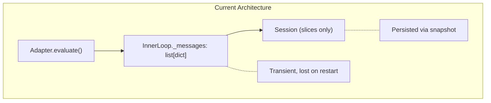
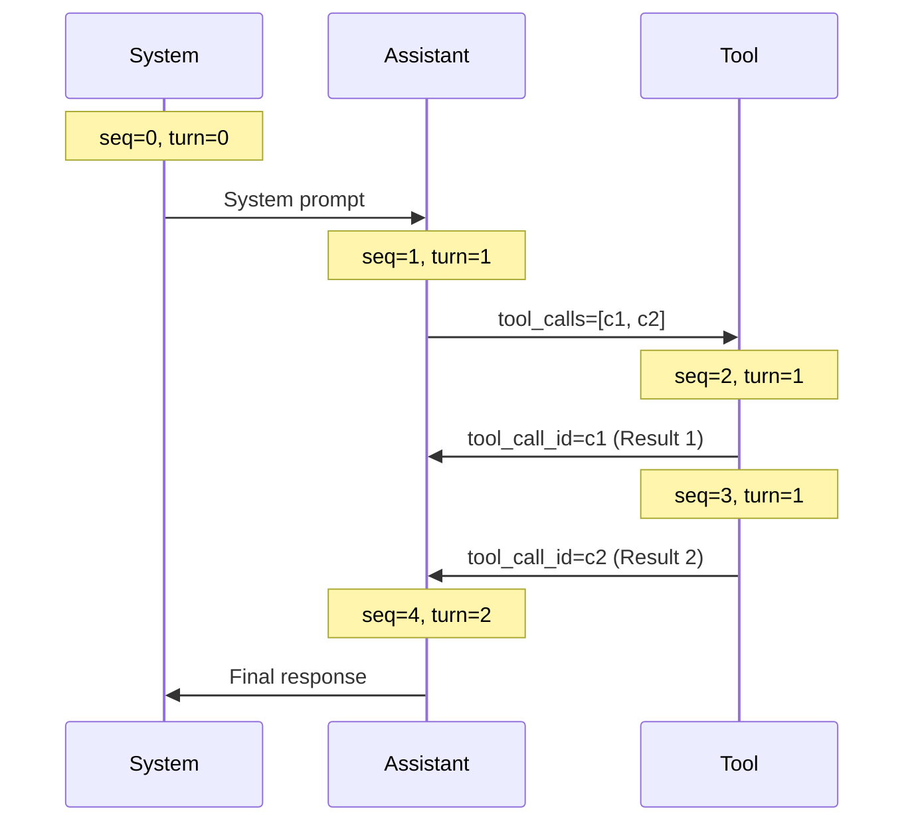
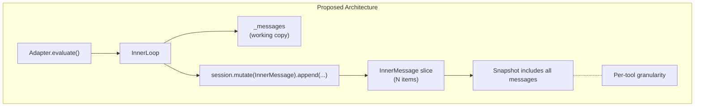

# Inner Messages Specification

## Purpose

Enable session snapshots to capture full conversation history, allowing prompt
evaluations to resume after process restarts. This specification covers the
`InnerMessage` dataclass stored as standalone session slice items, the
`inner_message_append` reducer, and the resume flow for adapters.

## Problem Statement

Currently, conversation messages live exclusively in `InnerLoop._messages`, a
transient list that exists only for the duration of a single `evaluate()` call.
When a process terminates mid-evaluation—especially during a tool call—all
conversation context is lost:



Session snapshots capture accumulated dataclass state but not the raw message
history required to resume provider conversations.

## Guiding Principles

- **Single source of truth**: Conversation state lives in the session, not the
  adapter loop.
- **Snapshot-complete**: A snapshot contains everything needed to resume,
  including messages.
- **Provider-agnostic messages**: Stored format is provider-neutral; adapters
  translate on resume.
- **Incremental capture**: Each message appends immediately; per-tool-call
  granularity.
- **Standalone items**: Each message is an independent slice item, not nested in
  a container.
- **Backward compatible**: Existing code paths continue to work; resume is
  opt-in.

## Core Data Model

### ToolCallRecord

Captures tool invocation metadata for assistant messages:

```python
@FrozenDataclass()
class ToolCallRecord:
    """Record of a tool call made by the assistant."""

    call_id: str
    name: str
    arguments: str  # JSON-encoded arguments
    status: Literal["pending", "completed", "failed"] = "pending"
```

### InnerMessage

Provider-neutral representation of a single message, stored as standalone slice
items:

```python
@FrozenDataclass()
class InnerMessage:
    """A single message in a conversation, stored as a session slice item."""

    role: Literal["system", "assistant", "user", "tool"]
    content: str

    # Ordering fields
    evaluation_id: str
    sequence: int  # Global sequence within evaluation, starts at 0

    # Tool-related fields
    tool_calls: tuple[ToolCallRecord, ...] = ()
    tool_call_id: str | None = None  # For role="tool", references the call
    tool_name: str | None = None  # For role="tool"

    # Metadata
    turn: int = 0  # Provider round-trip number
    prompt_ns: str = ""
    prompt_key: str = ""
    created_at: datetime = field(default_factory=lambda: datetime.now(UTC))
    message_id: UUID = field(default_factory=uuid4)
```

**Field semantics:**

| Field | Purpose | |-------|---------| | `evaluation_id` | Groups messages from
a single `evaluate()` call | | `sequence` | Strict ordering within evaluation;
system=0, then incrementing | | `turn` | Provider round-trip number; increments
after each assistant response | | `tool_call_id` | Links tool result to its
originating call | | `tool_calls` | For assistant messages, pending tool
invocations |

### Sequence Numbering



## Reducer

### inner_message_append

Custom reducer that maintains message ordering within an evaluation:

```python
def inner_message_append(
    slice_values: tuple[InnerMessage, ...],
    event: InnerMessage,
    *,
    context: ReducerContext,
) -> tuple[InnerMessage, ...]:
    """Append message maintaining sequence order within evaluation.

    Messages are ordered by (evaluation_id, sequence). Messages from different
    evaluations are kept separate but ordered by their first message's timestamp.
    Duplicate messages (same message_id) are ignored.
    """
    # Deduplicate by message_id
    existing_ids = {msg.message_id for msg in slice_values}
    if event.message_id in existing_ids:
        return slice_values

    # Find insertion point maintaining order
    result = list(slice_values)
    insert_idx = len(result)

    for i, msg in enumerate(result):
        if msg.evaluation_id == event.evaluation_id:
            if msg.sequence > event.sequence:
                insert_idx = i
                break
        elif msg.evaluation_id > event.evaluation_id:
            # Different evaluation, maintain evaluation order
            insert_idx = i
            break

    result.insert(insert_idx, event)
    return tuple(result)
```

### Reducer Registration

```python
from weakincentives.runtime.inner_messages import (
    InnerMessage,
    inner_message_append,
)

session.mutate(InnerMessage).register(
    InnerMessage,
    inner_message_append,
)
```

## Session Integration

### Recording Messages

The `InnerLoop` records each message immediately after creation:

```python
class InnerLoop:
    _sequence: int = 0
    _turn: int = 0

    def _record_message(
        self,
        role: Literal["system", "assistant", "user", "tool"],
        content: str,
        *,
        tool_calls: tuple[ToolCallRecord, ...] = (),
        tool_call_id: str | None = None,
        tool_name: str | None = None,
    ) -> InnerMessage:
        """Record a message to the session and return it."""
        message = InnerMessage(
            role=role,
            content=content,
            evaluation_id=self._evaluation_id,
            sequence=self._sequence,
            turn=self._turn,
            tool_calls=tool_calls,
            tool_call_id=tool_call_id,
            tool_name=tool_name,
            prompt_ns=self.inputs.prompt.ns,
            prompt_key=self.inputs.prompt.key,
        )
        self._sequence += 1
        self.config.session.mutate(InnerMessage).append(message)
        return message
```

### System Message Recording

During `_prepare()`:

```python
def _prepare(self) -> None:
    self._evaluation_id = str(uuid4())
    self._sequence = 0
    self._turn = 0

    # Record system message immediately
    self._record_message(
        role="system",
        content=self._rendered.text,
    )

    # ... rest of preparation ...
```

### Assistant Message Recording

After receiving provider response:

```python
def _handle_assistant_response(self, message: ProviderMessage) -> None:
    self._turn += 1

    tool_call_records = tuple(
        ToolCallRecord(
            call_id=tc.id,
            name=tc.function.name,
            arguments=tc.function.arguments,
            status="pending",
        )
        for tc in (message.tool_calls or [])
    )

    self._record_message(
        role="assistant",
        content=message.content or "",
        tool_calls=tool_call_records,
    )
```

### Tool Result Recording

After **each** tool execution (not batched):

```python
def _execute_tool_and_record(
    self,
    tool_call: ProviderToolCall,
) -> dict[str, Any]:
    """Execute a single tool and record result immediately."""

    result = self._invoke_handler(tool_call)

    # Record to session immediately after execution
    self._record_message(
        role="tool",
        content=self._serialize_result(result),
        tool_call_id=tool_call.id,
        tool_name=tool_call.function.name,
    )

    # Update tool call status in the assistant message
    self._mark_tool_completed(tool_call.id)

    return self._format_tool_message(tool_call.id, result)
```

### Updating Tool Call Status

When a tool completes, update its status in the originating assistant message:

```python
def _mark_tool_completed(self, call_id: str) -> None:
    """Update tool call status to completed in the assistant message."""
    messages = self.config.session.select_all(InnerMessage)

    for msg in reversed(messages):
        if msg.evaluation_id != self._evaluation_id:
            continue
        if msg.role != "assistant":
            continue

        for tc in msg.tool_calls:
            if tc.call_id == call_id:
                # Create updated message with completed status
                updated_calls = tuple(
                    replace(t, status="completed") if t.call_id == call_id else t
                    for t in msg.tool_calls
                )
                updated_msg = replace(msg, tool_calls=updated_calls)

                # Replace in session using upsert
                self.config.session.mutate(InnerMessage).dispatch(updated_msg)
                return
```

### State Flow



## Snapshot Serialization

Messages serialize as individual slice items:

```python
snapshot = session.snapshot()
json_str = snapshot.to_json()

# InnerMessage items appear individually:
# {
#   "slices": [
#     {
#       "slice_type": "weakincentives.runtime.inner_messages:InnerMessage",
#       "item_type": "weakincentives.runtime.inner_messages:InnerMessage",
#       "items": [
#         {"role": "system", "sequence": 0, "content": "...", ...},
#         {"role": "assistant", "sequence": 1, "content": "...", ...},
#         {"role": "tool", "sequence": 2, "tool_call_id": "c1", ...},
#         ...
#       ]
#     }
#   ]
# }
```

## Resume Flow

### Querying Conversation State

Retrieve messages for an evaluation:

```python
def get_inner_messages(
    session: Session,
    evaluation_id: str | None = None,
) -> tuple[InnerMessage, ...]:
    """Get conversation messages, optionally filtered by evaluation."""
    messages = session.select_all(InnerMessage)

    if evaluation_id is not None:
        messages = tuple(m for m in messages if m.evaluation_id == evaluation_id)

    return tuple(sorted(messages, key=lambda m: (m.evaluation_id, m.sequence)))


def get_latest_evaluation_id(session: Session) -> str | None:
    """Get the evaluation_id of the most recent conversation."""
    messages = session.select_all(InnerMessage)
    if not messages:
        return None

    # Find latest by created_at of system message
    system_messages = [m for m in messages if m.role == "system"]
    if not system_messages:
        return None

    latest = max(system_messages, key=lambda m: m.created_at)
    return latest.evaluation_id
```

### Detecting Incomplete Tool Calls

Find tool calls that started but didn't complete:

```python
def get_pending_tool_calls(
    session: Session,
    evaluation_id: str,
) -> tuple[ToolCallRecord, ...]:
    """Get tool calls that haven't completed."""
    messages = get_inner_messages(session, evaluation_id)

    # Find all tool_call_ids that have results
    completed_ids = {
        m.tool_call_id
        for m in messages
        if m.role == "tool" and m.tool_call_id
    }

    # Find pending from assistant messages
    pending: list[ToolCallRecord] = []
    for msg in messages:
        if msg.role == "assistant":
            for tc in msg.tool_calls:
                if tc.call_id not in completed_ids:
                    pending.append(tc)

    return tuple(pending)
```

### Adapter Interface

Adapters gain a `resume` parameter:

```python
class ProviderAdapter(ABC):
    @abstractmethod
    def evaluate(
        self,
        prompt: Prompt[OutputT],
        *,
        # ... existing parameters ...
        resume: bool = False,  # NEW: resume from session state
    ) -> PromptResponse[OutputT]: ...
```

### Resume Behavior

When `resume=True`:

1. **Query existing messages** from session
1. **Find pending tool calls** that need re-execution
1. **Reconstruct provider messages** from completed conversation
1. **Continue from interruption point**

```python
def evaluate(
    self,
    prompt: Prompt[OutputT],
    *,
    session: SessionProtocol,
    resume: bool = False,
    **kwargs,
) -> PromptResponse[OutputT]:
    if resume:
        return self._resume_evaluation(prompt, session, **kwargs)
    return self._fresh_evaluation(prompt, session, **kwargs)

def _resume_evaluation(
    self,
    prompt: Prompt[OutputT],
    session: SessionProtocol,
    **kwargs,
) -> PromptResponse[OutputT]:
    evaluation_id = get_latest_evaluation_id(session)
    if evaluation_id is None:
        raise ValueError("No conversation to resume")

    messages = get_inner_messages(session, evaluation_id)
    pending = get_pending_tool_calls(session, evaluation_id)

    # Validate prompt identity
    system_msg = next((m for m in messages if m.role == "system"), None)
    if system_msg and (prompt.ns, prompt.key) != (system_msg.prompt_ns, system_msg.prompt_key):
        raise ValueError("Cannot resume with mismatched prompt")

    # Reconstruct provider message list
    provider_messages = self._messages_to_provider_format(messages)

    # Determine resume point
    if pending:
        # Resume mid-turn: re-execute pending tools
        return self._resume_from_pending_tools(
            prompt, session, provider_messages, pending, evaluation_id, **kwargs
        )
    else:
        # Resume after complete turn: continue conversation
        return self._resume_from_complete_turn(
            prompt, session, provider_messages, evaluation_id, **kwargs
        )
```

### Message Reconstruction

Convert slice items to provider message format:

```python
def _messages_to_provider_format(
    self,
    messages: tuple[InnerMessage, ...],
) -> list[dict[str, Any]]:
    """Convert InnerMessage items to provider format."""
    result: list[dict[str, Any]] = []

    for msg in messages:
        if msg.role == "system":
            result.append({"role": "system", "content": msg.content})

        elif msg.role == "assistant":
            assistant_msg: dict[str, Any] = {
                "role": "assistant",
                "content": msg.content,
            }
            if msg.tool_calls:
                assistant_msg["tool_calls"] = [
                    {
                        "id": tc.call_id,
                        "type": "function",
                        "function": {
                            "name": tc.name,
                            "arguments": tc.arguments,
                        },
                    }
                    for tc in msg.tool_calls
                    if tc.status == "completed"  # Only include completed
                ]
            result.append(assistant_msg)

        elif msg.role == "tool":
            result.append({
                "role": "tool",
                "tool_call_id": msg.tool_call_id,
                "content": msg.content,
            })

        elif msg.role == "user":
            result.append({"role": "user", "content": msg.content})

    return result
```

### Resuming from Pending Tools

When interrupted mid-tool-execution:

```python
def _resume_from_pending_tools(
    self,
    prompt: Prompt[OutputT],
    session: SessionProtocol,
    provider_messages: list[dict[str, Any]],
    pending: tuple[ToolCallRecord, ...],
    evaluation_id: str,
    **kwargs,
) -> PromptResponse[OutputT]:
    """Resume by executing remaining tool calls."""

    # Create inner loop with existing messages
    # The loop will detect pending tools and execute them
    # Completed tools are already in the message history

    inputs = InnerLoopInputs[OutputT](
        # ... other fields ...
        initial_messages=provider_messages,
    )

    inner_loop = InnerLoop(inputs=inputs, config=config)
    inner_loop._evaluation_id = evaluation_id
    inner_loop._sequence = max(m.sequence for m in messages) + 1
    inner_loop._turn = max(m.turn for m in messages)

    # Execute pending tools
    for tc in pending:
        inner_loop._execute_tool_and_record(tc)

    # Continue with provider
    return inner_loop.run()
```

## MainLoop Integration

`MainLoop` enables message recording by registering the reducer:

```python
class MainLoop(ABC, Generic[UserRequestT, OutputT]):
    def execute(self, request: UserRequestT) -> PromptResponse[OutputT]:
        session = self.create_session()

        # Enable message recording
        session.mutate(InnerMessage).register(
            InnerMessage,
            inner_message_append,
        )

        return self._adapter.evaluate(
            self.create_prompt(request),
            session=session,
        )
```

Checkpoint persistence is the caller's responsibility. See Usage Example for
patterns.

## Tool Idempotency

Resume safety depends on tool idempotency. With per-tool-call recording,
idempotency requirements are reduced since completed tools are tracked.

### Idempotency Patterns

1. **Session-tracked completion**: The `ToolCallRecord.status` field tracks
   whether a tool completed. On resume, only pending tools re-execute.

1. **Natural idempotency**: Read-only tools (search, fetch) are safe by default.

1. **Idempotency keys**: For extra safety, mutating tools can use `call_id`:

   ```python
   def write_file_handler(
       params: WriteFileParams,
       *,
       context: ToolContext,
   ) -> ToolResult[WriteFileResult]:
       call_id = context.call_id
       if was_already_executed(call_id):
           return cached_result(call_id)
       # ... execute and cache ...
   ```

### ToolContext Enhancement

```python
@FrozenDataclass()
class ToolContext:
    # ... existing fields ...
    call_id: str  # Already present
    is_resume: bool = False  # NEW: indicates resumed execution
```

## Error Handling

### Resume Errors

| Error | Cause | Resolution | |-------|-------|------------| |
`ConversationNotFound` | No messages in session | Start fresh evaluation | |
`PromptMismatch` | Prompt ns/key changed | Clear and restart | |
`SnapshotRestoreError` | Corrupted snapshot | Clear and restart |

### Partial Execution Recovery

With per-tool-call recording:

1. Crash after tool A completes → tool A result in session
1. Resume detects tool B pending → only tool B re-executes
1. Tool A result already in provider messages → no duplicate execution

## Usage Example

### Basic Resume

```python
from weakincentives.runtime.session import Session, Snapshot
from weakincentives.runtime.inner_messages import (
    InnerMessage,
    inner_message_append,
    get_inner_messages,
)

# Setup session with recording
session = Session(bus=InProcessEventBus())
session.mutate(InnerMessage).register(
    InnerMessage,
    inner_message_append,
)

# Save checkpoint after each message
def save_on_change(old, new):
    if len(new) > len(old):
        Path("/tmp/checkpoint.json").write_text(session.snapshot().to_json())

session.observe(InnerMessage, save_on_change)

# Run evaluation
response = adapter.evaluate(prompt, session=session)
```

### Resume from Checkpoint

```python
# Load checkpoint
snapshot = Snapshot.from_json(Path("/tmp/checkpoint.json").read_text())

session = Session(bus=InProcessEventBus())
session.mutate(InnerMessage).register(
    InnerMessage,
    inner_message_append,
)
session.mutate().rollback(snapshot)

# Resume - will detect pending tools and continue
response = adapter.evaluate(prompt, session=session, resume=True)
```

### Inspecting Conversation

```python
# Get all messages
messages = session.select_all(InnerMessage)

# Get messages for specific evaluation
from weakincentives.runtime.inner_messages import get_inner_messages, get_latest_evaluation_id

eval_id = get_latest_evaluation_id(session)
conversation = get_inner_messages(session, eval_id)

for msg in conversation:
    print(f"[{msg.sequence}] {msg.role}: {msg.content[:50]}...")
```

## Migration

### Existing Code

Existing code works unchanged. Conversation recording is opt-in via reducer
registration. Adapters that don't use `resume=True` behave identically.

### Enabling Recording

```python
from weakincentives.runtime.inner_messages import (
    InnerMessage,
    inner_message_append,
    enable_inner_message_recording,
)

# Option 1: Manual registration
session.mutate(InnerMessage).register(
    InnerMessage,
    inner_message_append,
)

# Option 2: Convenience function
enable_inner_message_recording(session)
```

## Limitations

- **Provider compatibility**: Resume assumes provider accepts reconstructed
  message history; some providers may have session affinity
- **Token drift**: Reconstructed prompts may tokenize differently
- **Storage overhead**: Each message is a separate slice item
- **Manual checkpoint persistence**: Library provides serialization; storage is
  caller's responsibility

## File Locations

| Component | Location | |-----------|----------| | Data model |
`src/weakincentives/runtime/inner_messages.py` | | Reducer |
`src/weakincentives/runtime/inner_messages.py` | | Session integration |
`src/weakincentives/runtime/session/` | | Adapter changes |
`src/weakincentives/adapters/shared.py` | | MainLoop integration |
`src/weakincentives/runtime/main_loop.py` |

## Related Specifications

- `specs/SESSIONS.md` - Session state, snapshots, reducers
- `specs/ADAPTERS.md` - Provider adapter protocol
- `specs/MAIN_LOOP.md` - MainLoop orchestration
- `specs/TOOLS.md` - Tool handler patterns
