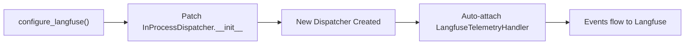
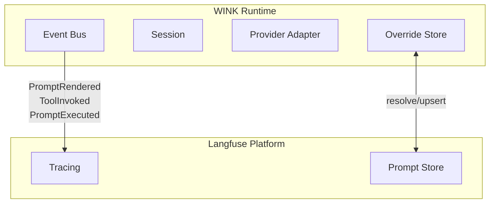
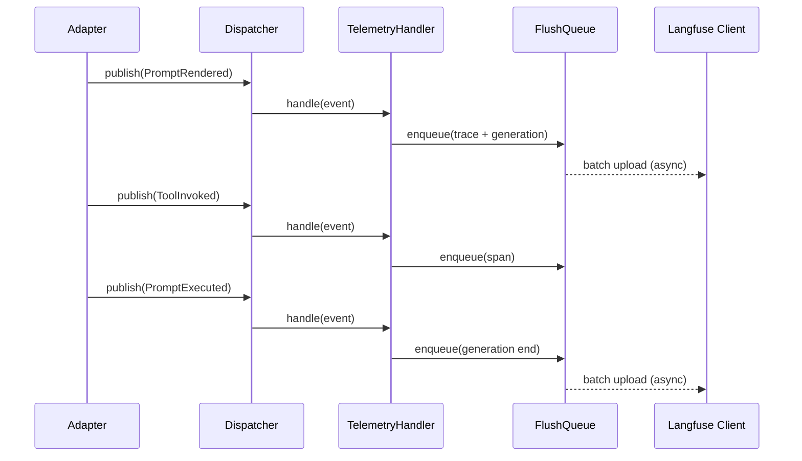
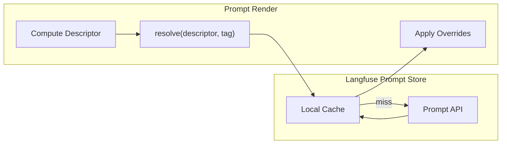
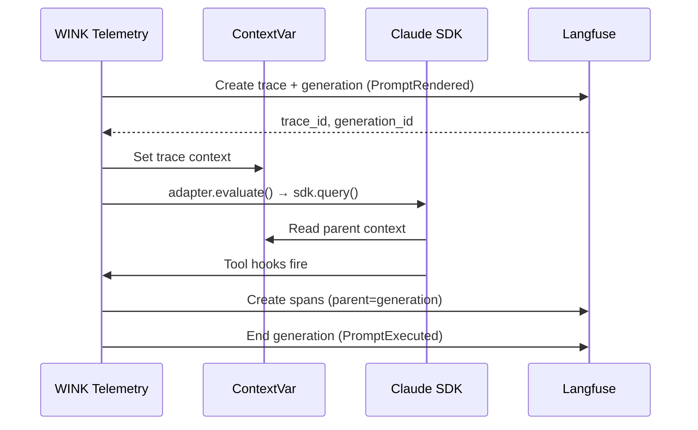

# Langfuse Integration Specification

## Purpose

Enable full observability of WINK background agents through Langfuse. This
specification covers telemetry/tracing integration and prompt management via
Langfuse's prompt store.

## Guiding Principles

- **Non-invasive instrumentation**: Telemetry hooks into existing event bus
  infrastructure without requiring changes to business logic.
- **Decoupled from critical path**: Network calls to Langfuse run asynchronously
  via background flush to avoid blocking prompt evaluation.
- **Bidirectional prompt management**: Override system supports both push
  (publish to Langfuse) and pull (fetch from Langfuse) workflows.
- **Graceful degradation**: Langfuse unavailability does not break agent
  execution.
- **Granular prompt versioning**: Each Section and Tool maps to an individual
  Langfuse prompt for independent version control.

## Auto-Instrumentation

WINK provides a single-call configuration function for automatic tracing:

```python
from weakincentives.contrib.langfuse import configure_langfuse

# Enable automatic tracing at application start
configure_langfuse()

# All WINK evaluations are now traced to Langfuse
response = adapter.evaluate(prompt, session=session)
```

### How It Works

`configure_langfuse()` patches the `InProcessDispatcher` class to automatically
attach telemetry handlers to every new bus instance:



### Configuration Options

```python
configure_langfuse(
    # API settings (fall back to LANGFUSE_* env vars)
    secret_key="sk-lf-...",
    public_key="pk-lf-...",
    host="https://cloud.langfuse.com",

    # Tracing behavior
    tracing_enabled=True,
    trace_sample_rate=1.0,

    # Prompt management
    prompt_management_enabled=True,

    # Advanced
    async_flush=True,
    flush_on_exit=True,
)
```

### Integrating with `@observe`

WINK traces compose naturally with Langfuse's `@observe` decorator for custom
application code:

```python
from langfuse.decorators import observe
from weakincentives.contrib.langfuse import configure_langfuse

configure_langfuse()

@observe(name="process_user_request")
def process_request(user_input: str) -> str:
    # Custom pre-processing (traced)
    processed = preprocess(user_input)

    # WINK evaluation (automatically traced as child)
    response = adapter.evaluate(
        prompt.bind(input=processed),
        session=session,
    )

    # Custom post-processing (traced)
    return postprocess(response.output)
```

**Resulting Trace:**

```
process_user_request (trace)
  └─ preprocess (if @observe)
  └─ WINK: my_prompt (generation)
       └─ Tool: search (span)
  └─ postprocess (if @observe)
```



## Integration Surface

### Event Bus Telemetry (Primary Hook)

The event bus provides the primary integration point for tracing. Subscribers
receive lifecycle events without modifying adapter or prompt code.

**Available Events:**

| Event | When Fired | Key Fields |
|-------|------------|------------|
| `PromptRendered` | After render, before provider call | `prompt_ns`, `prompt_key`, `prompt_name`, `adapter`, `rendered_prompt`, `descriptor` |
| `ToolInvoked` | After each tool handler | `name`, `params`, `result`, `usage`, `call_id` |
| `PromptExecuted` | After final parse | `result`, `usage`, `prompt_name` |

**Mapping to Langfuse Primitives:**

| Langfuse Concept | WINK Mapping |
|------------------|--------------|
| **Trace** | One `adapter.evaluate()` invocation |
| **Generation** | A single provider request/response cycle |
| **Span** | Tool execution within a generation |

```
PromptRendered  → Trace + Generation (start)
  └─ ToolInvoked → Span (within generation)
  └─ PromptExecuted → Generation (end with output)
```

### Override Store Protocol (Prompt Management)

Custom `PromptOverridesStore` implementations can fetch and persist overrides
via Langfuse's prompt management API, enabling centralized prompt versioning.

**Store Protocol:**

```python
class PromptOverridesStore(Protocol):
    def resolve(
        self,
        descriptor: PromptDescriptor,
        tag: str = "latest",
    ) -> PromptOverride | None: ...

    def upsert(
        self,
        descriptor: PromptDescriptor,
        override: PromptOverride,
    ) -> PromptOverride: ...
```

**Langfuse Mapping:**

| WINK Concept | Langfuse Concept |
|--------------|------------------|
| `ns/prompt_key/section/path` | Prompt name |
| `ns/prompt_key/tool/name` | Prompt name |
| `tag` | Version label |
| `SectionOverride.body` | Prompt content |
| `ToolOverride.description` | Prompt content (JSON) |

## Architecture

### Telemetry Layer



**Key Design Decisions:**

1. **Async flush queue**: Events are queued immediately (non-blocking) and
   uploaded in batches via background thread.
1. **Trace context propagation**: A trace ID generated at `PromptRendered`
   links all subsequent spans in a single trace.
1. **Graceful failure**: Queue overflow or upload failures are logged but do
   not raise to callers.

### Prompt Store Layer



**Caching Strategy:**

- **TTL-based invalidation**: Cached prompts expire after configurable duration
  (default: 60 seconds).
- **Tag-aware**: Versioned tags cache indefinitely; `latest` uses TTL.
- **Negative caching**: 404 responses cached to avoid repeated lookups.
- **Fail-open on network errors**: Use cached value or skip overrides rather
  than failing evaluation.

## Claude Agent SDK Adapter Integration

The `ClaudeAgentSDKAdapter` presents unique tracing considerations due to its
hook-based architecture.

### Hook-to-Trace Mapping

| SDK Hook | WINK Event | Langfuse Primitive |
|----------|------------|-------------------|
| `PreToolUse` | (none - internal) | Span start |
| `PostToolUse` | `ToolInvoked` | Span complete |
| `Stop` | `PromptExecuted` | Generation complete |

### Trace Context Correlation

For traces to appear unified in Langfuse, WINK sets up the trace context before
invoking the Claude Agent SDK:



**Session ID Propagation:**

WINK's `session_id` is included as metadata on all traces:

```python
trace = langfuse.trace(
    name=event.prompt_name,
    session_id=str(event.session_id),
    metadata={
        "wink_session_id": str(event.session_id),
        "prompt_ns": event.prompt_ns,
        "prompt_key": event.prompt_key,
    },
)
```

## Configuration

### LangfuseConfig

```python
@dataclass(slots=True, frozen=True)
class LangfuseConfig:
    """Configuration for Langfuse integration."""

    # API settings
    secret_key: str | None = None  # Falls back to LANGFUSE_SECRET_KEY env
    public_key: str | None = None  # Falls back to LANGFUSE_PUBLIC_KEY env
    host: str = "https://cloud.langfuse.com"

    # Telemetry settings
    tracing_enabled: bool = True
    trace_sample_rate: float = 1.0  # 0.0-1.0
    async_flush: bool = True
    flush_interval_seconds: float = 5.0
    flush_at: int = 15
    max_queue_size: int = 10000

    # Prompt management settings
    prompt_management_enabled: bool = True
    cache_ttl_seconds: float = 60.0
    cache_versioned_indefinitely: bool = True

    # Metadata
    release: str | None = None
    tags: tuple[str, ...] = ()
    debug: bool = False
```

### Environment Variables

| Variable | Description | Default |
|----------|-------------|---------|
| `LANGFUSE_SECRET_KEY` | Langfuse project secret key | (required) |
| `LANGFUSE_PUBLIC_KEY` | Langfuse project public key | (required) |
| `LANGFUSE_HOST` | API endpoint | `"https://cloud.langfuse.com"` |
| `LANGFUSE_ENABLED` | Enable tracing | `"true"` |
| `LANGFUSE_FLUSH_INTERVAL` | Flush interval (seconds) | `5` |
| `LANGFUSE_FLUSH_AT` | Batch size before flush | `15` |
| `LANGFUSE_DEBUG` | Enable debug logging | `"false"` |
| `LANGFUSE_PROMPT_CACHE_TTL` | Prompt cache TTL (seconds) | `60` |

## Implementation Components

### LangfuseTelemetryHandler

Event handler that captures WINK events and creates Langfuse traces.

```python
class LangfuseTelemetryHandler:
    """Subscribes to WINK events and publishes to Langfuse."""

    def __init__(
        self,
        config: LangfuseConfig,
        *,
        client: Langfuse | None = None,  # For testing
    ) -> None: ...

    def attach(self, bus: Dispatcher) -> None:
        """Subscribe to all telemetry events."""

    def detach(self, bus: Dispatcher) -> None:
        """Unsubscribe from all telemetry events."""

    def flush(self, *, timeout: float | None = None) -> None:
        """Block until pending uploads complete."""

    # Internal handlers
    def _on_prompt_rendered(self, event: PromptRendered) -> None: ...
    def _on_tool_invoked(self, event: ToolInvoked) -> None: ...
    def _on_prompt_executed(self, event: PromptExecuted) -> None: ...
```

**Trace Context Management:**

```python
@dataclass(slots=True)
class TraceContext:
    """Tracks parent-child relationships for a single evaluation."""
    trace_id: str
    generation_id: str
    session_id: UUID | None
    prompt_name: str
    started_at: datetime

# Thread-local storage for active contexts
_active_contexts: ContextVar[dict[UUID, TraceContext]] = ContextVar("langfuse_contexts")
```

### LangfusePromptOverridesStore

Override store backed by Langfuse's prompt management API. Each WINK Section
and Tool maps to an individual Langfuse prompt.

```python
class LangfusePromptOverridesStore(PromptOverridesStore):
    """Fetch and persist prompt overrides via Langfuse prompt API."""

    def __init__(
        self,
        config: LangfuseConfig,
        *,
        client: Langfuse | None = None,
        fallback_store: PromptOverridesStore | None = None,
    ) -> None: ...

    def resolve(
        self,
        descriptor: PromptDescriptor,
        tag: str = "latest",
    ) -> PromptOverride | None:
        """Fetch override from Langfuse, with caching."""

    def upsert(
        self,
        descriptor: PromptDescriptor,
        override: PromptOverride,
    ) -> PromptOverride:
        """Publish override to Langfuse."""

    def seed(
        self,
        prompt: PromptLike,
        *,
        tag: str = "latest",
    ) -> PromptOverride:
        """Create initial prompts in Langfuse from WINK prompt."""

    def set_section_override(
        self,
        prompt: PromptLike,
        *,
        tag: str = "latest",
        path: tuple[str, ...],
        body: str,
    ) -> PromptOverride:
        """Update a specific section's Langfuse prompt."""
```

### Naming Convention

**Section Prompts:**

| WINK Identifier | Langfuse Prompt Name |
|-----------------|----------------------|
| `ns="demo", key="welcome", path=("system",)` | `demo/welcome/section/system` |
| `ns="demo", key="welcome", path=("context", "user")` | `demo/welcome/section/context/user` |

**Tool Prompts:**

| WINK Identifier | Langfuse Prompt Name |
|-----------------|----------------------|
| `ns="demo", key="welcome", tool="search"` | `demo/welcome/tool/search` |

**Version Labels:**

| WINK Tag | Langfuse Label |
|----------|----------------|
| `"latest"` | Production (default) |
| `"stable"` | `stable` |
| `"v1.0"` | `v1.0` |

## Usage Examples

### Basic Telemetry

```python
from weakincentives.contrib.langfuse import (
    LangfuseConfig,
    LangfuseTelemetryHandler,
)
from weakincentives.runtime.events import InProcessDispatcher
from weakincentives.runtime.session import Session
from weakincentives.adapters.openai import OpenAIAdapter

# Configure
config = LangfuseConfig(tracing_enabled=True)

# Setup
bus = InProcessDispatcher()
session = Session(bus=bus)
adapter = OpenAIAdapter(model="gpt-4o")

# Attach telemetry
telemetry = LangfuseTelemetryHandler(config)
telemetry.attach(bus)

try:
    # Evaluate - traces automatically sent to Langfuse
    response = adapter.evaluate(prompt, session=session)
finally:
    # Ensure all traces are uploaded
    telemetry.flush()
    telemetry.detach(bus)
```

### Prompt Management Integration

```python
from weakincentives.contrib.langfuse import (
    LangfuseConfig,
    LangfusePromptOverridesStore,
)
from weakincentives.prompt import Prompt

config = LangfuseConfig(prompt_management_enabled=True)
store = LangfusePromptOverridesStore(config)

# Create prompt with Langfuse-backed overrides
prompt = Prompt(
    template,
    overrides_store=store,
    overrides_tag="production",
)

# Changes in Langfuse automatically apply on next evaluation
response = adapter.evaluate(prompt, session=session)

# Seed current prompt to Langfuse
store.seed(prompt, tag="v1.0")
```

### Full Agent Observability

```python
from weakincentives.contrib.langfuse import (
    LangfuseConfig,
    LangfuseTelemetryHandler,
    LangfusePromptOverridesStore,
)
from weakincentives import MainLoop

config = LangfuseConfig(
    tracing_enabled=True,
    prompt_management_enabled=True,
)

# Shared telemetry handler
telemetry = LangfuseTelemetryHandler(config)

# Langfuse-backed override store
store = LangfusePromptOverridesStore(config)

class ObservableAgentLoop(MainLoop[UserRequest, AgentOutput]):
    def __init__(self, adapter: ProviderAdapter[AgentOutput]) -> None:
        bus = InProcessDispatcher()
        super().__init__(adapter=adapter, bus=bus)

        # Attach telemetry
        telemetry.attach(bus)

        # Configure prompts with Langfuse overrides
        self._prompt = Prompt(
            agent_template,
            overrides_store=store,
            overrides_tag="production",
        )

    def shutdown(self) -> None:
        telemetry.flush(timeout=5.0)
        telemetry.detach(self._bus)
```

### Session-Based Correlation

```python
session = Session(bus=bus, session_id=uuid4())  # Explicit ID

# All evaluations in this session share the session_id in Langfuse
response1 = adapter.evaluate(prompt1, session=session)
response2 = adapter.evaluate(prompt2, session=session)

# Query in Langfuse: session_id="..."
```

### Custom Metadata via Session Tags

```python
session = Session(
    bus=bus,
    tags={
        "langfuse.user_id": user.id,
        "langfuse.metadata.customer_tier": "enterprise",
        "langfuse.tags": ("high-priority", "beta-feature"),
    },
)

# Tags propagate to all Langfuse traces in this session
```

## Error Handling

### Telemetry Failures

```python
# Telemetry failures are logged but don't raise
try:
    response = adapter.evaluate(prompt, session=session)
except PromptEvaluationError:
    # This is a prompt error, not a telemetry error
    raise

# Telemetry errors appear in logs:
# WARNING - langfuse_upload_failed: Failed to upload trace: ConnectionError
```

### Prompt Store Failures

```python
class LangfusePromptOverridesStore:
    def resolve(self, descriptor, tag):
        try:
            return self._fetch_from_langfuse(descriptor, tag)
        except LangfuseAPIError:
            # Log warning, try cache
            cached = self._cache.get(descriptor, tag)
            if cached:
                return cached
            # Fall back to local store if configured
            if self._fallback_store:
                return self._fallback_store.resolve(descriptor, tag)
            # Skip overrides rather than fail
            return None
```

## Events

### Langfuse-Specific Events

```python
@FrozenDataclass()
class LangfuseTraceStarted:
    trace_id: str
    session_id: UUID | None
    prompt_name: str
    created_at: datetime

@FrozenDataclass()
class LangfuseTraceCompleted:
    trace_id: str
    generation_count: int
    span_count: int
    total_tokens: int
    trace_url: str | None
    created_at: datetime

@FrozenDataclass()
class LangfuseUploadFailed:
    trace_id: str | None
    error: str
    retry_count: int
    created_at: datetime
```

These events are published to the session event bus for custom handling.

## Performance Considerations

### Async Flush Queue

- Events are queued immediately (non-blocking)
- Background thread uploads in batches
- Configurable batch size and interval
- Graceful overflow handling (oldest events dropped with warning)

### Caching

- Prompts cached with configurable TTL
- Versioned tags cached indefinitely (immutable)
- Cache invalidation on `upsert()` calls

### Sampling

For high-volume scenarios, enable trace sampling:

```python
config = LangfuseConfig(
    trace_sample_rate=0.1,  # 10% of traces
)
```

Sampling decision made at `PromptRendered` and propagated to all child spans.

## Testing

### Mock Client

```python
from weakincentives.contrib.langfuse.testing import MockLangfuseClient

mock_client = MockLangfuseClient()
telemetry = LangfuseTelemetryHandler(config, client=mock_client)

# After evaluation
assert mock_client.traces_created == 1
assert mock_client.generations_created == 1
assert mock_client.spans_created == 2
assert mock_client.last_trace.name == "my_prompt"
```

### Fixtures

```python
# tests/helpers/langfuse.py
@pytest.fixture
def langfuse_config():
    return LangfuseConfig(
        secret_key="test-key",
        public_key="test-key",
        async_flush=False,  # Sync for deterministic tests
    )

@pytest.fixture
def mock_langfuse():
    return MockLangfuseClient()
```

## Limitations

- **Synchronous WINK runtime**: Telemetry upload runs on background threads to
  avoid blocking, but the WINK event loop itself is synchronous.
- **No mid-evaluation updates**: Traces are created/updated at event
  boundaries, not during streaming.
- **No delete support**: Langfuse prompts cannot be deleted via API; archive
  via Langfuse UI.
- **Version immutability**: Once a version is created, its content cannot be
  modified. Create a new version instead.
- **Hash drift**: When source prompts change, all Langfuse overrides must be
  re-seeded with new hashes.

## Future Considerations

- **Streaming telemetry**: Support for token-level streaming events when WINK
  adds streaming support.
- **Evaluation integration**: Dataset-driven testing and automated prompt
  optimization via Langfuse experiments.
- **Score integration**: Publish evaluation scores from WINK optimizers to
  Langfuse for analysis.
- **Cost tracking**: Aggregate token costs per prompt/tool in Langfuse
  dashboards.

## Dependencies

```toml
[project.optional-dependencies]
langfuse = ["langfuse>=2.0.0"]
```

Import with feature check:

```python
try:
    from langfuse import Langfuse
except ImportError as error:
    raise ImportError(
        "Langfuse integration requires the 'langfuse' extra. "
        "Install with: pip install weakincentives[langfuse]"
    ) from error
```
