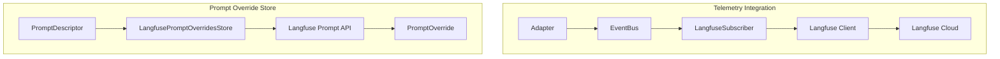

# Langfuse Integration Specification

## Purpose

This specification defines how to integrate Langfuse observability into WINK
applications. The integration provides two capabilities: telemetry tracing via
EventBus subscription, and prompt management as a backend for the override
system.

## Guiding Principles

- **Non-invasive**: Hooks into the existing `EventBus`; no adapter changes.
- **Opt-in**: Applications without Langfuse configuration incur no overhead.
- **Fail-safe**: Network failures do not interrupt prompt evaluation.
- **Granular prompts**: Each Section and Tool maps to an individual Langfuse
  prompt for independent versioning.



## Telemetry Integration

### Event Mapping

The integration subscribes to WINK's telemetry events:

| WINK Event | Langfuse Action |
|------------|-----------------|
| `PromptRendered` | Create trace and generation |
| `ToolInvoked` | Create span within generation |
| `PromptExecuted` | Complete generation with output and usage |

### Event Types

From `runtime/events`:

```python
@FrozenDataclass()
class PromptRendered:
    prompt_ns: str
    prompt_key: str
    prompt_name: str | None
    adapter: AdapterName
    session_id: UUID | None
    render_inputs: tuple[Any, ...]
    rendered_prompt: str
    created_at: datetime
    descriptor: PromptDescriptor | None = None
    event_id: UUID = field(default_factory=uuid4)

@FrozenDataclass()
class ToolInvoked:
    prompt_name: str
    adapter: AdapterName
    name: str
    params: Any
    result: Any
    session_id: UUID | None
    created_at: datetime
    usage: TokenUsage | None = None
    rendered_output: str = ""
    call_id: str | None = None
    event_id: UUID = field(default_factory=uuid4)

@FrozenDataclass()
class PromptExecuted:
    prompt_name: str
    adapter: AdapterName
    result: Any
    session_id: UUID | None
    created_at: datetime
    usage: TokenUsage | None = None
    event_id: UUID = field(default_factory=uuid4)

@FrozenDataclass()
class TokenUsage:
    input_tokens: int | None = None
    output_tokens: int | None = None
    cached_tokens: int | None = None
```

### LangfuseSubscriber

```python
class LangfuseSubscriber:
    """Event bus subscriber that forwards telemetry to Langfuse."""

    def __init__(
        self,
        config: LangfuseConfig | None = None,
        *,
        client: Langfuse | None = None,
    ) -> None: ...

    def attach(self, bus: EventBus) -> None:
        """Subscribe to PromptRendered, ToolInvoked, PromptExecuted."""
        ...

    def detach(self, bus: EventBus) -> None:
        """Unsubscribe from all events."""
        ...

    def flush(self) -> None:
        """Force flush pending events."""
        ...

    def shutdown(self) -> None:
        """Flush and close the client."""
        ...
```

### Configuration

```python
@FrozenDataclass()
class LangfuseConfig:
    secret_key: str | None = None
    public_key: str | None = None
    host: str = "https://cloud.langfuse.com"
    enabled: bool = True
    flush_interval_seconds: float = 5.0
    flush_at: int = 15
    debug: bool = False
    release: str | None = None
    sample_rate: float = 1.0
    tags: tuple[str, ...] = ()

    @classmethod
    def from_env(cls) -> LangfuseConfig:
        """Load from LANGFUSE_* environment variables."""
        ...
```

| Environment Variable | Description |
|---------------------|-------------|
| `LANGFUSE_SECRET_KEY` | Project secret key |
| `LANGFUSE_PUBLIC_KEY` | Project public key |
| `LANGFUSE_HOST` | Custom host for self-hosted |
| `LANGFUSE_ENABLED` | Set `"false"` to disable |
| `LANGFUSE_FLUSH_INTERVAL` | Background flush interval (seconds) |
| `LANGFUSE_FLUSH_AT` | Batch size before flush |

### Trace Context

```python
@FrozenDataclass()
class TraceContext:
    trace_id: str
    session_id: UUID | None
    prompt_name: str
    adapter: AdapterName
    started_at: datetime
    generation_id: str | None = None
    metadata: Mapping[str, Any] = field(default_factory=dict)
```

Context keyed by `(session_id, prompt_name)` for concurrent evaluation support.

### Event Handlers

**PromptRendered** creates trace and generation:

```python
def _handle_prompt_rendered(self, event: PromptRendered) -> None:
    trace = self._client.trace(
        id=str(event.event_id),
        name=event.prompt_name or f"{event.prompt_ns}/{event.prompt_key}",
        session_id=str(event.session_id) if event.session_id else None,
        metadata={
            "prompt_ns": event.prompt_ns,
            "prompt_key": event.prompt_key,
            "adapter": event.adapter,
        },
    )
    generation = trace.generation(
        name=f"{event.prompt_name or event.prompt_key}/generation",
        input=event.rendered_prompt,
    )
    self._store_context(event, trace, generation)
```

**ToolInvoked** creates span:

```python
def _handle_tool_invoked(self, event: ToolInvoked) -> None:
    context = self._get_context(event.session_id, event.prompt_name)
    if context is None:
        return

    span = self._get_generation(context).span(
        name=f"tool/{event.name}",
        input=self._serialize_params(event.params),
        output=event.rendered_output,
        metadata={"call_id": event.call_id},
    )
    if event.usage:
        span.update(usage=self._format_usage(event.usage))
    span.end()
```

**PromptExecuted** completes generation:

```python
def _handle_prompt_executed(self, event: PromptExecuted) -> None:
    context = self._get_context(event.session_id, event.prompt_name)
    if context is None:
        return

    generation = self._get_generation(context)
    generation.end(
        output=self._serialize_output(event.result),
        usage=self._format_usage(event.usage) if event.usage else None,
    )
    self._clear_context(event.session_id, event.prompt_name)
```

### Session Tag Conventions

| Tag Key | Langfuse Field |
|---------|----------------|
| `langfuse.user_id` | `user_id` |
| `langfuse.session_id` | `session_id` |
| `langfuse.metadata.*` | `metadata` |
| `langfuse.tags` | `tags` |

### Thread Safety

- `threading.RLock` protects trace context state
- Langfuse SDK handles background flushing
- Multiple threads can publish concurrently

## Prompt Override Store

Langfuse's prompt management API serves as a backend for WINK's override system.
Each Section and Tool maps to an individual Langfuse prompt.

### Architecture

```
┌─────────────────────────────────────────────────────────────────────┐
│                           WINK Prompt                                │
│  ┌──────────────┐  ┌──────────────┐  ┌──────────────┐              │
│  │   Section    │  │   Section    │  │    Tool      │              │
│  │   "system"   │  │ "instructions"│ │   "search"   │              │
│  └──────┬───────┘  └──────┬───────┘  └──────┬───────┘              │
└─────────┼─────────────────┼─────────────────┼──────────────────────┘
          │                 │                 │
          ▼                 ▼                 ▼
┌─────────────────┐ ┌─────────────────┐ ┌─────────────────┐
│ Langfuse Prompt │ │ Langfuse Prompt │ │ Langfuse Prompt │
│ demo/welcome/   │ │ demo/welcome/   │ │ demo/welcome/   │
│ section/system  │ │ section/        │ │ tool/search     │
│                 │ │ instructions    │ │                 │
└─────────────────┘ └─────────────────┘ └─────────────────┘
```

### Naming Convention

**Section Prompts:**

| WINK Identifier | Langfuse Prompt Name |
|-----------------|----------------------|
| `ns="demo", key="welcome", path=("system",)` | `demo/welcome/section/system` |
| `ns="demo", key="welcome", path=("context", "user")` | `demo/welcome/section/context/user` |

**Tool Prompts:**

| WINK Identifier | Langfuse Prompt Name |
|-----------------|----------------------|
| `ns="demo", key="welcome", tool="search"` | `demo/welcome/tool/search` |

**Version Labels:**

| WINK Tag | Langfuse Version |
|----------|------------------|
| `"latest"` | Production (default) |
| `"stable"` | Label `stable` |
| `"v1.0"` | Label `v1.0` |

### Prompt Content

**Section prompts** store plain text:

```
You are a helpful assistant specializing in code review.

Focus on:
- Security vulnerabilities
- Performance issues
- Code clarity
```

**Tool prompts** store JSON:

```json
{
  "wink_tool_version": 1,
  "expected_contract_hash": "abc123...",
  "description": "Search the codebase for files matching a pattern.",
  "param_descriptions": {
    "query": "Glob pattern to match files",
    "max_results": "Maximum number of results"
  }
}
```

### LangfusePromptOverridesStore

Implements `PromptOverridesStore` protocol from `prompt/overrides/versioning`:

```python
class LangfusePromptOverridesStore(PromptOverridesStore):
    """Fetch prompt overrides via Langfuse's prompt management API."""

    def __init__(
        self,
        config: LangfuseConfig | None = None,
        *,
        client: Langfuse | None = None,
        cache_ttl_seconds: float = 60.0,
        fallback_store: PromptOverridesStore | None = None,
    ) -> None: ...

    def resolve(
        self,
        descriptor: PromptDescriptor,
        tag: str = "latest",
    ) -> PromptOverride | None:
        """Fetch overrides from Langfuse for each section and tool."""
        ...

    def upsert(
        self,
        descriptor: PromptDescriptor,
        override: PromptOverride,
    ) -> PromptOverride:
        """Push each section and tool as a Langfuse prompt."""
        ...

    def delete(
        self,
        *,
        ns: str,
        prompt_key: str,
        tag: str,
    ) -> None:
        """Not supported. Raises PromptOverridesError."""
        ...

    def seed(
        self,
        prompt: PromptLike,
        *,
        tag: str = "latest",
    ) -> PromptOverride:
        """Create initial prompts in Langfuse from WINK prompt."""
        ...

    def set_section_override(
        self,
        prompt: PromptLike,
        *,
        tag: str = "latest",
        path: tuple[str, ...],
        body: str,
    ) -> PromptOverride:
        """Update a specific section's Langfuse prompt."""
        ...
```

### Resolution Process

```python
def resolve(
    self,
    descriptor: PromptDescriptor,
    tag: str = "latest",
) -> PromptOverride | None:
    sections: dict[tuple[str, ...], SectionOverride] = {}
    tools: dict[str, ToolOverride] = {}

    for section_desc in descriptor.sections:
        prompt_name = self._section_prompt_name(
            descriptor.ns, descriptor.key, section_desc.path
        )
        content = self._fetch_prompt(prompt_name, tag)
        if content is not None:
            override = self._parse_section_content(content, section_desc)
            if override is not None:
                sections[section_desc.path] = override

    for tool_desc in descriptor.tools:
        prompt_name = self._tool_prompt_name(
            descriptor.ns, descriptor.key, tool_desc.name
        )
        content = self._fetch_prompt(prompt_name, tag)
        if content is not None:
            override = self._parse_tool_content(content, tool_desc)
            if override is not None:
                tools[tool_desc.name] = override

    if not sections and not tools:
        return None

    return PromptOverride(
        ns=descriptor.ns,
        prompt_key=descriptor.key,
        tag=tag,
        sections=sections,
        tool_overrides=tools,
    )
```

### Hash Validation

Overrides include expected hashes that must match the descriptor:

```python
def _parse_section_content(
    self,
    content: str,
    section_desc: SectionDescriptor,
) -> SectionOverride | None:
    metadata = self._get_prompt_metadata(content)
    expected_hash = metadata.get("expected_hash")

    if expected_hash != section_desc.content_hash:
        self._logger.warning(
            "Section hash mismatch; override skipped.",
            event="langfuse_hash_mismatch",
            context={
                "section_path": section_desc.path,
                "langfuse_hash": expected_hash,
                "descriptor_hash": section_desc.content_hash,
            },
        )
        return None

    return SectionOverride(
        expected_hash=section_desc.content_hash,
        body=content,
    )
```

### Caching

```python
@FrozenDataclass()
class CachedPrompt:
    prompt_name: str
    tag: str
    content: str | None  # None means "not found"
    fetched_at: datetime
    ttl_seconds: float

    @property
    def expired(self) -> bool:
        elapsed = datetime.now(UTC) - self.fetched_at
        return elapsed.total_seconds() > self.ttl_seconds
```

- Per-prompt caching with configurable TTL
- Negative caching for 404 responses
- Thread-safe via `threading.RLock`
- Invalidation on `upsert()` and `set_section_override()`

### Fallback Behavior

| Scenario | Behavior |
|----------|----------|
| All prompts fetched | Use Langfuse versions |
| Some prompts 404 | Partial override |
| Network error | Fall back to local store |
| No fallback configured | Log warning, return partial/None |

### Langfuse Prompt Metadata

Section prompts store metadata in Langfuse's config field:

```python
langfuse.create_prompt(
    name="demo/welcome/section/system",
    prompt="You are a helpful assistant.",
    config={
        "wink_type": "section",
        "expected_hash": "abc123...",
        "section_path": ["system"],
    },
    labels=["stable"],
)
```

### Environment Variables

| Variable | Default | Description |
|----------|---------|-------------|
| `LANGFUSE_PROMPT_CACHE_TTL` | `60` | Cache TTL in seconds |
| `LANGFUSE_PROMPT_FALLBACK` | `"false"` | Enable local fallback |

## Usage Examples

### Basic Telemetry

```python
from weakincentives.runtime.events import InProcessEventBus
from weakincentives.adapters.openai import OpenAIAdapter
from weakincentives.integrations.langfuse import LangfuseSubscriber

bus = InProcessEventBus()
langfuse = LangfuseSubscriber()
langfuse.attach(bus)

adapter = OpenAIAdapter(model="gpt-4o")
response = adapter.evaluate(prompt, bus=bus, session=session)

langfuse.shutdown()
```

### Context Manager

```python
from weakincentives.integrations.langfuse import langfuse_tracing

with langfuse_tracing(bus) as langfuse:
    response = adapter.evaluate(prompt, bus=bus, session=session)
```

### Override Resolution

```python
from weakincentives.integrations.langfuse import LangfusePromptOverridesStore

store = LangfusePromptOverridesStore()

response = adapter.evaluate(
    prompt,
    bus=bus,
    session=session,
    overrides_store=store,
    overrides_tag="stable",
)
```

### Seeding Prompts

```python
store = LangfusePromptOverridesStore()
override = store.seed(prompt, tag="v1.0")

# Creates in Langfuse:
#   demo/welcome/section/system (v1.0)
#   demo/welcome/section/instructions (v1.0)
#   demo/welcome/tool/search (v1.0)
```

### Updating a Section

```python
store.set_section_override(
    prompt,
    tag="experiment-1",
    path=("system",),
    body="You are an expert security auditor.",
)
```

### With Local Fallback

```python
from weakincentives.prompt.overrides import LocalPromptOverridesStore
from weakincentives.integrations.langfuse import LangfusePromptOverridesStore

store = LangfusePromptOverridesStore(
    fallback_store=LocalPromptOverridesStore(),
    cache_ttl_seconds=300.0,
)
```

### With Optimizer

```python
from weakincentives.optimizers import OptimizationContext, WorkspaceDigestOptimizer

context = OptimizationContext(
    adapter=adapter,
    event_bus=bus,
    overrides_store=LangfusePromptOverridesStore(),
    overrides_tag="optimized",
)

optimizer = WorkspaceDigestOptimizer(context)
result = optimizer.optimize(prompt, session=session)
```

## Logging

Follows conventions from `specs/LOGGING.md`:

| Event | Level | Context Fields |
|-------|-------|----------------|
| `langfuse_attached` | INFO | `bus_type` |
| `langfuse_trace_started` | DEBUG | `trace_id`, `prompt_name`, `session_id` |
| `langfuse_generation_ended` | DEBUG | `trace_id`, `generation_id`, `usage` |
| `langfuse_operation_failed` | WARNING | `error`, `operation` |
| `langfuse_section_resolved` | DEBUG | `prompt_name`, `tag`, `path` |
| `langfuse_tool_resolved` | DEBUG | `prompt_name`, `tag`, `tool_name` |
| `langfuse_prompt_not_found` | DEBUG | `prompt_name`, `tag` |
| `langfuse_override_assembled` | INFO | `ns`, `key`, `section_count`, `tool_count` |
| `langfuse_hash_mismatch` | WARNING | `prompt_name`, `expected`, `actual` |
| `langfuse_fallback_triggered` | WARNING | `reason`, `fallback_store` |

## Limitations

- **Async not supported**: Synchronous-only, matching WINK's model.
- **Single generation per evaluation**: Multi-turn creates one generation with
  tool spans.
- **Sampling per-trace**: Once sampled out, all nested events excluded.
- **No delete support**: Archive prompts via Langfuse UI.
- **Version immutability**: Create new versions instead of modifying.
- **Hash drift**: Source changes require re-seeding overrides.

## Dependencies

```toml
[project.optional-dependencies]
langfuse = ["langfuse>=2.0.0"]
```

Import with feature check:

```python
try:
    from langfuse import Langfuse
except ImportError as error:
    raise ImportError(
        "Langfuse integration requires the 'langfuse' extra. "
        "Install with: pip install weakincentives[langfuse]"
    ) from error
```
