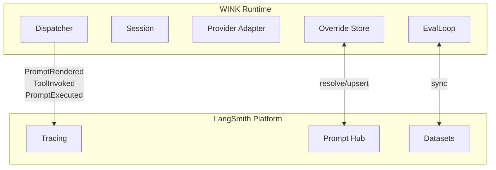
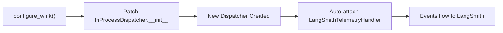
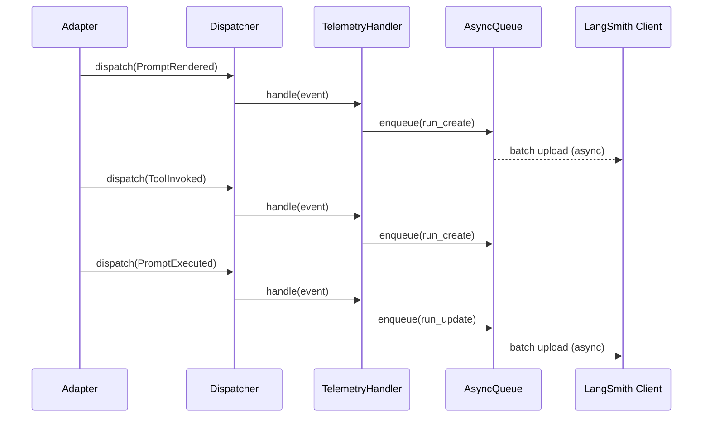
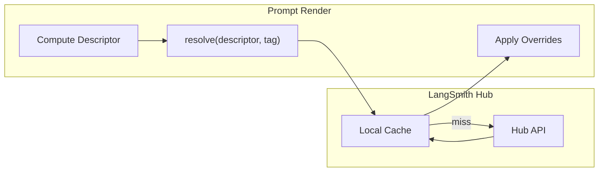
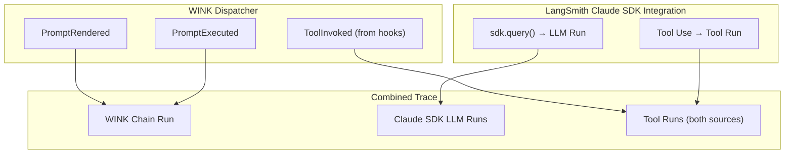
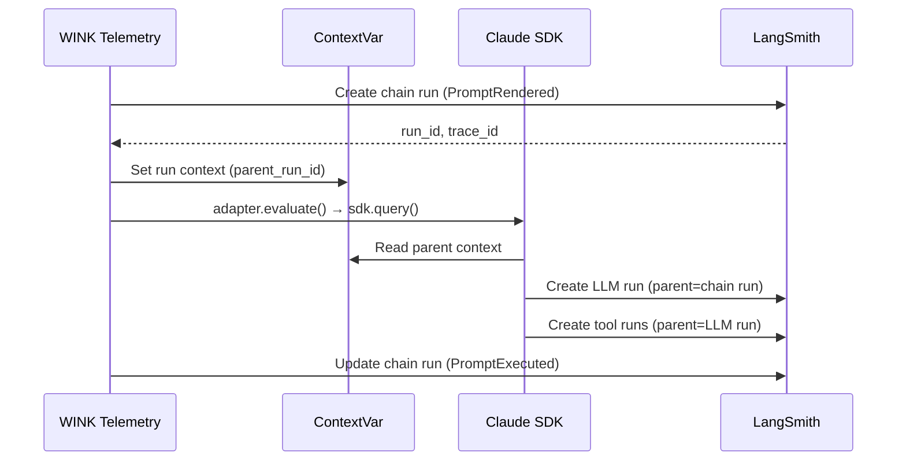

# LangSmith Integration Specification

## Purpose

Enable full observability of WINK agents through LangSmith. This specification
covers telemetry/tracing integration, prompt management via LangSmith Hub, and
evaluation dataset synchronization.

## Guiding Principles

- **Non-invasive instrumentation**: Telemetry hooks into the existing
  `Dispatcher` infrastructure without requiring changes to business logic.
- **Decoupled from critical path**: Network calls to LangSmith run
  asynchronously to avoid blocking prompt evaluation.
- **Bidirectional prompt management**: Override store supports both push
  (publish to Hub) and pull (fetch from Hub) workflows.
- **Graceful degradation**: LangSmith unavailability does not break agent
  execution.
- **Composable with LangSmith SDK**: Works alongside `@traceable` decorator
  and native LangSmith integrations (e.g., `configure_claude_agent_sdk()`).

## Architecture Overview



## Auto-Instrumentation

WINK provides a single-call configuration function following the pattern
established by LangSmith's native integrations:

```python
from weakincentives.contrib.langsmith import configure_wink

# Enable automatic tracing at application start
configure_wink()

# All WINK evaluations are now traced to LangSmith
response = adapter.evaluate(prompt, session=session)
```

### How It Works

`configure_wink()` patches the `InProcessDispatcher` class to automatically
attach telemetry handlers to every new dispatcher instance:



### Configuration Options

```python
configure_wink(
    # API settings (fall back to LANGCHAIN_* env vars)
    api_key="...",
    project="my-project",

    # Tracing behavior
    tracing_enabled=True,
    trace_sample_rate=1.0,

    # Hub integration
    hub_enabled=True,

    # Advanced
    async_upload=True,
    flush_on_exit=True,
)
```

### Composing with LangSmith's Claude Agent SDK Integration

When using the `ClaudeAgentSDKAdapter`, you can combine WINK's event-based
tracing with LangSmith's native Claude Agent SDK instrumentation:

```python
from langsmith.integrations.claude_agent_sdk import configure_claude_agent_sdk
from weakincentives.contrib.langsmith import configure_wink

# Enable both integrations
configure_claude_agent_sdk()  # Traces Claude SDK internals
configure_wink()               # Traces WINK prompt lifecycle

# Claude Agent SDK traces nest under WINK traces
adapter = ClaudeAgentSDKAdapter(model="claude-sonnet-4-5-20250929")
response = adapter.evaluate(prompt, session=session)
```

**Trace Hierarchy:**

```
WINK: PromptRendered (run_type="chain")
  └─ LangSmith: Claude SDK Query (run_type="llm")
       └─ LangSmith: Tool Use (run_type="tool")
  └─ WINK: ToolInvoked (run_type="tool")
  └─ WINK: PromptExecuted (updates parent run)
```

### Integrating with `@traceable`

WINK traces compose naturally with LangSmith's `@traceable` decorator for
custom application code:

```python
from langsmith import traceable
from weakincentives.contrib.langsmith import configure_wink

configure_wink()

@traceable(name="process_user_request")
def process_request(user_input: str) -> str:
    # Custom pre-processing (traced)
    processed = preprocess(user_input)

    # WINK evaluation (automatically traced as child)
    response = adapter.evaluate(
        prompt.bind(input=processed),
        session=session,
    )

    # Custom post-processing (traced)
    return postprocess(response.output)
```

**Resulting Trace:**

```
process_user_request (run_type="chain")
  └─ preprocess (if @traceable)
  └─ WINK: my_prompt (run_type="chain")
       └─ Provider Call (run_type="llm")
       └─ Tool: search (run_type="tool")
  └─ postprocess (if @traceable)
```

## Integration Surface

### Event Dispatcher Telemetry (Primary Hook)

The `Dispatcher` provides the primary integration point for tracing.
Subscribers receive lifecycle events without modifying adapter or prompt code.

**Available Events:**

| Event | When Fired | Key Fields |
| ---------------- | ---------------------------------- | ------------------------------------------------------------------------------------------ |
| `PromptRendered` | After render, before provider call | `prompt_ns`, `prompt_key`, `prompt_name`, `adapter`, `rendered_prompt`, `descriptor` |
| `ToolInvoked` | After each tool handler | `name`, `params`, `result`, `usage`, `call_id`, `rendered_output` |
| `PromptExecuted` | After final parse | `result`, `usage`, `prompt_name` |

**Mapping to LangSmith Runs:**

```
PromptRendered  → Run(run_type="chain", name=prompt_name)
  └─ Provider Call → Run(run_type="llm", parent_run_id=...)
       └─ ToolInvoked → Run(run_type="tool", parent_run_id=...)
  └─ PromptExecuted → Update parent run with outputs
```

### Override Store Protocol (Prompt Hub)

Custom `PromptOverridesStore` implementations can fetch and persist overrides
via LangSmith Hub, enabling centralized prompt management.

**Store Protocol:**

```python
class PromptOverridesStore(Protocol):
    def resolve(
        self,
        descriptor: PromptDescriptor,
        tag: str = "latest",
    ) -> PromptOverride | None: ...

    def upsert(
        self,
        descriptor: PromptDescriptor,
        override: PromptOverride,
    ) -> PromptOverride: ...

    def delete(
        self,
        *,
        ns: str,
        prompt_key: str,
        tag: str,
    ) -> None: ...

    def set_section_override(
        self,
        prompt: PromptLike,
        *,
        tag: str = "latest",
        path: tuple[str, ...],
        body: str,
    ) -> PromptOverride: ...

    def seed(
        self,
        prompt: PromptLike,
        *,
        tag: str = "latest",
    ) -> PromptOverride: ...
```

**Hub Mapping:**

| WINK Concept | LangSmith Hub Concept |
| -------------------------- | ---------------------------- |
| `ns/prompt_key` | Prompt name |
| `tag` | Commit hash or alias |
| `SectionOverride.body` | Prompt template content |
| `ToolOverride.description` | Tool description in template |

## Telemetry Layer



**Key Design Decisions:**

1. **Async upload queue**: Events are queued and uploaded in batches to avoid
   blocking the evaluation loop.
1. **Trace context propagation**: A trace ID generated at `PromptRendered`
   links all subsequent runs in a single trace.
1. **Graceful failure**: Queue overflow or upload failures are logged but do
   not raise to callers.

## Prompt Hub Layer



**Caching Strategy:**

- **TTL-based invalidation**: Cached overrides expire after configurable
  duration (default: 5 minutes).
- **Tag-aware**: `latest` tag bypasses cache for freshness; versioned tags
  cache indefinitely.
- **Fail-open on network errors**: Use cached value or skip overrides rather
  than failing evaluation.

## Claude Agent SDK Adapter Integration

The `ClaudeAgentSDKAdapter` presents unique tracing considerations due to its
hook-based architecture and delegation to Claude Code's native tools.

### Dual Tracing Strategy

When using the Claude Agent SDK adapter, traces can be captured at two levels:



### Hook-to-Run Mapping

The Claude Agent SDK adapter's hooks map to LangSmith runs:

| SDK Hook | WINK Event | LangSmith Run |
| ------------- | ----------------- | ------------------ |
| `PreToolUse` | (none - internal) | Child span start |
| `PostToolUse` | `ToolInvoked` | Tool run complete |
| `Stop` | `PromptExecuted` | Chain run complete |

### Deduplication

When both WINK and LangSmith's native Claude SDK integration are enabled, tool
invocations may be reported twice. The telemetry handler deduplicates based on
`call_id`:

```python
class LangSmithTelemetryHandler:
    def _on_tool_invoked(self, event: ToolInvoked) -> None:
        # Skip if LangSmith native integration already traced this call
        if self._is_traced_by_native_integration(event.call_id):
            return
        self._create_tool_run(event)
```

### Recommended Configuration

For most use cases, use both integrations with WINK tool tracing disabled:

```python
from langsmith.integrations.claude_agent_sdk import configure_claude_agent_sdk
from weakincentives.contrib.langsmith import configure_wink

configure_claude_agent_sdk()  # Detailed Claude SDK internals
configure_wink(
    project="my-agent",
    trace_native_tools=False,  # Let Claude SDK handle tool tracing
)
```

### Trace Context Correlation

**Critical**: For traces to appear unified in LangSmith, both integrations
must share the same trace context. WINK achieves this by setting up the
LangSmith run context before invoking the Claude Agent SDK:



**Implementation:**

```python
class LangSmithTelemetryHandler:
    def _on_prompt_rendered(self, event: PromptRendered) -> None:
        # Create parent run
        run = self._client.create_run(
            name=event.prompt_name,
            run_type="chain",
            inputs={"rendered_prompt": event.rendered_prompt},
        )

        # Set context so Claude SDK integration inherits this parent
        langsmith_context.set_parent_run(run.id, run.trace_id)

        # Store for later update
        self._active_runs[event.session_id] = run
```

The `langsmith` SDK uses `contextvars` for trace propagation. As long as WINK
sets the parent context before `sdk.query()` is called, all Claude SDK traces
automatically nest under the WINK chain run.

**Resulting Unified Trace:**

```
my_prompt (chain) ← WINK
  ├─ claude-sdk-query (llm) ← Claude SDK
  │   ├─ Read (tool) ← Claude SDK
  │   ├─ Write (tool) ← Claude SDK
  │   └─ Bash (tool) ← Claude SDK
  └─ [completion metadata] ← WINK (PromptExecuted)
```

**Session ID Propagation:**

WINK's `session_id` is included as metadata on all runs:

```python
run = self._client.create_run(
    name=event.prompt_name,
    run_type="chain",
    metadata={
        "wink_session_id": str(event.session_id),
        "prompt_ns": event.prompt_ns,
        "prompt_key": event.prompt_key,
    },
)
```

This enables querying all runs for a session in LangSmith:
`metadata.wink_session_id = "uuid-here"`

## Configuration

### LangSmithConfig

```python
@dataclass(slots=True, frozen=True)
class LangSmithConfig:
    """Configuration for LangSmith integration."""

    # API settings
    api_key: str | None = None  # Falls back to LANGCHAIN_API_KEY env
    api_url: str = "https://api.smith.langchain.com"
    project: str | None = None  # Falls back to LANGCHAIN_PROJECT env

    # Telemetry settings
    tracing_enabled: bool = True
    trace_sample_rate: float = 1.0  # 0.0-1.0, for high-volume scenarios
    trace_native_tools: bool = True  # Trace WINK tool invocations
    async_upload: bool = True
    upload_batch_size: int = 100
    upload_interval_seconds: float = 1.0
    max_queue_size: int = 10000

    # Hub settings
    hub_enabled: bool = True
    cache_ttl_seconds: float = 300.0  # 5 minutes
    cache_versioned_indefinitely: bool = True
```

### Environment Variables

| Variable | Description | Default |
| ---------------------- | -------------------- | ----------------------------------- |
| `LANGCHAIN_API_KEY` | LangSmith API key | (required) |
| `LANGCHAIN_PROJECT` | Default project name | `"default"` |
| `LANGCHAIN_TRACING_V2` | Enable tracing | `"true"` |
| `LANGCHAIN_ENDPOINT` | API endpoint | `"https://api.smith.langchain.com"` |

## Implementation Components

### LangSmithTelemetryHandler

Event handler that captures WINK events and creates LangSmith runs.

```python
class LangSmithTelemetryHandler:
    """Subscribes to WINK events and publishes to LangSmith."""

    def __init__(
        self,
        config: LangSmithConfig,
        *,
        client: Client | None = None,  # For testing
    ) -> None: ...

    def attach(self, dispatcher: Dispatcher) -> None:
        """Subscribe to all telemetry events."""

    def detach(self, dispatcher: Dispatcher) -> None:
        """Unsubscribe from all telemetry events."""

    def flush(self, *, timeout: float | None = None) -> None:
        """Block until pending uploads complete."""

    # Internal handlers
    def _on_prompt_rendered(self, event: PromptRendered) -> None: ...
    def _on_tool_invoked(self, event: ToolInvoked) -> None: ...
    def _on_prompt_executed(self, event: PromptExecuted) -> None: ...
```

**Trace Context Management:**

```python
@dataclass(slots=True)
class TraceContext:
    """Tracks parent-child relationships for a single evaluation."""
    trace_id: UUID
    root_run_id: UUID
    current_run_id: UUID
    session_id: UUID | None

# Thread-local storage for active contexts
_active_contexts: ContextVar[dict[UUID, TraceContext]] = ContextVar("langsmith_contexts")
```

### LangSmithPromptOverridesStore

Override store backed by LangSmith Hub.

```python
class LangSmithPromptOverridesStore:
    """Fetch and persist prompt overrides via LangSmith Hub."""

    def __init__(
        self,
        config: LangSmithConfig,
        *,
        client: Client | None = None,
        fallback_store: PromptOverridesStore | None = None,
    ) -> None: ...

    def resolve(
        self,
        descriptor: PromptDescriptor,
        tag: str = "latest",
    ) -> PromptOverride | None:
        """Fetch override from Hub, with caching."""

    def upsert(
        self,
        descriptor: PromptDescriptor,
        override: PromptOverride,
    ) -> PromptOverride:
        """Publish override to Hub."""

    def pull(
        self,
        *,
        ns: str,
        prompt_key: str,
        tag: str = "latest",
    ) -> PromptOverride | None:
        """Pull prompt from Hub without descriptor (for initial sync)."""

    def push(
        self,
        prompt: Prompt[object],
        *,
        tag: str = "latest",
        commit_message: str | None = None,
    ) -> str:
        """Push current prompt to Hub, returning commit hash."""
```

## Evaluation Integration

LangSmith integration extends to WINK's evaluation framework, enabling dataset
synchronization and experiment tracking.

### Dataset Synchronization

```python
from weakincentives.contrib.langsmith import LangSmithDatasetStore
from weakincentives.evals import Dataset

store = LangSmithDatasetStore(config)

# Pull dataset from LangSmith
dataset: Dataset[str, str] = store.pull("my-qa-dataset", str, str)

# Push local dataset to LangSmith
store.push(dataset, name="my-qa-dataset")
```

### Experiment Tracking

EvalLoop results are automatically traced as LangSmith experiments when
`configure_wink()` is enabled:

```python
from weakincentives.contrib.langsmith import configure_wink
from weakincentives.evals import EvalLoop, Dataset, exact_match

configure_wink(project="my-evals")

# Each sample execution creates a trace linked to the experiment
eval_loop = EvalLoop(
    loop=main_loop,
    evaluator=exact_match,
    requests=requests,
    results=results,
)
eval_loop.run()
```

Results appear in LangSmith under the configured project with:
- Individual sample traces
- Aggregate metrics (pass rate, mean score, latency)
- Side-by-side comparison with previous runs

## Usage Examples

### Basic Telemetry

```python
from weakincentives.contrib.langsmith import (
    LangSmithConfig,
    LangSmithTelemetryHandler,
)
from weakincentives.runtime.events import InProcessDispatcher
from weakincentives.runtime.session import Session
from weakincentives.adapters.openai import OpenAIAdapter

# Configure
config = LangSmithConfig(
    project="my-agent",
    tracing_enabled=True,
)

# Setup
dispatcher = InProcessDispatcher()
session = Session(bus=dispatcher)
adapter = OpenAIAdapter(model="gpt-4o")

# Attach telemetry
telemetry = LangSmithTelemetryHandler(config)
telemetry.attach(dispatcher)

try:
    # Evaluate - traces automatically sent to LangSmith
    response = adapter.evaluate(prompt, session=session)
finally:
    # Ensure all traces are uploaded
    telemetry.flush()
    telemetry.detach(dispatcher)
```

### Prompt Hub Integration

```python
from weakincentives.contrib.langsmith import (
    LangSmithConfig,
    LangSmithPromptOverridesStore,
)
from weakincentives.prompt import Prompt

config = LangSmithConfig(hub_enabled=True)
store = LangSmithPromptOverridesStore(config)

# Create prompt with Hub-backed overrides
prompt = Prompt(
    template,
    overrides_store=store,
    overrides_tag="production",  # or "latest", commit hash, etc.
)

# Changes in LangSmith Hub automatically apply on next evaluation
response = adapter.evaluate(prompt, session=session)

# Push local changes to Hub
commit_hash = store.push(prompt, tag="staging", commit_message="Improved instructions")
```

### Full Agent Observability

```python
from weakincentives.contrib.langsmith import (
    LangSmithConfig,
    LangSmithTelemetryHandler,
    LangSmithPromptOverridesStore,
)
from weakincentives import MainLoop
from weakincentives.runtime.events import InProcessDispatcher

config = LangSmithConfig(
    project="production-agent",
    tracing_enabled=True,
    hub_enabled=True,
)

# Shared telemetry handler
telemetry = LangSmithTelemetryHandler(config)

# Hub-backed override store
store = LangSmithPromptOverridesStore(config)


class ObservableAgentLoop(MainLoop[UserRequest, AgentOutput]):
    def __init__(self, adapter: ProviderAdapter[AgentOutput]) -> None:
        dispatcher = InProcessDispatcher()
        super().__init__(adapter=adapter, bus=dispatcher)

        # Attach telemetry
        telemetry.attach(dispatcher)

        # Configure prompts with Hub overrides
        self._prompt = Prompt(
            agent_template,
            overrides_store=store,
            overrides_tag="production",
        )

    def initialize(self, request: UserRequest) -> tuple[Prompt[AgentOutput], Session]:
        prompt = self._prompt.bind(request)
        session = Session(bus=self._bus)
        return prompt, session

    def shutdown(self) -> None:
        telemetry.flush(timeout=5.0)
        telemetry.detach(self._dispatcher)
```

## Trace Correlation

### Session-Based Correlation

Use `session_id` to correlate traces across multiple evaluations:

```python
from uuid import uuid4

session = Session(bus=dispatcher, session_id=uuid4())  # Explicit ID

# All evaluations in this session share the session_id in LangSmith
response1 = adapter.evaluate(prompt1, session=session)
response2 = adapter.evaluate(prompt2, session=session)

# Query in LangSmith: metadata.wink_session_id="..."
```

### Custom Metadata

Add custom tags and metadata via session tags:

```python
session = Session(
    bus=dispatcher,
    tags={
        "user_id": user.id,
        "request_source": "api",
        "environment": "production",
    },
)

# Tags propagate to all LangSmith runs in this session
```

### Nested Traces

Tool handlers that invoke sub-evaluations automatically nest:

```python
def research_tool(params: ResearchParams, *, context: ToolContext) -> ToolResult[str]:
    # This evaluation appears as a child run in LangSmith
    sub_response = context.adapter.evaluate(
        research_prompt,
        session=context.session,  # Same session maintains trace context
    )
    return ToolResult(message="done", value=sub_response.output, success=True)
```

## Error Handling

### Telemetry Failures

```python
# Telemetry failures are logged but don't raise
try:
    response = adapter.evaluate(prompt, session=session)
except PromptEvaluationError:
    # This is a prompt error, not a telemetry error
    raise

# Telemetry errors appear in logs:
# WARNING - langsmith_upload_failed: Failed to upload 3 runs: ConnectionError
```

### Hub Failures

```python
class LangSmithPromptOverridesStore:
    def resolve(self, descriptor, tag):
        try:
            return self._fetch_from_hub(descriptor, tag)
        except LangSmithAPIError:
            # Log warning, try cache
            cached = self._cache.get(descriptor, tag)
            if cached:
                return cached
            # Fall back to local store if configured
            if self._fallback_store:
                return self._fallback_store.resolve(descriptor, tag)
            # Skip overrides rather than fail
            return None
```

## Events

### LangSmith-Specific Events

```python
@FrozenDataclass()
class LangSmithTraceStarted:
    trace_id: UUID
    session_id: UUID | None
    project: str
    created_at: datetime


@FrozenDataclass()
class LangSmithTraceCompleted:
    trace_id: UUID
    run_count: int
    total_tokens: int
    trace_url: str | None
    created_at: datetime


@FrozenDataclass()
class LangSmithUploadFailed:
    trace_id: UUID | None
    error: str
    retry_count: int
    created_at: datetime
```

These events are dispatched to the session's dispatcher for custom handling.

## Performance Considerations

### Async Upload Queue

- Events are queued immediately (non-blocking)
- Background thread uploads in batches
- Configurable batch size and interval
- Graceful overflow handling (oldest events dropped with warning)

### Caching

- Hub prompts cached with configurable TTL
- Versioned tags cached indefinitely (immutable)
- Cache invalidation on `upsert()` calls

### Sampling

For high-volume scenarios, enable trace sampling:

```python
config = LangSmithConfig(
    trace_sample_rate=0.1,  # 10% of traces
)
```

Sampling decision made at `PromptRendered` and propagated to all child runs.

## Testing

### Mock Client

```python
from weakincentives.contrib.langsmith.testing import MockLangSmithClient

mock_client = MockLangSmithClient()
telemetry = LangSmithTelemetryHandler(config, client=mock_client)

# After evaluation
assert mock_client.runs_created == 3  # 1 chain + 1 llm + 1 tool
assert mock_client.last_run.name == "my_prompt"
```

### Fixtures

```python
# tests/helpers/langsmith.py
@pytest.fixture
def langsmith_config():
    return LangSmithConfig(
        api_key="test-key",
        project="test-project",
        async_upload=False,  # Sync for deterministic tests
    )


@pytest.fixture
def mock_hub():
    return MockLangSmithHub()
```

## Limitations

- **Synchronous WINK runtime**: Telemetry upload runs on background threads to
  avoid blocking, but the WINK event loop itself is synchronous.
- **No mid-evaluation updates**: Traces are created/updated at event
  boundaries, not during streaming.
- **Hub schema constraints**: Complex WINK prompt structures may require
  flattening for Hub storage.
- **Claude Agent SDK deduplication**: When using both
  `configure_claude_agent_sdk()` and `configure_wink()`, careful configuration
  is needed to avoid duplicate traces.
