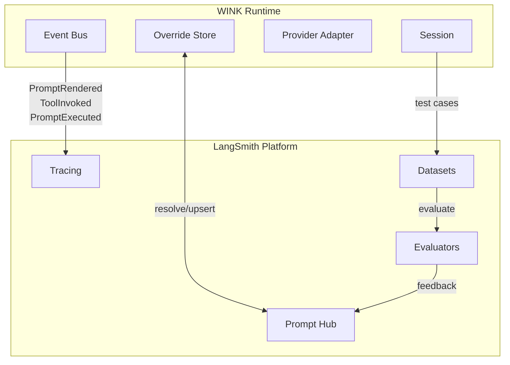
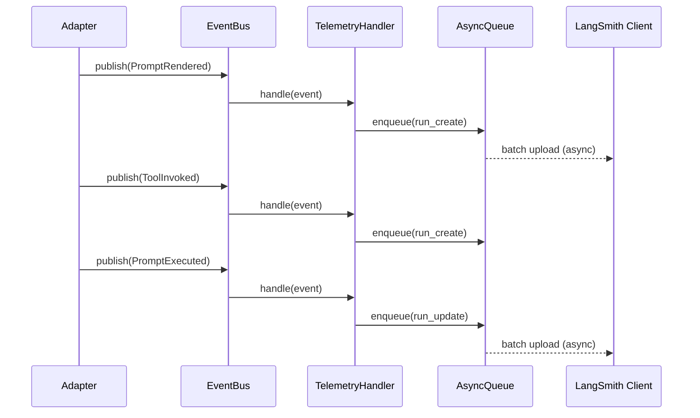
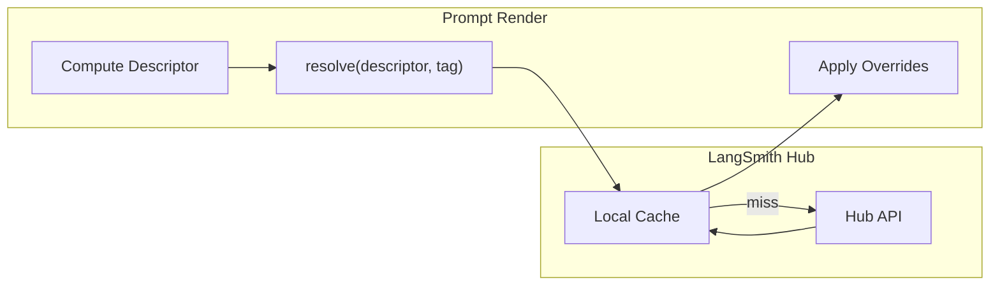
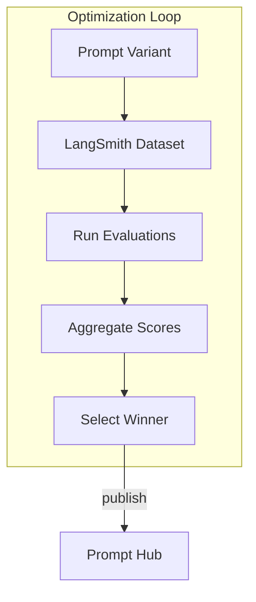

# LangSmith Integration Specification

## Purpose

Enable full observability and optimization of WINK background agents through
LangSmith. This specification covers telemetry/tracing integration, prompt
management via LangSmith Hub, and evaluation-driven optimization using LangSmith
datasets.

## Guiding Principles

- **Non-invasive instrumentation**: Telemetry hooks into existing event bus
  infrastructure without requiring changes to business logic.
- **Decoupled from critical path**: Network calls to LangSmith run asynchronously
  to avoid blocking prompt evaluation.
- **Bidirectional prompt management**: Override system supports both push (publish
  to Hub) and pull (fetch from Hub) workflows.
- **Evaluation-first optimization**: Prompt changes are validated against datasets
  before deployment.
- **Graceful degradation**: LangSmith unavailability does not break agent execution.



## Integration Surface

### Event Bus Telemetry (Primary Hook)

The event bus provides the primary integration point for tracing. Subscribers
receive lifecycle events without modifying adapter or prompt code.

**Available Events:**

| Event | When Fired | Key Fields |
|-------|------------|------------|
| `PromptRendered` | After render, before provider call | `prompt_ns`, `prompt_key`, `prompt_name`, `adapter`, `rendered_prompt`, `descriptor` |
| `ToolInvoked` | After each tool handler | `name`, `params`, `result`, `usage`, `call_id` |
| `PromptExecuted` | After final parse | `result`, `usage`, `prompt_name` |

**Mapping to LangSmith Runs:**

```
PromptRendered  → Run(run_type="chain", name=prompt_name)
  └─ Provider Call → Run(run_type="llm", parent_run_id=...)
       └─ ToolInvoked → Run(run_type="tool", parent_run_id=...)
  └─ PromptExecuted → Update parent run with outputs
```

### Override Store Protocol (Prompt Hub)

Custom `PromptOverridesStore` implementations can fetch and persist overrides
via LangSmith Hub, enabling centralized prompt management.

**Store Protocol:**

```python
class PromptOverridesStore(Protocol):
    def resolve(
        self,
        descriptor: PromptDescriptor,
        tag: str = "latest",
    ) -> PromptOverride | None: ...

    def upsert(
        self,
        descriptor: PromptDescriptor,
        override: PromptOverride,
    ) -> PromptOverride: ...
```

**Hub Mapping:**

| WINK Concept | LangSmith Hub Concept |
|--------------|----------------------|
| `ns/prompt_key` | Prompt name |
| `tag` | Commit hash or alias |
| `SectionOverride.body` | Prompt template content |
| `ToolOverride.description` | Tool description in template |

### Optimizer Integration (Datasets & Evaluation)

Optimizers can leverage LangSmith datasets for systematic prompt evaluation
before deploying overrides.

## Architecture

### Telemetry Layer



**Key Design Decisions:**

1. **Async upload queue**: Events are queued and uploaded in batches to avoid
   blocking the evaluation loop.
2. **Trace context propagation**: A trace ID generated at `PromptRendered` links
   all subsequent runs in a single trace.
3. **Graceful failure**: Queue overflow or upload failures are logged but do not
   raise to callers.

### Prompt Hub Layer



**Caching Strategy:**

- **TTL-based invalidation**: Cached overrides expire after configurable duration
  (default: 5 minutes).
- **Tag-aware**: `latest` tag bypasses cache for freshness; versioned tags cache
  indefinitely.
- **Fail-open on network errors**: Use cached value or skip overrides rather than
  failing evaluation.

### Evaluation Layer



## Configuration

### LangSmithConfig

```python
@dataclass(slots=True, frozen=True)
class LangSmithConfig:
    """Configuration for LangSmith integration."""

    # API settings
    api_key: str | None = None  # Falls back to LANGCHAIN_API_KEY env
    api_url: str = "https://api.smith.langchain.com"
    project: str | None = None  # Falls back to LANGCHAIN_PROJECT env

    # Telemetry settings
    tracing_enabled: bool = True
    trace_sample_rate: float = 1.0  # 0.0-1.0, for high-volume scenarios
    async_upload: bool = True
    upload_batch_size: int = 100
    upload_interval_seconds: float = 1.0
    max_queue_size: int = 10000

    # Hub settings
    hub_enabled: bool = True
    cache_ttl_seconds: float = 300.0  # 5 minutes
    cache_versioned_indefinitely: bool = True

    # Evaluation settings
    evaluation_timeout_seconds: float = 300.0
```

### Environment Variables

| Variable | Description | Default |
|----------|-------------|---------|
| `LANGCHAIN_API_KEY` | LangSmith API key | (required) |
| `LANGCHAIN_PROJECT` | Default project name | `"default"` |
| `LANGCHAIN_TRACING_V2` | Enable tracing | `"true"` |
| `LANGCHAIN_ENDPOINT` | API endpoint | `"https://api.smith.langchain.com"` |

## Implementation Components

### LangSmithTelemetryHandler

Event handler that captures WINK events and creates LangSmith runs.

```python
class LangSmithTelemetryHandler:
    """Subscribes to WINK events and publishes to LangSmith."""

    def __init__(
        self,
        config: LangSmithConfig,
        *,
        client: Client | None = None,  # For testing
    ) -> None: ...

    def attach(self, bus: EventBus) -> None:
        """Subscribe to all telemetry events."""

    def detach(self, bus: EventBus) -> None:
        """Unsubscribe from all telemetry events."""

    def flush(self, *, timeout: float | None = None) -> None:
        """Block until pending uploads complete."""

    # Internal handlers
    def _on_prompt_rendered(self, event: PromptRendered) -> None: ...
    def _on_tool_invoked(self, event: ToolInvoked) -> None: ...
    def _on_prompt_executed(self, event: PromptExecuted) -> None: ...
```

**Trace Context Management:**

```python
@dataclass(slots=True)
class TraceContext:
    """Tracks parent-child relationships for a single evaluation."""
    trace_id: UUID
    root_run_id: UUID
    current_run_id: UUID
    session_id: UUID | None

# Thread-local storage for active contexts
_active_contexts: ContextVar[dict[UUID, TraceContext]] = ContextVar("langsmith_contexts")
```

### LangSmithPromptOverridesStore

Override store backed by LangSmith Hub.

```python
class LangSmithPromptOverridesStore(PromptOverridesStore):
    """Fetch and persist prompt overrides via LangSmith Hub."""

    def __init__(
        self,
        config: LangSmithConfig,
        *,
        client: Client | None = None,
        fallback_store: PromptOverridesStore | None = None,
    ) -> None: ...

    def resolve(
        self,
        descriptor: PromptDescriptor,
        tag: str = "latest",
    ) -> PromptOverride | None:
        """Fetch override from Hub, with caching."""

    def upsert(
        self,
        descriptor: PromptDescriptor,
        override: PromptOverride,
    ) -> PromptOverride:
        """Publish override to Hub."""

    def pull(
        self,
        *,
        ns: str,
        prompt_key: str,
        tag: str = "latest",
    ) -> PromptOverride | None:
        """Pull prompt from Hub without descriptor (for initial sync)."""

    def push(
        self,
        prompt: Prompt[object],
        *,
        tag: str = "latest",
        commit_message: str | None = None,
    ) -> str:
        """Push current prompt to Hub, returning commit hash."""
```

**Hub ↔ Override Mapping:**

```python
def _hub_prompt_to_override(
    hub_prompt: HubPrompt,
    descriptor: PromptDescriptor,
) -> PromptOverride:
    """Convert LangSmith Hub prompt to WINK override format."""

def _override_to_hub_prompt(
    override: PromptOverride,
    descriptor: PromptDescriptor,
) -> HubPrompt:
    """Convert WINK override to LangSmith Hub prompt format."""
```

### LangSmithEvaluatedOptimizer

Optimizer that uses LangSmith datasets for prompt evaluation.

```python
class LangSmithEvaluatedOptimizer(BasePromptOptimizer[object, EvaluationResult]):
    """Optimize prompts using LangSmith dataset evaluation."""

    def __init__(
        self,
        context: OptimizationContext,
        *,
        dataset_name: str,
        evaluators: Sequence[Evaluator] | None = None,
        min_score_threshold: float = 0.0,
        config: LangSmithConfig | None = None,
    ) -> None: ...

    def optimize(
        self,
        prompt: Prompt[object],
        *,
        session: SessionProtocol,
    ) -> EvaluationResult: ...

    def evaluate_variant(
        self,
        prompt: Prompt[object],
        *,
        override: PromptOverride | None = None,
    ) -> EvaluationRunResult: ...

    def compare_variants(
        self,
        prompt: Prompt[object],
        variants: Sequence[PromptOverride],
    ) -> ComparisonResult: ...
```

**EvaluationResult:**

```python
@dataclass(slots=True, frozen=True)
class EvaluationResult:
    dataset_name: str
    example_count: int
    scores: dict[str, float]  # evaluator_name -> aggregate score
    passed: bool  # All scores above threshold
    run_url: str | None  # Link to LangSmith UI
    best_override: PromptOverride | None  # If comparing variants
```

## Usage Examples

### Basic Telemetry

```python
from weakincentives.contrib.langsmith import (
    LangSmithConfig,
    LangSmithTelemetryHandler,
)
from weakincentives.runtime.events import InProcessEventBus
from weakincentives.runtime.session import Session
from weakincentives.adapters.openai import OpenAIAdapter

# Configure
config = LangSmithConfig(
    project="my-agent",
    tracing_enabled=True,
)

# Setup
bus = InProcessEventBus()
session = Session(bus=bus)
adapter = OpenAIAdapter(model="gpt-4o")

# Attach telemetry
telemetry = LangSmithTelemetryHandler(config)
telemetry.attach(bus)

try:
    # Evaluate - traces automatically sent to LangSmith
    response = adapter.evaluate(prompt, session=session)
finally:
    # Ensure all traces are uploaded
    telemetry.flush()
    telemetry.detach(bus)
```

### Prompt Hub Integration

```python
from weakincentives.contrib.langsmith import (
    LangSmithConfig,
    LangSmithPromptOverridesStore,
)
from weakincentives.prompt import Prompt

config = LangSmithConfig(hub_enabled=True)
store = LangSmithPromptOverridesStore(config)

# Create prompt with Hub-backed overrides
prompt = Prompt(
    template,
    overrides_store=store,
    overrides_tag="production",  # or "latest", commit hash, etc.
)

# Changes in LangSmith Hub automatically apply on next evaluation
response = adapter.evaluate(prompt, session=session)

# Push local changes to Hub
commit_hash = store.push(prompt, tag="staging", commit_message="Improved instructions")
```

### Evaluation-Driven Optimization

```python
from weakincentives.contrib.langsmith import (
    LangSmithConfig,
    LangSmithEvaluatedOptimizer,
)
from weakincentives.optimizers import OptimizationContext

config = LangSmithConfig()
context = OptimizationContext(
    adapter=adapter,
    event_bus=bus,
    overrides_store=store,
)

optimizer = LangSmithEvaluatedOptimizer(
    context,
    dataset_name="agent-test-cases",
    evaluators=[correctness_evaluator, helpfulness_evaluator],
    min_score_threshold=0.8,
    config=config,
)

# Evaluate current prompt against dataset
result = optimizer.optimize(prompt, session=session)

if result.passed:
    print(f"Prompt passed with scores: {result.scores}")
    print(f"View results: {result.run_url}")
else:
    print(f"Prompt failed threshold: {result.scores}")
```

### A/B Testing Variants

```python
# Create variants
variant_a = store.resolve(descriptor, tag="variant-a")
variant_b = store.resolve(descriptor, tag="variant-b")

# Compare performance
comparison = optimizer.compare_variants(
    prompt,
    variants=[variant_a, variant_b],
)

print(f"Best variant: {comparison.winner.tag}")
print(f"Score improvement: {comparison.score_delta:.2%}")

# Promote winner to production
if comparison.winner:
    store.upsert(descriptor, comparison.winner.with_tag("production"))
```

### Full Agent Observability

```python
from weakincentives.contrib.langsmith import (
    LangSmithConfig,
    LangSmithTelemetryHandler,
    LangSmithPromptOverridesStore,
)
from weakincentives import MainLoop

config = LangSmithConfig(
    project="production-agent",
    tracing_enabled=True,
    hub_enabled=True,
)

# Shared telemetry handler
telemetry = LangSmithTelemetryHandler(config)

# Hub-backed override store
store = LangSmithPromptOverridesStore(config)

class ObservableAgentLoop(MainLoop[UserRequest, AgentOutput]):
    def __init__(self, adapter: ProviderAdapter[AgentOutput]) -> None:
        bus = InProcessEventBus()
        super().__init__(adapter=adapter, bus=bus)

        # Attach telemetry
        telemetry.attach(bus)

        # Configure prompts with Hub overrides
        self._prompt = Prompt(
            agent_template,
            overrides_store=store,
            overrides_tag="production",
        )

    def shutdown(self) -> None:
        telemetry.flush(timeout=5.0)
        telemetry.detach(self._bus)
```

## Trace Correlation

### Session-Based Correlation

Use `session_id` to correlate traces across multiple evaluations:

```python
session = Session(bus=bus, session_id=uuid4())  # Explicit ID

# All evaluations in this session share the session_id in LangSmith
response1 = adapter.evaluate(prompt1, session=session)
response2 = adapter.evaluate(prompt2, session=session)

# Query in LangSmith: session_id="..."
```

### Custom Metadata

Add custom tags and metadata via session tags:

```python
session = Session(
    bus=bus,
    tags={
        "user_id": user.id,
        "request_source": "api",
        "environment": "production",
    },
)

# Tags propagate to all LangSmith runs in this session
```

### Nested Traces

Tool handlers that invoke sub-evaluations automatically nest:

```python
def research_tool(params: ResearchParams, *, context: ToolContext) -> ToolResult[str]:
    # This evaluation appears as a child run in LangSmith
    sub_response = context.adapter.evaluate(
        research_prompt,
        session=context.session,  # Same session maintains trace context
    )
    return ToolResult(message="done", value=sub_response.output, success=True)
```

## Error Handling

### Telemetry Failures

```python
# Telemetry failures are logged but don't raise
try:
    response = adapter.evaluate(prompt, session=session)
except PromptEvaluationError:
    # This is a prompt error, not a telemetry error
    raise

# Telemetry errors appear in logs:
# WARNING - langsmith_upload_failed: Failed to upload 3 runs: ConnectionError
```

### Hub Failures

```python
class LangSmithPromptOverridesStore:
    def resolve(self, descriptor, tag):
        try:
            return self._fetch_from_hub(descriptor, tag)
        except LangSmithAPIError:
            # Log warning, try cache
            cached = self._cache.get(descriptor, tag)
            if cached:
                return cached
            # Fall back to local store if configured
            if self._fallback_store:
                return self._fallback_store.resolve(descriptor, tag)
            # Skip overrides rather than fail
            return None
```

### Evaluation Failures

```python
result = optimizer.optimize(prompt, session=session)

if result.error:
    # Partial results may still be available
    print(f"Evaluation error: {result.error}")
    print(f"Completed examples: {result.completed_count}/{result.example_count}")
```

## Events

### LangSmith-Specific Events

```python
@FrozenDataclass()
class LangSmithTraceStarted:
    trace_id: UUID
    session_id: UUID | None
    project: str
    created_at: datetime

@FrozenDataclass()
class LangSmithTraceCompleted:
    trace_id: UUID
    run_count: int
    total_tokens: int
    trace_url: str | None
    created_at: datetime

@FrozenDataclass()
class LangSmithUploadFailed:
    trace_id: UUID | None
    error: str
    retry_count: int
    created_at: datetime
```

These events are published to the session event bus for custom handling.

## Performance Considerations

### Async Upload Queue

- Events are queued immediately (non-blocking)
- Background thread uploads in batches
- Configurable batch size and interval
- Graceful overflow handling (oldest events dropped with warning)

### Caching

- Hub prompts cached with configurable TTL
- Versioned tags cached indefinitely (immutable)
- Cache invalidation on `upsert()` calls

### Sampling

For high-volume scenarios, enable trace sampling:

```python
config = LangSmithConfig(
    trace_sample_rate=0.1,  # 10% of traces
)
```

Sampling decision made at `PromptRendered` and propagated to all child runs.

## Testing

### Mock Client

```python
from weakincentives.contrib.langsmith.testing import MockLangSmithClient

mock_client = MockLangSmithClient()
telemetry = LangSmithTelemetryHandler(config, client=mock_client)

# After evaluation
assert mock_client.runs_created == 3  # 1 chain + 1 llm + 1 tool
assert mock_client.last_run.name == "my_prompt"
```

### Fixtures

```python
# tests/helpers/langsmith.py
@pytest.fixture
def langsmith_config():
    return LangSmithConfig(
        api_key="test-key",
        project="test-project",
        async_upload=False,  # Sync for deterministic tests
    )

@pytest.fixture
def mock_hub():
    return MockLangSmithHub()
```

## Limitations

- **Synchronous WINK runtime**: Telemetry upload runs on background threads to
  avoid blocking, but the WINK event loop itself is synchronous.
- **No mid-evaluation updates**: Traces are created/updated at event boundaries,
  not during streaming.
- **Hub schema constraints**: Complex WINK prompt structures may require
  flattening for Hub storage.
- **Evaluation latency**: Dataset evaluations run sequentially; large datasets
  may take significant time.
- **No automatic rollback**: Failed evaluations don't automatically revert Hub
  changes.

## Future Considerations

- **Streaming telemetry**: Support for token-level streaming events when WINK
  adds streaming support.
- **Automated prompt evolution**: Use LangSmith experiments to automatically
  propose and test prompt variants.
- **Multi-project support**: Route different prompt namespaces to different
  LangSmith projects.
- **Feedback integration**: Collect user feedback via LangSmith and feed into
  optimization loop.
- **Cost tracking**: Aggregate token costs per prompt/tool in LangSmith dashboards.
