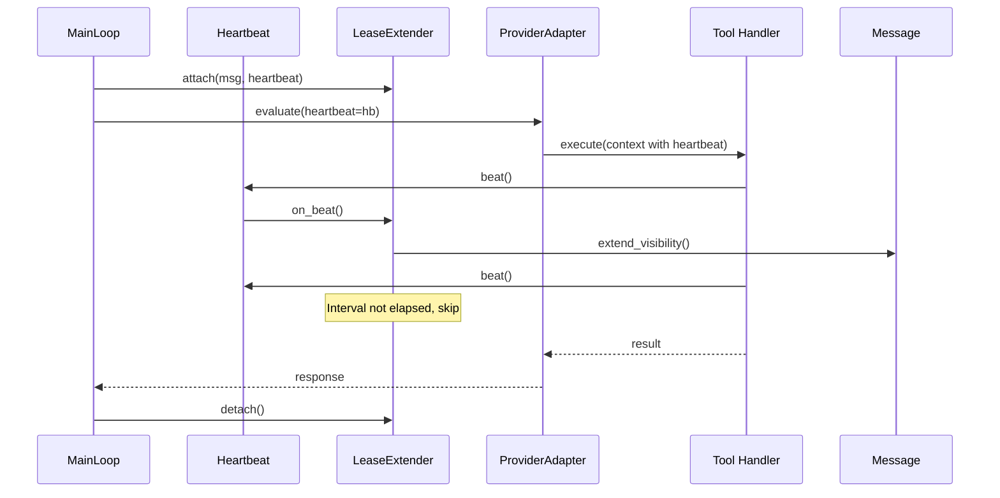

# Message Lease Extender Specification

## Purpose

`LeaseExtender` prevents message visibility timeout during long-running request
processing by extending the lease whenever a heartbeat occurs. Unlike a
background daemon thread, this approach ties lease extension directly to
proof-of-work: if the worker is actively processing (beating), the lease
extends; if the worker is stuck (no beats), the lease expires naturally and
the message becomes visible for another worker.

This design unifies two concerns:

- **Watchdog liveness**: Heartbeats prove the worker isn't stuck
- **Message visibility**: Lease extension keeps the message invisible

Both benefit from the same signal: active tool execution.

## Guiding Principles

- **Proof-of-work**: Lease extends only when actual work happens (heartbeats)
- **No separate thread**: Extension piggybacks on existing heartbeat calls
- **Fail-safe**: If worker stalls, lease expires naturally (correct behavior)
- **Tool-aware**: Heartbeats must propagate through adapter to tool execution

## Architecture



```mermaid
flowchart TB
    subgraph MainLoop["MainLoop._handle_message"]
        Receive["Receive message"]
        Attach["lease_extender.attach(msg, heartbeat)"]
        Execute["adapter.evaluate(heartbeat=hb)"]
        Detach["lease_extender.detach()"]
        Reply["_reply_and_ack()"]
    end

    subgraph Adapter["ProviderAdapter.evaluate"]
        Loop["InnerLoop.run()"]
        ToolExec["ToolExecutor.execute()"]
        Handler["tool_handler(context)"]
    end

    subgraph Beat["On heartbeat.beat()"]
        Check["interval elapsed?"]
        Extend["msg.extend_visibility()"]
        Skip["no-op"]
    end

    Receive --> Attach
    Attach --> Execute
    Execute --> Loop
    Loop --> ToolExec
    ToolExec --> Handler
    Handler -->|beat()| Check
    Check -->|yes| Extend
    Check -->|no| Skip
    Execute --> Detach
    Detach --> Reply
```

## Core Types

### LeaseExtenderConfig

```python
@dataclass(frozen=True, slots=True)
class LeaseExtenderConfig:
    """Configuration for heartbeat-triggered lease extension.

    Attributes:
        interval: Minimum seconds between extensions. Extensions are triggered
            by heartbeats but rate-limited to avoid excessive API calls.
        extension: Visibility timeout to request on each extension (seconds).
            Relative to current time, not original receive time.
        enabled: Whether to enable automatic extension. Defaults to True.
    """

    interval: float = 60.0
    extension: int = 300
    enabled: bool = True
```

**Default rationale:**

- `interval=60`: Rate-limits extensions to once per minute even if tools
  beat more frequently
- `extension=300`: Requests 5 more minutes on each extension, matching the
  default `visibility_timeout` in `MainLoop.run()`
- `enabled=True`: Automatic extension is the safe default for production

### LeaseExtender

```python
class LeaseExtender:
    """Extends message visibility when heartbeats occur.

    Attaches to a heartbeat for the duration of message processing. When
    the heartbeat's ``beat()`` is called, checks if enough time has elapsed
    since the last extension and extends the message visibility if so.

    This approach ensures lease extension only happens when actual work is
    being done. If the worker stalls (no heartbeats), the lease expires
    naturally and the message becomes visible for reprocessing.

    Example::

        extender = LeaseExtender(config=LeaseExtenderConfig(interval=30))
        heartbeat = Heartbeat()

        with extender.attach(msg, heartbeat):
            # Pass heartbeat through adapter to tools
            adapter.evaluate(prompt, session=session, heartbeat=heartbeat)
            # Tools call heartbeat.beat() during execution
            # Each beat potentially extends the message lease
    """

    def __init__(self, config: LeaseExtenderConfig | None = None) -> None:
        """Initialize the lease extender.

        Args:
            config: Extension configuration. Uses defaults if None.
        """
        self._config = config if config is not None else LeaseExtenderConfig()
        self._lock = threading.Lock()
        self._msg: Message[Any, Any] | None = None
        self._heartbeat: Heartbeat | None = None
        self._last_extension: float = 0.0
        self._original_callback: Callable[[], None] | None = None

    @contextmanager
    def attach(
        self,
        msg: Message[Any, Any],
        heartbeat: Heartbeat,
    ) -> Generator[None, None, None]:
        """Attach to a heartbeat for message lease extension.

        While attached, each ``heartbeat.beat()`` call may trigger a lease
        extension if the configured interval has elapsed.

        Args:
            msg: The message to extend visibility for.
            heartbeat: The heartbeat to observe for beats.

        Yields:
            Control to the caller while attached.
        """
        if not self._config.enabled:
            yield
            return

        self._attach(msg, heartbeat)
        try:
            yield
        finally:
            self._detach()

    def _attach(self, msg: Message[Any, Any], heartbeat: Heartbeat) -> None:
        """Attach lease extension callback to heartbeat."""
        with self._lock:
            if self._msg is not None:
                raise RuntimeError("LeaseExtender already attached")

            self._msg = msg
            self._heartbeat = heartbeat
            self._last_extension = time.monotonic()

            # Chain our callback with any existing one
            self._original_callback = heartbeat.on_beat
            heartbeat.on_beat = self._on_beat

    def _detach(self) -> None:
        """Detach lease extension callback from heartbeat."""
        with self._lock:
            if self._heartbeat is not None:
                # Restore original callback
                self._heartbeat.on_beat = self._original_callback
                self._original_callback = None

            self._msg = None
            self._heartbeat = None

    def _on_beat(self) -> None:
        """Called when heartbeat.beat() is invoked."""
        # Chain to original callback first
        if self._original_callback is not None:
            self._original_callback()

        with self._lock:
            if self._msg is None:
                return

            now = time.monotonic()
            elapsed = now - self._last_extension

            if elapsed < self._config.interval:
                return  # Rate limit

            try:
                self._msg.extend_visibility(self._config.extension)
                self._last_extension = now
                _logger.debug(
                    "Extended visibility for message %s by %d seconds",
                    self._msg.id,
                    self._config.extension,
                )
            except ReceiptHandleExpiredError:
                _logger.warning(
                    "Lease extension failed for message %s: receipt handle expired",
                    self._msg.id,
                )
                # Don't detach - let processing continue, it will handle gracefully
            except Exception:
                _logger.exception(
                    "Lease extension failed for message %s",
                    self._msg.id,
                )
```

### Heartbeat Extension

The `Heartbeat` class is extended to support an optional callback:

```python
@dataclass(slots=True)
class Heartbeat:
    """Thread-safe heartbeat tracker with optional beat callback.

    Workers call ``beat()`` at regular intervals to prove liveness.
    The watchdog calls ``elapsed()`` to check for stalls. An optional
    ``on_beat`` callback enables side effects like lease extension.
    """

    _last_beat: float = field(default_factory=time.monotonic)
    _lock: threading.Lock = field(default_factory=threading.Lock)
    on_beat: Callable[[], None] | None = None

    def beat(self) -> None:
        """Record a heartbeat and invoke callback if set."""
        with self._lock:
            self._last_beat = time.monotonic()

        # Invoke callback outside lock to avoid deadlock
        if self.on_beat is not None:
            self.on_beat()

    def elapsed(self) -> float:
        """Seconds since last heartbeat."""
        with self._lock:
            return time.monotonic() - self._last_beat
```

## Heartbeat Propagation

For lease extension to work during tool execution, the heartbeat must be
passed through the adapter to tool handlers.

### ProviderAdapter Interface

```python
class ProviderAdapter(ABC, Generic[OutputT]):
    @abstractmethod
    def evaluate(
        self,
        prompt: Prompt[OutputT],
        *,
        session: Session,
        deadline: Deadline | None = None,
        budget_tracker: BudgetTracker | None = None,
        heartbeat: Heartbeat | None = None,  # NEW
    ) -> PromptResponse[OutputT]:
        """Evaluate a prompt and return the response."""
        ...
```

### ToolContext Extension

```python
@dataclass(frozen=True, slots=True)
class ToolContext:
    """Context passed to tool handlers during execution."""

    prompt: Prompt[Any]
    session: Session
    deadline: Deadline | None = None
    heartbeat: Heartbeat | None = None  # NEW

    def beat(self) -> None:
        """Record a heartbeat if available.

        Tool handlers should call this during long-running operations
        to prove liveness and extend message visibility.
        """
        if self.heartbeat is not None:
            self.heartbeat.beat()
```

### Tool Handler Pattern

Tool handlers should beat during long-running operations:

```python
def filesystem_read_handler(
    params: ReadParams,
    *,
    context: ToolContext,
) -> ToolResult[ReadResult]:
    """Read a file from the filesystem."""
    # Beat before potentially slow I/O
    context.beat()

    content = context.resources.get(Filesystem).read(params.path)

    return ToolResult.ok(ReadResult(content=content))


def podman_exec_handler(
    params: ExecParams,
    *,
    context: ToolContext,
) -> ToolResult[ExecResult]:
    """Execute a command in a container."""
    container = context.resources.get(PodmanContainer)

    # Beat periodically during long-running command
    for chunk in container.exec_stream(params.command):
        context.beat()
        output.append(chunk)

    return ToolResult.ok(ExecResult(output="".join(output)))
```

### Adapter Threading

The heartbeat flows through the adapter internals:

```python
# MainLoop._execute
response = self._adapter.evaluate(
    prompt,
    session=session,
    deadline=effective_deadline,
    budget_tracker=budget_tracker,
    heartbeat=self._heartbeat,  # Pass heartbeat
)

# InnerLoopConfig
@dataclass(frozen=True, slots=True)
class InnerLoopConfig:
    deadline: Deadline | None = None
    budget_tracker: BudgetTracker | None = None
    heartbeat: Heartbeat | None = None  # NEW

# ToolExecutor receives heartbeat via config
# Creates ToolContext with heartbeat
# Tool handler receives context and can beat
```

## MainLoop Integration

### Configuration

```python
@FrozenDataclass()
class MainLoopConfig:
    """Configuration for MainLoop execution defaults."""

    deadline: Deadline | None = None
    budget: Budget | None = None
    resources: Mapping[type[object], object] | None = None
    lease_extender: LeaseExtenderConfig = field(
        default_factory=LeaseExtenderConfig
    )
```

### Constructor

```python
class MainLoop[UserRequestT, OutputT](ABC):
    def __init__(
        self,
        *,
        adapter: ProviderAdapter[OutputT],
        requests: Mailbox[...],
        config: MainLoopConfig | None = None,
    ) -> None:
        # ... existing initialization ...
        self._lease_extender = LeaseExtender(self._config.lease_extender)
```

### Message Handling

```python
def _handle_message(
    self, msg: Message[MainLoopRequest[UserRequestT], MainLoopResult[OutputT]]
) -> None:
    """Process a single message from the requests mailbox."""
    request_event = msg.body

    # Attach lease extender to heartbeat for this message
    with self._lease_extender.attach(msg, self._heartbeat):
        try:
            response, session = self._execute(request_event)
            result = MainLoopResult[OutputT](
                request_id=request_event.request_id,
                output=response.output,
                session_id=session.session_id,
            )
        except Exception as exc:
            result = MainLoopResult[OutputT](
                request_id=request_event.request_id,
                error=str(exc),
            )

    self._reply_and_ack(msg, result)
```

### Heartbeat Propagation in _execute

```python
def _execute(
    self,
    request_event: MainLoopRequest[UserRequestT],
) -> tuple[PromptResponse[OutputT], Session]:
    """Execute with heartbeat propagation."""
    prompt, session = self.prepare(request_event.request)
    # ... budget/deadline setup ...

    while True:
        try:
            response = self._adapter.evaluate(
                prompt,
                session=session,
                deadline=effective_deadline,
                budget_tracker=budget_tracker,
                heartbeat=self._heartbeat,  # Pass heartbeat to adapter
            )
        except VisibilityExpansionRequired as e:
            # ... handle visibility expansion ...
        else:
            self.finalize(prompt, session)
            return response, session
```

## Automatic Beating in Adapters

To ensure consistent heartbeating without requiring every tool to manually
call `context.beat()`, adapters should beat automatically at key points:

### ToolExecutor Auto-Beat

```python
class ToolExecutor:
    def execute(
        self,
        tool_call: ToolCall,
        *,
        context: ToolExecutionContext,
    ) -> ToolResult[Any]:
        """Execute a tool with automatic heartbeat."""
        # Beat before tool execution
        if context.heartbeat is not None:
            context.heartbeat.beat()

        with tool_execution(context, tool_call):
            result = self._execute_tool_with_snapshot(tool_call, context)

        # Beat after tool execution
        if context.heartbeat is not None:
            context.heartbeat.beat()

        return result
```

### InnerLoop Auto-Beat

```python
class InnerLoop:
    def run(self) -> PromptResponse[OutputT]:
        """Run the inner loop with automatic heartbeat."""
        while not self._should_stop():
            # Beat at start of each iteration
            if self._config.heartbeat is not None:
                self._config.heartbeat.beat()

            response = self._get_completion()
            # ... process response, execute tools ...

        return self._build_response()
```

This ensures:

1. Heartbeat occurs at each LLM call boundary
2. Heartbeat occurs before/after each tool execution
3. Long-running tools can add additional beats as needed

## Error Handling

| Error | Behavior |
| -------------------------- | ------------------------------------------ |
| `ReceiptHandleExpiredError` | Log warning; processing continues |
| Network/transient errors | Log exception; skip this extension |
| Callback chain failure | Original callback still invoked first |

**Design rationale:** Extension is a reliability optimization, not a
correctness requirement. If extension fails, the message may become visible
and be processed again - the system handles this via idempotent processing.

## Thread Safety

- `LeaseExtender` uses internal `threading.Lock` for state protection
- Heartbeat callback invoked outside lock to avoid deadlock
- `Heartbeat.on_beat` assignment is atomic (single reference)
- Rate limiting uses monotonic clock (no wall-clock issues)

## Comparison: Heartbeat-Based vs Daemon Thread

| Aspect | Daemon Thread | Heartbeat-Based |
| --------------------- | ---------------------- | --------------------------- |
| Extension trigger | Fixed interval timer | Tool execution beats |
| Stuck worker behavior | Keeps extending | Lease expires (correct!) |
| Thread overhead | Extra daemon thread | No additional threads |
| Timing accuracy | Precise intervals | Rate-limited, opportunistic |
| Proof-of-work | None (always extends) | Only extends on activity |

The heartbeat-based approach is superior because it correctly handles the
stuck worker case: if no work is happening, the lease should expire so the
message can be reprocessed by a healthy worker.

## Testing

### Unit Tests

```python
def test_lease_extender_extends_on_beat() -> None:
    """Verify extension happens when heartbeat fires."""
    msg = create_test_message()
    heartbeat = Heartbeat()
    config = LeaseExtenderConfig(interval=0.0)  # No rate limit
    extender = LeaseExtender(config)

    with extender.attach(msg, heartbeat):
        heartbeat.beat()
        heartbeat.beat()
        heartbeat.beat()

    assert msg.extend_visibility_calls == 3


def test_lease_extender_rate_limits() -> None:
    """Verify extension is rate-limited by interval."""
    msg = create_test_message()
    heartbeat = Heartbeat()
    config = LeaseExtenderConfig(interval=1.0)  # 1 second limit
    extender = LeaseExtender(config)

    with extender.attach(msg, heartbeat):
        heartbeat.beat()  # Extends
        heartbeat.beat()  # Skipped (interval not elapsed)
        heartbeat.beat()  # Skipped
        time.sleep(1.1)
        heartbeat.beat()  # Extends (interval elapsed)

    assert msg.extend_visibility_calls == 2


def test_lease_extender_disabled() -> None:
    """Verify no extension when disabled."""
    msg = create_test_message()
    heartbeat = Heartbeat()
    config = LeaseExtenderConfig(enabled=False)
    extender = LeaseExtender(config)

    with extender.attach(msg, heartbeat):
        heartbeat.beat()

    assert msg.extend_visibility_calls == 0


def test_heartbeat_callback_chaining() -> None:
    """Verify original callback is preserved."""
    calls: list[str] = []
    heartbeat = Heartbeat()
    heartbeat.on_beat = lambda: calls.append("original")

    msg = create_test_message()
    extender = LeaseExtender(LeaseExtenderConfig(interval=0.0))

    with extender.attach(msg, heartbeat):
        heartbeat.beat()

    assert calls == ["original"]
    assert msg.extend_visibility_calls == 1


def test_tool_context_beat() -> None:
    """Verify ToolContext.beat() propagates to heartbeat."""
    heartbeat = Heartbeat()
    context = ToolContext(
        prompt=mock_prompt,
        session=mock_session,
        heartbeat=heartbeat,
    )

    initial = heartbeat.elapsed()
    time.sleep(0.1)
    context.beat()

    assert heartbeat.elapsed() < 0.05  # Just beat, should be fresh
```

### Integration Tests

```python
def test_mainloop_extends_during_tool_execution(
    mailbox: InMemoryMailbox[...],
) -> None:
    """Verify MainLoop extends visibility when tools beat."""
    loop = ToolHeavyLoop(
        adapter=adapter_with_beating_tools,
        requests=mailbox,
        config=MainLoopConfig(
            lease_extender=LeaseExtenderConfig(interval=0.1),
        ),
    )

    mailbox.send(MainLoopRequest(request=TestRequest()))
    loop.run(max_iterations=1, visibility_timeout=2)

    # Extensions happened during tool execution
    assert mailbox.extend_visibility_call_count > 0


def test_stuck_worker_lease_expires() -> None:
    """Verify lease expires when no heartbeats occur."""
    msg = create_test_message(visibility_timeout=1)
    heartbeat = Heartbeat()
    extender = LeaseExtender(LeaseExtenderConfig(interval=0.1))

    with extender.attach(msg, heartbeat):
        # Simulate stuck worker - no beats
        time.sleep(1.5)

    # No extensions because no beats
    assert msg.extend_visibility_calls == 0
    # Message should have become visible (expired)
```

## Observability

Extension events are logged at DEBUG level:

```
DEBUG:weakincentives.runtime.main_loop:Extended visibility for message abc-123 by 300 seconds
```

Failures are logged at WARNING level:

```
WARNING:weakincentives.runtime.main_loop:Lease extension failed for message abc-123: receipt handle expired
```

## Migration Path

For tools that don't yet call `context.beat()`, the automatic beating in
`ToolExecutor` provides baseline coverage. As tools are updated to beat
during long operations, lease extension becomes more granular.

Priority for adding `context.beat()` calls:

1. Podman container execution (can run for minutes)
2. External API calls (network latency)
3. Large file operations (I/O bound)
4. Computation-heavy tools (CPU bound)

## Future Work

- **Metrics**: Emit counters for extension attempts/failures per tool
- **Adaptive interval**: Adjust based on observed tool durations
- **Per-tool beating frequency**: Some tools may need more frequent beats
