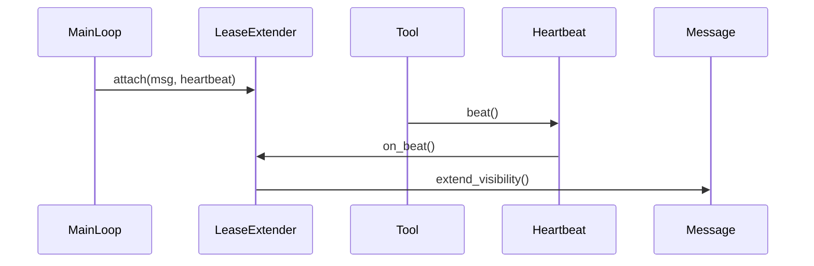

# Message Lease Extender Specification

Extends message visibility timeout via heartbeat-triggered callbacks.

**Source:** `src/weakincentives/runtime/lease_extender.py`

## Principles

- **Proof-of-work**: Lease extends only when actual work happens
- **No separate thread**: Piggybacks on heartbeat callbacks
- **Fail-safe**: If worker stalls, lease expires naturally

## Architecture



## Configuration

```python
LeaseExtenderConfig(
    interval: float = 60.0,   # Minimum seconds between extensions
    extension: int = 300,     # Visibility timeout to request
    enabled: bool = True,
)
```

## LeaseExtender

```python
extender = LeaseExtender(config)

with extender.attach(msg, heartbeat):
    adapter.evaluate(prompt, session=session, heartbeat=heartbeat)
    # Tools call heartbeat.beat() → lease extended
```

## Heartbeat Propagation

1. `MainLoop._handle_message()` attaches extender
2. `adapter.evaluate(heartbeat=hb)` passes heartbeat
3. `ToolContext.beat()` records heartbeat
4. `LeaseExtender._on_beat()` extends if interval elapsed

## ToolContext.beat()

```python
def my_handler(params, *, context: ToolContext) -> ToolResult:
    context.beat()  # Prove liveness
    # Long operation...
    return ToolResult.ok(...)
```

## Auto-Beat in Adapters

- `ToolExecutor`: Before/after each tool
- `InnerLoop`: At each iteration
- Claude Agent SDK: Via `PreToolUse`/`PostToolUse` hooks

## Error Handling

| Error | Behavior |
|-------|----------|
| `ReceiptHandleExpiredError` | Log warning, continue |
| Network errors | Log, skip extension |

## Comparison vs Daemon Thread

| Aspect | Daemon Thread | Heartbeat-Based |
|--------|---------------|-----------------|
| Stuck worker | Keeps extending | Lease expires (correct) |
| Proof-of-work | None | Only on activity |
