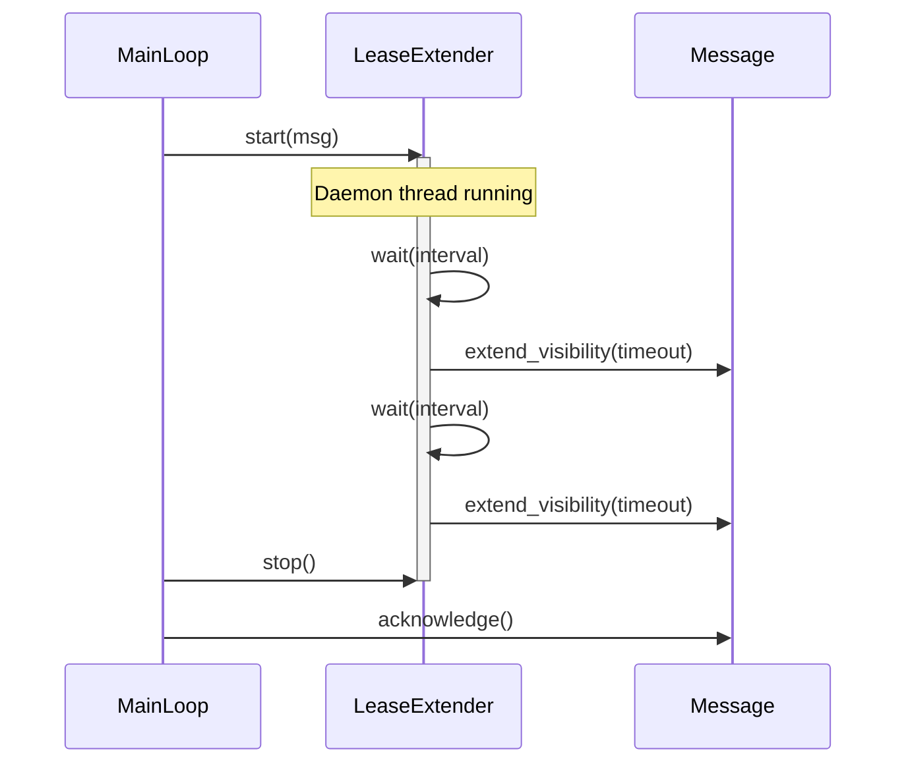
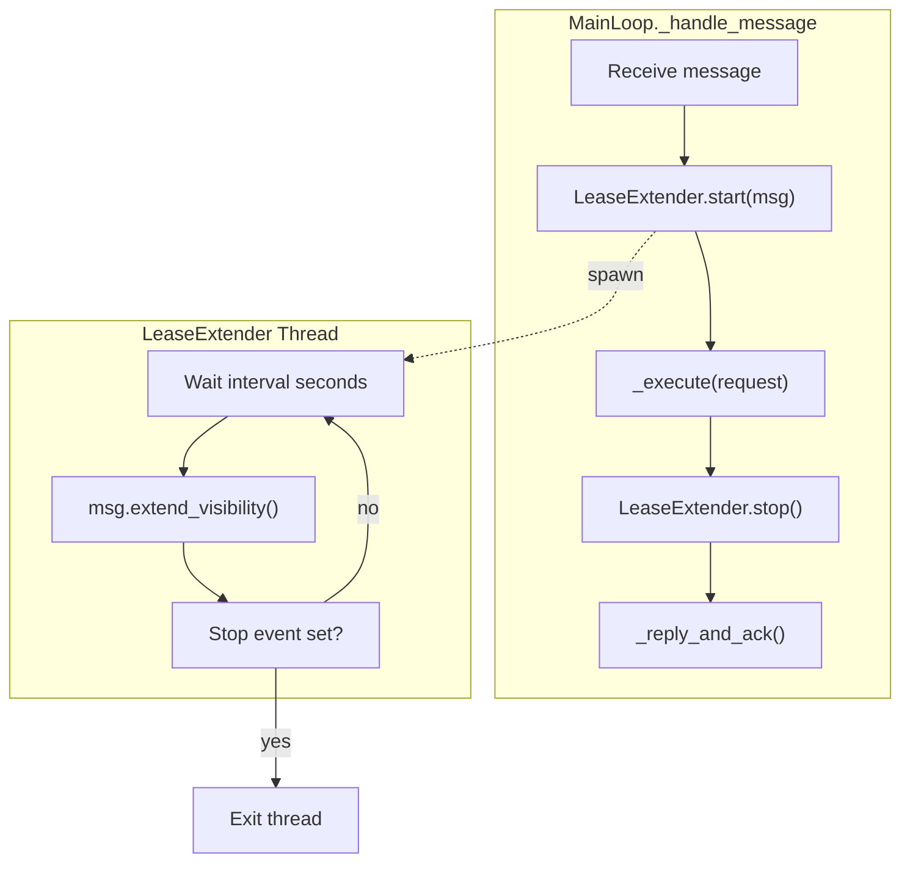

# Message Lease Extender Specification

## Purpose

`LeaseExtender` prevents message visibility timeout during long-running request
processing. Unlike trajectory observers (which run between tool calls), the
lease extender operates as a background daemon thread that periodically extends
message visibility while the main thread processes the request.

This ensures that messages remain invisible to other workers throughout
processing, preventing duplicate execution without requiring excessively long
initial visibility timeouts.

## Guiding Principles

- **Automatic**: Integrated into `MainLoop._handle_message` with no user action
- **Non-blocking**: Runs in daemon thread, never blocks request processing
- **Fail-safe**: Extension failures are logged but do not abort processing
- **Configurable**: Interval and extension amount are tunable per loop

## Architecture





## Core Types

### LeaseExtenderConfig

```python
@dataclass(frozen=True, slots=True)
class LeaseExtenderConfig:
    """Configuration for automatic lease extension.

    Attributes:
        interval: Seconds between extension attempts. Should be less than
            half the visibility timeout to provide margin for clock skew
            and network latency.
        extension: Visibility timeout to request on each extension (seconds).
            Relative to current time, not original receive time.
        enabled: Whether to enable automatic extension. Defaults to True.
    """

    interval: float = 60.0
    extension: int = 300
    enabled: bool = True
```

**Default rationale:**

- `interval=60`: Extends every minute, providing multiple extension attempts
  before a 5-minute visibility timeout expires
- `extension=300`: Requests 5 more minutes on each extension, matching the
  default `visibility_timeout` in `MainLoop.run()`
- `enabled=True`: Automatic extension is the safe default for production

### LeaseExtender

```python
class LeaseExtender:
    """Background thread that extends message visibility during processing.

    Implements context manager protocol for use with `with` statement.
    The extender thread starts on context entry and stops on exit.

    Example::

        extender = LeaseExtender(config=LeaseExtenderConfig(interval=30))

        with extender.extend(msg):
            # Long-running processing
            # Visibility extended every 30 seconds automatically
            process_request(msg.body)
        # Thread stopped, safe to acknowledge
        msg.acknowledge()
    """

    def __init__(self, config: LeaseExtenderConfig | None = None) -> None:
        """Initialize the lease extender.

        Args:
            config: Extension configuration. Uses defaults if None.
        """
        self._config = config if config is not None else LeaseExtenderConfig()
        self._stop_event: threading.Event | None = None
        self._thread: threading.Thread | None = None
        self._lock = threading.Lock()

    @contextmanager
    def extend(
        self, msg: Message[Any, Any]
    ) -> Generator[None, None, None]:
        """Context manager that extends message visibility during the block.

        Args:
            msg: The message to extend visibility for.

        Yields:
            Control to the caller while extension thread runs.
        """
        if not self._config.enabled:
            yield
            return

        self._start(msg)
        try:
            yield
        finally:
            self._stop()

    def _start(self, msg: Message[Any, Any]) -> None:
        """Start the extender thread for a message."""
        with self._lock:
            if self._thread is not None:
                raise RuntimeError("LeaseExtender already running")

            self._stop_event = threading.Event()
            self._thread = threading.Thread(
                target=self._run,
                args=(msg,),
                name="lease-extender",
                daemon=True,
            )
            self._thread.start()

    def _stop(self) -> None:
        """Stop the extender thread."""
        with self._lock:
            if self._stop_event is not None:
                self._stop_event.set()

            if self._thread is not None:
                # Wait up to 2x interval for clean exit
                self._thread.join(timeout=self._config.interval * 2)
                self._thread = None
                self._stop_event = None

    def _run(self, msg: Message[Any, Any]) -> None:
        """Extension loop: wait, extend, repeat until stopped."""
        assert self._stop_event is not None

        while not self._stop_event.wait(timeout=self._config.interval):
            try:
                msg.extend_visibility(self._config.extension)
                _logger.debug(
                    "Extended visibility for message %s by %d seconds",
                    msg.id,
                    self._config.extension,
                )
            except ReceiptHandleExpiredError:
                # Handle expired - message was requeued by reaper.
                # Stop extending; main thread will handle gracefully.
                _logger.warning(
                    "Lease extension failed for message %s: receipt handle expired",
                    msg.id,
                )
                break
            except Exception:
                # Log but continue - transient failures shouldn't stop extensions
                _logger.exception(
                    "Lease extension failed for message %s",
                    msg.id,
                )
```

## MainLoop Integration

### Configuration

`LeaseExtenderConfig` is added to `MainLoopConfig`:

```python
@FrozenDataclass()
class MainLoopConfig:
    """Configuration for MainLoop execution defaults."""

    deadline: Deadline | None = None
    budget: Budget | None = None
    resources: Mapping[type[object], object] | None = None
    lease_extender: LeaseExtenderConfig = field(
        default_factory=LeaseExtenderConfig
    )
```

### Constructor

`MainLoop` creates a `LeaseExtender` instance from config:

```python
class MainLoop[UserRequestT, OutputT](ABC):
    def __init__(
        self,
        *,
        adapter: ProviderAdapter[OutputT],
        requests: Mailbox[MainLoopRequest[UserRequestT], MainLoopResult[OutputT]],
        config: MainLoopConfig | None = None,
    ) -> None:
        # ... existing initialization ...
        self._lease_extender = LeaseExtender(self._config.lease_extender)
```

### Message Handling

`_handle_message` wraps execution with the lease extender context:

```python
def _handle_message(
    self, msg: Message[MainLoopRequest[UserRequestT], MainLoopResult[OutputT]]
) -> None:
    """Process a single message from the requests mailbox."""
    request_event = msg.body

    with self._lease_extender.extend(msg):
        try:
            response, session = self._execute(request_event)

            result = MainLoopResult[OutputT](
                request_id=request_event.request_id,
                output=response.output,
                session_id=session.session_id,
            )

        except Exception as exc:
            result = MainLoopResult[OutputT](
                request_id=request_event.request_id,
                error=str(exc),
            )

    # Extension stopped before reply/ack
    self._reply_and_ack(msg, result)
```

**Key changes:**

1. The entire `_execute()` call is wrapped in the extension context
2. Extension stops before `_reply_and_ack()` to avoid extending after ack
3. Both success and error paths are covered by the same context

## Error Handling

| Error | Behavior |
| -------------------------- | ------------------------------------------------ |
| `ReceiptHandleExpiredError` | Stop extending; processing continues |
| Network/transient errors | Log warning; continue extending |
| Extension thread crash | Daemon thread dies; processing continues |

**Design rationale:** Extension is a reliability optimization, not a
correctness requirement. If extension fails, the message may become visible
and be processed again - the system already handles this via idempotent
processing or deduplication at a higher layer.

## Thread Safety

- `LeaseExtender` uses internal `threading.Lock` for start/stop coordination
- Only one message can be extended at a time per `LeaseExtender` instance
- `MainLoop` uses one `LeaseExtender` instance for all messages (sequential)
- Extension thread accesses `Message.extend_visibility()` which is thread-safe
  (delegates to mailbox implementation with its own synchronization)

## Timing Considerations

### Clock Skew

The extension interval should be significantly less than the visibility
timeout to account for:

- Clock drift between client and server
- Network latency for extension requests
- Processing time for extension logic

**Recommendation:** Set `interval` to at most 40% of `visibility_timeout`:

```python
# visibility_timeout=300 (5 minutes)
config = LeaseExtenderConfig(
    interval=60,      # Extend every 1 minute
    extension=300,    # Request 5 more minutes
)
```

This provides 4+ extension opportunities before timeout.

### Long Tool Calls

Unlike trajectory observers that run between tool calls, `LeaseExtender`
operates independently. Even if a single tool call takes 10 minutes, the
lease will be extended every `interval` seconds throughout.

## Disabling Extension

For short-running requests or test scenarios, disable extension:

```python
config = MainLoopConfig(
    lease_extender=LeaseExtenderConfig(enabled=False),
)
loop = MyMainLoop(adapter=adapter, requests=requests, config=config)
```

## Observability

Extension events are logged at DEBUG level for normal operation:

```
DEBUG:weakincentives.runtime.main_loop:Extended visibility for message abc-123 by 300 seconds
```

Failures are logged at WARNING level:

```
WARNING:weakincentives.runtime.main_loop:Lease extension failed for message abc-123: receipt handle expired
```

## Comparison with Trajectory Observers

| Aspect | TrajectoryObserver | LeaseExtender |
| ----------------- | -------------------------- | ----------------------- |
| Execution model | Synchronous, between calls | Async daemon thread |
| Trigger | Tool invocation count/time | Fixed interval |
| Purpose | Agent feedback | Infrastructure reliability |
| Failure handling | Assessment not delivered | Log and continue |
| Thread | Main thread | Daemon thread |
| Lifetime | Per tool call | Per message |

## Implementation Notes

### Module Location

`LeaseExtender` lives in `weakincentives.runtime.main_loop` alongside
`MainLoop` since it's tightly coupled to message handling.

Alternatively, if reuse is desired for non-MainLoop message processing:

```
weakincentives/runtime/
├── main_loop.py
└── lease_extender.py  # Standalone module
```

### Imports

```python
from weakincentives.runtime.main_loop import (
    LeaseExtender,
    LeaseExtenderConfig,
    MainLoop,
    MainLoopConfig,
)
```

## Testing

### Unit Tests

```python
def test_lease_extender_extends_visibility() -> None:
    """Verify extension is called at configured interval."""
    msg = create_test_message()
    config = LeaseExtenderConfig(interval=0.1, extension=60)
    extender = LeaseExtender(config)

    with extender.extend(msg):
        time.sleep(0.25)  # Wait for 2+ extensions

    assert msg.extend_visibility_calls >= 2


def test_lease_extender_disabled() -> None:
    """Verify no extension when disabled."""
    msg = create_test_message()
    config = LeaseExtenderConfig(enabled=False)
    extender = LeaseExtender(config)

    with extender.extend(msg):
        time.sleep(0.1)

    assert msg.extend_visibility_calls == 0


def test_lease_extender_stops_on_expired_handle() -> None:
    """Verify extension stops when handle expires."""
    msg = create_expiring_message()  # Raises ReceiptHandleExpiredError
    extender = LeaseExtender(LeaseExtenderConfig(interval=0.05))

    with extender.extend(msg):
        time.sleep(0.2)

    # Should have stopped after first failure, no crash
```

### Integration Tests

```python
def test_mainloop_extends_during_slow_request(
    mailbox: InMemoryMailbox[...],
) -> None:
    """Verify MainLoop extends visibility during processing."""
    # Configure short visibility timeout and extension interval
    loop = SlowProcessingLoop(
        adapter=slow_adapter,  # Takes 5 seconds
        requests=mailbox,
        config=MainLoopConfig(
            lease_extender=LeaseExtenderConfig(
                interval=0.5,
                extension=10,
            ),
        ),
    )

    mailbox.send(MainLoopRequest(request=TestRequest()))
    loop.run(max_iterations=1, visibility_timeout=2)

    # Message processed successfully despite 2-second visibility timeout
    # because lease was extended multiple times during 5-second processing
```

## Future Work

- **Metrics**: Emit counters for extension attempts/failures
- **Adaptive interval**: Adjust based on observed processing times
- **Per-request override**: Allow `MainLoopRequest` to specify extension config
