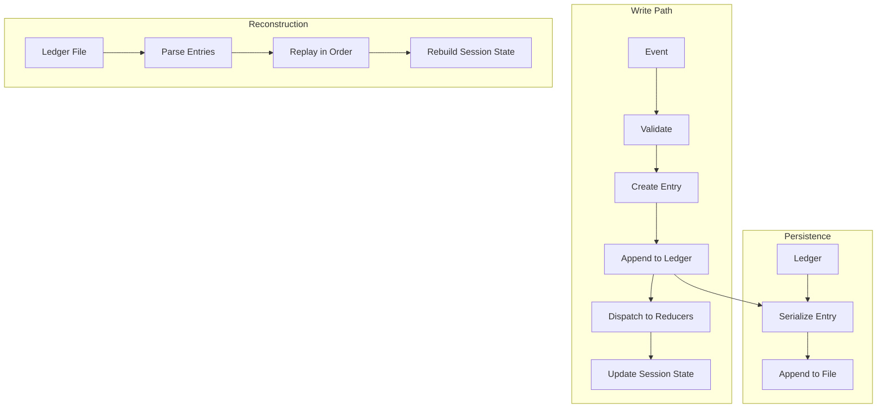
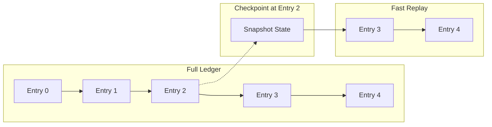

# Ledger Specification

## Purpose

The Ledger is an append-only data structure at the core of a Session that serves
as the authoritative source of truth for all state changes. Every mutation to
session state is recorded as a ledger entry, enabling:

- **Full reconstruction**: Sessions can be rebuilt from scratch by replaying the
  ledger
- **Durable persistence**: Simple serialization to disk with append-only writes
- **Audit trail**: Complete history of all state changes with timestamps
- **Time-travel debugging**: Replay to any point in session history

## Guiding Principles

- **Append-only**: Entries are never modified or deleted from the ledger
- **Event sourcing**: State is derived from events, not stored directly
- **Deterministic replay**: Same ledger always produces identical session state
- **Serialization-first**: Designed for efficient disk persistence
- **Minimal coupling**: Ledger knows about entries; reducers derive state



## Ledger Structure

### Ledger

The top-level container for all session events:

```python
@dataclass(slots=True, frozen=True)
class Ledger:
    """Append-only log of session events."""

    session_id: UUID
    created_at: datetime  # UTC
    entries: tuple[LedgerEntry, ...]
    schema_version: str = LEDGER_SCHEMA_VERSION  # "1"

    def append(self, entry: LedgerEntry) -> "Ledger":
        """Return new ledger with entry appended."""
        ...

    def replay(self, *, until: int | None = None) -> SessionState:
        """Replay entries to reconstruct state, optionally up to entry index."""
        ...

    @classmethod
    def empty(cls, session_id: UUID) -> "Ledger":
        """Create empty ledger for new session."""
        ...
```

### LedgerEntry

Individual recorded events with metadata:

```python
@dataclass(slots=True, frozen=True)
class LedgerEntry:
    """Single entry in the ledger."""

    entry_id: UUID
    sequence: int  # Monotonically increasing, 0-indexed
    timestamp: datetime  # UTC, when entry was created
    entry_type: LedgerEntryType
    payload: LedgerPayload
    checksum: str  # SHA-256 of serialized payload

    def verify(self) -> bool:
        """Verify checksum matches payload."""
        ...
```

### Entry Types

```python
class LedgerEntryType(Enum):
    """Categories of ledger entries."""

    # State mutations
    SLICE_SEED = "slice_seed"           # Initialize slice with values
    SLICE_APPEND = "slice_append"       # Append value to slice
    SLICE_CLEAR = "slice_clear"         # Clear slice (with optional predicate)
    EVENT_DISPATCH = "event_dispatch"   # Event dispatched through reducers

    # Reducer management
    REDUCER_REGISTER = "reducer_register"
    REDUCER_UNREGISTER = "reducer_unregister"

    # Session lifecycle
    SESSION_CREATED = "session_created"
    SESSION_CLONED = "session_cloned"
    SNAPSHOT_CREATED = "snapshot_created"
    ROLLBACK = "rollback"

    # Metadata
    TAG_SET = "tag_set"
    TAG_REMOVE = "tag_remove"
```

### Payloads

Type-specific payload structures:

```python
@dataclass(slots=True, frozen=True)
class SliceSeedPayload:
    """Payload for SLICE_SEED entries."""
    slice_type: str  # Type identifier: "package.module:ClassName"
    values: tuple[Any, ...]  # Serialized dataclass instances

@dataclass(slots=True, frozen=True)
class SliceAppendPayload:
    """Payload for SLICE_APPEND entries."""
    slice_type: str
    value: Any

@dataclass(slots=True, frozen=True)
class SliceClearPayload:
    """Payload for SLICE_CLEAR entries."""
    slice_type: str
    predicate_repr: str | None  # Human-readable predicate description

@dataclass(slots=True, frozen=True)
class EventDispatchPayload:
    """Payload for EVENT_DISPATCH entries."""
    event_type: str  # Type identifier of the event
    event: Any  # Serialized event dataclass
    target_slice_type: str  # Slice that received the event

@dataclass(slots=True, frozen=True)
class ReducerRegisterPayload:
    """Payload for REDUCER_REGISTER entries."""
    slice_type: str
    event_type: str
    reducer_name: str  # Qualified name for reconstruction

@dataclass(slots=True, frozen=True)
class SessionCreatedPayload:
    """Payload for SESSION_CREATED entries."""
    parent_id: UUID | None
    tags: Mapping[str, str]

@dataclass(slots=True, frozen=True)
class RollbackPayload:
    """Payload for ROLLBACK entries."""
    target_sequence: int  # Entry sequence to rollback to
    snapshot_id: UUID | None  # If rolling back to a snapshot
```

Union type for all payloads:

```python
LedgerPayload = (
    SliceSeedPayload
    | SliceAppendPayload
    | SliceClearPayload
    | EventDispatchPayload
    | ReducerRegisterPayload
    | SessionCreatedPayload
    | RollbackPayload
    | TagSetPayload
    | TagRemovePayload
    | SnapshotCreatedPayload
    | SessionClonedPayload
)
```

## Persistence Format

### File Layout

Ledger files use newline-delimited JSON (NDJSON) for append-friendly persistence:

```
ledger-{session_id}.ndjson
```

Each line is a complete, self-contained JSON object:

```json
{"entry_id":"550e8400-e29b-41d4-a716-446655440000","sequence":0,"timestamp":"2024-01-15T10:30:00Z","entry_type":"session_created","payload":{"parent_id":null,"tags":{}},"checksum":"abc123..."}
{"entry_id":"550e8400-e29b-41d4-a716-446655440001","sequence":1,"timestamp":"2024-01-15T10:30:01Z","entry_type":"slice_seed","payload":{"slice_type":"myapp.models:Plan","values":[{"objective":"Build feature"}]},"checksum":"def456..."}
```

### Header Line

The first line contains ledger metadata:

```json
{"schema_version":"1","session_id":"550e8400-e29b-41d4-a716-446655440000","created_at":"2024-01-15T10:30:00Z"}
```

### Serialization Rules

- Timestamps: ISO 8601 with UTC timezone (`Z` suffix)
- UUIDs: Lowercase hyphenated string
- Type identifiers: `"package.module:ClassName"` format
- Dataclass values: Via `weakincentives.serde.dump()`
- Checksums: SHA-256 hex digest of canonical JSON payload

### Append Protocol

Writing new entries:

1. Serialize entry to JSON
2. Compute checksum
3. Append line to file with atomic write
4. fsync to ensure durability

```python
def append_to_file(path: Path, entry: LedgerEntry) -> None:
    """Append entry to ledger file with durability guarantees."""
    line = serialize_entry(entry) + "\n"
    with open(path, "a") as f:
        f.write(line)
        f.flush()
        os.fsync(f.fileno())
```

## Session Integration

### Recording Mutations

All session mutations flow through the ledger:

```python
class Session:
    def __init__(self, *, ledger: Ledger | None = None, ...):
        self._ledger = ledger or Ledger.empty(self.session_id)
        ...

    @property
    def ledger(self) -> Ledger:
        """Read-only access to the session's ledger."""
        return self._ledger
```

The mutation API records entries before applying changes:

```python
class MutationBuilder:
    def seed(self, values: T | Iterable[T]) -> None:
        # Record to ledger first
        entry = LedgerEntry(
            entry_id=uuid4(),
            sequence=self._session.ledger.next_sequence,
            timestamp=datetime.now(UTC),
            entry_type=LedgerEntryType.SLICE_SEED,
            payload=SliceSeedPayload(
                slice_type=type_identifier(self._slice_type),
                values=tuple(dump(v) for v in normalized_values),
            ),
            checksum=...,
        )
        self._session._append_entry(entry)

        # Then apply to state
        self._session._state[self._slice_type] = normalized_values
```

### Reconstruction

Rebuilding a session from its ledger:

```python
def reconstruct_session(ledger: Ledger, *, bus: EventBus) -> Session:
    """Reconstruct session state by replaying ledger entries."""
    session = Session(
        bus=bus,
        session_id=ledger.session_id,
        created_at=ledger.created_at,
        ledger=Ledger.empty(ledger.session_id),  # Start fresh
    )

    for entry in ledger.entries:
        _apply_entry(session, entry)

    return session
```

Entry application handlers:

```python
def _apply_entry(session: Session, entry: LedgerEntry) -> None:
    """Apply a single ledger entry to session state."""
    match entry.entry_type:
        case LedgerEntryType.SLICE_SEED:
            _apply_slice_seed(session, entry.payload)
        case LedgerEntryType.SLICE_APPEND:
            _apply_slice_append(session, entry.payload)
        case LedgerEntryType.EVENT_DISPATCH:
            _apply_event_dispatch(session, entry.payload)
        case LedgerEntryType.REDUCER_REGISTER:
            _apply_reducer_register(session, entry.payload)
        # ... etc
```

### Loading from Disk

```python
def load_session(path: Path, *, bus: EventBus) -> Session:
    """Load session from ledger file."""
    ledger = Ledger.from_file(path)
    return reconstruct_session(ledger, bus=bus)

def save_session(session: Session, path: Path) -> None:
    """Persist session ledger to file."""
    session.ledger.to_file(path)
```

## Checkpointing

For long-running sessions, periodic checkpoints reduce replay time:



### Checkpoint Structure

```python
@dataclass(slots=True, frozen=True)
class LedgerCheckpoint:
    """Snapshot of session state at a specific ledger position."""

    checkpoint_id: UUID
    ledger_sequence: int  # Entry sequence this checkpoint represents
    created_at: datetime
    state: Snapshot  # Full session state at this point
    checksum: str  # Verification hash
```

### Checkpoint Files

Stored alongside ledger files:

```
ledger-{session_id}.ndjson           # Full ledger
ledger-{session_id}.checkpoint.100   # Checkpoint at sequence 100
ledger-{session_id}.checkpoint.500   # Checkpoint at sequence 500
```

### Checkpoint Loading

```python
def load_session_fast(
    ledger_path: Path,
    *,
    bus: EventBus,
    checkpoint_dir: Path | None = None,
) -> Session:
    """Load session using most recent checkpoint if available."""
    ledger = Ledger.from_file(ledger_path)

    # Find latest checkpoint before ledger end
    checkpoint = find_latest_checkpoint(checkpoint_dir, ledger.session_id)

    if checkpoint and checkpoint.ledger_sequence < len(ledger.entries):
        # Start from checkpoint state
        session = Session.from_snapshot(checkpoint.state, bus=bus)
        # Replay only entries after checkpoint
        for entry in ledger.entries[checkpoint.ledger_sequence + 1:]:
            _apply_entry(session, entry)
        return session

    # No checkpoint, full replay
    return reconstruct_session(ledger, bus=bus)
```

## Compaction

Over time, ledgers may contain redundant entries. Compaction creates a minimal
equivalent ledger:

### Compaction Rules

1. **Superseded seeds**: Multiple `SLICE_SEED` for same type → keep latest
2. **Cleared slices**: `SLICE_CLEAR` without predicate → remove prior mutations
3. **Rollbacks**: Entries after rollback target can be removed
4. **Idempotent appends**: Duplicate values in `append` reducers → keep first

### Compaction API

```python
def compact_ledger(ledger: Ledger) -> Ledger:
    """Return minimal ledger that produces identical final state."""
    ...

def compact_file(
    source: Path,
    destination: Path,
    *,
    preserve_history: bool = False,
) -> None:
    """Compact ledger file, optionally preserving full history."""
    ...
```

**Note**: Compaction is lossy for audit purposes. Keep original files for
compliance requirements.

## Invariants

The ledger maintains these invariants:

1. **Monotonic sequences**: Entry sequences are strictly increasing (0, 1, 2, ...)
2. **Timestamp ordering**: Entry timestamps are non-decreasing
3. **Referential integrity**: Type identifiers resolve to valid classes
4. **Checksum validity**: All entry checksums verify correctly
5. **Deterministic replay**: Replaying the same ledger always produces identical
   state

### Validation

```python
def validate_ledger(ledger: Ledger) -> list[LedgerValidationError]:
    """Validate ledger integrity, returning any errors found."""
    errors = []

    for i, entry in enumerate(ledger.entries):
        # Sequence check
        if entry.sequence != i:
            errors.append(SequenceGapError(expected=i, actual=entry.sequence))

        # Checksum verification
        if not entry.verify():
            errors.append(ChecksumMismatchError(entry_id=entry.entry_id))

        # Type resolution
        try:
            resolve_type_identifier(entry.payload.slice_type)
        except TypeResolutionError as e:
            errors.append(UnresolvableTypeError(entry_id=entry.entry_id, type_id=e.type_id))

    return errors
```

## Error Handling

### Error Types

```python
class LedgerError(WinkError):
    """Base class for ledger errors."""

class LedgerCorruptionError(LedgerError):
    """Ledger file is corrupted or invalid."""
    path: Path
    line_number: int | None
    details: str

class LedgerReplayError(LedgerError):
    """Error during ledger replay."""
    entry_id: UUID
    sequence: int
    cause: Exception

class LedgerValidationError(LedgerError):
    """Ledger invariant violation."""
    entry_id: UUID | None
    violation: str
```

### Recovery Strategies

1. **Truncation**: Remove corrupted entries from end of file
2. **Checkpoint restore**: Fall back to last valid checkpoint
3. **Manual repair**: Export valid entries to new file

```python
def repair_ledger(
    path: Path,
    *,
    strategy: Literal["truncate", "checkpoint", "export"] = "truncate",
) -> RepairResult:
    """Attempt to repair corrupted ledger file."""
    ...
```

## Thread Safety

Ledger operations must be thread-safe:

- **Append**: Serialized through session lock (same as mutations)
- **Read**: Entries tuple is immutable, safe for concurrent access
- **File I/O**: Use file locking for multi-process access

```python
class FileLedgerWriter:
    """Thread-safe and process-safe ledger file writer."""

    def __init__(self, path: Path):
        self._path = path
        self._lock = threading.Lock()

    def append(self, entry: LedgerEntry) -> None:
        with self._lock:
            with portalocker.Lock(self._path, mode="a") as f:
                f.write(serialize_entry(entry) + "\n")
                f.flush()
                os.fsync(f.fileno())
```

## Usage Example

```python
from weakincentives.runtime import Session, InProcessEventBus
from weakincentives.runtime.ledger import Ledger, load_session, save_session

# Create session with ledger
bus = InProcessEventBus()
session = Session(bus=bus)

# Mutations are recorded to ledger
session.mutate(Plan).seed(Plan(objective="Build feature"))
session.mutate(Plan).dispatch(UpdatePlan(status="in_progress"))

# Check ledger
print(f"Ledger has {len(session.ledger.entries)} entries")

# Persist to disk
save_session(session, Path("./session.ndjson"))

# Later: reconstruct from disk
restored = load_session(Path("./session.ndjson"), bus=InProcessEventBus())
assert session.query(Plan).latest() == restored.query(Plan).latest()

# Validate integrity
errors = validate_ledger(restored.ledger)
if errors:
    print(f"Found {len(errors)} validation errors")
```

## Performance Considerations

### Write Performance

- NDJSON allows append-only writes (no rewriting)
- fsync after each entry ensures durability but impacts throughput
- Batch writes for high-frequency mutations if durability can be relaxed

### Read Performance

- Sequential reads are cache-friendly
- Checkpoints amortize replay cost for long sessions
- Memory-map large files for random access patterns

### Memory Usage

- Entries stored as immutable tuples (COW-friendly)
- Lazy payload deserialization for large ledgers
- Streaming parser for files larger than memory

## Future Extensions

Potential future capabilities (not in initial implementation):

- **Distributed ledger**: Multi-node replication for fault tolerance
- **Event streaming**: Real-time ledger tailing for observers
- **Selective replay**: Reconstruct only specific slices
- **Ledger merging**: Combine child session ledgers into parent
- **Retention policies**: Automatic archival of old entries

## Limitations

- **No deletion**: Entries cannot be removed (by design)
- **No random access**: Reconstruction requires sequential replay
- **Type evolution**: Schema changes require migration tooling
- **Single-writer**: Concurrent append requires external coordination
- **Reducer registration**: Custom reducers must be re-registered after replay
  (stored by name, not definition)
