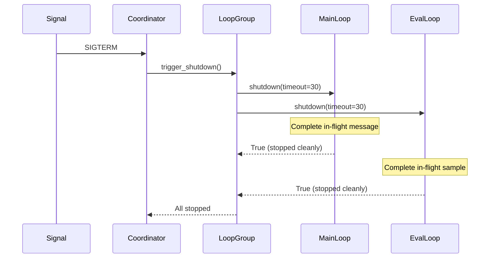

# Lifecycle Specification

## Purpose

Enable graceful shutdown of `MainLoop` and `EvalLoop` instances running in the
same process. Signal handlers coordinate shutdown across all loops, ensuring
in-flight work completes and messages are not lost.

## Guiding Principles

- **Cooperative shutdown**: Loops poll a shutdown flag rather than being killed
  mid-execution. In-flight requests complete before the loop exits.
- **Signal-driven**: SIGTERM and SIGINT trigger shutdown. Container
  orchestrators (Kubernetes, ECS) send SIGTERM during rolling deployments.
- **Composable**: A `LoopGroup` coordinates multiple loops. Individual loops
  remain usable standalone for simple deployments.
- **Timeout-bounded**: Shutdown waits for in-flight work up to a configurable
  timeout, then exits. Visibility timeout handles message recovery.

## Core Abstractions

### Runnable Protocol

Both `MainLoop` and `EvalLoop` implement a common interface for lifecycle
management:

```python
from typing import Protocol, Self
from contextlib import AbstractContextManager

class Runnable(Protocol):
    """Protocol for loops that support graceful shutdown."""

    def run(
        self,
        *,
        max_iterations: int | None = None,
        visibility_timeout: int = 300,
        wait_time_seconds: int = 20,
    ) -> None:
        """Run the loop, processing messages until stopped.

        Exits when:
        - max_iterations reached
        - shutdown() called
        - Mailbox closed

        Args:
            max_iterations: Maximum polling iterations (None = unlimited).
            visibility_timeout: Seconds messages remain invisible during
                processing. Must exceed maximum expected execution time.
            wait_time_seconds: Long poll duration (0-20 seconds).
        """
        ...

    def shutdown(self, *, timeout: float = 30.0) -> bool:
        """Request graceful shutdown.

        Sets the shutdown flag and waits for in-flight work to complete.
        Returns when the loop has stopped or timeout expires.

        Args:
            timeout: Maximum seconds to wait for in-flight work.

        Returns:
            True if loop stopped cleanly, False if timeout expired.
        """
        ...

    @property
    def running(self) -> bool:
        """True if the loop is currently processing messages."""
        ...

    def __enter__(self) -> Self:
        """Context manager entry (no-op, returns self)."""
        ...

    def __exit__(self, exc_type, exc_val, exc_tb) -> None:
        """Context manager exit triggers shutdown."""
        ...
```

### ShutdownCoordinator

Singleton that manages signal handlers and notifies registered loops:

```python
import signal
import threading
from collections.abc import Callable

class ShutdownCoordinator:
    """Coordinates graceful shutdown across multiple loops.

    Installs signal handlers for SIGTERM and SIGINT. When a signal arrives,
    all registered callbacks are invoked. Thread-safe for concurrent
    registration and signal delivery.

    Example:
        coordinator = ShutdownCoordinator.install()
        coordinator.register(loop.shutdown)
        loop.run()
    """

    _instance: ShutdownCoordinator | None = None
    _lock: threading.Lock = threading.Lock()

    def __init__(self) -> None:
        self._callbacks: list[Callable[[], None]] = []
        self._callbacks_lock = threading.Lock()
        self._triggered = threading.Event()

    @classmethod
    def install(
        cls,
        *,
        signals: tuple[signal.Signals, ...] = (signal.SIGTERM, signal.SIGINT),
    ) -> ShutdownCoordinator:
        """Install signal handlers and return the coordinator.

        Safe to call multiple times; returns the same instance. Signal
        handlers are installed only once.

        Args:
            signals: Signals to handle. Defaults to SIGTERM and SIGINT.

        Returns:
            The singleton ShutdownCoordinator instance.
        """
        with cls._lock:
            if cls._instance is None:
                cls._instance = cls()
                for sig in signals:
                    signal.signal(sig, cls._instance._handle_signal)
            return cls._instance

    @classmethod
    def get(cls) -> ShutdownCoordinator | None:
        """Return the installed coordinator, or None if not installed."""
        return cls._instance

    def register(self, callback: Callable[[], None]) -> None:
        """Register a callback to invoke on shutdown.

        Callbacks are invoked in registration order. If shutdown has
        already been triggered, the callback is invoked immediately.

        Args:
            callback: Zero-argument callable (typically loop.shutdown).
        """
        with self._callbacks_lock:
            self._callbacks.append(callback)
            if self._triggered.is_set():
                callback()

    def unregister(self, callback: Callable[[], None]) -> None:
        """Remove a callback from the shutdown list.

        Args:
            callback: Previously registered callback.
        """
        with self._callbacks_lock:
            try:
                self._callbacks.remove(callback)
            except ValueError:
                pass

    def trigger(self) -> None:
        """Manually trigger shutdown (for testing or programmatic control)."""
        self._triggered.set()
        with self._callbacks_lock:
            callbacks = list(self._callbacks)
        for callback in callbacks:
            callback()

    @property
    def triggered(self) -> bool:
        """True if shutdown has been triggered."""
        return self._triggered.is_set()

    def _handle_signal(self, signum: int, frame: object) -> None:
        """Signal handler that triggers shutdown."""
        _ = frame
        self.trigger()
```

### LoopGroup

Manages multiple loops as a unit with coordinated startup and shutdown:

```python
import threading
from concurrent.futures import ThreadPoolExecutor, Future
from typing import Sequence

@dataclass
class LoopGroup:
    """Coordinates lifecycle of multiple loops.

    Runs each loop in a separate thread and handles coordinated shutdown.
    Integrates with ShutdownCoordinator for signal-driven termination.

    Example:
        group = LoopGroup(loops=[main_loop, eval_loop])
        group.run()  # Blocks until shutdown signal or all loops exit

    Example with context manager:
        with LoopGroup(loops=[main_loop, eval_loop]) as group:
            group.run()
        # Shutdown triggered on context exit
    """

    loops: Sequence[Runnable]
    shutdown_timeout: float = 30.0

    _executor: ThreadPoolExecutor | None = field(default=None, init=False, repr=False)
    _futures: list[Future[None]] = field(default_factory=list, init=False, repr=False)
    _shutdown_event: threading.Event = field(
        default_factory=threading.Event, init=False, repr=False
    )

    def run(
        self,
        *,
        install_signals: bool = True,
        visibility_timeout: int = 300,
        wait_time_seconds: int = 20,
    ) -> None:
        """Run all loops until shutdown.

        Blocks until all loops exit or shutdown is triggered. Each loop
        runs in a dedicated thread.

        Args:
            install_signals: If True, install SIGTERM/SIGINT handlers.
            visibility_timeout: Passed to each loop's run() method.
            wait_time_seconds: Passed to each loop's run() method.
        """
        if install_signals:
            coordinator = ShutdownCoordinator.install()
            coordinator.register(self._trigger_shutdown)

        self._executor = ThreadPoolExecutor(
            max_workers=len(self.loops),
            thread_name_prefix="loop-worker",
        )

        try:
            for loop in self.loops:
                future = self._executor.submit(
                    loop.run,
                    visibility_timeout=visibility_timeout,
                    wait_time_seconds=wait_time_seconds,
                )
                self._futures.append(future)

            # Wait for all loops to complete
            for future in self._futures:
                future.result()

        finally:
            self._executor.shutdown(wait=True)

    def shutdown(self, *, timeout: float | None = None) -> bool:
        """Shutdown all loops gracefully.

        Args:
            timeout: Maximum seconds to wait. Defaults to shutdown_timeout.

        Returns:
            True if all loops stopped cleanly, False if timeout expired.
        """
        effective_timeout = timeout if timeout is not None else self.shutdown_timeout
        self._shutdown_event.set()

        results = []
        for loop in self.loops:
            result = loop.shutdown(timeout=effective_timeout)
            results.append(result)

        return all(results)

    def _trigger_shutdown(self) -> None:
        """Internal callback for ShutdownCoordinator."""
        _ = self.shutdown()

    def __enter__(self) -> Self:
        return self

    def __exit__(self, exc_type, exc_val, exc_tb) -> None:
        _ = self.shutdown()
```

## MainLoop Changes

### New Instance Attributes

```python
class MainLoop[UserRequestT, OutputT](ABC):
    # Existing attributes...

    # New lifecycle attributes
    _shutdown_event: threading.Event
    _running: bool
    _current_message: Message[MainLoopRequest[UserRequestT]] | None
    _lock: threading.Lock
```

### Updated run() Method

```python
def run(
    self,
    *,
    max_iterations: int | None = None,
    visibility_timeout: int = 300,
    wait_time_seconds: int = 20,
) -> None:
    """Run the worker loop with graceful shutdown support.

    The loop exits when:
    - max_iterations is reached
    - shutdown() is called
    - The requests mailbox is closed

    In-flight messages complete before exit. Visibility timeout is
    extended if needed during shutdown drain.
    """
    with self._lock:
        self._running = True

    iterations = 0
    try:
        while max_iterations is None or iterations < max_iterations:
            # Check shutdown before blocking on receive
            if self._shutdown_event.is_set():
                break

            if self._requests.closed:
                break

            messages = self._requests.receive(
                visibility_timeout=visibility_timeout,
                wait_time_seconds=wait_time_seconds,
            )

            for msg in messages:
                # Check shutdown between messages
                if self._shutdown_event.is_set():
                    # Nack unprocessed message for redelivery
                    try:
                        msg.nack(visibility_timeout=0)
                    except ReceiptHandleExpiredError:
                        pass
                    break

                with self._lock:
                    self._current_message = msg

                try:
                    self._handle_message(msg)
                finally:
                    with self._lock:
                        self._current_message = None

            iterations += 1
    finally:
        with self._lock:
            self._running = False
```

### New shutdown() Method

```python
def shutdown(self, *, timeout: float = 30.0) -> bool:
    """Request graceful shutdown and wait for completion.

    Sets the shutdown flag. If an in-flight message is being processed,
    waits up to timeout seconds for it to complete.

    Args:
        timeout: Maximum seconds to wait for in-flight work.

    Returns:
        True if loop stopped cleanly, False if timeout expired.
    """
    self._shutdown_event.set()

    deadline = time.monotonic() + timeout
    while time.monotonic() < deadline:
        with self._lock:
            if not self._running:
                return True
        time.sleep(0.1)

    return False

@property
def running(self) -> bool:
    """True if the loop is currently processing messages."""
    with self._lock:
        return self._running
```

### Context Manager Support

```python
def __enter__(self) -> Self:
    """Context manager entry. Returns self for use in with statement."""
    return self

def __exit__(
    self,
    exc_type: type[BaseException] | None,
    exc_val: BaseException | None,
    exc_tb: object,
) -> None:
    """Context manager exit. Triggers shutdown and waits for completion."""
    _ = self.shutdown()
```

## EvalLoop Changes

EvalLoop receives identical changes to MainLoop:

- `_shutdown_event`, `_running`, `_current_message`, `_lock` attributes
- Updated `run()` with shutdown checks
- New `shutdown()` method
- Context manager support
- `running` property

The implementation mirrors MainLoop since both follow the same mailbox-polling
pattern.

## Usage Patterns

### Single Loop with Signals

```python
from weakincentives.runtime import MainLoop, ShutdownCoordinator

# Install signal handlers
coordinator = ShutdownCoordinator.install()

# Create and register loop
loop = MyMainLoop(adapter=adapter, requests=requests, responses=responses)
coordinator.register(loop.shutdown)

# Run until signal
loop.run()
```

### Multiple Loops with LoopGroup

```python
from weakincentives.runtime import MainLoop, LoopGroup
from weakincentives.evals import EvalLoop

# Create loops
main_loop = AnalystLoop(...)
eval_loop = EvalLoop(loop=main_loop, evaluator=scorer, ...)

# Run as a group
group = LoopGroup(loops=[main_loop, eval_loop])
group.run()  # Blocks until SIGTERM/SIGINT
```

### Context Manager Pattern

```python
with LoopGroup(loops=[main_loop, eval_loop]) as group:
    # Run in background thread if needed
    thread = threading.Thread(target=group.run)
    thread.start()

    # Do other work...

    # Shutdown triggered on context exit
# All loops have stopped here
```

### Programmatic Shutdown

```python
# Run loop in background
thread = threading.Thread(target=loop.run)
thread.start()

# Later, trigger shutdown
success = loop.shutdown(timeout=60.0)
if not success:
    logger.warning("Loop did not stop within timeout")

thread.join()
```

## Execution Flow

### Normal Shutdown



### Shutdown During Message Processing

```mermaid
sequenceDiagram
    participant Loop
    participant Mailbox
    participant Handler

    Loop->>Mailbox: receive()
    Mailbox-->>Loop: [msg1, msg2, msg3]

    Loop->>Handler: _handle_message(msg1)
    Note right of Loop: Signal arrives during processing

    Handler-->>Loop: Complete
    Loop->>Mailbox: acknowledge(msg1)

    Note over Loop: Check shutdown flag
    Loop->>Mailbox: nack(msg2, visibility_timeout=0)
    Note over Loop: msg3 also nacked

    Loop-->>Loop: Exit run()
```

## Message Recovery

When shutdown interrupts processing:

| Scenario | Message State | Recovery |
|----------|---------------|----------|
| In-flight when shutdown triggered | Completes normally | Acknowledged |
| Received but not started | Nacked immediately | Redelivered |
| Never received | Still in queue | Picked up by other worker |
| Visibility expired during long shutdown | Requeued by reaper | Redelivered |

The visibility timeout mechanism ensures no messages are lost. Workers that
take too long are naturally handled by the mailbox's redelivery semantics.

## Thread Safety

### ShutdownCoordinator

- `_callbacks` protected by `_callbacks_lock`
- `_triggered` is a `threading.Event` (inherently thread-safe)
- Signal handlers may run on any thread; callbacks must be thread-safe

### LoopGroup

- Uses `ThreadPoolExecutor` for loop threads
- Shutdown can be called from signal handler thread
- Individual loop `shutdown()` methods are thread-safe

### MainLoop/EvalLoop

- `_shutdown_event` is a `threading.Event`
- `_running` and `_current_message` protected by `_lock`
- `shutdown()` can be called from any thread

## Configuration

### Timeouts

| Parameter | Default | Description |
|-----------|---------|-------------|
| `shutdown_timeout` | 30.0s | Max wait for in-flight work |
| `visibility_timeout` | 300s | Mailbox invisibility period |
| `wait_time_seconds` | 20s | Long poll duration |

**Relationship**: `visibility_timeout` should be greater than
`shutdown_timeout` + maximum expected message processing time. This ensures
messages are not prematurely redelivered during graceful shutdown.

### Signals

Default signals: `SIGTERM`, `SIGINT`

`SIGTERM` is sent by:
- Kubernetes pod termination
- Docker stop
- systemd service stop
- Manual `kill <pid>`

`SIGINT` is sent by:
- Ctrl+C in terminal
- IDE stop button

## Testing

### Unit Tests

```python
def test_shutdown_stops_loop():
    loop = MyMainLoop(...)
    thread = threading.Thread(target=loop.run)
    thread.start()

    time.sleep(0.1)  # Let loop start
    assert loop.running

    success = loop.shutdown(timeout=5.0)
    thread.join(timeout=1.0)

    assert success
    assert not loop.running
    assert not thread.is_alive()


def test_shutdown_waits_for_in_flight():
    # Use slow handler to test waiting
    slow_handler = SlowHandler(delay=2.0)
    loop = MyMainLoop(handler=slow_handler, ...)

    # Submit message and start loop
    requests.send(MainLoopRequest(request=...))
    thread = threading.Thread(target=loop.run, kwargs={"max_iterations": 1})
    thread.start()

    time.sleep(0.1)  # Let message start processing
    success = loop.shutdown(timeout=5.0)

    assert success
    assert slow_handler.completed  # Message finished


def test_loop_group_coordinates_shutdown():
    loop1 = MainLoop(...)
    loop2 = EvalLoop(...)

    group = LoopGroup(loops=[loop1, loop2])

    thread = threading.Thread(target=group.run)
    thread.start()

    time.sleep(0.1)
    success = group.shutdown(timeout=5.0)
    thread.join(timeout=1.0)

    assert success
    assert not loop1.running
    assert not loop2.running
```

### Integration Tests

```python
def test_sigterm_triggers_shutdown():
    """Test that SIGTERM gracefully stops loops."""
    import os
    import signal

    loop = MyMainLoop(...)
    group = LoopGroup(loops=[loop])

    # Run in subprocess to test signal handling
    pid = os.fork()
    if pid == 0:
        # Child process
        group.run()
        os._exit(0)
    else:
        # Parent process
        time.sleep(0.5)  # Let child start
        os.kill(pid, signal.SIGTERM)
        _, status = os.waitpid(pid, 0)
        assert os.WIFEXITED(status)
        assert os.WEXITSTATUS(status) == 0
```

## Limitations

- **Single process**: Signal handlers are process-wide. Multi-process
  deployments need external coordination (e.g., Kubernetes preStop hooks).
- **No mid-message cancellation**: In-flight work runs to completion. Use
  deadlines for time-bounded execution.
- **Python GIL**: Thread-based parallelism is limited. For CPU-bound work,
  use multiprocessing.
- **Signal handler restrictions**: Signal handlers run asynchronously and
  have limitations (no locks, limited stdlib usage). The coordinator
  keeps handlers minimal.

## Future Considerations

- **Checkpoint support**: Save partial progress for long-running evaluations
- **Health probes**: Expose liveness/readiness for Kubernetes
- **Drain mode**: Stop accepting new messages while completing in-flight
- **Priority shutdown**: Critical loops wait longer than background loops
