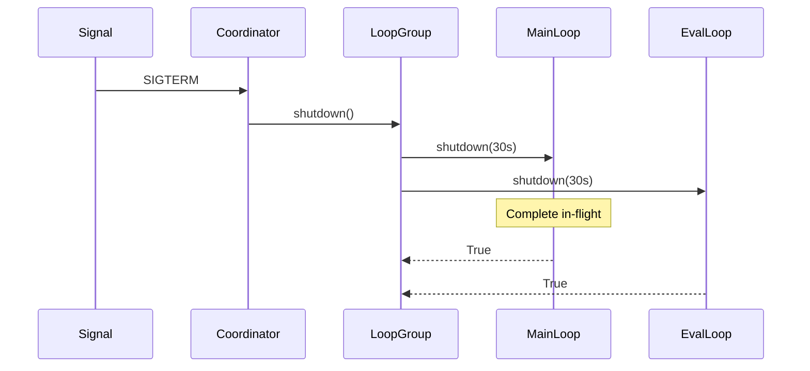

# Lifecycle Specification

Graceful shutdown coordination for `MainLoop` and `EvalLoop` instances.

**Source:** `src/weakincentives/runtime/lifecycle.py`

## Principles

- **Cooperative**: Loops poll shutdown flag; in-flight requests complete
- **Signal-driven**: SIGTERM/SIGINT trigger shutdown (Kubernetes, Docker, systemd)
- **Composable**: `LoopGroup` coordinates multiple loops; standalone also works
- **Timeout-bounded**: Shutdown waits for in-flight work up to configurable limit

## Core Abstractions

### Runnable Protocol

**Definition:** `runtime/lifecycle.py:Runnable`

| Method | Purpose |
|--------|---------|
| `run(...)` | Process until stopped |
| `shutdown(timeout)` | Request graceful shutdown, return success |
| `running` | True if currently processing |

Context manager triggers shutdown on exit.

### ShutdownCoordinator

**Definition:** `runtime/lifecycle.py:ShutdownCoordinator`

Singleton managing signal handlers. Thread-safe registration.

```python
coordinator = ShutdownCoordinator.install()  # SIGTERM, SIGINT
coordinator.register(loop.shutdown)
loop.run()
```

### LoopGroup

**Definition:** `runtime/lifecycle.py:LoopGroup`

```python
group = LoopGroup(
    loops=[main_loop, eval_loop],
    shutdown_timeout=30.0,
)
group.run()  # Blocks until signal
```

Each loop runs in dedicated thread. Shutdown invokes all loops in parallel.

## Execution Flow



## Message Recovery

| Scenario | Outcome |
|----------|---------|
| In-flight when shutdown | Completes, acknowledged |
| Received, not started | Nacked, redelivered |
| Never received | Picked up by other worker |
| Visibility expired | Requeued by reaper |

## Configuration

| Parameter | Default | Purpose |
|-----------|---------|---------|
| `shutdown_timeout` | 30s | Wait for in-flight work |
| `visibility_timeout` | 300s | Mailbox invisibility |
| `wait_time_seconds` | 20s | Long poll duration |

`visibility_timeout` > `shutdown_timeout` + max processing time.

## Thread Safety

- `ShutdownCoordinator._callbacks` protected by lock
- `_triggered` is `threading.Event`
- `LoopGroup` uses `ThreadPoolExecutor`
- Loop `shutdown()` callable from any thread

## Limitations

- Single process only (multi-process needs external coordination)
- No mid-message cancellation (use deadlines)
- Python GIL limits thread parallelism
- Signal handlers have restrictions (minimal work)
