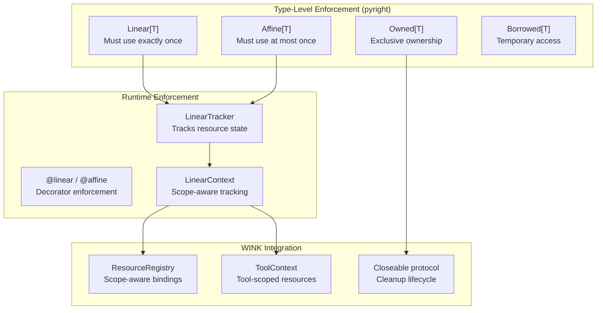

# Linear and Affine Types Specification

## Purpose

This specification defines `weakincentives.linearity`, a module providing
linear and affine type enforcement for resource management. Linear types
guarantee resources are used **exactly once**; affine types guarantee
resources are used **at most once**. These guarantees prevent:

- **Resource leaks**: Forgetting to close file handles, connections, or locks
- **Use-after-free**: Accessing resources after they've been released
- **Double-free**: Releasing resources multiple times
- **Scope escape**: Resources outliving their intended lifetime

For long-running agents that execute thousands of tool calls, resource
discipline is critical—a leaked database connection eventually exhausts the
pool; a use-after-free on a transaction handle corrupts data.

## Guiding Principles

- **Type-level enforcement where possible**: Leverage pyright's strict mode
  and Python's type system to catch violations at static analysis time.
- **Runtime enforcement as safety net**: Provide runtime checks for patterns
  the type checker cannot verify (dynamic dispatch, reflection, complex
  control flow).
- **Zero-cost when disabled**: Like DbC, enforcement is optional in production;
  the decorators and wrappers are no-ops unless explicitly enabled.
- **Composable with existing patterns**: Integrate with `ResourceRegistry`,
  `ToolContext`, scope lifecycles, and the prompt resource model.
- **Clear diagnostics**: Violations report the resource type, creation site,
  and the specific rule broken (unused, double-use, escaped scope).



## Background: Linear Type Theory

### Linear Types (Must Use Exactly Once)

A linear value must be:
1. **Consumed exactly once** - neither duplicated nor discarded
2. **Not aliased** - only one reference exists at any time

Linear types model resources with mandatory cleanup: file handles, database
connections, locks, and transactions. Forgetting to use them is an error;
using them twice is also an error.

### Affine Types (Must Use At Most Once)

An affine value may be:
1. **Consumed at most once** - can be discarded without use
2. **Not aliased** - only one reference exists

Affine types model resources that are safe to abandon but dangerous to reuse:
one-shot tokens, nonces, or resources with implicit cleanup (GC-managed
handles). Using them twice is an error, but letting them drop is permitted.

### Relevance to Python

Python lacks native linear types, but we can approximate them:

| Mechanism | Enforcement Level | Coverage |
|-----------|-------------------|----------|
| Generic type wrappers (`Linear[T]`) | Static (pyright) | Structural violations |
| Decorator checks (`@linear`) | Runtime | Dynamic dispatch, complex flow |
| Context managers | Runtime | Scope boundaries |
| Ownership protocols | Static + Runtime | Transfer semantics |

## Module Structure

```
weakincentives/linearity/
├── __init__.py         # Public API exports
├── types.py            # Linear[T], Affine[T], Owned[T], Borrowed[T]
├── decorators.py       # @linear, @affine, @consumes, @borrows
├── tracker.py          # LinearTracker runtime state machine
├── context.py          # LinearContext for scope tracking
├── protocols.py        # Consumable, Droppable protocols
├── errors.py           # Error hierarchy
└── integration.py      # ResourceRegistry and ToolContext bridges
```

## Core Types

### `Linear[T]`

A wrapper indicating the contained value must be consumed exactly once:

```python
from typing import Generic, TypeVar, final

T = TypeVar("T")

@final
class Linear(Generic[T]):
    """A value that must be consumed exactly once.

    Linear values cannot be:
    - Duplicated (no aliasing)
    - Discarded (must be explicitly consumed)
    - Used after consumption

    Type Parameters:
        T: The wrapped resource type
    """

    __slots__ = ("_value", "_consumed", "_creation_site")

    def __init__(self, value: T) -> None:
        self._value = value
        self._consumed = False
        self._creation_site = _capture_site()

    def consume(self) -> T:
        """Consume the linear value, returning the inner resource.

        Returns:
            The wrapped value.

        Raises:
            LinearityError: If already consumed.
        """
        if self._consumed:
            raise AlreadyConsumedError(self._creation_site)
        self._consumed = True
        return self._value

    def __del__(self) -> None:
        if not self._consumed and linearity_active():
            raise UnconsumedLinearError(self._creation_site)
```

### `Affine[T]`

A wrapper indicating the contained value may be consumed at most once:

```python
@final
class Affine(Generic[T]):
    """A value that may be consumed at most once.

    Affine values cannot be:
    - Duplicated (no aliasing)
    - Used after consumption

    Unlike Linear, affine values MAY be discarded without consumption.

    Type Parameters:
        T: The wrapped resource type
    """

    __slots__ = ("_value", "_consumed", "_creation_site")

    def __init__(self, value: T) -> None:
        self._value = value
        self._consumed = False
        self._creation_site = _capture_site()

    def consume(self) -> T:
        """Consume the affine value, returning the inner resource.

        Returns:
            The wrapped value.

        Raises:
            LinearityError: If already consumed.
        """
        if self._consumed:
            raise AlreadyConsumedError(self._creation_site)
        self._consumed = True
        return self._value

    def try_consume(self) -> T | None:
        """Attempt to consume; return None if already consumed."""
        if self._consumed:
            return None
        self._consumed = True
        return self._value

    def drop(self) -> None:
        """Explicitly discard without consuming.

        This is a no-op if already consumed. Use this to document
        intentional abandonment of an affine resource.
        """
        self._consumed = True
```

### `Owned[T]`

Marks exclusive ownership of a resource:

```python
@final
class Owned(Generic[T]):
    """Exclusive ownership of a resource.

    The owner is responsible for the resource lifecycle. Ownership
    can be transferred (moved) but not shared. Dropping an owned
    resource without transfer or explicit release is an error.

    Type Parameters:
        T: The owned resource type (should implement Closeable)
    """

    __slots__ = ("_value", "_transferred", "_creation_site")

    def __init__(self, value: T) -> None:
        self._value = value
        self._transferred = False
        self._creation_site = _capture_site()

    def transfer(self) -> "Owned[T]":
        """Transfer ownership, invalidating this handle.

        Returns:
            A new Owned wrapper with the resource.

        Raises:
            OwnershipError: If already transferred.
        """
        if self._transferred:
            raise AlreadyTransferredError(self._creation_site)
        self._transferred = True
        return Owned(self._value)

    def borrow(self) -> "Borrowed[T]":
        """Borrow the resource temporarily without transferring ownership.

        Returns:
            A Borrowed wrapper providing read access.

        Raises:
            OwnershipError: If already transferred.
        """
        if self._transferred:
            raise AlreadyTransferredError(self._creation_site)
        return Borrowed(self._value, owner=self)

    def release(self) -> T:
        """Release ownership, returning the raw resource.

        The caller takes responsibility for cleanup.

        Returns:
            The unwrapped resource.

        Raises:
            OwnershipError: If already transferred.
        """
        if self._transferred:
            raise AlreadyTransferredError(self._creation_site)
        self._transferred = True
        return self._value

    def __del__(self) -> None:
        if not self._transferred and linearity_active():
            raise UnreleasedOwnershipError(self._creation_site)
```

### `Borrowed[T]`

Temporary, non-owning access to a resource:

```python
@final
class Borrowed(Generic[T]):
    """Temporary access to a resource without ownership.

    Borrowed values:
    - Cannot outlive the owner (enforced via owner reference)
    - Cannot be transferred or consumed
    - Provide read-only access to the underlying value

    Type Parameters:
        T: The borrowed resource type
    """

    __slots__ = ("_value", "_owner", "_valid")

    def __init__(self, value: T, *, owner: Owned[T]) -> None:
        self._value = value
        self._owner = owner
        self._valid = True

    def get(self) -> T:
        """Access the borrowed value.

        Returns:
            The borrowed resource.

        Raises:
            BorrowError: If the owner has been transferred/released.
        """
        if self._owner._transferred:
            raise InvalidBorrowError("Owner has been transferred")
        return self._value

    def invalidate(self) -> None:
        """Mark this borrow as invalid (called when owner transfers)."""
        self._valid = False
```

## Decorators

### `@linear`

Marks a function that consumes linear arguments:

```python
from functools import wraps

def linear(*param_names: str):
    """Decorator marking parameters that must be linear values.

    The decorated function consumes the specified parameters. After
    the call, those arguments are considered consumed and cannot be
    reused by the caller.

    Args:
        *param_names: Names of parameters that are consumed.

    Example:
        @linear("handle")
        def close_file(handle: Linear[FileHandle]) -> None:
            h = handle.consume()
            h.close()
    """
    def decorator(fn: Callable[P, R]) -> Callable[P, R]:
        if not linearity_active():
            return fn

        @wraps(fn)
        def wrapper(*args: P.args, **kwargs: P.kwargs) -> R:
            # Validate linear parameters are unconsumed
            bound = inspect.signature(fn).bind(*args, **kwargs)
            for name in param_names:
                if name in bound.arguments:
                    val = bound.arguments[name]
                    if isinstance(val, (Linear, Affine)) and val._consumed:
                        raise AlreadyConsumedError(val._creation_site)
            return fn(*args, **kwargs)
        return wrapper
    return decorator
```

### `@affine`

Marks a function that may consume affine arguments:

```python
def affine(*param_names: str):
    """Decorator marking parameters that may be consumed at most once.

    Unlike @linear, affine parameters may be passed unconsumed—the
    decorator only verifies they haven't been consumed previously.

    Args:
        *param_names: Names of parameters with affine semantics.
    """
    def decorator(fn: Callable[P, R]) -> Callable[P, R]:
        if not linearity_active():
            return fn

        @wraps(fn)
        def wrapper(*args: P.args, **kwargs: P.kwargs) -> R:
            bound = inspect.signature(fn).bind(*args, **kwargs)
            for name in param_names:
                if name in bound.arguments:
                    val = bound.arguments[name]
                    if isinstance(val, (Linear, Affine)) and val._consumed:
                        raise AlreadyConsumedError(val._creation_site)
            return fn(*args, **kwargs)
        return wrapper
    return decorator
```

### `@consumes`

Documents that a function takes ownership of a parameter:

```python
def consumes(*param_names: str):
    """Decorator documenting ownership transfer to the function.

    The specified parameters are consumed by the function. Callers
    must pass Owned[T] values and cannot use them after the call.

    This is primarily for documentation and static analysis hints.
    Runtime enforcement uses the Owned wrapper's state.

    Args:
        *param_names: Names of parameters whose ownership transfers.
    """
    def decorator(fn: Callable[P, R]) -> Callable[P, R]:
        fn.__consumes__ = param_names
        return fn
    return decorator
```

### `@borrows`

Documents that a function borrows a parameter:

```python
def borrows(*param_names: str):
    """Decorator documenting temporary borrowing of parameters.

    The specified parameters are borrowed, not consumed. The caller
    retains ownership and the values remain valid after the call.

    Args:
        *param_names: Names of borrowed parameters.
    """
    def decorator(fn: Callable[P, R]) -> Callable[P, R]:
        fn.__borrows__ = param_names
        return fn
    return decorator
```

## Runtime Tracking

### `LinearTracker`

State machine tracking resource lifecycle:

```python
from enum import Enum, auto
from dataclasses import dataclass, field
from typing import Any
from uuid import UUID, uuid4
from datetime import datetime

class ResourceState(Enum):
    """Lifecycle state of a tracked resource."""
    ACTIVE = auto()      # Resource is live and usable
    CONSUMED = auto()    # Resource has been consumed (linear/affine)
    TRANSFERRED = auto() # Ownership has been transferred
    DROPPED = auto()     # Resource was explicitly dropped (affine only)
    CLOSED = auto()      # Resource was closed via Closeable


@dataclass(slots=True)
class TrackedResource:
    """Metadata for a tracked resource."""
    id: UUID = field(default_factory=uuid4)
    resource_type: type = field(default=object)
    state: ResourceState = ResourceState.ACTIVE
    created_at: datetime = field(default_factory=datetime.now)
    creation_site: str = ""
    consumption_site: str | None = None
    scope_id: UUID | None = None


class LinearTracker:
    """Tracks resource lifecycle at runtime.

    The tracker maintains a registry of active resources and their
    states. It detects violations like double-consumption, use-after-
    free, and unconsumed linear resources at scope exit.
    """

    __slots__ = ("_resources", "_scope_stack", "_lock")

    def __init__(self) -> None:
        self._resources: dict[int, TrackedResource] = {}
        self._scope_stack: list[UUID] = []
        self._lock = threading.Lock()

    def track(self, resource: Any, *, linear: bool = True) -> TrackedResource:
        """Begin tracking a resource.

        Args:
            resource: The resource to track.
            linear: If True, resource must be consumed; if False, affine.

        Returns:
            Tracking metadata for the resource.
        """
        with self._lock:
            resource_id = id(resource)
            tracked = TrackedResource(
                resource_type=type(resource),
                creation_site=_capture_site(),
                scope_id=self._scope_stack[-1] if self._scope_stack else None,
            )
            self._resources[resource_id] = tracked
            return tracked

    def consume(self, resource: Any) -> None:
        """Mark a resource as consumed.

        Raises:
            AlreadyConsumedError: If resource was already consumed.
            UntrackedResourceError: If resource was never tracked.
        """
        with self._lock:
            resource_id = id(resource)
            if resource_id not in self._resources:
                raise UntrackedResourceError(type(resource))

            tracked = self._resources[resource_id]
            if tracked.state != ResourceState.ACTIVE:
                raise AlreadyConsumedError(
                    tracked.creation_site,
                    previous_site=tracked.consumption_site,
                )

            tracked.state = ResourceState.CONSUMED
            tracked.consumption_site = _capture_site()

    def enter_scope(self) -> UUID:
        """Enter a new tracking scope.

        Returns:
            Scope identifier for exit validation.
        """
        scope_id = uuid4()
        with self._lock:
            self._scope_stack.append(scope_id)
        return scope_id

    def exit_scope(self, scope_id: UUID, *, require_consumed: bool = True) -> None:
        """Exit a tracking scope, validating resource states.

        Args:
            scope_id: The scope identifier from enter_scope().
            require_consumed: If True, unconsumed linear resources raise.

        Raises:
            UnconsumedLinearError: If linear resources remain unconsumed.
            ScopeMismatchError: If scope_id doesn't match current scope.
        """
        with self._lock:
            if not self._scope_stack or self._scope_stack[-1] != scope_id:
                raise ScopeMismatchError(scope_id)

            self._scope_stack.pop()

            if require_consumed:
                unconsumed = [
                    tracked for tracked in self._resources.values()
                    if tracked.scope_id == scope_id
                    and tracked.state == ResourceState.ACTIVE
                ]
                if unconsumed:
                    raise UnconsumedLinearError(
                        resources=[(t.resource_type, t.creation_site) for t in unconsumed]
                    )

            # Clean up scope resources
            self._resources = {
                k: v for k, v in self._resources.items()
                if v.scope_id != scope_id
            }
```

### `LinearContext`

Context manager for scoped linearity enforcement:

```python
from contextlib import contextmanager

@contextmanager
def linear_scope(
    tracker: LinearTracker | None = None,
    *,
    require_consumed: bool = True,
) -> Iterator[LinearTracker]:
    """Context manager for a linearity enforcement scope.

    Resources tracked within this scope must be consumed (if linear)
    before the scope exits. This integrates with tool_scope() to
    enforce that TOOL_CALL resources don't leak.

    Args:
        tracker: Existing tracker to use; creates new if None.
        require_consumed: Whether unconsumed linear resources raise.

    Yields:
        The LinearTracker for this scope.

    Raises:
        UnconsumedLinearError: If require_consumed and resources remain.

    Example:
        with linear_scope() as tracker:
            handle = Linear(open_connection())
            tracker.track(handle)
            # ... use handle ...
            handle.consume()  # Must consume before scope exit
    """
    tracker = tracker or LinearTracker()
    scope_id = tracker.enter_scope()
    try:
        yield tracker
    finally:
        tracker.exit_scope(scope_id, require_consumed=require_consumed)
```

## Protocols

### `Consumable`

Protocol for types that can be consumed:

```python
from typing import Protocol, runtime_checkable

@runtime_checkable
class Consumable(Protocol[T]):
    """Protocol for values that can be consumed."""

    def consume(self) -> T:
        """Consume the value, returning the inner resource.

        After consumption, subsequent consume() calls must raise.
        """
        ...

    @property
    def is_consumed(self) -> bool:
        """Whether the value has been consumed."""
        ...
```

### `Droppable`

Protocol for types that can be safely dropped:

```python
@runtime_checkable
class Droppable(Protocol):
    """Protocol for values that can be explicitly dropped.

    Droppable values (affine types) may be abandoned without
    consumption. The drop() method documents intentional abandonment.
    """

    def drop(self) -> None:
        """Explicitly drop the value without consuming it."""
        ...
```

### `Transferable`

Protocol for types with transferable ownership:

```python
@runtime_checkable
class Transferable(Protocol[T]):
    """Protocol for values with transferable ownership."""

    def transfer(self) -> "Transferable[T]":
        """Transfer ownership to a new wrapper.

        The original becomes invalid after transfer.
        """
        ...

    def release(self) -> T:
        """Release ownership, returning the raw value.

        The caller takes responsibility for cleanup.
        """
        ...

    @property
    def is_transferred(self) -> bool:
        """Whether ownership has been transferred."""
        ...
```

## Error Hierarchy

```python
class LinearityError(WinkError, RuntimeError):
    """Base class for linearity violations."""


class AlreadyConsumedError(LinearityError):
    """Resource was already consumed."""

    def __init__(
        self,
        creation_site: str,
        previous_site: str | None = None,
    ) -> None:
        self.creation_site = creation_site
        self.previous_site = previous_site
        msg = f"Resource created at {creation_site} was already consumed"
        if previous_site:
            msg += f" at {previous_site}"
        super().__init__(msg)


class UnconsumedLinearError(LinearityError):
    """Linear resource was not consumed before scope exit."""

    def __init__(
        self,
        resources: Sequence[tuple[type, str]],
    ) -> None:
        self.resources = resources
        lines = [f"  - {typ.__name__} created at {site}" for typ, site in resources]
        msg = "Unconsumed linear resources:\n" + "\n".join(lines)
        super().__init__(msg)


class OwnershipError(LinearityError):
    """Base class for ownership violations."""


class AlreadyTransferredError(OwnershipError):
    """Ownership was already transferred."""

    def __init__(self, creation_site: str) -> None:
        self.creation_site = creation_site
        super().__init__(f"Ownership transferred; resource created at {creation_site}")


class UnreleasedOwnershipError(OwnershipError):
    """Owned resource was dropped without release or transfer."""

    def __init__(self, creation_site: str) -> None:
        self.creation_site = creation_site
        super().__init__(f"Owned resource not released; created at {creation_site}")


class InvalidBorrowError(LinearityError):
    """Borrow is invalid because owner was transferred."""

    def __init__(self, reason: str) -> None:
        super().__init__(f"Invalid borrow: {reason}")


class UntrackedResourceError(LinearityError):
    """Operation on resource that was never tracked."""

    def __init__(self, resource_type: type) -> None:
        self.resource_type = resource_type
        super().__init__(f"Resource of type {resource_type.__name__} was never tracked")


class ScopeMismatchError(LinearityError):
    """Scope exit called with wrong scope ID."""

    def __init__(self, scope_id: UUID) -> None:
        self.scope_id = scope_id
        super().__init__(f"Scope mismatch: {scope_id}")
```

## Integration with Resource Registry

### Scope-Aware Linear Types

Map resource scopes to linearity semantics:

| Scope | Linearity | Rationale |
|-------|-----------|-----------|
| `SINGLETON` | Non-linear (shared) | Cached for context lifetime; cleanup automatic |
| `TOOL_CALL` | Affine | Fresh per tool; must not escape tool scope |
| `PROTOTYPE` | Linear | Fresh per access; caller responsible for cleanup |

### Enhanced Bindings

Extend `Binding` with linearity metadata:

```python
@dataclass(slots=True, frozen=True)
class Binding[T]:
    """Describes how to construct a resource and its lifetime."""

    protocol: type[T]
    provider: Provider[T]
    scope: Scope = Scope.SINGLETON
    eager: bool = False
    linearity: Literal["linear", "affine", "shared"] = "shared"
    """Linearity constraint for this resource.

    - "shared": No linearity enforcement (default for SINGLETON)
    - "affine": Must not be used after scope exit (default for TOOL_CALL)
    - "linear": Must be explicitly consumed (default for PROTOTYPE)
    """
```

### Integration with `ScopedResourceContext`

```python
class ScopedResourceContext:
    """Scoped resolution context with linearity tracking."""

    def __init__(
        self,
        registry: ResourceRegistry,
        *,
        singleton_cache: dict[type[object], object] | None = None,
        linearity_tracker: LinearTracker | None = None,
    ) -> None:
        self.registry = registry
        self.singleton_cache = singleton_cache or {}
        self._linearity_tracker = linearity_tracker or LinearTracker()
        # ...

    def get_linear[T](self, protocol: type[T]) -> Linear[T]:
        """Get a resource wrapped in Linear[T].

        The caller must consume the returned value. This is enforced
        by the Linear wrapper and tracked by the linearity tracker.

        Returns:
            Linear wrapper containing the resource.

        Raises:
            UnboundResourceError: No binding exists.
        """
        resource = self.get(protocol)
        linear = Linear(resource)
        self._linearity_tracker.track(linear, linear=True)
        return linear

    def get_affine[T](self, protocol: type[T]) -> Affine[T]:
        """Get a resource wrapped in Affine[T].

        The caller may consume the returned value at most once.
        Discarding without consumption is permitted.

        Returns:
            Affine wrapper containing the resource.
        """
        resource = self.get(protocol)
        affine = Affine(resource)
        self._linearity_tracker.track(affine, linear=False)
        return affine

    def get_owned[T](self, protocol: type[T]) -> Owned[T]:
        """Get a resource with exclusive ownership.

        The caller owns the resource and must either transfer
        ownership or explicitly release it.

        Returns:
            Owned wrapper containing the resource.
        """
        resource = self.get(protocol)
        return Owned(resource)

    @contextmanager
    def tool_scope(self) -> Iterator[ResourceResolver]:
        """Enter a tool-call scope with linearity enforcement.

        TOOL_CALL resources obtained within this scope are tracked
        as affine values. They must not be used after the scope exits.
        """
        scope_id = self._linearity_tracker.enter_scope()
        try:
            yield _ToolScopeResolver(self, scope_id)
        finally:
            # Affine resources may be unconsumed; linear must be consumed
            self._linearity_tracker.exit_scope(scope_id, require_consumed=False)
            self._cleanup_tool_call_cache()
```

## Integration with ToolContext

### Linear Resources in Tool Handlers

```python
def my_handler(params: MyParams, *, context: ToolContext) -> ToolResult[Output]:
    """Tool handler demonstrating linear resource usage."""

    # Affine: safe to use within tool, cannot escape
    db = context.resources.get_affine(DatabaseConnection)
    conn = db.consume()  # Take ownership for this tool call

    try:
        result = conn.execute(params.query)
        return ToolResult.ok(Output(data=result))
    finally:
        conn.close()  # Explicit cleanup (or rely on tool_scope exit)


def streaming_handler(params: StreamParams, *, context: ToolContext) -> ToolResult[Output]:
    """Tool handler with linear (must-consume) resource."""

    # Linear: MUST be consumed before returning
    stream = context.resources.get_linear(StreamHandle)
    handle = stream.consume()  # Must consume

    data = []
    for chunk in handle:
        data.append(chunk)
    handle.close()  # Explicit close after consumption

    return ToolResult.ok(Output(data=data))
```

### Preventing Scope Escape

Type-level enforcement prevents TOOL_CALL resources from escaping:

```python
# Type signature documents the constraint
def get_tool_scoped[T](protocol: type[T]) -> Affine[T]:
    """Get a TOOL_CALL resource as an affine value.

    The returned Affine[T] wrapper statically prevents storing
    the resource in structures that outlive the tool scope.
    """
    ...

# Pyright catches this violation:
class BadHandler:
    cached_connection: DatabaseConnection  # Stored on class

    def handle(self, params: Params, *, context: ToolContext) -> ToolResult:
        affine = context.resources.get_tool_scoped(DatabaseConnection)
        self.cached_connection = affine.consume()  # Type error: Affine cannot escape
        # ...
```

## Patterns and Best Practices

### Pattern: Resource Transfer

Transfer ownership between components:

```python
def create_transaction(db: Owned[DatabaseConnection]) -> Owned[Transaction]:
    """Create a transaction, taking ownership of the connection.

    Args:
        db: Owned connection (ownership transfers to transaction).

    Returns:
        Owned transaction wrapper.
    """
    conn = db.release()  # Take ownership from caller
    txn = conn.begin_transaction()
    return Owned(txn)


# Usage:
owned_conn = context.resources.get_owned(DatabaseConnection)
owned_txn = create_transaction(owned_conn)
# owned_conn is now invalid; owned_txn has ownership
```

### Pattern: Borrow for Read-Only Access

Borrow without transferring ownership:

```python
def read_config(config: Borrowed[Config]) -> dict[str, str]:
    """Read configuration without taking ownership.

    Args:
        config: Borrowed config reference.

    Returns:
        Configuration dictionary.
    """
    cfg = config.get()  # Safe read access
    return dict(cfg.items())


# Usage:
owned_config = context.resources.get_owned(Config)
borrowed = owned_config.borrow()
data = read_config(borrowed)
# owned_config still valid; we only borrowed
```

### Pattern: Linear File Handles

Ensure file handles are properly closed:

```python
@linear("handle")
def process_file(handle: Linear[FileHandle], processor: Processor) -> Output:
    """Process a file, consuming the handle.

    Args:
        handle: Linear file handle (consumed by this function).
        processor: Processing strategy.

    Returns:
        Processed output.
    """
    fh = handle.consume()
    try:
        data = fh.read()
        return processor.process(data)
    finally:
        fh.close()  # Always close, even on error


# Usage:
handle = Linear(open_file(path))
output = process_file(handle, MyProcessor())
# handle is consumed; cannot be reused
```

### Pattern: Affine One-Shot Tokens

Tokens that can only be used once:

```python
@dataclass(frozen=True)
class AuthToken:
    """One-shot authentication token."""
    value: str
    nonce: bytes


def authenticate(token: Affine[AuthToken]) -> Session:
    """Authenticate using a one-shot token.

    Args:
        token: Affine token (may be consumed at most once).

    Returns:
        Authenticated session.

    Raises:
        AuthError: If token is invalid.
    """
    t = token.consume()  # Consume the token
    return auth_service.validate_and_create_session(t)


# Usage:
token = Affine(AuthToken(value="...", nonce=os.urandom(16)))
session = authenticate(token)
# token consumed; cannot be reused (replay attack prevention)
```

### Pattern: Conditional Consumption

Handle resources that may or may not be consumed:

```python
def maybe_use_cache(cache: Affine[CacheEntry]) -> Result | None:
    """Optionally consume cache entry if valid.

    Args:
        cache: Affine cache entry.

    Returns:
        Cached result if valid, None otherwise.
    """
    entry = cache.try_consume()  # Safe: returns None if already consumed
    if entry is None or entry.expired:
        return None
    return entry.value


# Usage:
cache = Affine(lookup_cache(key))
result = maybe_use_cache(cache)
if result is None:
    cache.drop()  # Explicitly document we're abandoning the cache
    result = compute_fresh()
```

## Runtime Behavior

### Enforcement Toggle

Like DbC, linearity enforcement is disabled by default:

```python
import threading
from contextlib import contextmanager

_linearity_enabled = threading.local()


def linearity_active() -> bool:
    """Check if linearity enforcement is active."""
    return getattr(_linearity_enabled, "value", False)


def enable_linearity() -> None:
    """Enable linearity enforcement (call from test setup)."""
    _linearity_enabled.value = True


def disable_linearity() -> None:
    """Disable linearity enforcement."""
    _linearity_enabled.value = False


@contextmanager
def linearity_enabled() -> Iterator[None]:
    """Context manager enabling linearity for a scope."""
    previous = linearity_active()
    enable_linearity()
    try:
        yield
    finally:
        _linearity_enabled.value = previous
```

### Environment Variable

```bash
# Enable globally (e.g., in CI)
export WEAKINCENTIVES_LINEARITY=1

# Or per-test via pytest plugin
pytest --enable-linearity
```

### Pytest Plugin

```python
# tests/plugins/linearity.py
def pytest_configure(config: pytest.Config) -> None:
    if config.option.enable_linearity or os.environ.get("WEAKINCENTIVES_LINEARITY"):
        enable_linearity()


def pytest_unconfigure(config: pytest.Config) -> None:
    disable_linearity()


def pytest_addoption(parser: pytest.Parser) -> None:
    parser.addoption(
        "--enable-linearity",
        action="store_true",
        help="Enable linearity enforcement",
    )
```

## Type Checker Support

### Pyright Configuration

Add linearity-aware type stubs:

```python
# stubs/weakincentives/linearity.pyi

from typing import Generic, TypeVar, final, overload

T = TypeVar("T")
T_co = TypeVar("T_co", covariant=True)

@final
class Linear(Generic[T]):
    def __init__(self, value: T) -> None: ...
    def consume(self) -> T: ...
    # Note: No __iter__, __getitem__, or other access methods
    # This prevents accidental use without consumption

@final
class Affine(Generic[T]):
    def __init__(self, value: T) -> None: ...
    def consume(self) -> T: ...
    def try_consume(self) -> T | None: ...
    def drop(self) -> None: ...

@final
class Owned(Generic[T]):
    def __init__(self, value: T) -> None: ...
    def transfer(self) -> Owned[T]: ...
    def borrow(self) -> Borrowed[T]: ...
    def release(self) -> T: ...

@final
class Borrowed(Generic[T_co]):
    def get(self) -> T_co: ...
```

### Static Analysis Benefits

Pyright catches several classes of linearity violations:

```python
# ❌ Type error: Linear[T] has no attribute 'read'
def bad_direct_access(handle: Linear[FileHandle]) -> str:
    return handle.read()  # Must call .consume() first

# ❌ Type error: Cannot use consumed linear value
def bad_double_use(handle: Linear[FileHandle]) -> tuple[str, str]:
    h1 = handle.consume()
    h2 = handle.consume()  # Error: already consumed
    return (h1.read(), h2.read())

# ❌ Type error: Owned[T] cannot be assigned to T
def bad_ownership_loss(conn: Owned[Connection]) -> None:
    raw: Connection = conn  # Must use .release() or .transfer()

# ✓ Correct usage
def good_linear(handle: Linear[FileHandle]) -> str:
    fh = handle.consume()
    try:
        return fh.read()
    finally:
        fh.close()
```

## Acceptance Criteria

### Linear Consumption

```python
def test_linear_must_be_consumed():
    """Linear values must be consumed exactly once."""
    with linearity_enabled():
        resource = Linear(MockResource())

        # Consumption succeeds
        inner = resource.consume()
        assert inner is not None

        # Double consumption raises
        with pytest.raises(AlreadyConsumedError):
            resource.consume()


def test_linear_unconsumed_raises_at_scope_exit():
    """Unconsumed linear values raise at scope exit."""
    with linearity_enabled():
        with pytest.raises(UnconsumedLinearError):
            with linear_scope():
                Linear(MockResource())  # Never consumed
```

### Affine Semantics

```python
def test_affine_may_be_dropped():
    """Affine values may be dropped without consumption."""
    with linearity_enabled():
        with linear_scope(require_consumed=False):
            resource = Affine(MockResource())
            resource.drop()  # Explicit drop is fine
            # Implicit drop at scope exit is also fine


def test_affine_cannot_be_double_consumed():
    """Affine values cannot be consumed twice."""
    with linearity_enabled():
        resource = Affine(MockResource())
        _ = resource.consume()

        with pytest.raises(AlreadyConsumedError):
            resource.consume()
```

### Ownership Transfer

```python
def test_ownership_transfer():
    """Ownership can be transferred exactly once."""
    with linearity_enabled():
        original = Owned(MockResource())
        transferred = original.transfer()

        # Original is now invalid
        with pytest.raises(AlreadyTransferredError):
            original.transfer()

        with pytest.raises(AlreadyTransferredError):
            original.release()

        # Transferred is valid
        inner = transferred.release()
        assert inner is not None


def test_borrow_invalidates_on_transfer():
    """Borrows become invalid when owner transfers."""
    with linearity_enabled():
        owner = Owned(MockResource())
        borrowed = owner.borrow()

        # Borrow works while owner valid
        _ = borrowed.get()

        # Transfer invalidates borrows
        _ = owner.transfer()

        with pytest.raises(InvalidBorrowError):
            borrowed.get()
```

### Scope Integration

```python
def test_tool_scope_tracks_affine_resources():
    """Tool scope tracks TOOL_CALL resources as affine."""
    with linearity_enabled():
        registry = ResourceRegistry.of(
            Binding(Tracer, lambda r: Tracer(), scope=Scope.TOOL_CALL),
        )

        with registry.open() as ctx:
            with ctx.tool_scope() as resolver:
                tracer = resolver.get_affine(Tracer)
                _ = tracer.consume()  # Must consume within scope
            # Scope exit validates affine resources


def test_prototype_resources_are_linear():
    """PROTOTYPE scope resources default to linear semantics."""
    with linearity_enabled():
        registry = ResourceRegistry.of(
            Binding(Buffer, lambda r: Buffer(), scope=Scope.PROTOTYPE),
        )

        with registry.open() as ctx:
            with pytest.raises(UnconsumedLinearError):
                with linear_scope():
                    buffer = ctx.get_linear(Buffer)
                    # Never consumed
```

## Limitations

- **Python GC**: Python's garbage collector may not call `__del__` promptly;
  unconsumed linear values may not raise until much later. Use explicit
  `linear_scope()` for deterministic enforcement.
- **No compile-time guarantees**: Unlike Rust or Linear Haskell, Python
  cannot prevent aliasing at compile time. The type wrappers and decorators
  provide best-effort static analysis and runtime checks.
- **Reflection and dynamic access**: Code using `getattr()`, `vars()`, or
  other reflection may bypass linearity wrappers. The tracker catches some
  cases but cannot be exhaustive.
- **Async not supported**: The current design is synchronous only. Async
  resource tracking requires additional coordination.
- **Performance overhead**: Runtime tracking adds overhead. Keep it disabled
  in production; use it for testing and development.

## Future Considerations

The following are explicitly out of scope but may be added later:

- **Async linear types**: `AsyncLinear[T]` with async context managers and
  `await consume()` semantics.
- **Formal verification**: TLA+ specification of linearity invariants for
  model checking resource protocols.
- **IDE integration**: Custom pyright plugin for richer linearity diagnostics.
- **Ownership regions**: Region-based ownership for more fine-grained lifetime
  control without full borrow checking.
- **Effect tracking**: Combine linearity with effect systems to track both
  resource usage and side effects.

## See Also

- [specs/RESOURCE_REGISTRY.md](RESOURCE_REGISTRY.md) - Resource scopes and lifecycle
- [specs/DBC.md](DBC.md) - Design-by-contract enforcement model
- [specs/THREAD_SAFETY.md](THREAD_SAFETY.md) - Concurrency considerations
- [specs/TOOLS.md](TOOLS.md) - Tool handler patterns
- [Substructural Type Systems](https://en.wikipedia.org/wiki/Substructural_type_system) - Theory background
