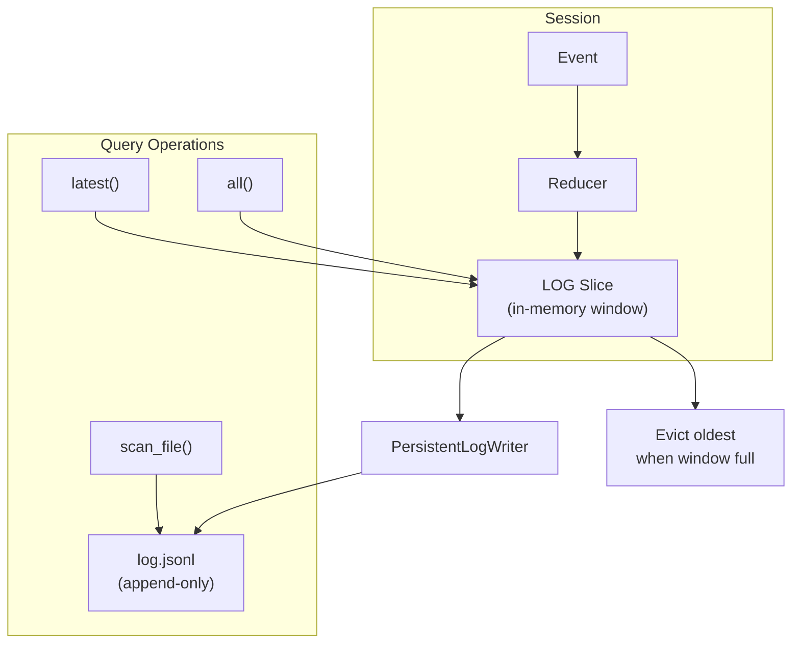

# LOG Slice JSONL Persistence

## Purpose

This specification defines a persistence layer for LOG slices that writes entries
to append-only JSONL files while maintaining a configurable in-memory window.
This enables long-running agents to preserve complete audit trails without
unbounded memory growth.

## Guiding Principles

- **Append-only durability**: Once written to disk, log entries are immutable
  and survive process restarts.
- **Bounded memory**: Only the most recent N entries remain in memory; older
  entries are available through explicit file reads.
- **Transparent integration**: Existing query APIs (`all()`, `latest()`,
  `where()`) continue to work on in-memory entries; disk access requires
  explicit operations.
- **Fail-safe writes**: Write failures are logged and isolated; session
  execution continues with in-memory-only behavior.
- **No implicit side effects**: Persistence must be explicitly configured per
  slice; default behavior remains fully in-memory.



## Configuration

### LogPersistenceConfig

Configuration for persisting a LOG slice to JSONL:

```python
from dataclasses import dataclass
from pathlib import Path

@dataclass(frozen=True, slots=True)
class LogPersistenceConfig:
    """Configuration for LOG slice JSONL persistence.

    Attributes:
        path: Path to the JSONL file. Parent directories are created if needed.
        max_memory_entries: Maximum entries kept in memory. When exceeded,
            oldest entries are evicted after being persisted. Must be >= 1.
        flush_interval: Number of entries to buffer before flushing to disk.
            Defaults to 1 (immediate flush). Higher values improve throughput
            at the cost of durability.
        sync_on_flush: Whether to call fsync after each flush. Defaults to
            False for performance; set True for maximum durability.
    """

    path: Path
    max_memory_entries: int = 1000
    flush_interval: int = 1
    sync_on_flush: bool = False

    def __post_init__(self) -> None:
        if self.max_memory_entries < 1:
            raise ValueError("max_memory_entries must be >= 1")
        if self.flush_interval < 1:
            raise ValueError("flush_interval must be >= 1")
```

### Registering Persistence

Persistence is configured when registering a LOG slice:

```python
from weakincentives.runtime import Session
from weakincentives.runtime.session import SlicePolicy, LogPersistenceConfig

session = Session(bus=bus)

# Configure persistence for ToolInvoked events
config = LogPersistenceConfig(
    path=Path("/var/log/agent/tool_invocations.jsonl"),
    max_memory_entries=500,
)

session.configure_persistence(ToolInvoked, config)
```

The `configure_persistence` method:

```python
def configure_persistence(
    self,
    slice_type: type[T],
    config: LogPersistenceConfig,
) -> None:
    """Configure JSONL persistence for a LOG slice.

    Args:
        slice_type: The dataclass type of the LOG slice.
        config: Persistence configuration.

    Raises:
        ValueError: If slice_type is not registered with SlicePolicy.LOG.
        LogPersistenceError: If the file cannot be opened for writing.
    """
```

## JSONL File Format

### Entry Schema

Each line in the JSONL file is a self-contained JSON object:

```json
{"__type__": "weakincentives.runtime.events:ToolInvoked", "prompt_name": "research", "adapter": "openai", "name": "search", "params": {"query": "test"}, "result": {"success": true}, "session_id": "550e8400-e29b-41d4-a716-446655440000", "created_at": "2025-01-15T10:30:00.123456+00:00", "event_id": "660e8400-e29b-41d4-a716-446655440001", "__seq__": 42, "__ts__": "2025-01-15T10:30:00.123789+00:00"}
```

### Required Metadata Fields

Two fields are added during persistence (not present on the dataclass):

| Field | Type | Description |
|-------|------|-------------|
| `__seq__` | `int` | Monotonically increasing sequence number within the file |
| `__ts__` | `str` | ISO 8601 timestamp when the entry was written to disk |

### Type Identification

The `__type__` field uses the same qualified format as snapshots:
`"package.module:ClassName"`. This enables deserialization without prior
knowledge of which slice types were persisted.

### File Lifecycle

```python
# File created on first write (parent directories created as needed)
# File opened in append mode ("a")
# Each entry written as: json.dumps(entry) + "\n"
# File remains open for session lifetime
# File closed on session.close() or garbage collection
```

## In-Memory Window

### Eviction Semantics

When a new entry would exceed `max_memory_entries`:

1. Persist the oldest entry to JSONL (if not already persisted)
2. Remove the oldest entry from the in-memory tuple
3. Add the new entry to the in-memory tuple

```python
# Invariant: len(session[ToolInvoked].all()) <= config.max_memory_entries
```

### Query Behavior

Standard query operations only access in-memory entries:

```python
# Returns only in-memory entries (up to max_memory_entries)
session[ToolInvoked].all()

# Returns most recent in-memory entry
session[ToolInvoked].latest()

# Filters in-memory entries only
session[ToolInvoked].where(lambda t: t.success)
```

This preserves O(1) access patterns and existing code compatibility.

## Disk Access Operations

### Scanning the Full Log

To access entries beyond the in-memory window:

```python
from weakincentives.runtime.session import scan_log

# Iterate all persisted entries (oldest first)
for entry in scan_log(ToolInvoked, config.path):
    print(entry.name, entry.created_at)

# With type filtering (for files with mixed types)
for entry in scan_log(ToolInvoked, config.path, strict=True):
    ...  # Raises on type mismatch if strict=True
```

### scan_log Signature

```python
def scan_log(
    entry_type: type[T],
    path: Path,
    *,
    strict: bool = False,
    start_seq: int | None = None,
    end_seq: int | None = None,
) -> Iterator[T]:
    """Iterate persisted log entries from a JSONL file.

    Args:
        entry_type: Expected dataclass type for entries.
        path: Path to the JSONL file.
        strict: If True, raise on type mismatch; if False, skip mismatched
            entries silently.
        start_seq: If provided, skip entries with __seq__ < start_seq.
        end_seq: If provided, stop iteration at __seq__ >= end_seq.

    Yields:
        Deserialized dataclass instances (without __seq__ and __ts__).

    Raises:
        FileNotFoundError: If the file does not exist.
        LogParseError: If strict=True and an entry cannot be parsed.
    """
```

### Counting Entries

```python
from weakincentives.runtime.session import count_log_entries

# Count all entries in file
total = count_log_entries(config.path)

# Count entries of specific type
tool_count = count_log_entries(config.path, entry_type=ToolInvoked)
```

## Buffered Writes

### Flush Behavior

When `flush_interval > 1`, entries are buffered before writing:

```python
config = LogPersistenceConfig(
    path=Path("events.jsonl"),
    max_memory_entries=1000,
    flush_interval=10,  # Write every 10 entries
)
```

The buffer is flushed:

1. When `flush_interval` entries accumulate
2. On `session.flush_logs()` (explicit flush)
3. On `session.close()` or context manager exit
4. On `session.snapshot()` (ensures durability before snapshot)

### Durability Trade-offs

| Configuration | Durability | Performance |
|---------------|------------|-------------|
| `flush_interval=1, sync_on_flush=True` | Highest | Lowest |
| `flush_interval=1, sync_on_flush=False` | High | Medium |
| `flush_interval=N, sync_on_flush=False` | Medium | Highest |

For critical audit logs, use `sync_on_flush=True`. For high-throughput
telemetry, use larger `flush_interval` values.

## Snapshot Integration

### Snapshot Metadata

When persistence is configured, snapshots include file references:

```python
snapshot = session.snapshot()
# snapshot.log_files contains:
# {
#     "weakincentives.runtime.events:ToolInvoked": {
#         "path": "/var/log/agent/tool_invocations.jsonl",
#         "last_seq": 1234,
#         "entry_count": 5000,
#     }
# }
```

### Restore Behavior

On `session.restore(snapshot)`:

- In-memory LOG slices are preserved (existing behavior)
- File references are validated but files are not reloaded
- The writer resumes appending with the next sequence number

To reconstruct full state from files:

```python
session.restore(snapshot)
session.reload_logs()  # Reloads max_memory_entries from each configured file
```

## Error Handling

### LogPersistenceError

Base exception for persistence failures:

```python
class LogPersistenceError(WinkError):
    """Base exception for LOG persistence failures."""

class LogWriteError(LogPersistenceError):
    """Failed to write entry to JSONL file."""

class LogParseError(LogPersistenceError):
    """Failed to parse entry from JSONL file."""
```

### Write Failure Semantics

When a write fails:

1. Error is logged with full context
2. Entry remains in memory (not evicted)
3. Session continues operating
4. Subsequent writes are retried

```python
# Write failures do not raise; session continues with degraded durability
logger.exception(
    "Failed to persist log entry",
    event="log_write_failed",
    context={
        "slice_type": "ToolInvoked",
        "path": str(config.path),
        "entry_seq": seq,
    },
)
```

### Recovery

On process restart, the file is opened in append mode. Sequence numbers
continue from `max(__seq__)` found in the existing file (or 0 if empty).

```python
# Automatic recovery on session initialization
session.configure_persistence(ToolInvoked, config)
# Scans file for highest __seq__, resumes from there
```

## Thread Safety

All persistence operations are protected by the session's existing lock:

- Writes are serialized with reducer execution
- Eviction is atomic with append
- Flush operations acquire the lock
- File handles are not shared across threads

See `specs/THREAD_SAFETY.md` for the session locking model.

## Usage Example

```python
from pathlib import Path
from weakincentives.runtime import Session, InProcessEventBus
from weakincentives.runtime.session import LogPersistenceConfig, scan_log
from weakincentives.runtime.events import ToolInvoked

# Setup session with persistence
bus = InProcessEventBus()
session = Session(bus=bus)

config = LogPersistenceConfig(
    path=Path("./logs/tools.jsonl"),
    max_memory_entries=100,
    flush_interval=5,
)
session.configure_persistence(ToolInvoked, config)

# Run agent... events accumulate and persist automatically

# Query recent in-memory events
recent = session[ToolInvoked].all()
print(f"In memory: {len(recent)} events")

# Query full history from disk
all_events = list(scan_log(ToolInvoked, config.path))
print(f"Total persisted: {len(all_events)} events")

# Explicit flush before checkpoint
session.flush_logs()
snapshot = session.snapshot()

# Cleanup
session.close()
```

## Limitations

- **No random access**: Disk entries must be scanned sequentially; use
  `start_seq`/`end_seq` for range queries.
- **No automatic compaction**: JSONL files grow indefinitely; implement
  external rotation if needed.
- **No encryption**: Entries are written as plain JSON; encrypt the filesystem
  for sensitive data.
- **Single-writer assumption**: Only one session should write to a given file
  at a time.
- **Memory-first queries**: Standard query APIs only access in-memory entries;
  full history requires explicit `scan_log()` calls.
- **No cross-session sharing**: Persistence is per-session; sharing files
  across sessions requires external coordination.

## Non-Goals

- **Database integration**: Use external tools to import JSONL into databases.
- **Query optimization**: Complex queries should load data into pandas or
  similar tools.
- **Real-time tailing**: Use standard UNIX tools (`tail -f`) for live
  monitoring.
- **Compression**: Apply external compression (gzip, zstd) to rotated files.
- **Schema migration**: Type changes require manual file reprocessing.
