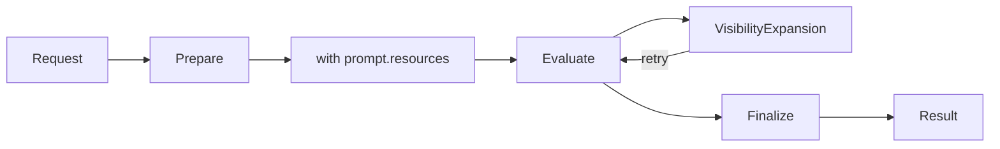

# Main Loop Specification

Standardized agent workflow orchestration: receive → prepare → evaluate → finalize.

**Source:** `src/weakincentives/runtime/main_loop.py`

## Principles

- **Event-driven**: Requests via mailbox; results via reply
- **Factory-based**: Subclasses own prompt/session construction
- **Prompt-owned resources**: Lifecycle managed by prompt context
- **Visibility-transparent**: Expansion retries automatically

## MainLoop

**Definition:** `runtime/main_loop.py:MainLoop`

```python
class MainLoop(ABC, Generic[UserRequestT, OutputT]):
    def __init__(
        self,
        *,
        adapter: ProviderAdapter[OutputT],
        requests: Mailbox[MainLoopRequest, MainLoopResult],
        dlq: DLQPolicy | None = None,
    ) -> None: ...

    @abstractmethod
    def prepare(self, request: UserRequestT) -> tuple[Prompt[OutputT], Session]: ...

    def finalize(self, prompt: Prompt[OutputT], session: Session) -> None: ...
```

## Execution



1. Receive `MainLoopRequest` from mailbox
2. `prepare(request)` → prompt, session
3. Enter prompt context (resources initialized)
4. Evaluate with adapter
5. On `VisibilityExpansionRequired`: update session, retry
6. `finalize(prompt, session)`
7. Exit context (resources cleaned up)
8. Reply with result, acknowledge message

## Events

**Definition:** `runtime/main_loop.py`

| Type | Purpose |
|------|---------|
| `MainLoopRequest[T]` | Input with optional budget/deadline |
| `MainLoopResult[T]` | Output or error |

## Implementation

```python
class ReviewLoop(MainLoop[ReviewRequest, ReviewResult]):
    def prepare(self, request: ReviewRequest) -> tuple[Prompt, Session]:
        prompt = Prompt(self._template).bind(
            Params.from_request(request),
            resources={GitClient: GitClient(repo=request.repo)},
        )
        session = Session(dispatcher=self._dispatcher)
        return prompt, session
```

## Error Handling

| Exception | Behavior |
|-----------|----------|
| `VisibilityExpansionRequired` | Retry with updated overrides |
| DLQ configured + threshold | Dead-letter, reply error |
| Other | Nack with backoff |

## Related

- `specs/DLQ.md` - Dead letter queue
- `specs/MAILBOX.md` - Message protocol
- `specs/LIFECYCLE.md` - Graceful shutdown
