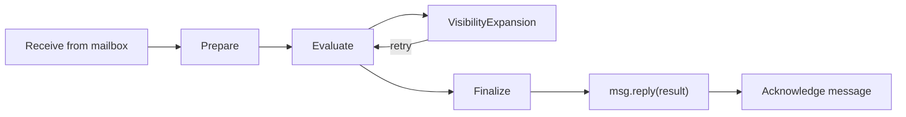

# Main Loop Specification

## Purpose

`MainLoop` standardizes agent workflow orchestration: receive request from a
mailbox, build prompt, evaluate within prompt's resource context, handle
visibility expansion, reply with result. Implementations define only the
domain-specific factories.

## Guiding Principles

- **Mailbox-driven**: Requests arrive via mailbox; results return via `Message.reply()`
- **Factory-based**: Subclasses own prompt and session construction
- **Prompt-owned resources**: Resource lifecycle managed by prompt context
- **Visibility-transparent**: Expansion exceptions retry automatically
- **Type-safe**: Generic parameters ensure request-prompt alignment
- **Durable**: At-least-once delivery with acknowledgement semantics

## Core Components

### MainLoop

```python
class MainLoop(ABC, Generic[UserRequestT, OutputT]):
    def __init__(
        self,
        *,
        adapter: ProviderAdapter[OutputT],
        requests: Mailbox[MainLoopRequest[UserRequestT], MainLoopResult[OutputT]],
        config: MainLoopConfig | None = None,
    ) -> None: ...

    @abstractmethod
    def prepare(self, request: UserRequestT) -> tuple[Prompt[OutputT], Session]: ...

    def finalize(self, prompt: Prompt[OutputT], session: Session) -> None: ...

    def execute(
        self,
        request: UserRequestT,
        *,
        budget: Budget | None = None,
        deadline: Deadline | None = None,
        resources: ResourceRegistry | None = None,
    ) -> tuple[PromptResponse[OutputT], Session]: ...

    def run(
        self,
        *,
        max_iterations: int | None = None,
        visibility_timeout: int = 300,
        wait_time_seconds: int = 20,
    ) -> None: ...

    def shutdown(self, *, timeout: float = 30.0) -> bool: ...

    @property
    def running(self) -> bool: ...

    @property
    def heartbeat(self) -> Heartbeat: ...
```

### MainLoopRequest

```python
@FrozenDataclass()
class MainLoopRequest(Generic[UserRequestT]):
    """Request for MainLoop execution with optional constraints."""

    request: UserRequestT
    """The user-defined request payload."""

    budget: Budget | None = None
    """Overrides config default budget."""

    deadline: Deadline | None = None
    """Overrides config default deadline."""

    resources: ResourceRegistry | None = None
    """Overrides config default resources."""

    request_id: UUID = field(default_factory=uuid4)
    """Unique identifier for request correlation."""

    created_at: datetime = field(default_factory=lambda: datetime.now(UTC))
    """Timestamp when request was created."""
```

### MainLoopResult

```python
@dataclass(frozen=True, slots=True)
class MainLoopResult(Generic[OutputT]):
    """Response from MainLoop execution.

    Consolidates success and failure into a single type. Check ``success``
    property to determine outcome.
    """

    request_id: UUID
    """Correlates with MainLoopRequest.request_id."""

    output: OutputT | None = None
    """Present on success. The parsed output from the prompt response."""

    error: str | None = None
    """Error message on failure."""

    session_id: UUID | None = None
    """Session that processed the request (if available)."""

    completed_at: datetime = field(default_factory=lambda: datetime.now(UTC))
    """Timestamp when processing completed."""

    @property
    def success(self) -> bool:
        """Return True if this result represents successful completion."""
        return self.error is None
```

### MainLoopConfig

```python
@FrozenDataclass()
class MainLoopConfig:
    """Configuration for MainLoop execution defaults."""

    deadline: Deadline | None = None
    budget: Budget | None = None
    resources: ResourceRegistry | None = None
```

Request-level `budget`, `deadline`, and `resources` override config defaults.
A fresh `BudgetTracker` is created per execution.

## Execution



1. Receive `Message[MainLoopRequest]` from requests mailbox
1. Initialize prompt and session via `prepare(request)`
1. Evaluate with adapter
1. On `VisibilityExpansionRequired`: write overrides into session state, retry
   step 3
1. Call `finalize(prompt, session)` for post-processing
1. Send `MainLoopResult` via `msg.reply(result)`
1. Acknowledge the request message

### Visibility Handling

Overrides are stored in the session; session persists across retries; prompt
is not recreated. The `finalize` hook is called only on successful evaluation.

## Usage

### Mailbox-Driven (Recommended)

```python
from weakincentives.runtime import Mailbox, MainLoopRequest, MainLoopResult

# Create request and reply mailboxes
requests: Mailbox[MainLoopRequest[MyRequest], MainLoopResult[MyOutput]] = ...
replies: Mailbox[MainLoopResult[MyOutput], None] = ...

loop = MyMainLoop(adapter=adapter, requests=requests)

# Start worker in background thread
worker = threading.Thread(target=loop.run, kwargs={"max_iterations": 100})
worker.start()

# Send request with reply_to
request_id = uuid4()
requests.send(
    MainLoopRequest(
        request=MyRequest(...),
        budget=Budget(max_total_tokens=10000),
        request_id=request_id,
    ),
    reply_to=replies,
)

# Read result from reply mailbox
messages = replies.receive(wait_time_seconds=30)
for msg in messages:
    result: MainLoopResult[MyOutput] = msg.body
    if result.success:
        print(f"Output: {result.output}")
    else:
        print(f"Error: {result.error}")
    msg.acknowledge()

# Graceful shutdown
loop.shutdown(timeout=30.0)
worker.join()
```

### Direct Execution

For synchronous execution without mailbox routing:

```python
loop = MyMainLoop(adapter=adapter, requests=requests)
response, session = loop.execute(
    MyRequest(...),
    budget=Budget(max_total_tokens=10000),
)
```

## Implementation

```python
class CodeReviewLoop(MainLoop[ReviewRequest, ReviewResult]):
    def __init__(
        self,
        *,
        adapter: ProviderAdapter[ReviewResult],
        requests: Mailbox[MainLoopRequest[ReviewRequest], MainLoopResult[ReviewResult]],
    ) -> None:
        super().__init__(adapter=adapter, requests=requests)
        self._template = PromptTemplate[ReviewResult](
            ns="reviews",
            key="code-review",
            sections=[...],
        )

    def prepare(self, request: ReviewRequest) -> tuple[Prompt[ReviewResult], Session]:
        prompt = Prompt(self._template).bind(ReviewParams.from_request(request))
        session = Session(tags={"loop": "code-review"})
        return prompt, session

    def finalize(self, prompt: Prompt[ReviewResult], session: Session) -> None:
        # Optional: cleanup, logging, or post-processing
        pass
```

### With Resources

Resources are declared on the template or bound at runtime:

```python
def prepare(self, request: ReviewRequest) -> tuple[Prompt[ReviewResult], Session]:
    # Template already has default resources
    # Add request-specific resources at bind time
    prompt = Prompt(self._template).bind(
        ReviewParams.from_request(request),
        resources=ResourceRegistry.build({
            GitClient: GitClient(repo=request.repo_path),
        }),
    )
    session = Session()
    return prompt, session
```

### With Reducers

```python
def prepare(self, request: ReviewRequest) -> tuple[Prompt[ReviewResult], Session]:
    prompt = Prompt(self._template).bind(ReviewParams.from_request(request))
    session = Session()
    session[Plan].register(SetupPlan, plan_reducer)
    return prompt, session
```

### With Progressive Disclosure

```python
def prepare(self, request: Request) -> tuple[Prompt[Output], Session]:
    prompt = Prompt(PromptTemplate[Output](
        ns="agent",
        key="task",
        sections=[
            MarkdownSection[Params](
                title="Reference",
                template="...",
                summary="Reference available.",
                visibility=SectionVisibility.SUMMARY,
                key="reference",
            ),
        ],
    )).bind(Params.from_request(request))
    session = Session()
    return prompt, session
```

## Worker Lifecycle

### run()

The `run()` method processes messages from the requests mailbox:

```python
loop.run(
    max_iterations=100,       # Exit after N polling iterations (None = unlimited)
    visibility_timeout=300,   # Seconds message stays invisible during processing
    wait_time_seconds=20,     # Long poll duration
)
```

The loop exits when:

- `max_iterations` is reached
- `shutdown()` is called
- The requests mailbox is closed

In-flight messages complete before exit. Unprocessed messages from the current
batch are nacked for redelivery.

### shutdown()

Request graceful shutdown and wait for completion:

```python
stopped = loop.shutdown(timeout=30.0)  # Returns True if stopped cleanly
```

### Context Manager

MainLoop supports context manager protocol for automatic cleanup:

```python
with MyMainLoop(adapter=adapter, requests=requests) as loop:
    loop.run(max_iterations=10)
# shutdown() called automatically on exit
```

### Heartbeat

The loop exposes a `heartbeat` property for watchdog monitoring:

```python
loop.heartbeat.beat()           # Called internally after each message
loop.heartbeat.last_beat_at     # Timestamp of last beat
```

The watchdog can detect stuck workers by monitoring heartbeat staleness.

## Error Handling

| Exception | Behavior |
| ----------------------------- | ------------------------------------------- |
| `VisibilityExpansionRequired` | Retry with updated overrides |
| All others | Reply with error result, acknowledge message|

On reply send failure, the message is nacked with exponential backoff for
retry. If the receipt handle expires during processing (long-running request),
the message is automatically requeued by the mailbox reaper.

## Code Reviewer Integration

The code reviewer agent uses `MainLoop` with these specifics:

**Session reuse:** A single session is created at loop construction and reused
across all `prepare()` calls. State accumulates across turns.

**Auto-optimization:** The explicit `optimize` command is removed. Before each
evaluation, the loop checks for `WorkspaceDigest` in session state. If absent,
optimization runs automatically.

```python
def execute(self, request: UserRequestT) -> PromptResponse[OutputT]:
    if self._session[WorkspaceDigest].latest() is None:
        self._run_optimization()
    # ... proceed with evaluation
```

**Default deadline:** All requests receive a 5-minute deadline unless
overridden at the request level.

```python
config = MainLoopConfig(
    deadline=Deadline(expires_at=datetime.now(UTC) + timedelta(minutes=5)),
)
```

## Limitations

- Synchronous execution (single-threaded message processing)
- One adapter per loop instance
- No mid-execution cancellation
- Message visibility timeout must exceed maximum expected execution time
