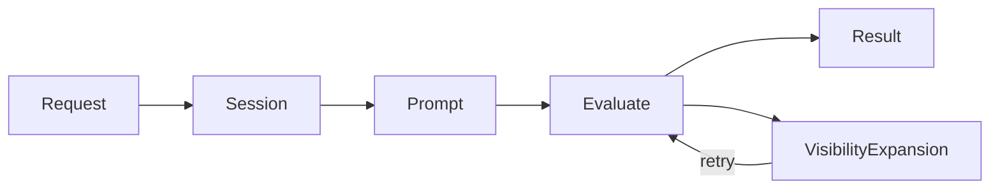
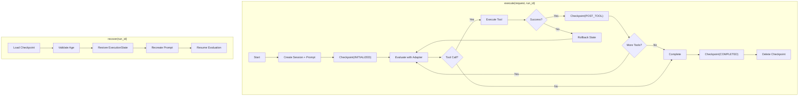

# Main Loop Specification

## Purpose

`MainLoop` standardizes agent workflow orchestration: receive request, build
prompt, evaluate, handle visibility expansion, publish result. Implementations
define only the domain-specific factories.

## Guiding Principles

- **Event-driven**: Requests arrive via bus; results return the same way
- **Factory-based**: Subclasses own prompt and session construction
- **Visibility-transparent**: Expansion exceptions retry automatically
- **Type-safe**: Generic parameters ensure request-prompt alignment

## Core Components

### MainLoop

```python
class MainLoop(ABC, Generic[UserRequestT, OutputT]):
    def __init__(
        self,
        *,
        adapter: ProviderAdapter[OutputT],
        bus: ControlBus,
        config: MainLoopConfig | None = None,
    ) -> None: ...

    @abstractmethod
    def create_prompt(self, request: UserRequestT) -> Prompt[OutputT]: ...

    @abstractmethod
    def create_session(self) -> Session: ...

    def execute(self, request: UserRequestT) -> tuple[PromptResponse[OutputT], Session]: ...
```

### Events

```python
@FrozenDataclass()
class MainLoopRequest(Generic[UserRequestT]):
    request: UserRequestT
    budget: Budget | None = None       # Overrides config default
    deadline: Deadline | None = None   # Overrides config default
    request_id: UUID = field(default_factory=uuid4)
    created_at: datetime = field(default_factory=lambda: datetime.now(UTC))


@FrozenDataclass()
class MainLoopCompleted(Generic[OutputT]):
    request_id: UUID
    response: PromptResponse[OutputT]
    session_id: UUID
    completed_at: datetime = field(default_factory=lambda: datetime.now(UTC))


@FrozenDataclass()
class MainLoopFailed:
    request_id: UUID
    error: Exception
    session_id: UUID | None
    failed_at: datetime = field(default_factory=lambda: datetime.now(UTC))
```

### Configuration

```python
@FrozenDataclass()
class MainLoopConfig:
    deadline: Deadline | None = None
    budget: Budget | None = None
```

Request-level `budget` and `deadline` override config defaults. A fresh
`BudgetTracker` is created per execution.

## Execution



1. Receive `MainLoopRequest` via bus or direct `execute()` call
1. Create session via `create_session()`
1. Create prompt via `create_prompt(request)`
1. Evaluate with adapter
1. On `VisibilityExpansionRequired`: write overrides into session state, retry
   step 4
1. Publish `MainLoopCompleted` or `MainLoopFailed`

### Visibility Handling

```python
def execute(self, request: UserRequestT) -> tuple[PromptResponse[OutputT], Session]:
    session = self.create_session()
    prompt = self.create_prompt(request)
    budget_tracker = BudgetTracker(budget=self._effective_budget) if self._effective_budget else None

    while True:
        try:
            response = self._adapter.evaluate(
                prompt,
                session=session,
                deadline=self._effective_deadline,
                budget_tracker=budget_tracker,
            )
            return response, session
        except VisibilityExpansionRequired as e:
            for path, visibility in e.requested_overrides.items():
                session[VisibilityOverrides].apply(
                    SetVisibilityOverride(path=path, visibility=visibility)
                )
```

Overrides are stored in the session; session persists across retries; prompt
is not recreated.

## Usage

### Bus-Driven

```python
loop = MyMainLoop(adapter=adapter, bus=bus)

# MainLoop subscribes to MainLoopRequest in __init__

# With request-specific constraints
bus.publish(MainLoopRequest(
    request=MyRequest(...),
    budget=Budget(max_total_tokens=10000),
))
```

**Note:** `InProcessEventBus` dispatches by `type(event)`, not generic alias.
`MainLoopRequest[T]` is for static type checking; at runtime all events are
`MainLoopRequest`. For multiple loop types on one bus, filter by request type
in the handler or use separate buses.

### Direct

```python
response, session = loop.execute(MyRequest(...))
```

## Implementation

```python
class CodeReviewLoop(MainLoop[ReviewRequest, ReviewResult]):
    def __init__(self, *, adapter: ProviderAdapter[ReviewResult], bus: ControlBus) -> None:
        super().__init__(adapter=adapter, bus=bus)
        self._template = PromptTemplate[ReviewResult](
            ns="reviews",
            key="code-review",
            sections=[...],
        )

    def create_prompt(self, request: ReviewRequest) -> Prompt[ReviewResult]:
        return Prompt(self._template).bind(ReviewParams.from_request(request))

    def create_session(self) -> Session:
        return Session(bus=self._bus, tags={"loop": "code-review"})
```

### With Reducers

```python
def create_session(self) -> Session:
    session = Session(bus=self._bus)
    session[Plan].register(SetupPlan, plan_reducer)
    return session
```

### With Progressive Disclosure

```python
def create_prompt(self, request: Request) -> Prompt[Output]:
    return Prompt(PromptTemplate[Output](
        ns="agent",
        key="task",
        sections=[
            MarkdownSection[Params](
                title="Reference",
                template="...",
                summary="Reference available.",
                visibility=SectionVisibility.SUMMARY,
                key="reference",
            ),
        ],
    )).bind(Params.from_request(request))
```

## Error Handling

| Exception | Behavior | |-----------|----------| |
`VisibilityExpansionRequired` | Retry with updated overrides | | All others |
Publish `MainLoopFailed`, re-raise |

## Code Reviewer Integration

The code reviewer agent uses `MainLoop` with these specifics:

**Session reuse:** A single session is created at loop construction and reused
across all `execute()` calls. State accumulates across turns.

**Auto-optimization:** The explicit `optimize` command is removed. Before each
evaluation, the loop checks for `WorkspaceDigest` in session state. If absent,
optimization runs automatically.

```python
def execute(self, request: UserRequestT) -> PromptResponse[OutputT]:
    if self._session[WorkspaceDigest].latest() is None:
        self._run_optimization()
    # ... proceed with evaluation
```

**Default deadline:** All requests receive a 5-minute deadline unless
overridden at the request level.

```python
config = MainLoopConfig(
    deadline=Deadline(expires_at=datetime.now(UTC) + timedelta(minutes=5)),
)
```

## Restart Recovery

MainLoop provides built-in facilities for resuming work after a process restart
when an in-flight prompt was disrupted. This enables durable agent execution
where crashes, OOM kills, or infrastructure restarts do not lose progress.

### Guiding Principles

- **Checkpoint at transaction boundaries**: State is persisted after each
  successful tool call, not mid-tool.
- **Idempotent recovery**: Resuming a disrupted run produces the same result
  as if the run had never been interrupted.
- **Explicit opt-in**: Recovery is disabled by default; callers enable it via
  configuration.
- **Backend-agnostic**: Persistence uses a `CheckpointBackend` protocol;
  implementations may use filesystem, database, or remote storage.

### Components

#### CheckpointBackend Protocol

```python
class CheckpointBackend(Protocol):
    """Storage backend for execution checkpoints."""

    def save(self, run_id: UUID, checkpoint: Checkpoint) -> None:
        """Persist a checkpoint. Overwrites any existing checkpoint for run_id."""
        ...

    def load(self, run_id: UUID) -> Checkpoint | None:
        """Load the most recent checkpoint for a run, or None if not found."""
        ...

    def delete(self, run_id: UUID) -> None:
        """Remove checkpoint for a completed or abandoned run."""
        ...

    def list_incomplete(self) -> Sequence[UUID]:
        """Return run IDs with checkpoints that were never marked complete."""
        ...
```

#### Checkpoint

```python
@dataclass(slots=True, frozen=True)
class Checkpoint:
    """Serializable execution state at a transaction boundary."""

    run_id: UUID
    request_id: UUID
    created_at: datetime
    composite_snapshot: CompositeSnapshot
    request_payload: bytes          # Serialized UserRequestT
    request_type: str               # Fully-qualified type name
    tool_calls_completed: int       # Progress indicator
    phase: CheckpointPhase
    adapter_state: bytes | None     # Optional adapter-specific state


class CheckpointPhase(Enum):
    """Lifecycle phase when checkpoint was taken."""

    INITIALIZED = "initialized"     # After session/prompt creation, before first eval
    POST_TOOL = "post_tool"         # After successful tool execution
    COMPLETED = "completed"         # Final checkpoint before cleanup
    FAILED = "failed"               # Checkpoint taken on handled failure
```

#### RecoveryConfig

```python
@dataclass(slots=True, frozen=True)
class RecoveryConfig:
    """Configuration for restart recovery."""

    backend: CheckpointBackend
    checkpoint_interval: int = 1    # Checkpoint every N successful tool calls
    cleanup_on_success: bool = True # Delete checkpoint after successful completion
    max_resume_age: timedelta = timedelta(hours=24)  # Ignore stale checkpoints
```

### MainLoop Integration

```python
class MainLoop(ABC, Generic[UserRequestT, OutputT]):
    def __init__(
        self,
        *,
        adapter: ProviderAdapter[OutputT],
        bus: ControlBus,
        config: MainLoopConfig | None = None,
        recovery: RecoveryConfig | None = None,  # New parameter
    ) -> None: ...

    def execute(
        self,
        request: UserRequestT,
        *,
        run_id: UUID | None = None,  # Explicit run ID for tracking
    ) -> tuple[PromptResponse[OutputT], Session]: ...

    def recover(self, run_id: UUID) -> tuple[PromptResponse[OutputT], Session]:
        """Resume an interrupted run from its last checkpoint."""
        ...

    def list_recoverable(self) -> Sequence[RecoverableRun]:
        """List runs that can be recovered."""
        ...

    def abandon(self, run_id: UUID) -> None:
        """Mark a run as abandoned and delete its checkpoint."""
        ...
```

### Execution Flow with Recovery



### Recovery Semantics

#### What Gets Restored

| Component | Restored From | Notes |
|-----------|---------------|-------|
| Session slices | `CompositeSnapshot.session` | Full slice state |
| Filesystem | `CompositeSnapshot.resources` | If `SnapshotableFilesystem` |
| Request | `Checkpoint.request_payload` | Deserialized via serde |
| Tool progress | `Checkpoint.tool_calls_completed` | Resume position |

#### What Gets Recreated

| Component | How | Notes |
|-----------|-----|-------|
| Prompt | `create_prompt(request)` | Must be deterministic |
| Adapter | Constructor | Stateless by design |
| Reducers | `create_session()` | Re-registered on restore |

### Resume Behavior

When `recover(run_id)` is called:

1. Load checkpoint from backend
2. Validate checkpoint age against `max_resume_age`
3. Deserialize request from `request_payload`
4. Create fresh session via `create_session()`
5. Restore session state from `composite_snapshot.session`
6. Restore snapshotable resources from `composite_snapshot.resources`
7. Recreate prompt via `create_prompt(request)`
8. Resume adapter evaluation with conversation prefix

```python
def recover(self, run_id: UUID) -> tuple[PromptResponse[OutputT], Session]:
    checkpoint = self._recovery.backend.load(run_id)
    if checkpoint is None:
        raise RecoveryError(f"No checkpoint found for run {run_id}")

    age = datetime.now(UTC) - checkpoint.created_at
    if age > self._recovery.max_resume_age:
        raise RecoveryError(f"Checkpoint too old: {age}")

    # Deserialize request
    request = deserialize(checkpoint.request_payload, checkpoint.request_type)

    # Create fresh session and restore state
    session = self.create_session()
    execution_state = ExecutionState(session=session, resources=self._build_resources())
    execution_state.restore(checkpoint.composite_snapshot)

    # Recreate prompt (must be deterministic)
    prompt = self.create_prompt(request)

    # Resume evaluation
    return self._execute_with_state(
        request=request,
        run_id=run_id,
        execution_state=execution_state,
        prompt=prompt,
        resume_from=checkpoint,
    )
```

### Adapter Resume Support

Adapters must support resuming from a checkpoint:

```python
class ProviderAdapter(Protocol[OutputT]):
    def evaluate(
        self,
        prompt: Prompt[OutputT],
        *,
        execution_state: ExecutionState,
        deadline: Deadline | None = None,
        budget_tracker: BudgetTracker | None = None,
        resume_from: AdapterResumeState | None = None,  # New parameter
    ) -> PromptResponse[OutputT]: ...


@dataclass(slots=True, frozen=True)
class AdapterResumeState:
    """State needed to resume an interrupted adapter evaluation."""

    conversation_prefix: tuple[Message, ...]  # Messages up to interruption
    pending_tool_calls: tuple[ToolCall, ...]  # Unanswered tool calls
```

The adapter reconstructs its conversation state and continues from where it
left off. Tool calls that were interrupted mid-execution are re-executed
(idempotent handlers are recommended).

### Filesystem Backend

A reference implementation for local development:

```python
@dataclass(slots=True)
class FilesystemCheckpointBackend:
    """Checkpoint backend using local filesystem."""

    root: Path

    def save(self, run_id: UUID, checkpoint: Checkpoint) -> None:
        path = self.root / f"{run_id}.checkpoint.json"
        path.write_text(checkpoint.to_json())

    def load(self, run_id: UUID) -> Checkpoint | None:
        path = self.root / f"{run_id}.checkpoint.json"
        if not path.exists():
            return None
        return Checkpoint.from_json(path.read_text())

    def delete(self, run_id: UUID) -> None:
        path = self.root / f"{run_id}.checkpoint.json"
        path.unlink(missing_ok=True)

    def list_incomplete(self) -> Sequence[UUID]:
        return [
            UUID(p.stem.replace(".checkpoint", ""))
            for p in self.root.glob("*.checkpoint.json")
            if Checkpoint.from_json(p.read_text()).phase != CheckpointPhase.COMPLETED
        ]
```

### Events

```python
@FrozenDataclass()
class CheckpointSaved:
    """Published after a checkpoint is persisted."""

    run_id: UUID
    checkpoint_id: UUID
    phase: CheckpointPhase
    tool_calls_completed: int
    created_at: datetime = field(default_factory=lambda: datetime.now(UTC))


@FrozenDataclass()
class RecoveryStarted:
    """Published when recovery begins for an interrupted run."""

    run_id: UUID
    checkpoint_created_at: datetime
    tool_calls_completed: int
    started_at: datetime = field(default_factory=lambda: datetime.now(UTC))


@FrozenDataclass()
class RecoveryCompleted:
    """Published when recovery finishes successfully."""

    run_id: UUID
    completed_at: datetime = field(default_factory=lambda: datetime.now(UTC))


@FrozenDataclass()
class RecoveryFailed:
    """Published when recovery fails."""

    run_id: UUID
    error: Exception
    failed_at: datetime = field(default_factory=lambda: datetime.now(UTC))
```

### Error Handling

```python
class RecoveryError(WinkError, RuntimeError):
    """Base class for recovery errors."""


class CheckpointNotFoundError(RecoveryError):
    """No checkpoint exists for the given run ID."""


class CheckpointExpiredError(RecoveryError):
    """Checkpoint is older than max_resume_age."""


class CheckpointCorruptedError(RecoveryError):
    """Checkpoint data is invalid or cannot be deserialized."""


class RequestTypeMismatchError(RecoveryError):
    """Checkpoint request type does not match MainLoop type parameters."""
```

### Usage

#### Basic Recovery-Enabled Loop

```python
backend = FilesystemCheckpointBackend(root=Path("/var/lib/agent/checkpoints"))
recovery = RecoveryConfig(backend=backend)

loop = MyMainLoop(
    adapter=adapter,
    bus=bus,
    recovery=recovery,
)

# Normal execution with explicit run_id
run_id = uuid4()
response, session = loop.execute(request, run_id=run_id)
```

#### Startup Recovery

```python
# On process startup, recover any incomplete runs
for run_id in loop.list_recoverable():
    try:
        response, session = loop.recover(run_id)
        bus.publish(MainLoopCompleted(request_id=..., response=response, ...))
    except RecoveryError as e:
        log.warning(f"Failed to recover run {run_id}: {e}")
        loop.abandon(run_id)
```

#### Worker Entry Point Pattern

```python
def worker_main():
    """Entry point with automatic recovery."""
    loop = create_main_loop(recovery=recovery_config)

    # Phase 1: Recover interrupted work
    for run_id in loop.list_recoverable():
        try:
            response, session = loop.recover(run_id)
            publish_result(response, session)
        except RecoveryError:
            loop.abandon(run_id)

    # Phase 2: Process new work
    while True:
        request = receive_request()
        run_id = uuid4()
        try:
            response, session = loop.execute(request, run_id=run_id)
            publish_result(response, session)
        except Exception:
            # Checkpoint exists; will be recovered on restart
            raise
```

### Constraints

#### Deterministic Prompt Creation

`create_prompt(request)` must be deterministic—given the same request, it must
produce an equivalent prompt. If prompt creation depends on external state
(timestamps, random values), that state must be captured in the request or
session.

#### Idempotent Tool Handlers

Tool handlers that interact with external systems should be idempotent. A
handler may be re-executed after a crash if the checkpoint was taken before
tool completion. Non-idempotent handlers should use the session to track
completion state.

```python
def send_email_handler(params: SendEmailParams, *, context: ToolContext) -> ToolResult:
    # Check if already sent (idempotency key in session)
    sent_emails = context.session[SentEmails].all()
    if params.idempotency_key in {e.key for e in sent_emails}:
        return ToolResult(message="Email already sent", success=True)

    # Send and record
    send_email(params)
    context.session[SentEmails].append(SentEmail(key=params.idempotency_key))
    return ToolResult(message="Email sent", success=True)
```

### Acceptance Criteria

#### Checkpoint Creation

```python
def test_checkpoint_created_after_tool_call(loop: MainLoop, backend: CheckpointBackend):
    run_id = uuid4()
    loop.execute(request_with_tool_calls, run_id=run_id)

    # Checkpoint was created during execution
    assert backend.load(run_id) is not None
```

#### Recovery Restores State

```python
def test_recovery_restores_state(loop: MainLoop, backend: CheckpointBackend):
    run_id = uuid4()

    # Execute partway, then simulate crash
    with simulate_crash_after_n_tools(n=2):
        loop.execute(request, run_id=run_id)

    # Recover and verify state
    response, session = loop.recover(run_id)
    assert session[Plan].latest() is not None
    assert response.output == expected_output
```

#### Stale Checkpoint Rejected

```python
def test_stale_checkpoint_rejected(loop: MainLoop, backend: CheckpointBackend):
    run_id = uuid4()
    old_checkpoint = Checkpoint(
        run_id=run_id,
        created_at=datetime.now(UTC) - timedelta(days=2),
        ...
    )
    backend.save(run_id, old_checkpoint)

    with pytest.raises(CheckpointExpiredError):
        loop.recover(run_id)
```

#### Cleanup on Success

```python
def test_checkpoint_deleted_on_success(loop: MainLoop, backend: CheckpointBackend):
    run_id = uuid4()
    loop.execute(request, run_id=run_id)

    # Checkpoint cleaned up after successful completion
    assert backend.load(run_id) is None
```

## Limitations

- Synchronous execution
- One adapter per loop instance
- No mid-execution cancellation (but recovery handles crashes)
- Events local to process
- Recovery requires deterministic `create_prompt()`
- Non-idempotent tool handlers may cause duplicate side effects on recovery
