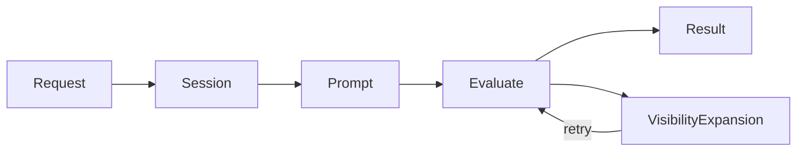

# Main Loop Specification

## Purpose

`MainLoop` standardizes agent workflow orchestration: receive request, build
prompt, evaluate, handle visibility expansion, publish result. Implementations
define only the domain-specific factories.

## Guiding Principles

- **Event-driven**: Requests arrive via bus; results return the same way
- **Factory-based**: Subclasses own prompt and session construction
- **Visibility-transparent**: Expansion exceptions retry automatically
- **Type-safe**: Generic parameters ensure request-prompt alignment

## Core Components

### MainLoop

```python
class MainLoop(ABC, Generic[UserRequestT, OutputT]):
    def __init__(
        self,
        *,
        adapter: ProviderAdapter[OutputT],
        bus: ControlBus,
        config: MainLoopConfig | None = None,
    ) -> None: ...

    @abstractmethod
    def create_prompt(self, request: UserRequestT) -> Prompt[OutputT]: ...

    @abstractmethod
    def create_session(self) -> Session: ...

    def execute(self, request: UserRequestT) -> tuple[PromptResponse[OutputT], Session]: ...
```

### Events

```python
@FrozenDataclass()
class MainLoopRequest(Generic[UserRequestT]):
    request: UserRequestT
    budget: Budget | None = None       # Overrides config default
    deadline: Deadline | None = None   # Overrides config default
    request_id: UUID = field(default_factory=uuid4)
    created_at: datetime = field(default_factory=lambda: datetime.now(UTC))


@FrozenDataclass()
class MainLoopCompleted(Generic[OutputT]):
    request_id: UUID
    response: PromptResponse[OutputT]
    session_id: UUID
    completed_at: datetime = field(default_factory=lambda: datetime.now(UTC))


@FrozenDataclass()
class MainLoopFailed:
    request_id: UUID
    error: Exception
    session_id: UUID | None
    failed_at: datetime = field(default_factory=lambda: datetime.now(UTC))
```

### Configuration

```python
@FrozenDataclass()
class MainLoopConfig:
    deadline: Deadline | None = None
    budget: Budget | None = None
```

Request-level `budget` and `deadline` override config defaults. A fresh
`BudgetTracker` is created per execution.

## Execution



1. Receive `MainLoopRequest` via bus or direct `execute()` call
1. Create session via `create_session()`
1. Create prompt via `create_prompt(request)`
1. Evaluate with adapter
1. On `VisibilityExpansionRequired`: write overrides into session state, retry
   step 4
1. Publish `MainLoopCompleted` or `MainLoopFailed`

### Visibility Handling

```python
def execute(self, request: UserRequestT) -> tuple[PromptResponse[OutputT], Session]:
    session = self.create_session()
    prompt = self.create_prompt(request)
    budget_tracker = BudgetTracker(budget=self._effective_budget) if self._effective_budget else None

    while True:
        try:
            response = self._adapter.evaluate(
                prompt,
                session=session,
                deadline=self._effective_deadline,
                budget_tracker=budget_tracker,
            )
            return response, session
        except VisibilityExpansionRequired as e:
            for path, visibility in e.requested_overrides.items():
                session[VisibilityOverrides].apply(
                    SetVisibilityOverride(path=path, visibility=visibility)
                )
```

Overrides are stored in the session; session persists across retries; prompt
is not recreated.

## Usage

### Bus-Driven

```python
loop = MyMainLoop(adapter=adapter, bus=bus)

# MainLoop subscribes to MainLoopRequest in __init__

# With request-specific constraints
bus.publish(MainLoopRequest(
    request=MyRequest(...),
    budget=Budget(max_total_tokens=10000),
))
```

**Note:** `InProcessEventBus` dispatches by `type(event)`, not generic alias.
`MainLoopRequest[T]` is for static type checking; at runtime all events are
`MainLoopRequest`. For multiple loop types on one bus, filter by request type
in the handler or use separate buses.

### Direct

```python
response, session = loop.execute(MyRequest(...))
```

## Implementation

```python
class CodeReviewLoop(MainLoop[ReviewRequest, ReviewResult]):
    def __init__(self, *, adapter: ProviderAdapter[ReviewResult], bus: ControlBus) -> None:
        super().__init__(adapter=adapter, bus=bus)
        self._template = PromptTemplate[ReviewResult](
            ns="reviews",
            key="code-review",
            sections=[...],
        )

    def create_prompt(self, request: ReviewRequest) -> Prompt[ReviewResult]:
        return Prompt(self._template).bind(ReviewParams.from_request(request))

    def create_session(self) -> Session:
        return Session(bus=self._bus, tags={"loop": "code-review"})
```

### With Reducers

```python
def create_session(self) -> Session:
    session = Session(bus=self._bus)
    session[Plan].register(SetupPlan, plan_reducer)
    return session
```

### With Progressive Disclosure

```python
def create_prompt(self, request: Request) -> Prompt[Output]:
    return Prompt(PromptTemplate[Output](
        ns="agent",
        key="task",
        sections=[
            MarkdownSection[Params](
                title="Reference",
                template="...",
                summary="Reference available.",
                visibility=SectionVisibility.SUMMARY,
                key="reference",
            ),
        ],
    )).bind(Params.from_request(request))
```

## Error Handling

| Exception | Behavior | |-----------|----------| |
`VisibilityExpansionRequired` | Retry with updated overrides | | All others |
Publish `MainLoopFailed`, re-raise |

## Code Reviewer Integration

The code reviewer agent uses `MainLoop` with these specifics:

**Session reuse:** A single session is created at loop construction and reused
across all `execute()` calls. State accumulates across turns.

**Auto-optimization:** The explicit `optimize` command is removed. Before each
evaluation, the loop checks for `WorkspaceDigest` in session state. If absent,
optimization runs automatically.

```python
def execute(self, request: UserRequestT) -> PromptResponse[OutputT]:
    if self._session[WorkspaceDigest].latest() is None:
        self._run_optimization()
    # ... proceed with evaluation
```

**Default deadline:** All requests receive a 5-minute deadline unless
overridden at the request level.

```python
config = MainLoopConfig(
    deadline=Deadline(expires_at=datetime.now(UTC) + timedelta(minutes=5)),
)
```

## Restart Recovery

MainLoop provides opt-in facilities for resuming work after process restarts.
Checkpoints are persisted after each successful tool call, enabling recovery
from crashes without losing progress.

### Guiding Principles

- **Checkpoint at transaction boundaries**: Persist after successful tool
  calls, not mid-tool
- **Explicit opt-in**: Disabled by default; enable via `RecoveryConfig`
- **Backend-agnostic**: Pluggable `CheckpointBackend` protocol

### Components

```python
class CheckpointBackend(Protocol):
    def save(self, run_id: UUID, checkpoint: Checkpoint) -> None: ...
    def load(self, run_id: UUID) -> Checkpoint | None: ...
    def delete(self, run_id: UUID) -> None: ...
    def list_incomplete(self) -> Sequence[UUID]: ...


@dataclass(slots=True, frozen=True)
class Checkpoint:
    run_id: UUID
    request_id: UUID
    created_at: datetime
    composite_snapshot: CompositeSnapshot
    request_payload: bytes                      # Serialized request
    request_type: str                           # Fully-qualified type
    tool_calls_completed: int
    phase: Literal["initialized", "post_tool", "completed", "failed"]


@dataclass(slots=True, frozen=True)
class RecoveryConfig:
    backend: CheckpointBackend
    checkpoint_interval: int = 1                # Every N tool calls
    cleanup_on_success: bool = True
    max_resume_age: timedelta = timedelta(hours=24)
```

### MainLoop Integration

```python
class MainLoop(ABC, Generic[UserRequestT, OutputT]):
    def __init__(
        self,
        *,
        adapter: ProviderAdapter[OutputT],
        bus: ControlBus,
        config: MainLoopConfig | None = None,
        recovery: RecoveryConfig | None = None,
    ) -> None: ...

    def execute(self, request: UserRequestT, *, run_id: UUID | None = None) -> ...: ...
    def recover(self, run_id: UUID) -> tuple[PromptResponse[OutputT], Session]: ...
    def list_recoverable(self) -> Sequence[UUID]: ...
    def abandon(self, run_id: UUID) -> None: ...
```

### Recovery Semantics

| Restored | From |
|----------|------|
| Session slices | `CompositeSnapshot.session` |
| Filesystem | `CompositeSnapshot.resources` |
| Request | `Checkpoint.request_payload` |

| Recreated | How |
|-----------|-----|
| Prompt | `create_prompt(request)` — must be deterministic |
| Reducers | `create_session()` |

### Usage

```python
def worker_main():
    loop = create_main_loop(recovery=RecoveryConfig(backend=backend))

    # Recover interrupted runs on startup
    for run_id in loop.list_recoverable():
        try:
            loop.recover(run_id)
        except RecoveryError:
            loop.abandon(run_id)

    # Process new work
    for request in receive_requests():
        loop.execute(request, run_id=uuid4())
```

### Constraints

- **Deterministic prompts**: `create_prompt(request)` must produce equivalent
  output for the same request
- **Idempotent tools**: Handlers may re-execute after crash; use session state
  to track completion for non-idempotent operations

### Error Hierarchy

- `RecoveryError` — base class
  - `CheckpointNotFoundError`
  - `CheckpointExpiredError`
  - `CheckpointCorruptedError`

## Limitations

- Synchronous execution
- One adapter per loop instance
- No mid-execution cancellation (recovery handles crashes)
- Events local to process
- Recovery requires deterministic `create_prompt()`
