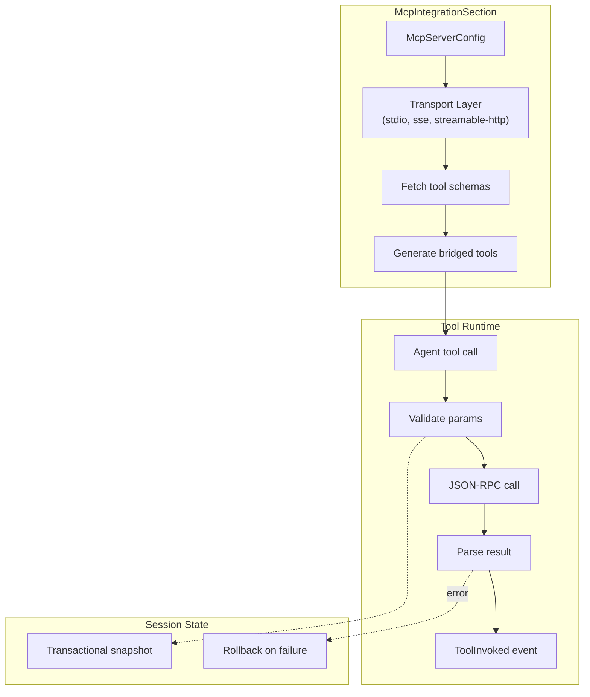
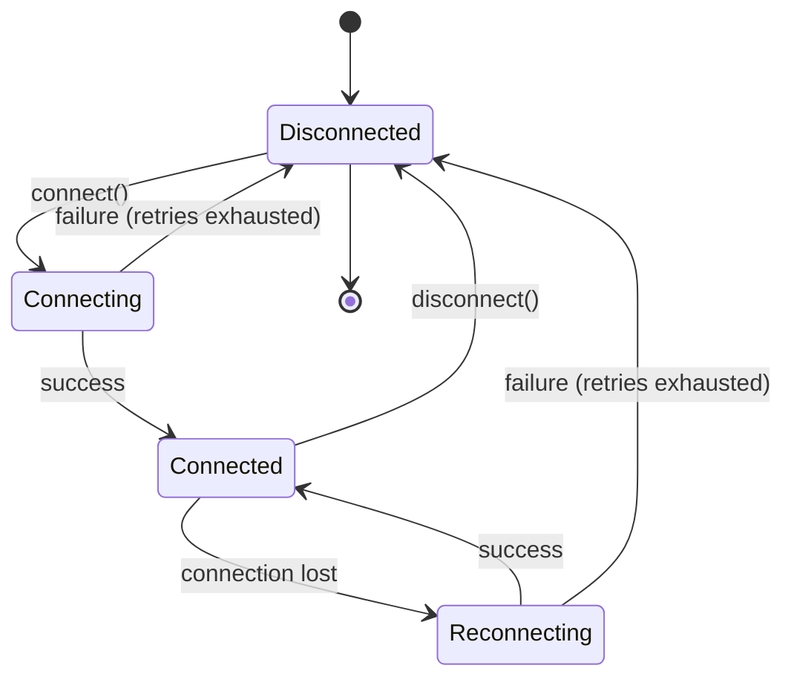

# MCP Integration Section Specification

## Purpose

`McpIntegrationSection` connects external MCP (Model Context Protocol) servers
to the prompt system, exposing their tools to agents as first-class
weakincentives tools. This bridges the gap between the typed, session-aware
weakincentives tool model and the broader MCP ecosystem.

## Guiding Principles

- **MCP-native semantics**: Honor MCP protocol conventions (JSON-RPC, tool
  schemas, resource URIs) while adapting to weakincentives patterns.
- **Type-safe bridging**: External tool schemas translate to dataclass-backed
  handlers with validated inputs and outputs.
- **Session integration**: MCP tool invocations publish `ToolInvoked` events
  and participate in transactional execution.
- **Explicit lifecycle**: Connections open lazily and close deterministically
  to prevent resource leaks.
- **Isolation boundaries**: Network and sandbox policies apply to MCP
  subprocess transports.



## Core Components

### McpServerConfig

Defines connection parameters for a single MCP server:

```python
@dataclass(slots=True, frozen=True)
class McpServerConfig:
    name: str                                      # Server identifier (e.g., "github", "filesystem")
    transport: McpTransport                        # Connection mechanism
    tool_prefix: str | None = None                 # Prefix for tool names (default: name)
    enabled_tools: tuple[str, ...] | None = None   # Allowlist (None = all)
    disabled_tools: tuple[str, ...] = ()           # Blocklist (applied after allowlist)
    timeout: float = 30.0                          # Per-call timeout in seconds
    env: Mapping[str, str] = field(default_factory=dict)  # Environment for subprocess
```

**Naming rules**:

- `name` must match `^[a-z][a-z0-9_-]{0,31}$`
- `tool_prefix` defaults to `name` if unset
- Final tool names: `{prefix}_{original_name}` (e.g., `github_create_issue`)

### McpTransport

Union type representing supported MCP transports:

```python
McpTransport = StdioTransport | SseTransport | StreamableHttpTransport
```

#### StdioTransport

Subprocess-based communication via stdin/stdout:

```python
@dataclass(slots=True, frozen=True)
class StdioTransport:
    command: str                                   # Executable path or name
    args: tuple[str, ...] = ()                     # Command-line arguments
    cwd: str | None = None                         # Working directory
```

Example:

```python
StdioTransport(
    command="npx",
    args=("-y", "@modelcontextprotocol/server-github"),
)
```

#### SseTransport

Server-Sent Events over HTTP (deprecated in MCP spec, but supported):

```python
@dataclass(slots=True, frozen=True)
class SseTransport:
    url: str                                       # SSE endpoint URL
    headers: Mapping[str, str] = field(default_factory=dict)
```

#### StreamableHttpTransport

HTTP with streaming JSON-RPC (recommended for remote servers):

```python
@dataclass(slots=True, frozen=True)
class StreamableHttpTransport:
    url: str                                       # HTTP endpoint URL
    headers: Mapping[str, str] = field(default_factory=dict)
    method: Literal["GET", "POST"] = "POST"
```

### McpIntegrationSection

Section that manages MCP server connections and exposes their tools:

```python
class McpIntegrationSection(Section[McpIntegrationParams]):
    def __init__(
        self,
        *,
        servers: Sequence[McpServerConfig],
        session: Session,
        title: str = "MCP Integrations",
        key: str = "mcp.integrations",
        template: str | None = None,
        connect_on_init: bool = False,
        accepts_overrides: bool = False,
    ) -> None: ...

    def connect(self) -> None:
        """Establish connections to all configured servers."""

    def disconnect(self) -> None:
        """Close all server connections."""

    def tools(self) -> tuple[Tool[Any, Any], ...]:
        """Return bridged tools from connected servers."""

    @property
    def connected(self) -> bool:
        """True if all servers are connected."""

    def __enter__(self) -> Self: ...
    def __exit__(self, *exc: object) -> None: ...
```

**Lifecycle rules**:

- `connect_on_init=True` establishes connections during `__init__`
- `connect_on_init=False` (default) defers until explicit `connect()` call
- `tools()` raises `McpConnectionError` if called before `connect()`
- Context manager ensures `disconnect()` on exit

### McpIntegrationParams

Section parameters (typically empty, but extensible):

```python
@dataclass(slots=True, frozen=True)
class McpIntegrationParams:
    pass
```

## Tool Bridging

### Schema Translation

MCP tool schemas translate to weakincentives tools as follows:

| MCP Schema Field | Tool Mapping |
|------------------|--------------|
| `name` | `Tool.name` with prefix |
| `description` | `Tool.description` (truncated to 200 chars) |
| `inputSchema` | Synthetic dataclass from JSON Schema |
| `outputSchema` | Dynamic result dataclass or `dict[str, Any]` |

### Synthetic Dataclasses

When an MCP tool defines `inputSchema`, a dataclass is generated:

```python
# MCP schema:
# {
#   "type": "object",
#   "properties": {
#     "owner": {"type": "string"},
#     "repo": {"type": "string"},
#     "title": {"type": "string"}
#   },
#   "required": ["owner", "repo", "title"]
# }

# Generated:
@dataclass(slots=True, frozen=True)
class GithubCreateIssueParams:
    owner: str
    repo: str
    title: str
```

**Type mapping**:

| JSON Schema Type | Python Type |
|------------------|-------------|
| `string` | `str` |
| `number` | `float` |
| `integer` | `int` |
| `boolean` | `bool` |
| `array` | `list[T]` (recursive) |
| `object` (nested) | nested dataclass |
| `null` | `None` |
| union types | `T \| None` for optional |

### Bridged Handler

Each MCP tool wraps in a handler that:

1. Serializes params to JSON
1. Sends JSON-RPC `tools/call` request
1. Awaits response with timeout
1. Parses result into `ToolResult`
1. Publishes `ToolInvoked` event

```python
def _create_bridged_handler(
    server: McpServerConfig,
    tool_schema: McpToolSchema,
    connection: McpConnection,
) -> ToolHandler[Any, Any]:
    def handler(
        params: Any,
        *,
        context: ToolContext,
    ) -> ToolResult[dict[str, Any]]:
        # Serialize and call
        request = {
            "jsonrpc": "2.0",
            "method": "tools/call",
            "params": {
                "name": tool_schema.name,
                "arguments": dump(params),
            },
            "id": generate_request_id(),
        }

        response = connection.send(request, timeout=server.timeout)

        if "error" in response:
            return ToolResult(
                message=response["error"].get("message", "MCP error"),
                value=None,
                success=False,
            )

        return ToolResult(
            message="Success",
            value=response.get("result", {}),
            success=True,
        )

    return handler
```

### Result Handling

MCP tool results map to `ToolResult`:

| MCP Result | ToolResult |
|------------|------------|
| `{ "content": [...] }` | `value` contains content array |
| `{ "isError": true }` | `success=False` |
| RPC error response | `success=False`, message from error |
| Timeout | `success=False`, timeout message |

## Session Integration

### Event Publication

Bridged tools publish `ToolInvoked` events like native tools:

```python
@dataclass(slots=True, frozen=True)
class ToolInvoked:
    tool_name: str
    params: SupportsDataclass | None
    result: ToolResult[Any]
    source: Literal["native", "mcp"]
    mcp_server: str | None = None  # Set for MCP tools
```

### Transactional Execution

When using `ClaudeAgentSDKAdapter` or another adapter with execution state,
MCP tool calls participate in transactional semantics:

1. Snapshot session state before call
1. Execute MCP RPC
1. On failure, restore snapshot
1. On success, commit state changes

### Resource Registry

MCP connections register in `ToolContext.resources`:

```python
def handler(params: Params, *, context: ToolContext) -> ToolResult[Result]:
    # Access MCP connection pool
    mcp_pool = context.resources.get(McpConnectionPool)
    if mcp_pool:
        github = mcp_pool.get("github")
```

## Error Handling

### Exception Types

```python
class McpError(Exception):
    """Base exception for MCP operations."""

class McpConnectionError(McpError):
    """Failed to establish or maintain connection."""
    server_name: str
    transport: McpTransport

class McpToolError(McpError):
    """Tool invocation failed."""
    server_name: str
    tool_name: str
    rpc_error: dict[str, Any] | None = None

class McpTimeoutError(McpError):
    """Operation exceeded timeout."""
    server_name: str
    timeout: float

class McpSchemaError(McpError):
    """Invalid or unsupported tool schema."""
    server_name: str
    tool_name: str
    reason: str
```

### Failure Semantics

| Failure Mode | Behavior |
|--------------|----------|
| Connection refused | `McpConnectionError` on `connect()` |
| Connection lost | Automatic reconnect (3 retries) |
| Tool not found | `ToolResult(success=False)` |
| Schema validation | `ToolResult(success=False)` |
| Timeout | `ToolResult(success=False)` + event |
| Server crash | `McpConnectionError` + cleanup |

## Configuration Patterns

### Single Server

```python
from weakincentives.contrib.mcp import McpIntegrationSection, McpServerConfig, StdioTransport
from weakincentives.runtime import InProcessEventBus, Session

session = Session(bus=InProcessEventBus())

mcp_section = McpIntegrationSection(
    servers=[
        McpServerConfig(
            name="filesystem",
            transport=StdioTransport(
                command="npx",
                args=("-y", "@modelcontextprotocol/server-filesystem", "/workspace"),
            ),
        ),
    ],
    session=session,
)

with mcp_section:
    # Tools available: filesystem_read_file, filesystem_write_file, etc.
    template = PromptTemplate[None](
        ns="demo",
        key="mcp",
        sections=[mcp_section],
    )
```

### Multiple Servers

```python
mcp_section = McpIntegrationSection(
    servers=[
        McpServerConfig(
            name="github",
            transport=StdioTransport(
                command="npx",
                args=("-y", "@modelcontextprotocol/server-github"),
            ),
            env={"GITHUB_TOKEN": os.environ["GITHUB_TOKEN"]},
        ),
        McpServerConfig(
            name="brave",
            transport=StdioTransport(
                command="npx",
                args=("-y", "@anthropic/mcp-server-brave-search"),
            ),
            env={"BRAVE_API_KEY": os.environ["BRAVE_API_KEY"]},
        ),
    ],
    session=session,
)
```

### Tool Filtering

```python
McpServerConfig(
    name="github",
    transport=...,
    enabled_tools=("create_issue", "list_issues", "get_issue"),  # Only these
    disabled_tools=("delete_repo",),  # Never this one
)
```

### HTTP Transport

```python
McpServerConfig(
    name="remote",
    transport=StreamableHttpTransport(
        url="https://mcp.example.com/v1",
        headers={"Authorization": f"Bearer {api_key}"},
    ),
    timeout=60.0,
)
```

## Isolation

### Subprocess Sandbox

When using `StdioTransport` with `ClaudeAgentSDKAdapter`, the MCP subprocess
inherits isolation settings from `IsolationConfig`:

```python
adapter = ClaudeAgentSDKAdapter(
    client_config=ClaudeAgentSDKClientConfig(
        isolation=IsolationConfig(
            network_policy=NetworkPolicy.with_domains("api.github.com"),
            sandbox=SandboxConfig(enabled=True),
        ),
    ),
)
```

The MCP subprocess runs with:

- Restricted network egress (if `network_policy` set)
- Sandbox constraints (if `sandbox.enabled`)
- Isolated HOME directory

### Environment Variables

Sensitive credentials pass via `McpServerConfig.env`:

```python
McpServerConfig(
    name="github",
    transport=StdioTransport(...),
    env={
        "GITHUB_TOKEN": secrets.get("github_token"),  # From secure store
    },
)
```

**Security rules**:

- Never include credentials in `args`
- Use `env` for all secrets
- Credentials excluded from telemetry and logging

## Template Rendering

### Default Template

When `template=None`, the section renders a tool inventory:

```markdown
## MCP Integrations

The following external tools are available via MCP:

### github

- `github_create_issue` - Create a new issue in a repository
- `github_list_issues` - List issues with optional filters
- `github_get_issue` - Get details of a specific issue

### filesystem

- `filesystem_read_file` - Read contents of a file
- `filesystem_write_file` - Write contents to a file
```

### Custom Template

```python
McpIntegrationSection(
    servers=[...],
    session=session,
    template="""
    External integrations are available. Use the GitHub tools to manage
    issues and the filesystem tools to read project files.

    Available servers: ${server_names}
    Total tools: ${tool_count}
    """,
)
```

Template variables:

| Variable | Type | Description |
|----------|------|-------------|
| `server_names` | `str` | Comma-separated server names |
| `tool_count` | `int` | Total bridged tool count |
| `tools_by_server` | `dict` | Server name to tool list mapping |

## Connection Lifecycle



### Lazy Connection

```python
section = McpIntegrationSection(servers=[...], session=session)
# No connections yet

section.connect()  # Establishes all connections
tools = section.tools()  # Now available

section.disconnect()  # Closes all connections
```

### Eager Connection

```python
section = McpIntegrationSection(
    servers=[...],
    session=session,
    connect_on_init=True,  # Connects immediately
)
```

### Context Manager

```python
with McpIntegrationSection(servers=[...], session=session) as section:
    section.connect()
    # Use tools...
# Automatically disconnected
```

## Limitations

- **Synchronous bridging**: MCP calls block the handler thread; async MCP
  operations are not supported in this version.
- **No streaming**: MCP streaming responses are buffered and returned as a
  single result.
- **No resources/prompts**: Only MCP tools are bridged; resources and prompts
  require explicit handling.
- **Schema subset**: Complex JSON Schema features (oneOf, allOf, conditional
  schemas) may not translate correctly.
- **No hot reload**: Adding/removing tools requires `disconnect()` +
  `connect()` cycle.
- **Single session**: Each section binds to one session; multi-session use
  requires separate instances.

## Future Considerations

- **Async transport**: Native asyncio support for non-blocking MCP calls
- **Resource bridging**: Expose MCP resources as `ToolContext.resources`
- **Prompt bridging**: Map MCP prompts to weakincentives prompt templates
- **Discovery**: Dynamic server discovery via registry
- **Multiplexing**: Share connections across multiple sections
