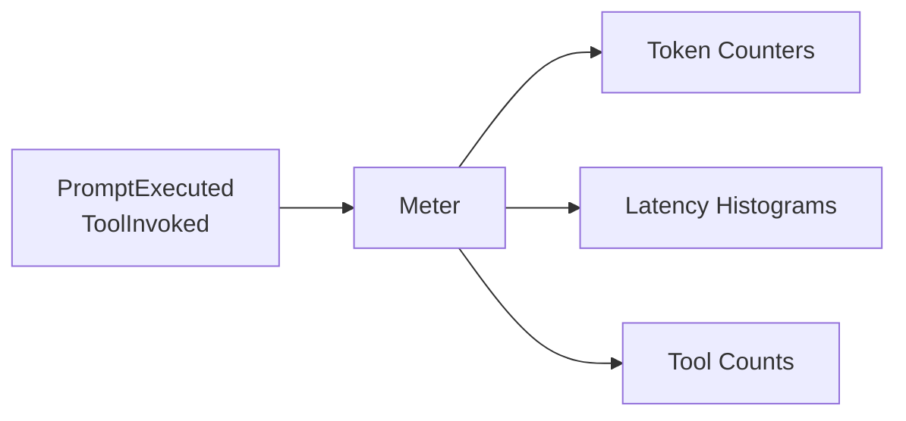

# Metrics Interface Specification

## Purpose

Aggregate runtime metrics from existing WINK events. No new instrumentation
points—just a `Meter` that subscribes to the event bus and accumulates counts.

## Design

Events already carry the data:

- `PromptExecuted.usage` → token counts
- `PromptExecuted.created_at` - `PromptRendered.created_at` → latency
- `ToolInvoked` → tool invocation counts

A `Meter` subscribes to these events and maintains running totals.



## Meter Protocol

```python
class Meter(Protocol):
    """Aggregates metrics from event stream."""

    @property
    def tokens(self) -> TokenUsage:
        """Cumulative token usage."""
        ...

    @property
    def latencies(self) -> tuple[float, ...]:
        """Evaluation latencies in milliseconds."""
        ...

    @property
    def tool_counts(self) -> Mapping[str, int]:
        """Tool invocation counts by name."""
        ...

    def attach(self, bus: Dispatcher) -> None:
        """Subscribe to events."""
        ...

    def detach(self, bus: Dispatcher) -> None:
        """Unsubscribe from events."""
        ...

    def reset(self) -> None:
        """Clear all accumulated metrics."""
        ...
```

## Implementation

```python
@dataclass
class InMemoryMeter:
    """Thread-safe metric aggregation."""

    _input_tokens: int = 0
    _output_tokens: int = 0
    _cached_tokens: int = 0
    _latencies: list[float] = field(default_factory=list)
    _tool_counts: dict[str, int] = field(default_factory=dict)
    _eval_starts: dict[UUID, datetime] = field(default_factory=dict)
    _lock: threading.Lock = field(default_factory=threading.Lock)

    @property
    def tokens(self) -> TokenUsage:
        with self._lock:
            return TokenUsage(
                input_tokens=self._input_tokens,
                output_tokens=self._output_tokens,
                cached_tokens=self._cached_tokens,
            )

    @property
    def latencies(self) -> tuple[float, ...]:
        with self._lock:
            return tuple(self._latencies)

    @property
    def tool_counts(self) -> Mapping[str, int]:
        with self._lock:
            return dict(self._tool_counts)

    def attach(self, bus: Dispatcher) -> None:
        bus.subscribe(PromptRendered, self._on_rendered)
        bus.subscribe(PromptExecuted, self._on_executed)
        bus.subscribe(ToolInvoked, self._on_tool)

    def detach(self, bus: Dispatcher) -> None:
        bus.unsubscribe(PromptRendered, self._on_rendered)
        bus.unsubscribe(PromptExecuted, self._on_executed)
        bus.unsubscribe(ToolInvoked, self._on_tool)

    def reset(self) -> None:
        with self._lock:
            self._input_tokens = 0
            self._output_tokens = 0
            self._cached_tokens = 0
            self._latencies.clear()
            self._tool_counts.clear()
            self._eval_starts.clear()

    def _on_rendered(self, event: PromptRendered) -> None:
        with self._lock:
            self._eval_starts[event.event_id] = event.created_at

    def _on_executed(self, event: PromptExecuted) -> None:
        with self._lock:
            if event.usage:
                self._input_tokens += event.usage.input_tokens or 0
                self._output_tokens += event.usage.output_tokens or 0
                self._cached_tokens += event.usage.cached_tokens or 0

            start = self._eval_starts.pop(event.event_id, None)
            if start:
                duration_ms = (event.created_at - start).total_seconds() * 1000
                self._latencies.append(duration_ms)

    def _on_tool(self, event: ToolInvoked) -> None:
        with self._lock:
            self._tool_counts[event.name] = self._tool_counts.get(event.name, 0) + 1
```

## Histogram Helpers

For latency analysis:

```python
def percentile(values: Sequence[float], p: float) -> float:
    """Compute percentile (0-100) from values."""
    if not values:
        return 0.0
    sorted_vals = sorted(values)
    k = (len(sorted_vals) - 1) * (p / 100)
    f, c = int(k), int(k) + 1
    if c >= len(sorted_vals):
        return sorted_vals[-1]
    return sorted_vals[f] + (k - f) * (sorted_vals[c] - sorted_vals[f])


def histogram_stats(values: Sequence[float]) -> dict[str, float]:
    """Compute common statistics."""
    if not values:
        return {"count": 0, "mean": 0, "p50": 0, "p95": 0, "p99": 0}
    return {
        "count": len(values),
        "mean": sum(values) / len(values),
        "p50": percentile(values, 50),
        "p95": percentile(values, 95),
        "p99": percentile(values, 99),
    }
```

## Usage

```python
from weakincentives.metrics import InMemoryMeter

# Setup
meter = InMemoryMeter()
bus = InProcessDispatcher()
meter.attach(bus)

# Run evaluations
session = Session(bus=bus)
adapter.evaluate(prompt, session=session)

# Read metrics
print(f"Tokens: {meter.tokens.total_tokens}")
print(f"Mean latency: {sum(meter.latencies) / len(meter.latencies):.0f}ms")
print(f"Tool calls: {meter.tool_counts}")

# Cleanup
meter.detach(bus)
```

## Testing

```python
def test_tokens_accumulated():
    meter = InMemoryMeter()
    bus = InProcessDispatcher()
    meter.attach(bus)

    bus.dispatch(PromptExecuted(
        ...,
        usage=TokenUsage(input_tokens=100, output_tokens=50),
    ))

    assert meter.tokens.input_tokens == 100
    assert meter.tokens.output_tokens == 50

def test_tool_counts():
    meter = InMemoryMeter()
    bus = InProcessDispatcher()
    meter.attach(bus)

    bus.dispatch(ToolInvoked(name="search", ...))
    bus.dispatch(ToolInvoked(name="search", ...))
    bus.dispatch(ToolInvoked(name="read", ...))

    assert meter.tool_counts == {"search": 2, "read": 1}
```

## External Backends

For production monitoring (Prometheus, OpenTelemetry), subscribe to the same
events and export in the backend's format. The `Meter` is for in-process use;
external systems handle their own aggregation.

```python
# Prometheus example - subscribe directly to events
def prometheus_handler(event: PromptExecuted) -> None:
    if event.usage:
        tokens_counter.labels(adapter=event.adapter).inc(event.usage.total_tokens)

bus.subscribe(PromptExecuted, prometheus_handler)
```
