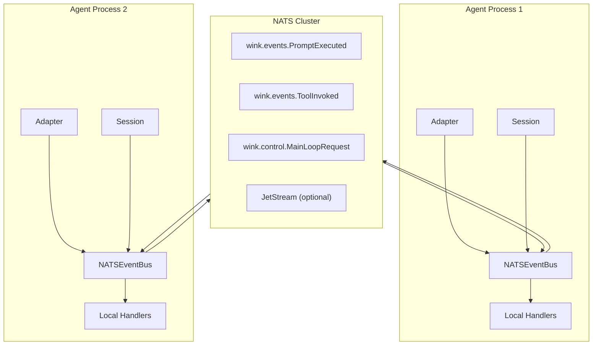
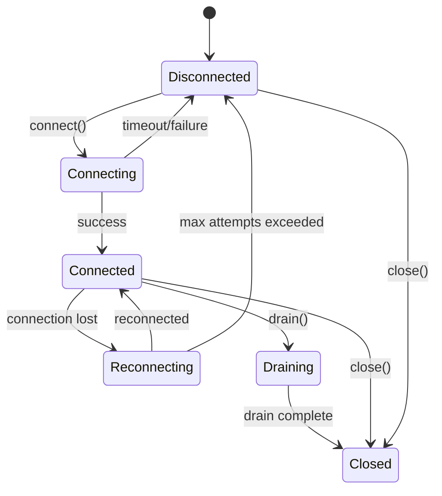
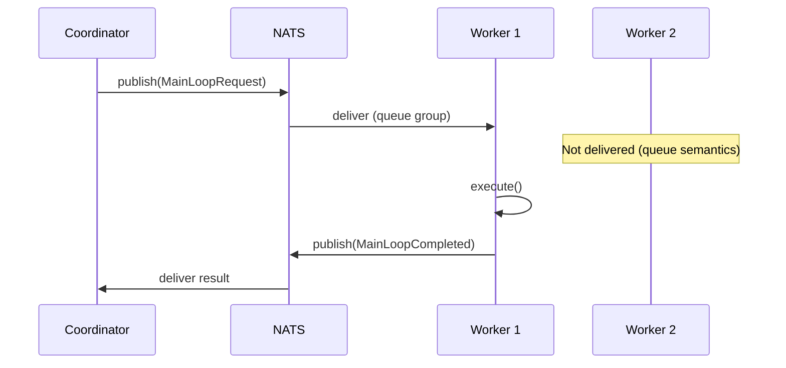

# NATS Integration Specification

## Purpose

This specification details how to integrate [NATS](https://nats.io/) as an
event bus backend for distributed session telemetry and main loop
orchestration. NATS enables cross-process event delivery, horizontal scaling
of agent workers, and durable event persistence via JetStream.

## Guiding Principles

- **Protocol compatibility**: `NATSEventBus` implements the existing `EventBus`
  protocol; all current code works unchanged.
- **Sync-first bridge**: The public API remains synchronous; async NATS
  operations are bridged internally.
- **Graceful degradation**: Network failures are logged and isolated; local
  handlers still execute.
- **Subject-per-type**: Event types map to NATS subjects deterministically,
  enabling targeted subscriptions.
- **Optional persistence**: JetStream integration is opt-in for durability and
  replay.



## Core Components

### NATSEventBus

```python
from weakincentives.runtime.events import EventBus, PublishResult

class NATSEventBus(EventBus):
    """NATS-backed event bus with local and remote delivery."""

    def __init__(
        self,
        *,
        servers: str | list[str] = "nats://localhost:4222",
        subject_prefix: str = "wink.events",
        connect_timeout: float = 5.0,
        reconnect_delay: float = 1.0,
        max_reconnect_attempts: int = 10,
        credentials: NATSCredentials | None = None,
        jetstream: JetStreamConfig | None = None,
        serializer: EventSerializer | None = None,
    ) -> None: ...

    def subscribe(self, event_type: type[object], handler: EventHandler) -> None: ...
    def unsubscribe(self, event_type: type[object], handler: EventHandler) -> bool: ...
    def publish(self, event: object) -> PublishResult: ...

    async def connect(self) -> None: ...
    async def drain(self) -> None: ...
    async def close(self) -> None: ...

    @property
    def is_connected(self) -> bool: ...
```

### NATSControlBus

Specialized bus for main loop request/response orchestration:

```python
class NATSControlBus(NATSEventBus):
    """Control-plane bus optimized for MainLoop request distribution."""

    def __init__(
        self,
        *,
        servers: str | list[str] = "nats://localhost:4222",
        subject_prefix: str = "wink.control",
        queue_group: str | None = None,  # Load balancing across workers
        **kwargs: Any,
    ) -> None: ...
```

### Configuration

```python
@dataclass(slots=True, frozen=True)
class NATSCredentials:
    """Authentication credentials for NATS connection."""

    user: str | None = None
    password: str | None = None
    token: str | None = None
    nkey_seed: str | None = None
    jwt_path: Path | None = None
    nkey_path: Path | None = None


@dataclass(slots=True, frozen=True)
class JetStreamConfig:
    """JetStream configuration for durable event streams."""

    enabled: bool = True
    stream_name: str = "WINK_EVENTS"
    storage: Literal["memory", "file"] = "file"
    retention: Literal["limits", "interest", "workqueue"] = "limits"
    max_msgs: int = 100_000
    max_bytes: int = 100 * 1024 * 1024  # 100MB
    max_age: timedelta = timedelta(hours=24)
    replicas: int = 1
    consumer_name: str | None = None  # Auto-generated if None
    ack_wait: timedelta = timedelta(seconds=30)
    max_deliver: int = 3


@dataclass(slots=True, frozen=True)
class NATSEventBusConfig:
    """Complete configuration for NATSEventBus."""

    servers: str | list[str] = "nats://localhost:4222"
    subject_prefix: str = "wink.events"
    connect_timeout: float = 5.0
    reconnect_delay: float = 1.0
    max_reconnect_attempts: int = 10
    credentials: NATSCredentials | None = None
    jetstream: JetStreamConfig | None = None
```

## Event Serialization

### EventSerializer Protocol

```python
class EventSerializer(Protocol):
    """Serialize and deserialize events for NATS transport."""

    def serialize(self, event: object) -> bytes:
        """Encode event to bytes for NATS payload."""
        ...

    def deserialize(self, data: bytes, event_type: type[object]) -> object:
        """Decode bytes to event instance."""
        ...

    def event_type_from_subject(self, subject: str) -> type[object] | None:
        """Resolve event type from NATS subject."""
        ...
```

### DataclassSerializer (Default)

```python
class DataclassSerializer(EventSerializer):
    """JSON-based serializer using weakincentives.serde."""

    def __init__(
        self,
        *,
        type_registry: dict[str, type[object]] | None = None,
        include_type_header: bool = True,
    ) -> None: ...

    def serialize(self, event: object) -> bytes:
        # Uses weakincentives.serde.to_json()
        envelope = {
            "_type": f"{type(event).__module__}:{type(event).__qualname__}",
            "_timestamp": datetime.now(UTC).isoformat(),
            "payload": to_json_dict(event),
        }
        return json.dumps(envelope).encode("utf-8")

    def deserialize(self, data: bytes, event_type: type[object]) -> object:
        envelope = json.loads(data.decode("utf-8"))
        return from_json_dict(envelope["payload"], event_type)
```

### Subject Mapping

Event types map to NATS subjects via a deterministic scheme:

```python
def event_type_to_subject(event_type: type[object], prefix: str) -> str:
    """Map event type to NATS subject.

    Examples:
        PromptExecuted -> wink.events.PromptExecuted
        MainLoopRequest -> wink.control.MainLoopRequest
        custom.MyEvent -> wink.events.custom.MyEvent
    """
    module = event_type.__module__
    name = event_type.__qualname__

    # Standard library or weakincentives events use short names
    if module.startswith("weakincentives."):
        return f"{prefix}.{name}"

    # Third-party events include module path
    safe_module = module.replace(".", "_")
    return f"{prefix}.{safe_module}.{name}"
```

Subject patterns for wildcards:

| Pattern | Matches |
|---------|---------|
| `wink.events.>` | All telemetry events |
| `wink.events.ToolInvoked` | Only ToolInvoked |
| `wink.control.>` | All control events |
| `wink.*.MainLoop*` | MainLoop events across prefixes |

## Connection Lifecycle

### Initialization

```python
from weakincentives.contrib.nats import NATSEventBus, NATSEventBusConfig

# Synchronous initialization (connects on first publish/subscribe)
bus = NATSEventBus(servers="nats://localhost:4222")

# Explicit connection control
import asyncio
asyncio.run(bus.connect())

# Or use context manager
async with NATSEventBus.connected(config=config) as bus:
    session = Session(bus=bus)
    # ... use session ...
```

### Connection States



### Reconnection Strategy

```python
async def _reconnect_loop(self) -> None:
    """Exponential backoff reconnection with jitter."""
    attempt = 0
    while attempt < self._max_reconnect_attempts:
        delay = self._reconnect_delay * (2 ** attempt)
        jitter = random.uniform(0, delay * 0.1)
        await asyncio.sleep(delay + jitter)

        try:
            await self._nc.connect(servers=self._servers)
            await self._resubscribe_all()
            logger.info("Reconnected to NATS after %d attempts", attempt + 1)
            return
        except Exception as e:
            logger.warning("Reconnect attempt %d failed: %s", attempt + 1, e)
            attempt += 1

    logger.error("Max reconnection attempts exceeded")
    self._connection_state = ConnectionState.DISCONNECTED
```

## Publish Semantics

### Local-First Delivery

```python
def publish(self, event: object) -> PublishResult:
    """Publish event locally first, then to NATS."""

    # 1. Invoke local handlers synchronously (same as InProcessEventBus)
    with self._lock:
        handlers = tuple(self._handlers.get(type(event), ()))

    invoked: list[EventHandler] = []
    failures: list[HandlerFailure] = []

    for handler in handlers:
        invoked.append(handler)
        try:
            handler(event)
        except Exception as error:
            failures.append(HandlerFailure(handler=handler, error=error))

    # 2. Publish to NATS asynchronously (fire-and-forget)
    if self._is_connected:
        try:
            subject = self._event_type_to_subject(type(event))
            payload = self._serializer.serialize(event)
            self._publish_async(subject, payload)
        except Exception as e:
            logger.warning("NATS publish failed: %s", e)
            # Does not affect PublishResult - network failures are isolated

    return PublishResult(
        event=event,
        handlers_invoked=tuple(invoked),
        errors=tuple(failures),
    )
```

### Delivery Guarantees

| Mode | Guarantee | Use Case |
|------|-----------|----------|
| Core NATS | At-most-once | Telemetry, metrics |
| JetStream | At-least-once | Critical events, audit |
| JetStream + dedup | Exactly-once | Financial, state sync |

### JetStream Publishing

```python
async def _publish_jetstream(self, subject: str, payload: bytes) -> None:
    """Publish with JetStream acknowledgment."""
    ack = await self._js.publish(
        subject,
        payload,
        timeout=self._config.jetstream.ack_wait.total_seconds(),
    )
    logger.debug("JetStream ack: stream=%s, seq=%d", ack.stream, ack.seq)
```

## Subscribe Semantics

### Local Handler Registration

```python
def subscribe(self, event_type: type[object], handler: EventHandler) -> None:
    """Register local handler and NATS subscription."""

    with self._lock:
        handlers = self._handlers.setdefault(event_type, [])
        handlers.append(handler)

        # Subscribe to NATS subject if not already subscribed
        if event_type not in self._nats_subscriptions:
            subject = self._event_type_to_subject(event_type)
            self._subscribe_async(subject, event_type)
```

### Remote Event Reception

```python
async def _on_nats_message(
    self,
    msg: nats.aio.client.Msg,
    event_type: type[object],
) -> None:
    """Handle incoming NATS message."""

    try:
        event = self._serializer.deserialize(msg.data, event_type)
    except Exception as e:
        logger.error("Failed to deserialize event: %s", e)
        if self._jetstream_enabled:
            await msg.nak()  # Negative ack for retry
        return

    # Dispatch to local handlers
    with self._lock:
        handlers = tuple(self._handlers.get(event_type, ()))

    for handler in handlers:
        try:
            handler(event)
        except Exception as e:
            logger.exception("Handler failed: %s", e)

    if self._jetstream_enabled:
        await msg.ack()
```

### Queue Groups (Load Balancing)

```python
# Workers in same queue group receive round-robin distribution
control_bus = NATSControlBus(
    servers="nats://localhost:4222",
    queue_group="agent-workers",  # Load balance MainLoopRequest
)

# Each request goes to exactly one worker
control_bus.subscribe(MainLoopRequest, handle_request)
```

## Session Integration

### Distributed Session Factory

```python
def create_distributed_session(
    *,
    nats_config: NATSEventBusConfig,
    session_id: UUID | None = None,
) -> Session:
    """Create a session with NATS-backed telemetry bus."""

    bus = NATSEventBus(**asdict(nats_config))
    return Session(bus=bus, session_id=session_id)
```

### Session State Synchronization

Sessions are **process-local** by design. For distributed state:

```python
# Option 1: Snapshot and restore (recommended)
snapshot = session.snapshot()
json_str = snapshot.to_json()

# Publish snapshot to NATS for other processes
bus.publish(SessionSnapshot(session_id=session.session_id, data=json_str))

# Other process receives and restores
def on_snapshot(event: SessionSnapshot) -> None:
    loaded = Snapshot.from_json(event.data)
    local_session.restore(loaded)


# Option 2: Event replay (advanced)
# Subscribe to all events for a session_id, replay in order
```

### Telemetry Aggregation

```python
# Central telemetry aggregator subscribes to all events
aggregator_bus = NATSEventBus(subject_prefix="wink.events")

aggregator_bus.subscribe(PromptExecuted, record_execution)
aggregator_bus.subscribe(ToolInvoked, record_tool_call)
aggregator_bus.subscribe(PromptRendered, record_render)
```

## MainLoop Integration

### Distributed Work Queue



### Coordinator Pattern

```python
class DistributedCoordinator:
    """Distributes work via NATS, collects results."""

    def __init__(self, *, control_bus: NATSControlBus) -> None:
        self._bus = control_bus
        self._pending: dict[UUID, asyncio.Future[MainLoopCompleted]] = {}

        control_bus.subscribe(MainLoopCompleted, self._on_completed)
        control_bus.subscribe(MainLoopFailed, self._on_failed)

    def submit(
        self,
        request: UserRequestT,
        *,
        budget: Budget | None = None,
        deadline: Deadline | None = None,
    ) -> UUID:
        """Submit request for distributed processing."""
        req = MainLoopRequest(
            request=request,
            budget=budget,
            deadline=deadline,
        )
        self._pending[req.request_id] = asyncio.get_event_loop().create_future()
        self._bus.publish(req)
        return req.request_id

    async def wait(self, request_id: UUID, timeout: float = 300.0) -> MainLoopCompleted:
        """Wait for request completion."""
        future = self._pending[request_id]
        return await asyncio.wait_for(future, timeout=timeout)

    def _on_completed(self, event: MainLoopCompleted) -> None:
        if future := self._pending.pop(event.request_id, None):
            future.set_result(event)

    def _on_failed(self, event: MainLoopFailed) -> None:
        if future := self._pending.pop(event.request_id, None):
            future.set_exception(event.error)
```

### Worker Pattern

```python
class DistributedWorker:
    """Processes MainLoopRequest from NATS queue."""

    def __init__(
        self,
        *,
        loop: MainLoop[UserRequestT, OutputT],
        control_bus: NATSControlBus,
    ) -> None:
        self._loop = loop
        self._bus = control_bus

        # Subscribe with queue group for load balancing
        control_bus.subscribe(MainLoopRequest, self._handle_request)

    def _handle_request(self, event: MainLoopRequest[UserRequestT]) -> None:
        try:
            response, session = self._loop.execute(
                event.request,
                budget=event.budget,
                deadline=event.deadline,
            )
            completed = MainLoopCompleted(
                request_id=event.request_id,
                response=response,
                session_id=session.session_id,
            )
            self._bus.publish(completed)
        except Exception as exc:
            failed = MainLoopFailed(
                request_id=event.request_id,
                error=exc,
                session_id=None,
            )
            self._bus.publish(failed)
```

## Error Handling

### Connection Errors

| Error | Behavior |
|-------|----------|
| Initial connect timeout | Raise `NATSConnectionError` |
| Publish during disconnect | Log warning, skip NATS publish |
| Subscribe during disconnect | Queue subscription for reconnect |
| Message deserialize failure | Log error, NAK (JetStream) or skip |

### Error Types

```python
class NATSEventBusError(WinkError):
    """Base exception for NATS event bus errors."""


class NATSConnectionError(NATSEventBusError):
    """Failed to connect to NATS server."""

    servers: list[str]
    timeout: float


class NATSSerializationError(NATSEventBusError):
    """Failed to serialize or deserialize event."""

    event_type: type[object]
    cause: Exception


class NATSPublishError(NATSEventBusError):
    """Failed to publish event to NATS."""

    subject: str
    cause: Exception
```

### Graceful Degradation

```python
def publish(self, event: object) -> PublishResult:
    # Local handlers always execute
    result = self._publish_local(event)

    # NATS publish is best-effort
    if self._is_connected:
        try:
            self._publish_to_nats(event)
        except Exception as e:
            # Log but don't fail - local delivery succeeded
            logger.warning(
                "NATS publish failed for %s: %s",
                type(event).__name__,
                e,
            )

    return result
```

## Security

### Authentication Methods

```python
# Token auth
bus = NATSEventBus(
    credentials=NATSCredentials(token="secret-token"),
)

# User/password
bus = NATSEventBus(
    credentials=NATSCredentials(user="agent", password="secret"),
)

# NKey (Ed25519)
bus = NATSEventBus(
    credentials=NATSCredentials(nkey_seed="SUAM..."),
)

# JWT + NKey (decentralized auth)
bus = NATSEventBus(
    credentials=NATSCredentials(
        jwt_path=Path("/etc/nats/agent.jwt"),
        nkey_path=Path("/etc/nats/agent.nkey"),
    ),
)
```

### TLS Configuration

```python
@dataclass(slots=True, frozen=True)
class NATSTLSConfig:
    """TLS settings for NATS connection."""

    enabled: bool = True
    ca_file: Path | None = None
    cert_file: Path | None = None
    key_file: Path | None = None
    verify: bool = True


bus = NATSEventBus(
    servers="tls://nats.example.com:4222",
    tls=NATSTLSConfig(
        ca_file=Path("/etc/ssl/ca.pem"),
        cert_file=Path("/etc/ssl/client.pem"),
        key_file=Path("/etc/ssl/client-key.pem"),
    ),
)
```

### Subject Authorization

NATS supports subject-level permissions. Recommended ACL:

```
# Agent workers
agent-worker {
    subscribe: ["wink.control.MainLoopRequest"]
    publish: ["wink.control.MainLoopCompleted", "wink.control.MainLoopFailed"]
    publish: ["wink.events.>"]
}

# Coordinators
coordinator {
    publish: ["wink.control.MainLoopRequest"]
    subscribe: ["wink.control.MainLoopCompleted", "wink.control.MainLoopFailed"]
}

# Telemetry aggregators
aggregator {
    subscribe: ["wink.events.>"]
}
```

## Observability

### Metrics

```python
@dataclass(slots=True)
class NATSEventBusMetrics:
    """Metrics for NATS event bus monitoring."""

    messages_published: int = 0
    messages_received: int = 0
    publish_errors: int = 0
    deserialize_errors: int = 0
    reconnect_attempts: int = 0
    current_subscriptions: int = 0

    # Latency histograms (when timing enabled)
    publish_latency_ms: list[float] = field(default_factory=list)
    handler_latency_ms: list[float] = field(default_factory=list)
```

### Health Check

```python
async def health_check(self) -> NATSHealthStatus:
    """Check NATS connection health."""
    return NATSHealthStatus(
        connected=self._nc.is_connected,
        server=self._nc.connected_url,
        pending_bytes=self._nc.pending_data_size,
        subscriptions=len(self._nats_subscriptions),
        jetstream_enabled=self._jetstream_enabled,
    )
```

### Tracing

Events include correlation IDs for distributed tracing:

```python
@FrozenDataclass()
class NATSEventEnvelope:
    """Wire format for NATS events with tracing context."""

    event_type: str
    payload: dict[str, Any]
    timestamp: datetime
    trace_id: str | None = None
    span_id: str | None = None
    session_id: UUID | None = None
```

## Usage Examples

### Basic Telemetry

```python
from weakincentives.contrib.nats import NATSEventBus
from weakincentives.runtime import Session

# Create NATS-backed bus
bus = NATSEventBus(servers="nats://localhost:4222")

# Session uses NATS for telemetry
session = Session(bus=bus)

# Events published locally AND to NATS
response = adapter.evaluate(prompt, session=session, bus=bus)
```

### Distributed Main Loop

```python
from weakincentives.contrib.nats import NATSControlBus, DistributedWorker

# Worker process
control_bus = NATSControlBus(
    servers="nats://nats.internal:4222",
    queue_group="code-reviewers",
)

loop = CodeReviewLoop(adapter=adapter, bus=control_bus)
worker = DistributedWorker(loop=loop, control_bus=control_bus)

# Run forever, processing requests
await worker.run()
```

### JetStream Durability

```python
from weakincentives.contrib.nats import NATSEventBus, JetStreamConfig

bus = NATSEventBus(
    servers="nats://localhost:4222",
    jetstream=JetStreamConfig(
        enabled=True,
        stream_name="AGENT_EVENTS",
        retention="limits",
        max_age=timedelta(days=7),
    ),
)

# Events persisted to JetStream
# Consumers can replay from any point
```

## Testing

### Mock NATS Bus

```python
class MockNATSEventBus(NATSEventBus):
    """In-memory NATS bus for testing."""

    def __init__(self) -> None:
        self._published: list[tuple[str, bytes]] = []
        self._handlers: dict[type[object], list[EventHandler]] = {}

    def publish(self, event: object) -> PublishResult:
        # Record for assertions
        subject = self._event_type_to_subject(type(event))
        payload = self._serializer.serialize(event)
        self._published.append((subject, payload))

        # Deliver locally
        return self._publish_local(event)

    @property
    def published_events(self) -> list[tuple[str, bytes]]:
        return list(self._published)
```

### Integration Test Fixtures

```python
import pytest

@pytest.fixture
async def nats_bus():
    """Provide connected NATS bus for integration tests."""
    bus = NATSEventBus(servers="nats://localhost:4222")
    await bus.connect()
    yield bus
    await bus.drain()
    await bus.close()


@pytest.fixture
def nats_server():
    """Start embedded NATS server for tests."""
    # Use nats-py test utilities or subprocess
    ...
```

## Limitations

- **Sync bridge overhead**: Async NATS operations are bridged to sync API via
  internal event loop; adds minor latency.
- **No transaction support**: Events are published individually; no atomic
  multi-event transactions.
- **Session state is local**: Only events are distributed; session slices
  require explicit snapshot/restore for cross-process sync.
- **Subject length limits**: NATS subjects limited to 255 characters; deeply
  nested event types may truncate.
- **JetStream ordering**: Within a single subject, order is preserved; across
  subjects, no global ordering guarantee.
- **Serialization constraints**: Events must be JSON-serializable via
  weakincentives.serde; binary payloads require base64 encoding.

## Dependencies

```toml
[project.optional-dependencies]
nats = [
    "nats-py>=2.7.0",
]
```

## Future Considerations

- **Request/reply pattern**: Native NATS request/reply for synchronous RPC
- **Key-value store**: NATS KV for distributed session state
- **Object store**: NATS Object Store for large payloads (workspace snapshots)
- **Cluster awareness**: Automatic failover across NATS cluster nodes
- **Schema registry**: Event schema versioning and compatibility checking
