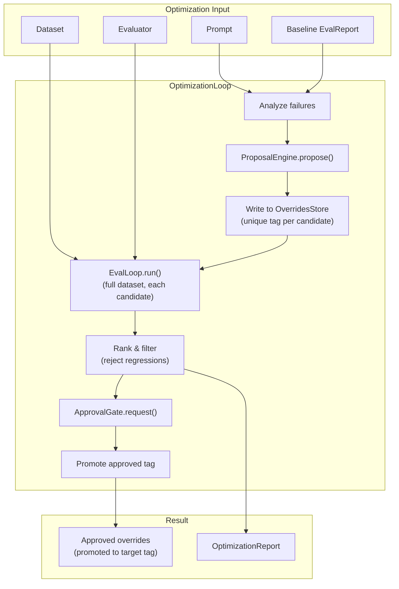

# Optimization Loop Specification

## Purpose

Closed-loop prompt optimization that proposes changes, validates them against
full evaluation datasets, and surfaces improvements for human approval before
installation. Built on composition with EvalLoop rather than reimplementing
evaluation logic.

## Guiding Principles

- **EvalLoop composition**: OptimizationLoop delegates evaluation to EvalLoop,
  never duplicates scoring logic.
- **Override-native**: Candidates are written to the override store with unique
  tags; no prompt patching or reconstruction in the optimization layer.
- **Regression-safe**: Every candidate is evaluated against the full dataset to
  detect regressions on passing samples.
- **Human-in-the-loop**: Proposals surface for explicit approval before
  promotion to production tags.
- **Experiment-centric**: All optimization activity occurs within an Experiment
  context that flows through to tool handlers.



## Experiment

An Experiment represents an isolated optimization context backed by an overrides
tag. It carries feature flags and flows through the entire evaluation stack to
tool handlers via ToolContext.

### Core Type

```python
@dataclass(slots=True, frozen=True)
class Experiment:
    """Isolated optimization context backed by an overrides tag."""

    id: str                          # Unique identifier (e.g., UUID or slug)
    name: str                        # Human-readable name
    overrides_tag: str               # Tag in PromptOverridesStore
    parent_tag: str | None = None    # Tag this was derived from (lineage)
    flags: dict[str, bool] = field(default_factory=dict)  # Feature flags
    created_at: datetime = field(default_factory=lambda: datetime.now(UTC))
```

**Fields:**

- `id`: Machine identifier, unique within an optimization run
- `name`: Display name (e.g., "baseline", "candidate-0", "candidate-1")
- `overrides_tag`: The tag used to resolve overrides from the store
- `parent_tag`: The tag this experiment derived from (enables lineage tracking)
- `flags`: Boolean feature flags for conditional behavior in tool handlers

### Experiment in ToolContext

Experiment is accessible via the ResourceRegistry pattern:

```python
@dataclass(slots=True, frozen=True)
class ToolContext:
    # ... existing fields ...
    resources: ResourceRegistry = field(default_factory=ResourceRegistry)

    @property
    def experiment(self) -> Experiment | None:
        """Current experiment context, if any."""
        return self.resources.get(Experiment)
```

Tool handlers access the experiment for flag-based behavior:

```python
def my_handler(params: Params, *, context: ToolContext) -> ToolResult[Result]:
    exp = context.experiment
    if exp is None:
        # No experiment context - use defaults
        return handle_default(params)

    # Check feature flags
    if exp.flags.get("use_new_algorithm", False):
        return handle_with_new_algorithm(params)

    return handle_default(params)
```

### Experiment Lifecycle

```
┌─────────────┐     ┌─────────────┐     ┌─────────────┐
│   CREATE    │     │  EVALUATE   │     │   DECIDE    │
│             │     │             │     │             │
│ Write to    │────▶│ EvalLoop    │────▶│ Approve?    │
│ store with  │     │ with tag    │     │             │
│ unique tag  │     │             │     │             │
└─────────────┘     └─────────────┘     └──────┬──────┘
                                               │
                         ┌─────────────────────┴─────────────────────┐
                         │                                           │
                         ▼                                           ▼
                  ┌─────────────┐                             ┌─────────────┐
                  │   PROMOTE   │                             │   DISCARD   │
                  │             │                             │             │
                  │ copy_tag    │                             │ delete_tag  │
                  │ exp→stable  │                             │ (cleanup)   │
                  └─────────────┘                             └─────────────┘
```

## Proposal Engine

The ProposalEngine generates candidate prompt modifications targeting evaluation
failures.

### Protocol

```python
class ProposalEngine(Protocol):
    """Generates candidate prompt modifications."""

    def propose(
        self,
        prompt: PromptDescriptor,
        failures: Sequence[FailedSample],
        *,
        adapter: ProviderAdapter[object],
        session: Session,
        max_candidates: int = 3,
    ) -> Sequence[OptimizationProposal]:
        """Generate candidate modifications targeting failures.

        Args:
            prompt: Descriptor of prompt to optimize
            failures: Samples that failed evaluation
            adapter: Provider for LLM-based proposal generation
            session: Session for state and events
            max_candidates: Maximum proposals to generate

        Returns:
            Sequence of proposed modifications
        """
        ...
```

### OptimizationProposal

```python
@dataclass(slots=True, frozen=True)
class SectionEdit:
    """Proposed edit to a single section."""

    path: tuple[str, ...]      # Section path in prompt
    original_hash: HexDigest   # Hash of original content
    proposed_body: str         # New section body
    rationale: str             # Why this change helps


@dataclass(slots=True, frozen=True)
class OptimizationProposal:
    """Complete proposal for prompt modification."""

    id: str                              # Unique identifier
    edits: tuple[SectionEdit, ...]       # Proposed section changes
    target_failures: tuple[str, ...]     # Sample IDs this targets
    created_at: datetime = field(default_factory=lambda: datetime.now(UTC))
```

### Built-in Strategies

**CriticStrategy**: Uses an LLM to analyze failures and propose targeted edits.

```python
class CriticStrategy:
    """LLM-based proposal generation via failure analysis."""

    def __init__(
        self,
        *,
        critic_prompt: Prompt[CriticOutput],
        proposal_prompt: Prompt[ProposalOutput],
    ) -> None: ...

    def propose(
        self,
        prompt: PromptDescriptor,
        failures: Sequence[FailedSample],
        *,
        adapter: ProviderAdapter[object],
        session: Session,
        max_candidates: int = 3,
    ) -> Sequence[OptimizationProposal]: ...
```

Workflow:
1. Render failure examples with prompt context
2. Invoke critic prompt to identify weaknesses
3. Invoke proposal prompt to generate edits addressing weaknesses
4. Return ranked candidates

## Candidate Evaluation

Each proposal is written to the override store and evaluated against the full
dataset.

### ExperimentResult

```python
@dataclass(slots=True, frozen=True)
class ExperimentResult:
    """Outcome of evaluating an experiment."""

    experiment: Experiment
    eval_report: EvalReport
    evaluated_at: datetime


@dataclass(slots=True, frozen=True)
class CandidateComparison:
    """Comparison of candidate against baseline."""

    experiment: Experiment
    proposal: OptimizationProposal
    baseline: ExperimentResult
    candidate: ExperimentResult

    @property
    def net_improvement(self) -> float:
        """Pass rate delta (positive = improvement)."""
        return (
            self.candidate.eval_report.pass_rate
            - self.baseline.eval_report.pass_rate
        )

    @property
    def fixes(self) -> tuple[SampleDelta, ...]:
        """Samples that failed before but pass now."""
        baseline_failed = {
            r.sample_id
            for r in self.baseline.eval_report.results
            if r.success and not r.score.passed
        }
        return tuple(
            SampleDelta(
                sample_id=r.sample_id,
                baseline_score=self._baseline_score(r.sample_id),
                candidate_score=r.score,
            )
            for r in self.candidate.eval_report.results
            if r.sample_id in baseline_failed and r.score.passed
        )

    @property
    def regressions(self) -> tuple[SampleDelta, ...]:
        """Samples that passed before but fail now."""
        baseline_passed = {
            r.sample_id
            for r in self.baseline.eval_report.results
            if r.success and r.score.passed
        }
        return tuple(
            SampleDelta(
                sample_id=r.sample_id,
                baseline_score=self._baseline_score(r.sample_id),
                candidate_score=r.score,
            )
            for r in self.candidate.eval_report.results
            if r.sample_id in baseline_passed and not r.score.passed
        )


@dataclass(slots=True, frozen=True)
class SampleDelta:
    """Score change for a single sample."""

    sample_id: str
    baseline_score: Score
    candidate_score: Score
```

### Regression Policy

Controls which candidates are viable:

```python
@dataclass(slots=True, frozen=True)
class RegressionPolicy:
    """Policy for accepting candidates with regressions."""

    allow_regressions: bool = False        # Hard gate: any regression rejects
    max_regression_count: int = 0          # Soft gate: reject if exceeded
    min_net_improvement: float = 0.0       # Minimum pass rate improvement

    def accepts(self, comparison: CandidateComparison) -> bool:
        """Check if candidate meets policy requirements."""
        if not self.allow_regressions and comparison.regressions:
            return False
        if len(comparison.regressions) > self.max_regression_count:
            return False
        if comparison.net_improvement < self.min_net_improvement:
            return False
        return True
```

## Approval Gate

Surfaces candidates for human review before installation.

### Protocol

```python
class ApprovalGate(Protocol):
    """Surfaces candidates for human approval."""

    def request(
        self,
        candidates: Sequence[ApprovalRequest],
    ) -> Sequence[ApprovalDecision]:
        """Request approval for ranked candidates.

        Args:
            candidates: Ranked candidates with full evaluation evidence

        Returns:
            Approval decisions (may be subset if reviewer stops early)
        """
        ...
```

### ApprovalRequest

Rich context for human review:

```python
@dataclass(slots=True, frozen=True)
class ApprovalRequest:
    """Request for human approval of a candidate."""

    proposal: OptimizationProposal
    comparison: CandidateComparison

    # Pre-computed for display
    @property
    def diff_view(self) -> str:
        """Unified diff of all section changes."""
        ...

    @property
    def summary(self) -> str:
        """Human-readable summary of changes and impact."""
        ...
```

### ApprovalDecision

```python
@dataclass(slots=True, frozen=True)
class ApprovalDecision:
    """Human decision on a candidate."""

    proposal_id: str
    approved: bool
    reviewer: str                    # Identifier of approver
    reason: str | None = None        # Optional explanation
    decided_at: datetime = field(default_factory=lambda: datetime.now(UTC))
```

### Built-in Gates

**MailboxApprovalGate**: Async approval via mailbox pattern.

```python
class MailboxApprovalGate:
    """Approval gate using mailbox for async human review."""

    def __init__(
        self,
        *,
        requests: Mailbox[ApprovalRequest],
        decisions: Mailbox[ApprovalDecision],
        timeout: timedelta = timedelta(hours=24),
    ) -> None: ...
```

**CallbackApprovalGate**: Synchronous callback for embedded UIs.

```python
class CallbackApprovalGate:
    """Approval gate using callback for interactive review."""

    def __init__(
        self,
        callback: Callable[[ApprovalRequest], ApprovalDecision],
    ) -> None: ...
```

## Override Store Extensions

Additional methods for experiment lifecycle management:

```python
class PromptOverridesStore(Protocol):
    # Existing methods...

    def copy_tag(
        self,
        *,
        ns: str,
        prompt_key: str,
        from_tag: str,
        to_tag: str,
    ) -> None:
        """Copy all overrides from one tag to another.

        Used for promoting approved experiments to production tags.
        """
        ...

    def delete_tag(
        self,
        *,
        ns: str,
        prompt_key: str,
        tag: str,
    ) -> None:
        """Delete all overrides for a tag.

        Used for cleaning up rejected experiments.
        """
        ...

    def list_tags(
        self,
        *,
        ns: str,
        prompt_key: str,
    ) -> Sequence[str]:
        """List all tags for a prompt.

        Used for experiment discovery and cleanup.
        """
        ...
```

## OptimizationLoop

The main orchestrator composing ProposalEngine, EvalLoop, and ApprovalGate.

### Configuration

```python
@dataclass(slots=True, frozen=True)
class OptimizationConfig:
    """Configuration for optimization loop."""

    max_candidates: int = 3              # Proposals per iteration
    max_iterations: int = 1              # Optimization rounds
    baseline_tag: str = "stable"         # Tag for baseline evaluation
    target_tag: str = "stable"           # Tag to promote approved changes to
    experiment_prefix: str = "exp"       # Prefix for experiment tags
    cleanup_rejected: bool = True        # Delete rejected experiment tags
    regression_policy: RegressionPolicy = field(default_factory=RegressionPolicy)
```

### Core Class

```python
class OptimizationLoop(Generic[InputT, OutputT, ExpectedT]):
    """Closed-loop prompt optimization with human approval."""

    def __init__(
        self,
        *,
        eval_loop: EvalLoop[InputT, OutputT, ExpectedT],
        proposal_engine: ProposalEngine,
        approval_gate: ApprovalGate,
        overrides_store: PromptOverridesStore,
        config: OptimizationConfig = OptimizationConfig(),
    ) -> None:
        self._eval_loop = eval_loop
        self._proposal_engine = proposal_engine
        self._approval_gate = approval_gate
        self._store = overrides_store
        self._config = config

    def run(
        self,
        prompt: Prompt[InputT],
        dataset: Dataset[InputT, ExpectedT],
        evaluator: Evaluator[OutputT, ExpectedT],
        *,
        baseline: EvalReport | None = None,
        flags: dict[str, bool] | None = None,
    ) -> OptimizationResult:
        """Run optimization loop.

        Args:
            prompt: Prompt to optimize
            dataset: Full evaluation dataset
            evaluator: Scoring function
            baseline: Pre-computed baseline (computed if None)
            flags: Feature flags propagated to all experiments

        Returns:
            OptimizationResult with approval outcomes and metrics
        """
        ...
```

### Execution Flow

```python
def run(
    self,
    prompt: Prompt[InputT],
    dataset: Dataset[InputT, ExpectedT],
    evaluator: Evaluator[OutputT, ExpectedT],
    *,
    baseline: EvalReport | None = None,
    flags: dict[str, bool] | None = None,
) -> OptimizationResult:
    experiment_id = generate_experiment_id()
    flags = flags or {}

    # 1. Establish baseline
    baseline_exp = Experiment(
        id=f"{experiment_id}-baseline",
        name="baseline",
        overrides_tag=self._config.baseline_tag,
        flags=flags,
    )
    baseline_result = self._evaluate_experiment(
        prompt, dataset, evaluator, baseline_exp
    )

    # 2. Generate proposals targeting failures
    failures = baseline_result.eval_report.failed_samples()
    proposals = self._proposal_engine.propose(
        descriptor_for_prompt(prompt),
        failures,
        adapter=self._eval_loop.adapter,
        session=self._create_session(),
        max_candidates=self._config.max_candidates,
    )

    # 3. Create and evaluate candidate experiments
    comparisons: list[CandidateComparison] = []
    for i, proposal in enumerate(proposals):
        candidate_exp = self._create_candidate_experiment(
            experiment_id, i, proposal, baseline_exp, flags
        )
        candidate_result = self._evaluate_experiment(
            prompt, dataset, evaluator, candidate_exp
        )
        comparisons.append(CandidateComparison(
            experiment=candidate_exp,
            proposal=proposal,
            baseline=baseline_result,
            candidate=candidate_result,
        ))

    # 4. Filter by regression policy
    viable = [
        c for c in comparisons
        if self._config.regression_policy.accepts(c)
    ]
    ranked = sorted(viable, key=lambda c: c.net_improvement, reverse=True)

    # 5. Surface for approval
    requests = [ApprovalRequest(proposal=c.proposal, comparison=c) for c in ranked]
    decisions = self._approval_gate.request(requests)

    # 6. Process decisions
    approved: list[CandidateComparison] = []
    rejected: list[CandidateComparison] = []

    for decision in decisions:
        comparison = next(c for c in ranked if c.proposal.id == decision.proposal_id)
        if decision.approved:
            self._promote_experiment(
                prompt, comparison.experiment, self._config.target_tag
            )
            approved.append(comparison)
        else:
            if self._config.cleanup_rejected:
                self._cleanup_experiment(prompt, comparison.experiment)
            rejected.append(comparison)

    return OptimizationResult(
        experiment_id=experiment_id,
        baseline=baseline_result,
        candidates=comparisons,
        approved=tuple(approved),
        rejected=tuple(rejected),
        decisions=tuple(decisions),
    )

def _create_candidate_experiment(
    self,
    experiment_id: str,
    index: int,
    proposal: OptimizationProposal,
    baseline: Experiment,
    flags: dict[str, bool],
) -> Experiment:
    """Create experiment for a candidate proposal."""
    tag = f"{self._config.experiment_prefix}-{experiment_id}-{index}"

    # Write proposal edits to override store
    for edit in proposal.edits:
        self._store.set_section_override(
            prompt,
            tag=tag,
            path=edit.path,
            body=edit.proposed_body,
        )

    return Experiment(
        id=f"{experiment_id}-candidate-{index}",
        name=f"candidate-{index}",
        overrides_tag=tag,
        parent_tag=baseline.overrides_tag,
        flags=flags,
    )

def _evaluate_experiment(
    self,
    prompt: Prompt[InputT],
    dataset: Dataset[InputT, ExpectedT],
    evaluator: Evaluator[OutputT, ExpectedT],
    experiment: Experiment,
) -> ExperimentResult:
    """Evaluate prompt with experiment's overrides tag."""
    report = self._eval_loop.run(
        prompt,
        dataset,
        evaluator,
        overrides_tag=experiment.overrides_tag,
        experiment=experiment,  # Propagated to ToolContext
    )
    return ExperimentResult(
        experiment=experiment,
        eval_report=report,
        evaluated_at=datetime.now(UTC),
    )

def _promote_experiment(
    self,
    prompt: Prompt[InputT],
    experiment: Experiment,
    target_tag: str,
) -> None:
    """Promote experiment overrides to target tag."""
    descriptor = descriptor_for_prompt(prompt)
    self._store.copy_tag(
        ns=descriptor.ns,
        prompt_key=descriptor.key,
        from_tag=experiment.overrides_tag,
        to_tag=target_tag,
    )

def _cleanup_experiment(
    self,
    prompt: Prompt[InputT],
    experiment: Experiment,
) -> None:
    """Delete experiment overrides."""
    descriptor = descriptor_for_prompt(prompt)
    self._store.delete_tag(
        ns=descriptor.ns,
        prompt_key=descriptor.key,
        tag=experiment.overrides_tag,
    )
```

### OptimizationResult

```python
@dataclass(slots=True, frozen=True)
class OptimizationResult:
    """Complete result of an optimization run."""

    experiment_id: str
    baseline: ExperimentResult
    candidates: tuple[CandidateComparison, ...]
    approved: tuple[CandidateComparison, ...]
    rejected: tuple[CandidateComparison, ...]
    decisions: tuple[ApprovalDecision, ...]

    @property
    def improved(self) -> bool:
        """True if any candidate was approved."""
        return len(self.approved) > 0

    @property
    def best_improvement(self) -> float:
        """Largest pass rate improvement among approved candidates."""
        if not self.approved:
            return 0.0
        return max(c.net_improvement for c in self.approved)
```

## EvalLoop Integration

EvalLoop must accept and propagate experiment context:

```python
class EvalLoop(Generic[InputT, OutputT, ExpectedT]):
    def run(
        self,
        prompt: Prompt[InputT],
        dataset: Dataset[InputT, ExpectedT],
        evaluator: Evaluator[OutputT, ExpectedT],
        *,
        overrides_tag: str = "latest",
        experiment: Experiment | None = None,  # New parameter
    ) -> EvalReport:
        """Run evaluation with optional experiment context.

        Args:
            prompt: Prompt to evaluate
            dataset: Evaluation samples
            evaluator: Scoring function
            overrides_tag: Tag for override resolution
            experiment: Experiment context propagated to ToolContext

        Returns:
            Aggregate evaluation report
        """
        ...
```

MainLoop propagates experiment to ToolContext via ResourceRegistry:

```python
def _build_tool_context(
    self,
    experiment: Experiment | None,
    # ... other args
) -> ToolContext:
    resources = ResourceRegistry.build({
        Experiment: experiment,
        # ... other resources
    }) if experiment else ResourceRegistry()

    return ToolContext(
        # ... other fields
        resources=resources,
    )
```

## Events

Optimization activity emits events for observability:

```python
@dataclass(slots=True, frozen=True)
class OptimizationLoopStarted:
    """Emitted when optimization loop begins."""

    experiment_id: str
    prompt_ns: str
    prompt_key: str
    dataset_size: int
    baseline_tag: str
    created_at: datetime = field(default_factory=lambda: datetime.now(UTC))


@dataclass(slots=True, frozen=True)
class CandidateEvaluated:
    """Emitted after evaluating each candidate."""

    experiment_id: str
    candidate_name: str
    overrides_tag: str
    pass_rate: float
    net_improvement: float
    fix_count: int
    regression_count: int
    created_at: datetime = field(default_factory=lambda: datetime.now(UTC))


@dataclass(slots=True, frozen=True)
class ApprovalRequested:
    """Emitted when candidates are surfaced for approval."""

    experiment_id: str
    candidate_count: int
    created_at: datetime = field(default_factory=lambda: datetime.now(UTC))


@dataclass(slots=True, frozen=True)
class OptimizationLoopCompleted:
    """Emitted when optimization loop finishes."""

    experiment_id: str
    approved_count: int
    rejected_count: int
    best_improvement: float
    created_at: datetime = field(default_factory=lambda: datetime.now(UTC))
```

## Usage Examples

### Basic Optimization

```python
from weakincentives.evals import Dataset, EvalLoop, exact_match
from weakincentives.optimizers import (
    OptimizationLoop,
    OptimizationConfig,
    CriticStrategy,
    CallbackApprovalGate,
)
from weakincentives.prompt.overrides import LocalPromptOverridesStore

# Setup components
store = LocalPromptOverridesStore()
eval_loop = EvalLoop(loop=main_loop, evaluator=exact_match, ...)
proposal_engine = CriticStrategy(critic_prompt=..., proposal_prompt=...)

# Simple approval callback
def approve_callback(request: ApprovalRequest) -> ApprovalDecision:
    print(f"Proposal: {request.proposal.id}")
    print(f"Improvement: {request.comparison.net_improvement:.1%}")
    print(f"Fixes: {len(request.comparison.fixes)}")
    print(f"Regressions: {len(request.comparison.regressions)}")
    print(request.diff_view)

    approved = input("Approve? [y/N] ").lower() == "y"
    return ApprovalDecision(
        proposal_id=request.proposal.id,
        approved=approved,
        reviewer="human",
    )

# Run optimization
opt_loop = OptimizationLoop(
    eval_loop=eval_loop,
    proposal_engine=proposal_engine,
    approval_gate=CallbackApprovalGate(approve_callback),
    overrides_store=store,
    config=OptimizationConfig(
        max_candidates=3,
        baseline_tag="stable",
        target_tag="stable",
    ),
)

dataset = Dataset.load(Path("evals/qa.jsonl"), str, str)
result = opt_loop.run(prompt, dataset, exact_match)

if result.improved:
    print(f"Approved {len(result.approved)} improvements")
    print(f"Best improvement: {result.best_improvement:.1%}")
```

### With Feature Flags

```python
# Run with feature flags for A/B testing
result = opt_loop.run(
    prompt,
    dataset,
    exact_match,
    flags={
        "use_extended_context": True,
        "enable_caching": False,
    },
)

# Tool handlers check flags
def search_handler(params: SearchParams, *, context: ToolContext) -> ToolResult:
    exp = context.experiment
    if exp and exp.flags.get("use_extended_context"):
        return search_with_extended_context(params)
    return search_default(params)
```

### Strict Regression Policy

```python
from weakincentives.optimizers import RegressionPolicy

# Reject any candidate with regressions
strict_policy = RegressionPolicy(
    allow_regressions=False,
)

# Allow up to 2 regressions if net improvement >= 5%
lenient_policy = RegressionPolicy(
    allow_regressions=True,
    max_regression_count=2,
    min_net_improvement=0.05,
)

opt_loop = OptimizationLoop(
    ...,
    config=OptimizationConfig(
        regression_policy=strict_policy,
    ),
)
```

### Async Approval via Mailbox

```python
from weakincentives.runtime import RedisMailbox
from weakincentives.optimizers import MailboxApprovalGate

# Redis-backed approval flow
requests_mailbox = RedisMailbox(name="approval-requests", client=redis)
decisions_mailbox = RedisMailbox(name="approval-decisions", client=redis)

approval_gate = MailboxApprovalGate(
    requests=requests_mailbox,
    decisions=decisions_mailbox,
    timeout=timedelta(hours=24),
)

# Optimization sends to mailbox, blocks waiting for decisions
result = opt_loop.run(prompt, dataset, exact_match)

# Separate reviewer process polls requests mailbox
# and posts decisions to decisions mailbox
```

## Limitations

- **Sequential candidate evaluation**: Candidates are evaluated one at a time;
  parallel evaluation is a future enhancement.
- **Single prompt scope**: Each run optimizes one prompt; cross-prompt
  optimization requires multiple runs.
- **No automatic rollback**: If promoted changes degrade in production, manual
  intervention is required.
- **Synchronous approval**: MailboxApprovalGate blocks until decisions arrive
  or timeout; true async requires external orchestration.
- **Alpha stability**: Interfaces may evolve without compatibility shims.
