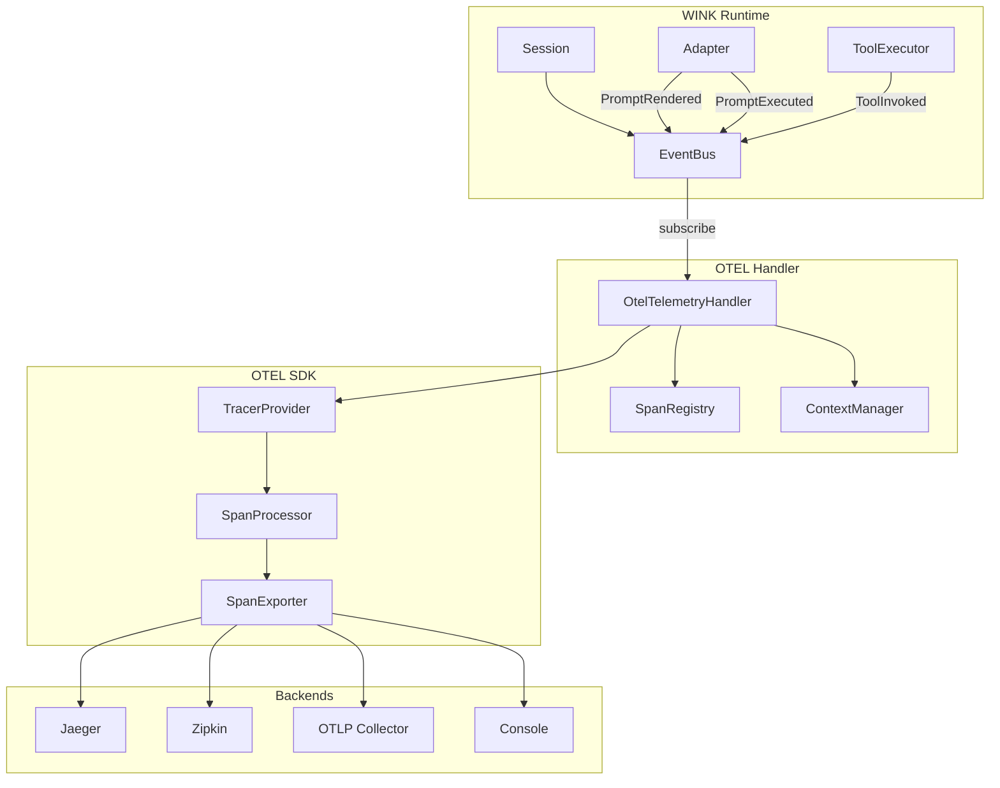
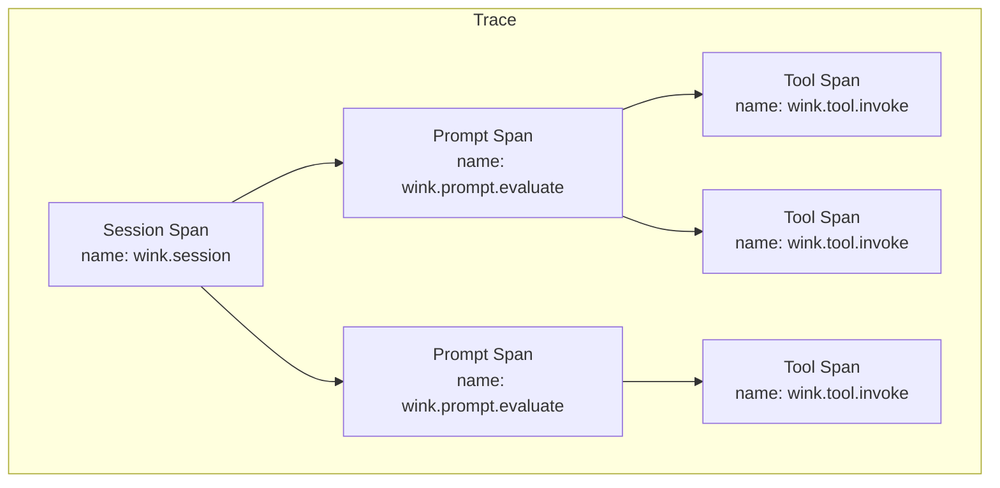
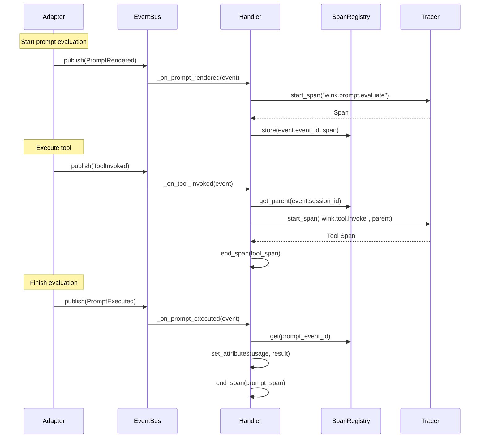

# OpenTelemetry Trace Export Specification

## Purpose

Enable full observability of WINK background agents through OpenTelemetry
(OTEL). This spec covers trace export, span lifecycle, attribute standards,
and integration patterns for exporting telemetry to OTEL-compatible backends
(Jaeger, Zipkin, OTLP collectors, etc.).

## Guiding Principles

- **Non-invasive instrumentation**: All tracing hooks into the existing event
  bus—no changes to core runtime or adapters required
- **Span hierarchy mirrors execution**: Session → Prompt Evaluation → Tool
  Invocation matches the natural execution structure
- **Semantic conventions**: Follow OpenTelemetry Semantic Conventions for
  GenAI where applicable
- **Composable backends**: Works alongside LangSmith or other telemetry
  handlers without conflicts
- **Zero overhead when disabled**: No span creation or context propagation
  when OTEL is not configured
- **Fail open**: Telemetry failures never interrupt agent execution

## Architecture



## Trace Hierarchy

WINK traces form a hierarchy that mirrors the execution model:



### Span Mapping

| WINK Event | Span Name | Span Kind | Parent |
|------------|-----------|-----------|--------|
| Session created | `wink.session` | `INTERNAL` | External context or root |
| `PromptRendered` | `wink.prompt.evaluate` | `CLIENT` | Session span |
| `ToolInvoked` | `wink.tool.invoke` | `INTERNAL` | Prompt span |
| `PromptExecuted` | — | Updates prompt span | — |

The `PromptExecuted` event does not create a new span—it closes the prompt
span opened by `PromptRendered` and attaches final attributes (usage, result).

## Span Attributes

### Session Span Attributes

| Attribute | Type | Description |
|-----------|------|-------------|
| `wink.session.id` | string | Session UUID |
| `wink.session.parent_id` | string | Parent session UUID if nested |
| `wink.session.tags.*` | string | Session tags (flattened) |

### Prompt Span Attributes

| Attribute | Type | Description |
|-----------|------|-------------|
| `wink.prompt.namespace` | string | Prompt namespace |
| `wink.prompt.key` | string | Prompt key |
| `wink.prompt.name` | string | Prompt name |
| `wink.adapter.name` | string | Adapter class name |
| `wink.adapter.model` | string | Model identifier |
| `gen_ai.system` | string | Provider name (OpenAI, Anthropic, etc.) |
| `gen_ai.request.model` | string | Requested model |
| `gen_ai.response.model` | string | Actual model used |
| `gen_ai.usage.input_tokens` | int | Input token count |
| `gen_ai.usage.output_tokens` | int | Output token count |
| `wink.usage.cached_tokens` | int | Cached token count |
| `wink.tool_count` | int | Number of tools available |
| `wink.deadline.expires_at` | string | ISO 8601 deadline if set |
| `wink.budget.remaining` | int | Remaining token budget if set |

### Tool Span Attributes

| Attribute | Type | Description |
|-----------|------|-------------|
| `wink.tool.name` | string | Tool name |
| `wink.tool.call_id` | string | Provider-assigned call ID |
| `wink.tool.success` | bool | Whether handler succeeded |
| `wink.tool.has_value` | bool | Whether result has a value |
| `wink.tool.message` | string | Result message (truncated) |

### Error Attributes

When spans end with errors:

| Attribute | Type | Description |
|-----------|------|-------------|
| `exception.type` | string | Exception class name |
| `exception.message` | string | Exception message |
| `exception.stacktrace` | string | Full traceback |

## Configuration

### OtelConfig Dataclass

```python
@dataclass(slots=True, frozen=True)
class OtelConfig:
    """Configuration for OpenTelemetry trace export."""

    service_name: str = "wink"
    """Service name for traces."""

    enabled: bool = True
    """Master switch for OTEL instrumentation."""

    exporter: Literal["otlp", "jaeger", "zipkin", "console"] = "otlp"
    """Exporter type. OTLP is recommended for production."""

    endpoint: str | None = None
    """Exporter endpoint. Uses SDK defaults if None."""

    headers: Mapping[str, str] = field(default_factory=dict)
    """Additional headers for exporter (e.g., auth tokens)."""

    resource_attributes: Mapping[str, str] = field(default_factory=dict)
    """Additional resource attributes."""

    sample_rate: float = 1.0
    """Sampling rate (0.0 to 1.0). Use < 1.0 for high-volume."""

    max_attribute_length: int = 1024
    """Maximum length for string attributes (truncated)."""

    capture_prompts: bool = False
    """Include rendered prompt content in spans (privacy-sensitive)."""

    capture_tool_params: bool = False
    """Include tool parameters in spans (privacy-sensitive)."""

    propagate_context: bool = True
    """Propagate trace context to nested sessions."""
```

### Environment Variables

| Variable | Config Field | Default |
|----------|--------------|---------|
| `OTEL_SERVICE_NAME` | `service_name` | `wink` |
| `OTEL_EXPORTER_OTLP_ENDPOINT` | `endpoint` | SDK default |
| `OTEL_EXPORTER_OTLP_HEADERS` | `headers` | — |
| `WINK_OTEL_ENABLED` | `enabled` | `true` |
| `WINK_OTEL_EXPORTER` | `exporter` | `otlp` |
| `WINK_OTEL_SAMPLE_RATE` | `sample_rate` | `1.0` |
| `WINK_OTEL_CAPTURE_PROMPTS` | `capture_prompts` | `false` |
| `WINK_OTEL_CAPTURE_TOOL_PARAMS` | `capture_tool_params` | `false` |

## Implementation

### OtelTelemetryHandler

The handler subscribes to the event bus and creates spans:

```python
class OtelTelemetryHandler:
    """Converts WINK events to OpenTelemetry spans."""

    def __init__(
        self,
        config: OtelConfig,
        tracer_provider: TracerProvider | None = None,
    ) -> None:
        self._config = config
        self._provider = tracer_provider or get_tracer_provider()
        self._tracer = self._provider.get_tracer("wink", __version__)
        self._spans: dict[str, Span] = {}  # event_id -> span
        self._session_spans: dict[str, Span] = {}  # session_id -> span

    def subscribe(self, bus: EventBus) -> None:
        """Subscribe to WINK events."""
        bus.subscribe(PromptRendered, self._on_prompt_rendered)
        bus.subscribe(ToolInvoked, self._on_tool_invoked)
        bus.subscribe(PromptExecuted, self._on_prompt_executed)

    def unsubscribe(self, bus: EventBus) -> None:
        """Unsubscribe from WINK events."""
        bus.unsubscribe(PromptRendered, self._on_prompt_rendered)
        bus.unsubscribe(ToolInvoked, self._on_tool_invoked)
        bus.unsubscribe(PromptExecuted, self._on_prompt_executed)
```

### Span Lifecycle



### SpanRegistry

Tracks active spans for correlation:

```python
@dataclass(slots=True)
class SpanRegistry:
    """Thread-safe registry for active spans."""

    _prompt_spans: dict[str, tuple[Span, str]]  # event_id -> (span, session_id)
    _session_spans: dict[str, Span]  # session_id -> session span
    _lock: threading.Lock

    def register_prompt_span(
        self,
        event_id: str,
        session_id: str,
        span: Span,
    ) -> None:
        """Register an active prompt span."""
        with self._lock:
            self._prompt_spans[event_id] = (span, session_id)

    def get_prompt_span(self, event_id: str) -> Span | None:
        """Get prompt span by event ID."""
        with self._lock:
            entry = self._prompt_spans.get(event_id)
            return entry[0] if entry else None

    def get_active_prompt_span(self, session_id: str) -> Span | None:
        """Get the most recent active prompt span for a session."""
        with self._lock:
            for span, sid in reversed(self._prompt_spans.values()):
                if sid == session_id and span.is_recording():
                    return span
            return None

    def remove_prompt_span(self, event_id: str) -> Span | None:
        """Remove and return a prompt span."""
        with self._lock:
            entry = self._prompt_spans.pop(event_id, None)
            return entry[0] if entry else None
```

### Context Propagation

Trace context flows through sessions:

```python
def create_session_with_context(
    parent_context: Context | None = None,
    **kwargs: Any,
) -> tuple[Session, Context]:
    """Create a session with OTEL context."""
    session = Session(**kwargs)

    # Use parent context or current context
    ctx = parent_context or get_current()

    # Create session span
    tracer = get_tracer("wink")
    span = tracer.start_span(
        "wink.session",
        context=ctx,
        attributes={
            "wink.session.id": str(session.session_id),
        },
    )

    # Return session and new context with span
    return session, trace.set_span_in_context(span, ctx)
```

For nested sessions (e.g., MainLoop spawning sub-agents):

```python
# Parent session
parent_session, parent_ctx = create_session_with_context()

# Child session inherits context
child_session, child_ctx = create_session_with_context(
    parent_context=parent_ctx,
    parent=parent_session,
)
# Child spans will be nested under parent session span
```

### Correlation with Claude Agent SDK

When using the Claude Agent SDK adapter, the SDK may create its own spans.
WINK spans should be parents:

```python
def _on_prompt_rendered(self, event: PromptRendered) -> None:
    """Handle PromptRendered by starting a prompt span."""
    # Get or create session span
    session_span = self._get_or_create_session_span(event.session_id)

    # Start prompt span as child of session
    ctx = trace.set_span_in_context(session_span)
    span = self._tracer.start_span(
        "wink.prompt.evaluate",
        context=ctx,
        kind=SpanKind.CLIENT,
        attributes={
            "wink.prompt.namespace": event.prompt_ns,
            "wink.prompt.key": event.prompt_key,
            "wink.prompt.name": event.prompt_name,
            "wink.adapter.name": event.adapter,
        },
    )

    # Store for later correlation
    self._registry.register_prompt_span(
        event.event_id,
        str(event.session_id),
        span,
    )

    # Inject context for downstream SDK calls
    if self._config.propagate_context:
        token = attach(trace.set_span_in_context(span))
        self._context_tokens[event.event_id] = token
```

### Deduplication with call_id

Tool spans use `call_id` to prevent duplicates when multiple telemetry
handlers are active:

```python
def _on_tool_invoked(self, event: ToolInvoked) -> None:
    """Handle ToolInvoked by creating a tool span."""
    # Skip if we've already processed this call
    if event.call_id and event.call_id in self._processed_calls:
        return
    if event.call_id:
        self._processed_calls.add(event.call_id)

    # Find parent prompt span
    parent_span = self._registry.get_active_prompt_span(
        str(event.session_id),
    )
    # ... create tool span
```

## Auto-Instrumentation

### configure_otel Function

Single-call setup for automatic instrumentation:

```python
def configure_otel(
    config: OtelConfig | None = None,
    tracer_provider: TracerProvider | None = None,
) -> OtelTelemetryHandler:
    """
    Configure OpenTelemetry instrumentation for WINK.

    Call once at application startup. Returns the handler
    for manual lifecycle management if needed.

    Example:
        from weakincentives.contrib.otel import configure_otel

        # Basic setup with defaults
        configure_otel()

        # Custom configuration
        configure_otel(OtelConfig(
            service_name="my-agent",
            exporter="jaeger",
            endpoint="http://localhost:14268/api/traces",
        ))
    """
    config = config or OtelConfig.from_env()

    if not config.enabled:
        return _NoopHandler()

    # Set up tracer provider if not provided
    if tracer_provider is None:
        tracer_provider = _create_tracer_provider(config)
        set_tracer_provider(tracer_provider)

    # Create and register handler
    handler = OtelTelemetryHandler(config, tracer_provider)
    _register_global_handler(handler)

    return handler
```

### Integration with Session Creation

```python
from weakincentives.contrib.otel import configure_otel
from weakincentives.runtime import Session, InProcessEventBus

# One-time setup at startup
configure_otel()

# Sessions automatically get instrumented
bus = InProcessEventBus()
session = Session(bus=bus, tags={"user_id": "u123"})

# All events published to bus are converted to spans
```

## Usage Examples

### Basic Setup

```python
from weakincentives.contrib.otel import configure_otel, OtelConfig

# Configure with OTLP exporter (default)
configure_otel(OtelConfig(
    service_name="my-agent",
    endpoint="http://localhost:4317",
))
```

### Jaeger Export

```python
configure_otel(OtelConfig(
    service_name="my-agent",
    exporter="jaeger",
    endpoint="http://localhost:14268/api/traces",
))
```

### Console Export for Development

```python
configure_otel(OtelConfig(
    exporter="console",
))
```

### With Custom TracerProvider

```python
from opentelemetry.sdk.trace import TracerProvider
from opentelemetry.sdk.trace.export import BatchSpanProcessor
from opentelemetry.exporter.otlp.proto.grpc.trace_exporter import (
    OTLPSpanExporter,
)

# Custom provider with specific configuration
provider = TracerProvider()
provider.add_span_processor(
    BatchSpanProcessor(
        OTLPSpanExporter(endpoint="http://collector:4317"),
        max_queue_size=2048,
        max_export_batch_size=512,
    ),
)

configure_otel(tracer_provider=provider)
```

### Sampling for High Volume

```python
from opentelemetry.sdk.trace.sampling import TraceIdRatioBased

configure_otel(OtelConfig(
    sample_rate=0.1,  # Sample 10% of traces
))
```

### Capturing Prompt Content

```python
# Warning: May contain sensitive data
configure_otel(OtelConfig(
    capture_prompts=True,
    capture_tool_params=True,
    max_attribute_length=4096,
))
```

### Distributed Tracing Across Services

```python
from opentelemetry import trace
from opentelemetry.propagate import inject, extract

# Incoming request with trace headers
headers = request.headers
ctx = extract(headers)

# Create session within incoming trace context
session, session_ctx = create_session_with_context(
    parent_context=ctx,
    bus=bus,
)

# Outgoing calls propagate context
outgoing_headers = {}
inject(outgoing_headers, context=session_ctx)
```

## Error Handling

### Span Status on Errors

```python
def _on_prompt_executed(self, event: PromptExecuted) -> None:
    """Handle PromptExecuted by closing the prompt span."""
    span = self._registry.remove_prompt_span(event.event_id)
    if span is None:
        return

    # Set usage attributes
    if event.usage:
        span.set_attribute("gen_ai.usage.input_tokens", event.usage.input_tokens)
        span.set_attribute("gen_ai.usage.output_tokens", event.usage.output_tokens)

    # Check result for errors
    if event.result and not event.result.success:
        span.set_status(StatusCode.ERROR, event.result.error_message)
        if event.result.exception:
            span.record_exception(event.result.exception)
    else:
        span.set_status(StatusCode.OK)

    span.end()
```

### Telemetry Failures

Telemetry failures are logged but never raise:

```python
def _on_prompt_rendered(self, event: PromptRendered) -> None:
    try:
        # ... span creation logic
    except Exception:
        logger.exception(
            "OTEL span creation failed",
            extra={"event": "otel_span_creation_failed"},
        )
        # Do not re-raise - telemetry must not interrupt execution
```

## Testing

### Mocking the Tracer

```python
from unittest.mock import MagicMock
from opentelemetry.sdk.trace import TracerProvider
from opentelemetry.sdk.trace.export.in_memory_span_exporter import (
    InMemorySpanExporter,
)

def test_prompt_span_created():
    # Set up in-memory exporter
    exporter = InMemorySpanExporter()
    provider = TracerProvider()
    provider.add_span_processor(SimpleSpanProcessor(exporter))

    # Configure OTEL
    handler = configure_otel(
        OtelConfig(enabled=True),
        tracer_provider=provider,
    )

    # Create session and trigger events
    bus = InProcessEventBus()
    handler.subscribe(bus)
    session = Session(bus=bus)

    # Simulate prompt execution
    bus.publish(PromptRendered(...))
    bus.publish(PromptExecuted(...))

    # Verify spans
    spans = exporter.get_finished_spans()
    assert len(spans) == 1
    assert spans[0].name == "wink.prompt.evaluate"
```

### Verifying Span Hierarchy

```python
def test_tool_spans_nested_under_prompt():
    exporter = InMemorySpanExporter()
    # ... setup ...

    bus.publish(PromptRendered(event_id="pr-1", ...))
    bus.publish(ToolInvoked(event_id="ti-1", ...))
    bus.publish(ToolInvoked(event_id="ti-2", ...))
    bus.publish(PromptExecuted(event_id="pr-1", ...))

    spans = exporter.get_finished_spans()
    prompt_span = next(s for s in spans if s.name == "wink.prompt.evaluate")
    tool_spans = [s for s in spans if s.name == "wink.tool.invoke"]

    for tool_span in tool_spans:
        assert tool_span.parent.span_id == prompt_span.context.span_id
```

## Limitations

### Current Limitations

1. **No automatic Session span creation**: Session spans must be explicitly
   created or enabled via configuration. By default, only prompt and tool
   spans are created.

1. **Synchronous export only**: The current implementation uses synchronous
   event handlers. For high-throughput scenarios, consider using
   `BatchSpanProcessor`.

1. **No metrics export**: This spec covers traces only. Metrics (token usage
   aggregates, latency histograms) are a future consideration.

1. **Limited baggage propagation**: Session tags are exported as span
   attributes but not as OTEL baggage.

### Future Considerations

- **Metrics integration**: Export token usage, latency, and error rates as
  OTEL metrics
- **Logs correlation**: Attach trace IDs to structured log events
- **Baggage propagation**: Propagate session tags as OTEL baggage
- **Automatic session spans**: Option to automatically create session spans
  on first event
- **Span links**: Link related traces (e.g., retry attempts, nested agents)

## Related Specs

- `LOGGING.md` — Structured logging and event schemas
- `LANGSMITH.md` — Alternative telemetry backend with similar patterns
- `SESSIONS.md` — Session lifecycle and event bus
- `ADAPTERS.md` — Adapter lifecycle and event emission
- `TOOLS.md` — Tool execution and ToolInvoked events
