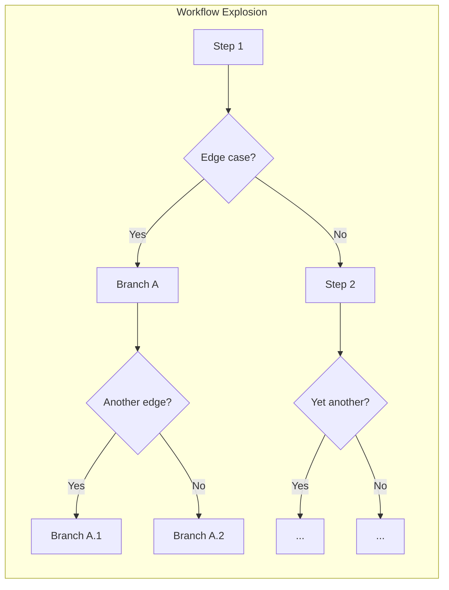
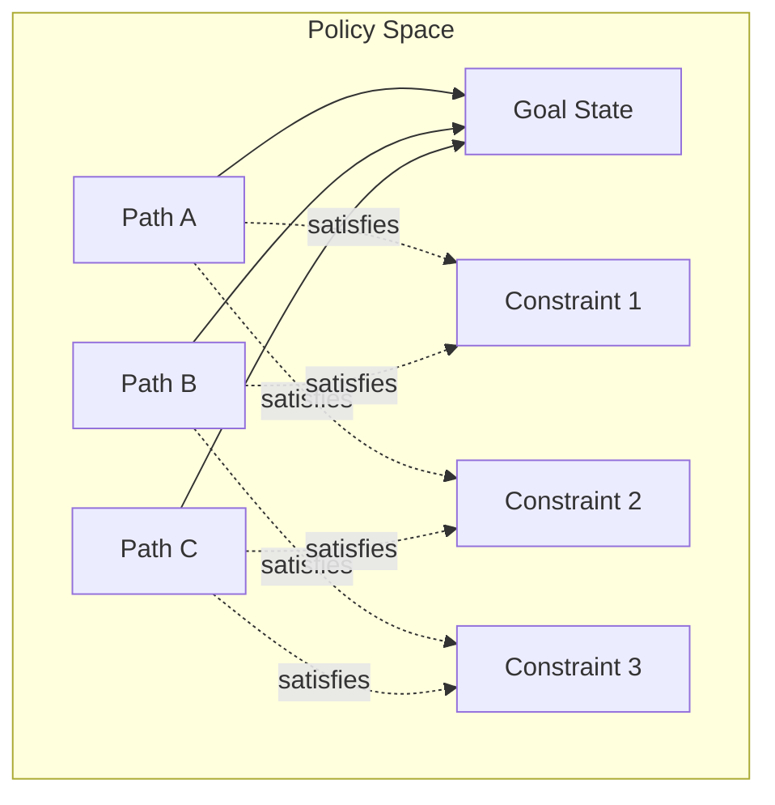

# Policies Over Workflows

## Purpose

This document articulates a design philosophy for unattended agents: prefer
declarative policies over prescriptive workflows. Policies define constraints
and invariants that preserve the agent's ability to reason through novel
situations, while workflows encode rigid sequences that fracture when
encountering the long tail of real-world variation.

## The Problem with Workflows

A workflow is a predetermined sequence of steps:

```
1. Read the file
2. Parse the AST
3. Identify the function
4. Generate the patch
5. Write the file
6. Run tests
```

This works for the common case. But unattended agents encounter situations that
workflow authors cannot anticipate:

- The file doesn't exist yet
- The function spans multiple files
- The AST parser fails on malformed syntax
- Tests require environment setup first
- The patch reveals a deeper design issue

When a workflow encounters an unexpected state, it has three options:

1. **Fail** — Abort and surface the error
1. **Skip** — Continue past the step, often leaving invalid state
1. **Branch** — Add conditional logic for the edge case

Option 3 seems reasonable until you realize it transforms workflows into
sprawling decision trees. Each edge case spawns branches; branches interact
combinatorially. The workflow becomes a program—and a brittle one, because it
encodes domain knowledge in control flow rather than constraints.



The fundamental issue: **workflows encode how to accomplish a goal, not what
the goal requires.** When the "how" breaks, the agent has no recourse.

## Policies Preserve Agency

A policy is a declarative constraint:

- "A file must be read before it can be overwritten"
- "Tests must pass before deployment"
- "Sensitive operations require confirmation"

Policies describe invariants that must hold, not sequences that must execute.
The agent remains free to find any path that satisfies the constraints.



When the agent encounters an unexpected situation, it can:

1. **Reason** about which constraints apply
1. **Discover** alternative approaches that satisfy them
1. **Adapt** its strategy without violating invariants

This is the difference between giving someone directions ("turn left, then
right, then left again") and giving them a map with constraints ("stay on
paved roads, avoid tolls"). Directions fail when the road is closed; maps
enable rerouting.

## Why This Matters for Unattended Agents

Attended agents have a human in the loop. When a workflow breaks, the human
can intervene: provide context, adjust the approach, or take over entirely.
The workflow's brittleness is masked by human adaptability.

Unattended agents operate without this safety net. Every edge case the
workflow doesn't handle becomes a failure. And because the long tail of edge
cases is effectively infinite, **no workflow can be complete**.

Policies offer a different contract:

| Aspect | Workflow | Policy |
|--------|----------|--------|
| Specifies | Steps to execute | Constraints to satisfy |
| On unexpected input | Fails or branches | Agent reasons about constraints |
| Composability | Sequential coupling | Independent conjunction |
| Completeness | Requires enumeration | Permits discovery |
| Agent role | Executor | Reasoner |

The agent's language model is a general-purpose reasoner. Workflows
deliberately bypass this capability, treating the agent as a script runner.
Policies leverage it, treating the agent as a problem-solver that happens to
be constrained.

## Characteristics of Good Policies

### Declarative, Not Procedural

Policies state what must be true, not how to make it true.

```python
# Procedural (workflow fragment)
def deploy():
    run_tests()
    build()
    push()

# Declarative (policy)
policy = SequentialDependencyPolicy(
    dependencies={"deploy": frozenset({"test", "build"})}
)
```

The procedural version locks in an execution order. The declarative version
expresses that deployment requires testing and building, but permits the agent
to determine when and how to satisfy those prerequisites.

### Independently Composable

Each policy should be evaluable in isolation. Policies compose through
conjunction: all must allow, any may deny.

```python
policies = [
    ReadBeforeWritePolicy(),        # Filesystem safety
    RequireReviewPolicy(),          # Human oversight
    BudgetLimitPolicy(max=10000),   # Resource bounds
]

# Each policy checks independently; all must pass
for policy in policies:
    decision = policy.check(tool, params, context=context)
    if not decision.allowed:
        return deny(decision.reason)
```

Avoid policies that depend on each other's internal state. If policy A needs
to know what policy B decided, they're not truly independent—refactor into
a single policy or share state through the session.

### Fail-Closed by Default

When a policy cannot determine whether to allow an action, it should deny.
This preserves safety at the cost of capability. The agent can then reason
about why denial occurred and adjust its approach.

```python
def check(self, tool, params, *, context):
    if not self._can_evaluate(context):
        return PolicyDecision.deny("Insufficient context to evaluate safety")
    # ...
```

### Observable and Debuggable

Policies should expose their reasoning. When a policy denies an action, the
agent (and human reviewers) should understand why.

```python
return PolicyDecision.deny(
    f"File '{path}' must be read before overwriting. "
    f"Read {', '.join(read_paths)} so far."
)
```

This feedback enables the agent to self-correct rather than simply retry the
same action.

## Policies in WINK

WINK implements this philosophy through several mechanisms:

### Tool Policies

Gate individual tool invocations based on session state. See
[TOOL_POLICIES.md](./TOOL_POLICIES.md).

```python
# Read-before-write: prevents blind overwrites
policy = ReadBeforeWritePolicy()

# Sequential dependency: build before deploy
policy = SequentialDependencyPolicy(
    dependencies={"deploy": frozenset({"test", "build"})}
)
```

### Feedback Providers

Provide soft guidance based on patterns over time. See
[FEEDBACK_PROVIDERS.md](./FEEDBACK_PROVIDERS.md).

```python
# Deadline feedback: reminds agent of time constraints
provider = DeadlineFeedback(warning_threshold_seconds=120)
```

Feedback providers inject context rather than blocking actions, preserving
agent autonomy while surfacing concerns.

### Budget Constraints

Hard limits on resource consumption. See [SESSIONS.md](./SESSIONS.md).

```python
budget = Budget(
    deadline=Deadline(expires_at=...),
    max_total_tokens=50000,
)
```

Budgets are policies at the resource level: the agent is free to allocate
tokens however it chooses, but cannot exceed the total.

### Task Completion Checking

Verify goal achievement without prescribing how to achieve it. See
[TASK_COMPLETION.md](./TASK_COMPLETION.md).

The checker assesses whether the task is complete based on the current state,
not whether specific steps were followed.

## Anti-Patterns

### Workflow Masquerading as Policy

```python
# Anti-pattern: sequential steps encoded as dependencies
policy = SequentialDependencyPolicy(
    dependencies={
        "step_2": frozenset({"step_1"}),
        "step_3": frozenset({"step_2"}),
        "step_4": frozenset({"step_3"}),
        "step_5": frozenset({"step_4"}),
    }
)
```

This is a workflow in policy clothing. If the sequence is truly invariant,
consider whether the agent needs individual tools at all, or whether a single
composite operation is more appropriate.

### Over-Constraining the Solution Space

```python
# Anti-pattern: policy that leaves only one valid path
policies = [
    MustUseToolX(),
    MustNotUseToolY(),
    MustCallInOrderABC(),
    MustCompleteInUnderNSeconds(),
]
```

If policies eliminate all flexibility, you've rebuilt a workflow. Step back
and identify which constraints are truly invariants versus preferences.

### Policies That Require Orchestration

```python
# Anti-pattern: policy that depends on external state machine
class StateMachinePolicy:
    def check(self, ...):
        current_state = self.state_machine.current
        if current_state == "INIT" and tool.name == "read":
            self.state_machine.transition("READING")
            return allow()
        # ...
```

This conflates policy enforcement with workflow execution. Policies should be
stateless with respect to their evaluation logic; state lives in the session.

## When Workflows Are Appropriate

Policies are not universally superior. Workflows are appropriate when:

1. **The sequence is truly invariant** — Not just common, but required by
   external systems (e.g., protocol handshakes, transaction ordering).

1. **Failure is preferable to adaptation** — Some contexts require strict
   reproducibility over resilience.

1. **The agent lacks reasoning capability** — Rule-based systems or simple
   state machines don't benefit from flexible policies.

1. **Human oversight is continuous** — Attended operation can course-correct
   workflow failures in real-time.

For unattended agents with language model reasoning, policies are almost
always the better default.

## Summary

| Principle | Implication |
|-----------|-------------|
| Preserve agency | Let the agent reason; don't script its actions |
| Declare constraints | State invariants, not procedures |
| Compose independently | Policies should be conjunction-friendly |
| Fail closed | Deny when uncertain; let the agent adapt |
| Surface reasoning | Explain denials to enable self-correction |
| Avoid pseudo-workflows | If only one path satisfies constraints, reconsider |

The goal is not to remove all structure, but to provide structure that works
*with* the agent's reasoning rather than *around* it. Policies define the
boundaries; the agent finds the path.
