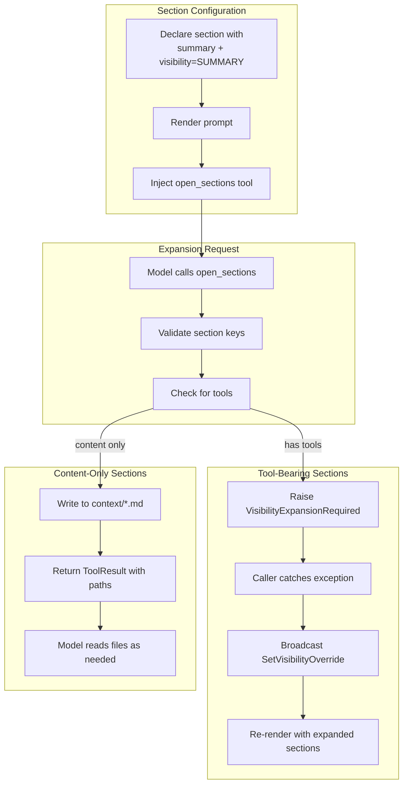

# Progressive Disclosure Specification

## Purpose

Progressive disclosure minimizes initial prompt token usage by rendering verbose
sections as summaries. When a model needs the full content, it calls the
`open_sections` tool. This specification covers visibility management, the
disclosure tool, and the context file system for content-only sections.

## Guiding Principles

- **Token efficiency**: Summarized content reduces initial prompt size.
- **On-demand expansion**: Models request detailed content when needed.
- **Tool-aware branching**: Sections with tools require re-render; content-only
  sections write to filesystem.
- **Minimal interruption**: Content-only expansions don't halt the turn.
- **Consistent state**: Mixed requests (tools + content) use the exception path
  for all sections.



## Section Visibility

### Visibility Enum

```python
class SectionVisibility(Enum):
    FULL = auto()     # Render complete content
    SUMMARY = auto()  # Render summary text only
```

### Section Configuration

Sections declare visibility via the `visibility` parameter:

```python
section = MarkdownSection[Params](
    title="Reference Documentation",
    key="reference-docs",
    template="Full detailed documentation content...",
    summary="Reference documentation is available on request.",
    visibility=SectionVisibility.SUMMARY,
)
```

**Requirements:**

- `summary` must be defined when `visibility=SUMMARY`
- `summary` is a plain string (no template substitution)
- Validation raises `PromptValidationError` if summary is missing

### Dynamic Visibility

Visibility can be computed from parameters or session state:

```python
# From parameters
visibility=lambda params: SectionVisibility.SUMMARY if params.verbose else SectionVisibility.FULL

# From session state (zero-argument callable)
visibility=lambda: compute_visibility_from_session()
```

### Visibility Resolution Order

The effective visibility is resolved in precedence order:

1. **Session state override** via `VisibilityOverrides` slice
1. **User-provided selector** (constant or callable)

```python
def effective_visibility(
    self,
    override: SectionVisibility | None = None,
    params: SupportsDataclass | None = None,
    *,
    session: SessionProtocol | None = None,
    path: SectionPath | None = None,
) -> SectionVisibility:
    # Check session state first
    if session is not None and path is not None:
        session_override = get_session_visibility_override(session, path)
        if session_override is not None:
            return session_override

    # Fall back to user selector
    return self._visibility(params, session)
```

## Visibility State Management

### VisibilityOverrides Slice

Session state tracks visibility overrides:

```python
@FrozenDataclass()
class VisibilityOverrides:
    overrides: Mapping[SectionPath, SectionVisibility] = field(
        default_factory=lambda: MappingProxyType({})
    )

    def with_override(
        self, path: SectionPath, visibility: SectionVisibility
    ) -> VisibilityOverrides:
        new_overrides = dict(self.overrides)
        new_overrides[path] = visibility
        return VisibilityOverrides(overrides=MappingProxyType(new_overrides))
```

### Events

```python
@dataclass(slots=True, frozen=True)
class SetVisibilityOverride:
    path: SectionPath
    visibility: SectionVisibility

@dataclass(slots=True, frozen=True)
class ClearVisibilityOverride:
    path: SectionPath

@dataclass(slots=True, frozen=True)
class ClearAllVisibilityOverrides:
    pass
```

### Reducers

```python
@reducer(on=SetVisibilityOverride)
def handle_set(self, event: SetVisibilityOverride) -> VisibilityOverrides:
    return self.with_override(event.path, event.visibility)

@reducer(on=ClearVisibilityOverride)
def handle_clear(self, event: ClearVisibilityOverride) -> VisibilityOverrides:
    return self.without_override(event.path)

@reducer(on=ClearAllVisibilityOverrides)
def handle_clear_all(self, event: ClearAllVisibilityOverrides) -> VisibilityOverrides:
    return VisibilityOverrides()
```

## The open_sections Tool

### Automatic Registration

When `Prompt.render()` detects summarized sections, it injects `open_sections`:

```python
if has_summarized_sections(registry, param_lookup, session=session):
    open_sections_tool = create_open_sections_handler(
        registry=registry,
        current_visibility=current_visibility,
        param_lookup=param_lookup,
    )
    collected_tools.append(open_sections_tool)
```

### Tool Schema

```python
@dataclass(slots=True, frozen=True)
class OpenSectionsParams:
    section_keys: tuple[str, ...]  # Dot notation: "parent.child"
    reason: str                     # Explanation for expansion

@dataclass(slots=True, frozen=True)
class OpenSectionsResult:
    written_files: tuple[str, ...]  # Paths to context files
```

### Validation

The handler validates all requested keys before processing:

1. **Non-empty**: At least one key required
1. **Exists**: Key must match a section in the registry
1. **Not expanded**: Section must not already be `FULL`

```python
def _validate_section_keys(
    section_keys: tuple[str, ...],
    *,
    registry: RegistrySnapshot,
    current_visibility: Mapping[SectionPath, SectionVisibility],
) -> dict[SectionPath, SectionVisibility]:
    if not section_keys:
        raise PromptValidationError("At least one section key must be provided.")

    requested_overrides: dict[SectionPath, SectionVisibility] = {}

    for key in section_keys:
        path = tuple(key.split("."))

        if path not in registry.section_paths:
            raise PromptValidationError(
                f"Section '{key}' does not exist in this prompt."
            )

        if current_visibility.get(path) == SectionVisibility.FULL:
            raise PromptValidationError(f"Section '{key}' is already expanded.")

        requested_overrides[path] = SectionVisibility.FULL

    return requested_overrides
```

## Expansion Paths

The handler branches based on whether requested sections contain tools.

### Tool Detection

A section "has tools" if it or any descendant exposes tools:

```python
def _section_has_tools(
    section_path: SectionPath,
    registry: RegistrySnapshot,
) -> bool:
    """Check if section or any descendant exposes tools."""
    for node in registry.sections:
        if node.path == section_path or _is_descendant(node.path, section_path):
            if node.section.tools():
                return True
    return False

def _is_descendant(candidate: SectionPath, parent: SectionPath) -> bool:
    """Check if candidate is a descendant of parent."""
    return len(candidate) > len(parent) and candidate[:len(parent)] == parent
```

### Path 1: Tool-Bearing Sections (Exception)

When any requested section has tools, raise `VisibilityExpansionRequired`:

```python
@dataclass
class VisibilityExpansionRequired(PromptError):
    requested_overrides: Mapping[SectionPath, SectionVisibility]
    reason: str
    section_keys: tuple[str, ...]
```

The caller catches the exception and applies overrides:

```python
while expansion_count < max_expansions:
    try:
        response = adapter.evaluate(prompt, session=session)
        break
    except VisibilityExpansionRequired as e:
        for path, visibility in e.requested_overrides.items():
            session.broadcast(
                SetVisibilityOverride(path=path, visibility=visibility)
            )
        expansion_count += 1
```

**Why exception-based?** Tool-bearing sections must re-render the prompt to
expose new tool schemas to the model. This requires halting the current turn.

### Path 2: Content-Only Sections (Context Files)

When all requested sections are content-only, write to the filesystem:

```python
def handler(
    params: OpenSectionsParams, *, context: ToolContext
) -> ToolResult[OpenSectionsResult | None]:
    # ... validation ...

    # Partition sections
    sections_with_tools: dict[SectionPath, SectionVisibility] = {}
    content_only_sections: list[SectionPath] = []

    for path, visibility in requested_overrides.items():
        if _section_has_tools(path, registry):
            sections_with_tools[path] = visibility
        else:
            content_only_sections.append(path)

    # Tool-bearing: raise for re-render
    if sections_with_tools:
        _raise_visibility_expansion(
            params.section_keys,
            requested_overrides,
            params.reason,
        )

    # Content-only: write to context files
    if context.filesystem is None:
        return ToolResult(
            message="Cannot write context files: no filesystem available.",
            value=None,
            success=False,
        )

    written_files: list[str] = []
    for path in content_only_sections:
        file_path = _write_section_context(
            path, registry, frozen_params, context.filesystem
        )
        written_files.append(file_path)

    return ToolResult(
        message=f"Section content written to: {', '.join(written_files)}",
        value=OpenSectionsResult(written_files=tuple(written_files)),
        success=True,
    )
```

## Context File System

### File Location

Content is written to the `context/` folder in the workspace:

```
context/
├── reference-docs.md
├── api-reference.md
└── guidelines.code-style.md   # Nested section
```

### File Naming

- Section key with dots preserved: `"guidelines.code-style"` → `context/guidelines.code-style.md`
- Files are markdown with the rendered section content

### Writing Context Files

```python
CONTEXT_FOLDER = "context"

def _write_section_context(
    section_path: SectionPath,
    registry: RegistrySnapshot,
    param_lookup: Mapping[type[SupportsDataclass], SupportsDataclass],
    filesystem: Filesystem,
) -> str:
    """Render section content and write to context folder."""
    node = _find_section_node(section_path, registry)
    section_params = registry.resolve_section_params(node, dict(param_lookup))

    # Render with FULL visibility, standalone formatting
    content = node.section.render(
        section_params,
        depth=0,
        number="",
        path=node.path,
        visibility=SectionVisibility.FULL,
    )

    file_key = ".".join(section_path)
    file_path = f"{CONTEXT_FOLDER}/{file_key}.md"

    filesystem.mkdir(CONTEXT_FOLDER, parents=True, exist_ok=True)
    filesystem.write(file_path, content, mode="overwrite")

    return file_path
```

### Filesystem Requirements

- Requires `context.filesystem` to be available
- Uses `mode="overwrite"` for idempotent re-opens
- Creates `context/` directory if missing

## Summary Suffix

Summarized sections append an instruction suffix to guide the model.

### Suffix Format

The suffix varies based on whether the section has tools:

**With tools:**

```
---
[This section is summarized. To view full content and access additional tools,
call `open_sections` with key "reference-docs".]
```

**Content-only:**

```
---
[This section is summarized. To view full content, call `open_sections` with
key "reference-docs". The content will be written to context/reference-docs.md
for you to read.]
```

### With Children

```
---
[This section is summarized. Call `open_sections` with key "parent" to view
full content including subsections: child1, child2.]
```

### Implementation

```python
def build_summary_suffix(
    section_key: str,
    child_keys: tuple[str, ...],
    has_tools: bool = False,
) -> str:
    if has_tools:
        base = (
            f'[This section is summarized. To view full content and access '
            f'additional tools, call `open_sections` with key "{section_key}".]'
        )
    else:
        base = (
            f'[This section is summarized. To view full content, call '
            f'`open_sections` with key "{section_key}". The content will be '
            f'written to context/{section_key}.md for you to read.]'
        )

    if child_keys:
        children_str = ", ".join(child_keys)
        if has_tools:
            base = (
                f'[This section is summarized. Call `open_sections` with key '
                f'"{section_key}" to view full content including subsections: '
                f'{children_str}. Additional tools may become available.]'
            )
        else:
            base = (
                f'[This section is summarized. Call `open_sections` with key '
                f'"{section_key}" to write content (including subsections: '
                f'{children_str}) to context/{section_key}.md.]'
            )

    return f"\n\n---\n{base}"
```

## Rendering Behavior

### Section Skipping

When a section renders with `SUMMARY` visibility:

1. Children are skipped (not rendered)
1. Tools from the section and children are not collected
1. Summary text is rendered instead of template
1. Suffix is appended

```python
# In PromptRenderer.render()
if effective_visibility == SectionVisibility.SUMMARY:
    summary_skip_depth = node.depth
    has_summarized = True

# Skip children
if summary_skip_depth is not None and node.depth > summary_skip_depth:
    continue

# Don't collect tools for summarized sections
if effective_visibility != SectionVisibility.SUMMARY:
    self._collect_section_tools(...)
```

### Tool Injection

The `open_sections` tool is only injected when summarized sections exist:

```python
if has_summarized:
    open_sections_tool = create_open_sections_handler(...)
    collected_tools.append(open_sections_tool)
```

## Edge Cases

### Mixed Requests

When a request contains both tool-bearing and content-only sections:

- **Behavior**: Raise exception for ALL sections
- **Rationale**: Ensures consistent state; avoids partial writes

```python
if sections_with_tools:
    _raise_visibility_expansion(
        params.section_keys,
        requested_overrides,  # All sections, not just tool-bearing
        params.reason,
    )
```

### Filesystem Unavailable

If no filesystem is configured:

```python
if context.filesystem is None:
    return ToolResult(
        message="Cannot write context files: no filesystem available.",
        value=None,
        success=False,
    )
```

### Rendering Failures

Section rendering errors return failure result:

```python
try:
    file_path = _write_section_context(...)
    written_files.append(file_path)
except Exception as e:
    return ToolResult(
        message=f"Failed to write context for '{'.'.join(path)}': {e}",
        value=None,
        success=False,
    )
```

### Nested Sections with Varying Tool Status

Tool detection traverses the entire subtree:

```
parent/                    # No tools
├── child-a/              # Has tools
│   └── grandchild/       # No tools
└── child-b/              # No tools
```

- `parent` has_tools = True (due to child-a)
- `child-a` has_tools = True
- `child-b` has_tools = False

### Re-opening Sections

- Content-only: Files overwritten (idempotent)
- Tool-bearing: Exception raised, but validation catches "already expanded"

## Usage Examples

### Basic Progressive Disclosure

```python
template = PromptTemplate[Output](
    ns="agents/assistant",
    key="task-handler",
    sections=[
        MarkdownSection[TaskParams](
            title="Instructions",
            key="instructions",
            template="Complete the following task: ${task}",
        ),
        MarkdownSection[None](
            title="Reference Documentation",
            key="reference-docs",
            template="Detailed API documentation...\n\n${api_docs}",
            summary="API documentation available on request.",
            visibility=SectionVisibility.SUMMARY,
        ),
    ],
)
```

### Content-Only Section with Filesystem

```python
from weakincentives.contrib.tools import VfsToolsSection

template = PromptTemplate[Output](
    ns="agents/coder",
    key="edit-files",
    sections=[
        MarkdownSection[None](
            title="Instructions",
            key="instructions",
            template="Edit files as requested.",
        ),
        VfsToolsSection(...),  # Provides filesystem
        MarkdownSection[None](
            title="Code Style Guide",
            key="style-guide",
            template="Comprehensive style guide content...",
            summary="Code style guide available.",
            visibility=SectionVisibility.SUMMARY,
        ),
    ],
)

# Model calls: open_sections(["style-guide"], reason="Need formatting rules")
# Handler writes: context/style-guide.md
# Returns: ToolResult(value=OpenSectionsResult(written_files=("context/style-guide.md",)))
# Model can then read the file via filesystem tools
```

### Tool-Bearing Section

```python
verify_tool = Tool[VerifyParams, VerifyResult](
    name="verify_result",
    description="Verify computation result.",
    handler=verify_handler,
)

template = PromptTemplate[Output](
    ns="agents/calculator",
    key="compute",
    sections=[
        MarkdownSection[None](
            title="Instructions",
            key="instructions",
            template="Perform calculations.",
        ),
        MarkdownSection[None](
            title="Verification Tools",
            key="verification",
            template="Use verify_result to check your work.",
            summary="Verification tools available.",
            visibility=SectionVisibility.SUMMARY,
            tools=[verify_tool],
        ),
    ],
)

# Model calls: open_sections(["verification"], reason="Need to verify")
# Handler raises: VisibilityExpansionRequired
# Caller broadcasts: SetVisibilityOverride
# Prompt re-renders with verify_result tool now available
```

## Comparison: Exception vs Context File Path

| Aspect | Exception Path | Context File Path |
|--------|----------------|-------------------|
| **Trigger** | Section has tools | Section is content-only |
| **Interrupts turn** | Yes | No |
| **State change** | VisibilityOverrides updated | Filesystem written |
| **Tool availability** | New tools exposed | No change |
| **Model action** | Automatic re-prompt | Must read file |
| **Idempotent** | No (raises "already expanded") | Yes (overwrites) |

## Limitations

- **Single-turn exception**: Tool-bearing expansion halts the current turn
- **No partial expansion**: Sections open fully or remain summarized
- **Filesystem dependency**: Content-only path requires workspace section
- **No streaming**: Entire section rendered before writing
- **Mixed request atomic**: Cannot expand some sections without all
