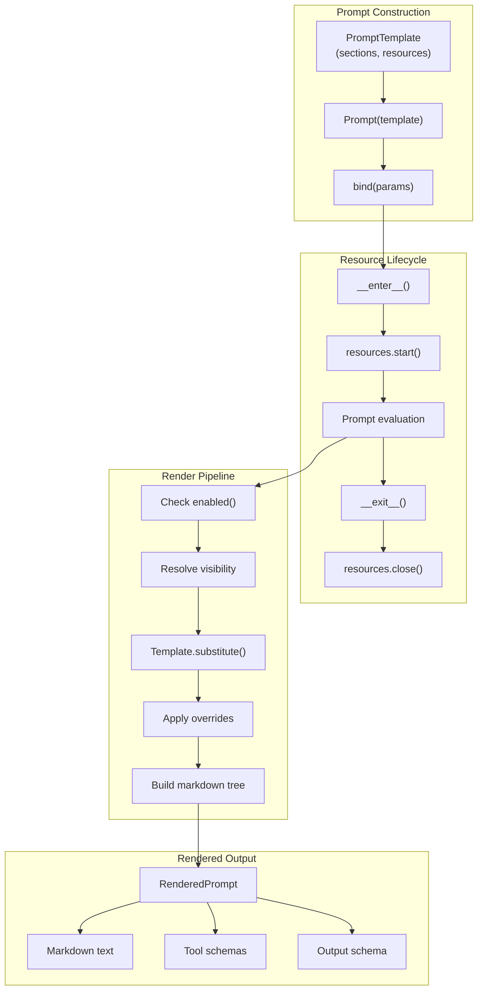

# Prompt System Specification

## Purpose

The `Prompt` abstraction centralizes every string template that flows to an LLM
so the codebase has a single, inspectable source for system prompts and per-turn
instructions. Prompts also own their resource dependencies, providing unified
lifecycle management for both prompt content and runtime requirements.

## Guiding Principles

- **Type-Safety First**: Every placeholder maps to a dataclass field so issues
  surface early in development.
- **Strict, Predictable Failures**: Validation and render errors fail loudly
  with actionable context.
- **Composable Markdown Structure**: Hierarchical sections with deterministic
  heading levels keep prompts readable.
- **Resource Co-location**: Prompts declare the resources they need; lifecycle
  is managed via context manager.
- **Minimal Templating Surface**: Limit to `Template.substitute` plus boolean
  selectors to prevent complex control flow.
- **Declarative over Imperative**: Prompts describe structure, not logic.



## Core Components

### PromptTemplate and Prompt

`PromptTemplate` is the configuration blueprint that owns a namespace (`ns`), a
required `key`, an optional `name`, an ordered tree of `Section` instances, and
resource bindings:

```python
template = PromptTemplate[OutputType](
    ns="demo",
    key="compose-email",
    name="compose_email",
    sections=[...],
    resources=ResourceRegistry.of(
        Binding(HTTPClient, lambda r: HTTPClient(timeout=30)),
    ),
)
```

`Prompt` is a context manager that binds parameters and owns the resource
lifecycle:

```python
# Create a Prompt and bind parameters
prompt = Prompt(template).bind(MyParams(field="value"))

# Use as context manager for resource lifecycle
with prompt.resources:
    rendered = prompt.render()
    # Resources available via prompt.resources
```

**Construction Rules:**

- `ns` and `key` are required and non-empty.
- The `(ns, key)` pair identifies a prompt for versioning and overrides.
- Section keys must match: `^[a-z0-9][a-z0-9._-]{0,63}$`
- `Prompt.bind()` maintains at most one bound instance per dataclass type.
  Rebinding the same type replaces the previous value; providing the same type
  more than once in a single `bind()` call is rejected during render.

### Section

Abstract base with metadata, `is_enabled`, `render`, child handling, override
gating, and resource contribution:

```python
class Section(ABC, Generic[ParamsT]):
    title: str
    key: str
    children: tuple[Section, ...] = ()
    tools: tuple[Tool, ...] = ()
    enabled: Callable[[ParamsT], bool] | None = None
    default_params: ParamsT | None = None
    accepts_overrides: bool = True
    visibility: SectionVisibility | Callable[[ParamsT], SectionVisibility] | Callable[[], SectionVisibility] = FULL

    def resources(self) -> ResourceRegistry:
        """Return resources required by this section.

        Override to contribute resources. Default returns empty registry.
        Children's resources are collected automatically.
        """
        return ResourceRegistry()
```

**Key Behaviors:**

- Sections must be specialized: `MarkdownSection[MyParams]`
- `accepts_overrides=False` excludes sections from the override system
- `visibility` controls full vs. summary rendering
- `resources()` returns resources this section needs; collected by prompt

### MarkdownSection

Default concrete section that dedents, strips, and runs `Template.substitute`:

```python
tone_section = MarkdownSection[ToneParams](
    title="Tone",
    key="tone",
    template="Target tone: ${tone}",
    summary="Tone guidance available.",  # Optional for progressive disclosure
)
```

### WorkspaceSection

Section that provides filesystem access. Contributes its filesystem to prompt
resources:

```python
class WorkspaceSection(Section[WorkspaceParams]):
    filesystem: Filesystem

    def resources(self) -> ResourceRegistry:
        return ResourceRegistry.build({Filesystem: self.filesystem})
```

## Resource Lifecycle

Prompts own their resource lifecycle via the context manager protocol.

### Resource Collection

When a prompt enters its context, it collects resources from:

1. **Template resources** - Declared on `PromptTemplate.resources`
1. **Section resources** - Collected from all sections via `section.resources()`
1. **Bind-time resources** - Passed to `bind(resources=...)`

Resources merge in order; later sources override earlier on conflict:

```python
def _collected_resources(self) -> ResourceRegistry:
    """Collect resources from template and all sections."""
    result = self._template.resources

    for section in self._template.sections:
        result = result.merge(section.resources())
        for child in section.children:
            result = result.merge(child.resources())

    if self._bound_resources is not None:
        result = result.merge(self._bound_resources)

    return result
```

### Context Manager Protocol

```python
class Prompt(Generic[OutputT]):
    _resource_context: ScopedResourceContext | None = None

    def bind(
        self,
        *params: object,
        resources: ResourceRegistry | None = None,
    ) -> Self:
        """Bind parameters and optional runtime resources."""
        # ... parameter binding logic ...
        self._bound_resources = resources
        return self

    @property
    def resources(self) -> PromptResources:
        """Return resource accessor for lifecycle management and resolution.

        The PromptResources object serves as both a context manager and a
        proxy to the active resource context:

        - As context manager: ``with prompt.resources:`` manages lifecycle
        - As proxy: ``prompt.resources.get(Protocol)`` resolves resources
        """
        return PromptResources(self)


class PromptResources:
    """Resource accessor: context manager for lifecycle + proxy to active context."""

    def __init__(self, prompt: Prompt[Any]) -> None:
        self._prompt = prompt

    def __enter__(self) -> Self:
        """Enter resource context; initialize resources."""
        collected = self._prompt._collected_resources()
        ctx = collected._create_context()
        ctx.start()
        self._prompt._resource_context = ctx
        return self

    def __exit__(self, exc_type, exc_val, exc_tb) -> None:
        """Exit resource context; cleanup resources."""
        if self._prompt._resource_context is not None:
            self._prompt._resource_context.close()
            self._prompt._resource_context = None

    @property
    def context(self) -> ScopedResourceContext:
        """Return the underlying ScopedResourceContext for framework use."""
        if self._prompt._resource_context is None:
            raise RuntimeError("Resources accessed outside context")
        return self._prompt._resource_context

    def get[T](self, protocol: type[T]) -> T:
        """Resolve and return resource for protocol."""
        return self.context.get(protocol)

    def get_optional[T](self, protocol: type[T]) -> T | None:
        """Resolve if bound, return None otherwise."""
        return self.context.get_optional(protocol)
```

### Usage Pattern

```python
prompt = Prompt(template).bind(
    TaskParams(objective="Review code"),
    resources=ResourceRegistry.build({Clock: SystemClock()}),
)

with prompt.resources:
    # Resources are initialized and available
    fs = prompt.resources.get(Filesystem)
    clock = prompt.resources.get(Clock)

    # Render and evaluate
    response = adapter.evaluate(prompt, session=session)

# Resources are cleaned up
```

### Transactional Tool Execution

Tool execution uses snapshot/restore for atomicity. The prompt's resource
context provides snapshot capability for snapshotable resources:

```python
# Before tool execution - use .context for underlying ScopedResourceContext
session_snapshot = session.snapshot()
resource_snapshot = prompt.resources.context.snapshot()

try:
    result = tool.handler(params, context=context)
    if not result.success:
        raise ToolFailedError(result)
except Exception:
    session.restore(session_snapshot)
    prompt.resources.context.restore(resource_snapshot)
    raise
```

See `ScopedResourceContext.snapshot()` and `restore()` in the Resource Registry
specification.

## Rendering

`Prompt.bind()` collects dataclass instances keyed by type. `Prompt.render()`
renders using the currently bound parameters, walking the section tree
depth-first and producing markdown with deterministic headings.

### Heading Levels

- Root sections: `##`
- Each depth level adds one `#` (depth 1 = `###`, depth 2 = `####`)
- Headings include numbering with a trailing period after the index:
  `## 1. Title`, `### 1.1. Subtitle`

### Parameter Lookup

The renderer builds a map of dataclass type to instance. When a section lacks an
override:

1. Use `default_params` if configured
1. Else use the first default for that type
1. Else instantiate with no arguments

Missing required fields raise `PromptRenderError`. Supplying the same dataclass
type more than once is rejected with `PromptValidationError` (the renderer does
**not** fan out duplicate param types).

### RenderedPrompt

```python
@FrozenDataclass()
class RenderedPrompt(Generic[OutputT]):
    text: str
    structured_output: StructuredOutputConfig | None = None
    deadline: Deadline | None = None
    descriptor: PromptDescriptor | None = None

    # Properties derived from structured_output
    @property
    def tools(self) -> tuple[Tool, ...]: ...
    @property
    def tool_param_descriptions(self) -> Mapping[str, Mapping[str, str]]: ...
    @property
    def output_type(self) -> type | None: ...
    @property
    def container(self) -> Literal["object", "array"] | None: ...
    @property
    def allow_extra_keys(self) -> bool | None: ...
```

## Structured Output

Prompts can declare typed outputs via generic specialization:

```python
@dataclass
class Summary:
    title: str
    gist: str

template = PromptTemplate[Summary](...)
prompt = Prompt(template)
```

### Declaration

- `PromptTemplate[T]` - JSON object output matching dataclass `T`
- `PromptTemplate[list[T]]` - JSON array of objects matching `T`
- Non-dataclass types raise `PromptValidationError`

Providers must support native structured outputs (JSON schema response format)
for structured output to work correctly.

### Parsing

`parse_structured_output(output_text, rendered)` validates assistant responses:

1. **Extract JSON**: Prefer fenced `json` block, else parse entire message, else
   scan for `{...}` or `[...]`
1. **Validate container**: Object vs. array must match declaration
1. **Validate dataclass**: Required fields, no extra keys (unless allowed),
   conservative type coercions

Failures raise `OutputParseError` with the raw response attached.

### Configuration

```python
template = PromptTemplate[Output](
    ...,
    allow_extra_keys=False,  # Default: reject unknown keys
)
```

## Progressive Disclosure

Sections can render with `SUMMARY` visibility to reduce token usage. The
framework provides two tools for accessing summarized content:

- `open_sections` - Permanently expands sections (used for sections with tools)
- `read_section` - Returns section content without changing state (used for
  sections without tools)

### Section Visibility

```python
class SectionVisibility(Enum):
    FULL = auto()
    SUMMARY = auto()

section = MarkdownSection[Params](
    ...,
    template="Full detailed content...",
    summary="Brief overview available.",
    visibility=SectionVisibility.SUMMARY,
)
```

### Automatic Tool Registration

The framework automatically injects the appropriate disclosure tools based on
whether summarized sections have tools attached:

**For sections WITH tools** - `open_sections` is injected:

```python
@dataclass
class OpenSectionsParams:
    section_keys: tuple[str, ...]  # Dot notation for nested sections
    reason: str                     # Why expansion is needed
```

**For sections WITHOUT tools** - `read_section` is injected:

```python
@dataclass
class ReadSectionParams:
    section_key: str  # Single section key (dot notation for nested)
```

When a prompt has both types of summarized sections, both tools are available.

### open_sections: Exception-Based Expansion

The `open_sections` tool raises `VisibilityExpansionRequired` rather than
returning a result. This permanently changes visibility state:

```python
@dataclass
class VisibilityExpansionRequired(PromptError):
    requested_overrides: Mapping[tuple[str, ...], SectionVisibility]
    reason: str
    section_keys: tuple[str, ...]
```

### read_section: Read-Only Access

The `read_section` tool returns the rendered markdown content without changing
visibility state. The section remains summarized in subsequent turns. Child
sections are rendered with their current visibility (which may still be
`SUMMARY`).

```python
result = read_section_tool.handler(
    ReadSectionParams(section_key="context"),
    context=tool_context,
)
# result.value contains the markdown content
# result.success indicates success
```

### Caller Pattern for open_sections

```python
prompt = Prompt(template).bind(*params)

with prompt.resources:
    while True:
        try:
            response = adapter.evaluate(prompt, session=session)
            break
        except VisibilityExpansionRequired as e:
            for path, visibility in e.requested_overrides.items():
                session[VisibilityOverrides].apply(
                    SetVisibilityOverride(path=path, visibility=visibility)
                )
```

### Summary Suffix

Summarized sections automatically append a suffix directing the model to the
appropriate tool:

**For sections with tools:**

```
---
[This section is summarized. To view full content, call `open_sections` with key "context".]
```

**For sections without tools:**

```
---
[This section is summarized. To view full content, call `read_section` with key "context".]
```

## Cloning

Sections expose `clone(**kwargs)` for insertion into new prompts:

```python
cloned = section.clone(session=new_session, bus=new_bus)
```

- Clones are fully decoupled (no shared references)
- Tool-backed sections rewire reducers and handlers to provided instances
- Children are recursively cloned

## Error Handling

### Exception Types

- `PromptValidationError` - Construction failures (missing key, invalid type)
- `PromptRenderError` - Rendering failures (missing params, template errors)
- `OutputParseError` - Structured output validation failures
- `VisibilityExpansionRequired` - Progressive disclosure expansion request

### Validation Rules

- Empty namespace or key: `PromptValidationError`
- Unspecialized section: `PromptValidationError`
- Missing placeholder in dataclass: `PromptValidationError`
- Missing required field at render: `PromptRenderError`
- Template substitution failure: `PromptRenderError`
- Wrong container type in output: `OutputParseError`
- Missing required fields in output: `OutputParseError`
- Accessing `prompt.resources` outside context: `RuntimeError`

## Usage Example

```python
from dataclasses import dataclass
from weakincentives.prompt import Prompt, MarkdownSection, parse_structured_output
from weakincentives.resources import ResourceRegistry, Binding

@dataclass
class TaskParams:
    objective: str

@dataclass
class TaskResult:
    summary: str
    steps: list[str]

template = PromptTemplate[TaskResult](
    ns="agents/assistant",
    key="task-planner",
    sections=[
        MarkdownSection[TaskParams](
            title="Task",
            key="task",
            template="Plan the following: ${objective}",
        ),
    ],
    resources=ResourceRegistry.of(
        Binding(HTTPClient, lambda r: HTTPClient(timeout=30)),
    ),
)

prompt = Prompt(template).bind(TaskParams(objective="Refactor auth module"))

with prompt.resources:
    rendered = prompt.render()
    response = adapter.evaluate(prompt, session=session)
    result: TaskResult = parse_structured_output(response.output, rendered)
```

## Limitations

- **Dataclass-only inputs**: Non-dataclass params are rejected
- **Limited templating**: Only `Template.substitute` and boolean `enabled`
- **No nested prompts**: Use `children` for reuse, not prompt embedding
- **Single-turn expansion**: Progressive disclosure halts the current turn
- **No partial expansion**: Sections open fully or remain summarized
- **Context manager required**: Resources only available within `with` block
