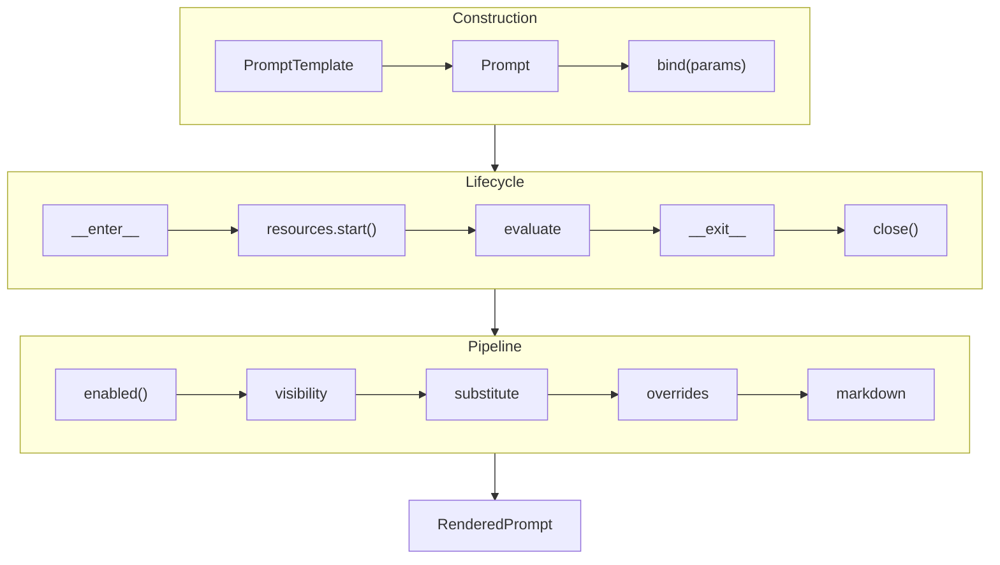

# Prompt System Specification

Centralized abstraction for LLM prompt composition with typed templates,
hierarchical sections, and resource lifecycle management.

**Source:** `src/weakincentives/prompt/`

## Principles

- **Type-safe**: Placeholders map to dataclass fields
- **Strict failures**: Validation errors fail loudly with context
- **Composable**: Hierarchical sections with deterministic heading levels
- **Resource co-location**: Prompts declare and manage resource lifecycle



## PromptTemplate

**Definition:** `prompt/prompt.py:PromptTemplate`

```python
template = PromptTemplate[OutputType](
    ns="demo",
    key="compose-email",
    name="compose_email",
    sections=[...],
    resources=ResourceRegistry.of(...),
)
```

- `ns` and `key` required, non-empty
- `(ns, key)` identifies prompt for versioning/overrides
- Section keys: `^[a-z0-9][a-z0-9._-]{0,63}$`

## Sections

**Definition:** `prompt/section.py`

| Field | Purpose |
|-------|---------|
| `title` | Rendered as heading |
| `key` | Identifier for overrides |
| `template` | Content with `$placeholder` substitution |
| `tools` | Tools available when section enabled |
| `enabled` | `Callable[[ParamsT], bool]` predicate |
| `visibility` | `FULL` or `SUMMARY` |
| `accepts_overrides` | Allow override system |

### MarkdownSection

Default section: dedents, strips, runs `Template.substitute`:

```python
section = MarkdownSection[Params](
    title="Tone",
    key="tone",
    template="Target tone: ${tone}",
    summary="Tone guidance available.",
)
```

### WorkspaceSection

Contributes filesystem to prompt resources. **Definition:** `prompt/section.py`

## Resource Lifecycle

Prompts collect resources from: template, sections, bind-time. Later sources
override earlier on conflict.

```python
prompt = Prompt(template).bind(Params(...), resources={Clock: SystemClock()})

with prompt.resources:
    fs = prompt.resources.get(Filesystem)
    response = adapter.evaluate(prompt, session=session)
# Cleanup automatic
```

**Transactions:** Use `runtime.transactions.tool_transaction` for atomic tool
execution with snapshot/restore.

## Rendering

`Prompt.render()` walks section tree depth-first, producing markdown.

**Heading levels:** Root = `##`, depth N = `##` + N `#`'s. Numbered: `## 1. Title`

**Parameter lookup:** `default_params` → first bound default → instantiate.
Missing required fields raise `PromptRenderError`.

## Structured Output

**Definition:** `prompt/structured_output.py`

```python
@dataclass
class Summary:
    title: str
    gist: str

template = PromptTemplate[Summary](...)  # JSON object
template = PromptTemplate[list[Summary]](...)  # JSON array
```

`parse_structured_output(text, rendered)` extracts/validates: prefers fenced
JSON, else scans for `{...}`/`[...]`.

## Progressive Disclosure

Sections render with `SUMMARY` visibility to reduce tokens. Framework provides:

| Tool | Behavior |
|------|----------|
| `open_sections` | Permanently expand (for sections with tools) |
| `read_section` | Return content without state change |

Summarized sections append suffix directing model to appropriate tool.
`open_sections` raises `VisibilityExpansionRequired` for caller to handle.

## Prompt Overrides

**Definition:** `prompt/overrides/`

Hash-validated patches for iteration without source changes:

| Target | Override Type |
|--------|---------------|
| Section body | `SectionOverride` |
| Tool description | `ToolOverride` |
| Tool param description | `ToolOverride.param_descriptions` |
| Tool/task examples | `ToolExampleOverride`, `TaskExampleOverride` |

**Not overridable:** Tool names, parameter types, section structure.

```python
store = LocalPromptOverridesStore()
prompt = Prompt(template, overrides_store=store, overrides_tag="stable")
```

**Storage:** `.weakincentives/prompts/overrides/{ns}/{key}/{tag}.json`

Hash mismatches indicate source drift; stale overrides filtered on load.

## RenderedPrompt

**Definition:** `prompt/rendering.py:RenderedPrompt`

| Property | Type |
|----------|------|
| `text` | Markdown string |
| `tools` | `tuple[Tool, ...]` |
| `output_type` | Structured output type |
| `deadline` | Optional deadline |
| `descriptor` | For override system |

## Errors

| Error | Cause |
|-------|-------|
| `PromptValidationError` | Missing key, invalid type, bad section |
| `PromptRenderError` | Missing params, template error |
| `OutputParseError` | Structured output validation failed |
| `VisibilityExpansionRequired` | Progressive disclosure expansion |

## Limitations

- Dataclass-only inputs
- Only `Template.substitute` and boolean `enabled`
- No nested prompts (use `children`)
- Single-turn expansion for progressive disclosure
- Resources require context manager
