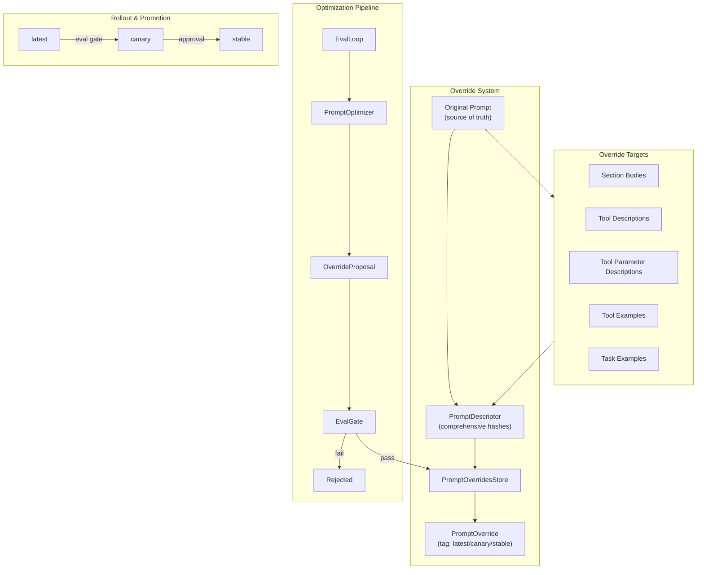
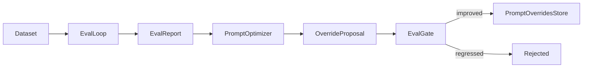

# Prompt Optimization Specification

## Purpose

Enable comprehensive prompt iteration and enhancement without source file
changes. This specification covers the override system for replacing all
string literals that impact agent performance, including examples, and the
optimization pipeline for automated, eval-driven prompt improvement.

## Guiding Principles

- **Total coverage**: Every string literal that impacts model behavior is
  overridable.
- **Stable identifiers**: Overrides anchor to deterministic keys and hashes.
- **Fail closed**: Stale or ambiguous edits fail rather than silently mutate.
- **Source of truth preserved**: Authored prompts remain canonical; overrides
  are opt-in layers.
- **Eval-driven iteration**: Optimization proposals are validated by evals
  before promotion.
- **Graduated rollout**: Tags support staging (latest → canary → stable) with
  approval gates.



## Override Target Model

All overridable content falls into these categories:

| Target | Identifier | Hash Basis | Override Type |
|--------|------------|------------|---------------|
| Section body | `(path,)` | Template text | `SectionOverride` |
| Tool description | `tool_name` | Contract (desc + schema) | `ToolOverride` |
| Tool param description | `tool_name.param` | Contract hash | `ToolOverride.param_descriptions` |
| Tool example | `tool_name#index` | Example content hash | `ToolExampleOverride` |
| Task example | `path#index` | Example content hash | `TaskExampleOverride` |

### What's Overridable

**Section Content:**
- Template text in `MarkdownSection` and other template-based sections
- Section summaries
- Any section implementing `render_override()`

**Tool Metadata:**
- Tool descriptions (1-200 ASCII chars)
- Parameter descriptions (per-field metadata)
- Tool examples: description, input, output (add/modify/remove)

**Task Examples:**
- Objective text
- Outcome text/structure
- Step descriptions and tool invocations (add/modify/remove)

### What's NOT Overridable

- Tool names (breaking change to schema)
- Tool parameter types/constraints (schema change)
- Section structure (add/remove sections)
- Tool availability (add/remove tools)

## Descriptor System

### Core Descriptors

```python
class HexDigest(str):
    """Validated lowercase hexadecimal SHA-256 digest (64 chars)."""

@dataclass(slots=True, frozen=True)
class SectionDescriptor:
    """Hash metadata for a single section within a prompt."""
    path: tuple[str, ...]
    content_hash: HexDigest  # SHA-256 of original body template
    number: str

@dataclass(slots=True, frozen=True)
class ToolDescriptor:
    """Metadata describing a tool exposed by a prompt."""
    path: tuple[str, ...]
    name: str
    contract_hash: HexDigest  # hash(description :: params_schema :: result_schema)
    example_hashes: tuple[HexDigest, ...]  # Per-example content hashes

@dataclass(slots=True, frozen=True)
class TaskExampleDescriptor:
    """Metadata describing a task example within a section."""
    path: tuple[str, ...]
    index: int
    content_hash: HexDigest  # hash(objective :: steps :: outcome)

@dataclass(slots=True, frozen=True)
class PromptDescriptor:
    """Complete metadata for a prompt and all overridable content."""
    ns: str
    key: str
    sections: list[SectionDescriptor]
    tools: list[ToolDescriptor]
    task_examples: list[TaskExampleDescriptor]
```

### Hash Computation

**Section hash:**
```python
hash_text(section.original_body_template())
```

**Tool contract hash:**
```python
hash_text("::".join([
    hash_text(tool.description),
    hash_json(params_schema),
    hash_json(result_schema),
]))
```

**Tool example hash:**
```python
hash_json({
    "description": example.description,
    "input": dump(example.input),
    "output": dump(example.output),
})
```

**Task example hash:**
```python
hash_json({
    "objective": example.objective,
    "steps": [
        {"tool": step.tool_name, "description": step.example.description}
        for step in example.steps
    ],
    "outcome": dump(example.outcome) if dataclass else example.outcome,
})
```

## Override Models

### Section Override

```python
@dataclass(slots=True, frozen=True)
class SectionOverride:
    """Override payload for a prompt section validated by hash."""
    expected_hash: HexDigest
    body: str
```

### Tool Override

```python
@dataclass(slots=True, frozen=True)
class ToolExampleOverride:
    """Override for a single tool example."""
    index: int  # Original index, or -1 for append
    expected_hash: HexDigest | None  # None for new examples
    action: Literal["modify", "remove", "append"]
    description: str | None = None
    input_json: str | None = None  # JSON-serialized params
    output_json: str | None = None  # JSON-serialized result

@dataclass(slots=True, frozen=True)
class ToolOverride:
    """Description overrides validated against a tool contract hash."""
    name: str
    expected_contract_hash: HexDigest
    description: str | None = None
    param_descriptions: dict[str, str] = field(default_factory=dict)
    example_overrides: tuple[ToolExampleOverride, ...] = ()
```

### Task Example Override

```python
@dataclass(slots=True, frozen=True)
class TaskStepOverride:
    """Override for a single step within a task example."""
    index: int
    tool_name: str | None = None  # None = keep original
    description: str | None = None
    input_json: str | None = None
    output_json: str | None = None

@dataclass(slots=True, frozen=True)
class TaskExampleOverride:
    """Override for a task example within TaskExamplesSection."""
    path: tuple[str, ...]
    index: int  # Original index, or -1 for append
    expected_hash: HexDigest | None  # None for new examples
    action: Literal["modify", "remove", "append"]
    objective: str | None = None
    outcome: str | None = None  # String or JSON-serialized dataclass
    step_overrides: tuple[TaskStepOverride, ...] = ()
    steps_to_remove: tuple[int, ...] = ()  # Indices to remove
    steps_to_append: tuple[TaskStepOverride, ...] = ()  # New steps
```

### Prompt Override

```python
@dataclass(slots=True, frozen=True)
class PromptOverride:
    """Complete override specification for a prompt."""
    ns: str
    prompt_key: str
    tag: str
    sections: dict[tuple[str, ...], SectionOverride] = field(default_factory=dict)
    tool_overrides: dict[str, ToolOverride] = field(default_factory=dict)
    task_example_overrides: tuple[TaskExampleOverride, ...] = ()
```

## Storage Layout

```
.weakincentives/
  prompts/
    overrides/
      {ns_segments...}/
        {prompt_key}/
          latest.json
          canary.json
          stable.json
```

### File Format (v2)

```json
{
  "version": 2,
  "ns": "agents/code-review",
  "prompt_key": "review",
  "tag": "latest",
  "sections": {
    "system": {
      "expected_hash": "abc123...",
      "body": "You are a code review assistant..."
    }
  },
  "tools": {
    "suggest_fix": {
      "expected_contract_hash": "def456...",
      "description": "Suggest a code fix for the identified issue.",
      "param_descriptions": {
        "file_path": "Path to the file containing the issue",
        "line_number": "Line number where the issue occurs"
      },
      "example_overrides": [
        {
          "index": 0,
          "expected_hash": "ghi789...",
          "action": "modify",
          "description": "Fix unused import",
          "input_json": "{\"file_path\": \"src/main.py\", \"line_number\": 5}",
          "output_json": "{\"suggestion\": \"Remove unused import\"}"
        },
        {
          "index": -1,
          "expected_hash": null,
          "action": "append",
          "description": "Fix type annotation",
          "input_json": "{\"file_path\": \"src/utils.py\", \"line_number\": 10}",
          "output_json": "{\"suggestion\": \"Add return type annotation\"}"
        }
      ]
    }
  },
  "task_example_overrides": [
    {
      "path": ["task-examples", "fix-lint-errors"],
      "index": 0,
      "expected_hash": "jkl012...",
      "action": "modify",
      "objective": "Fix all lint errors in the utils module",
      "outcome": "All lint errors resolved, tests passing",
      "step_overrides": [
        {
          "index": 0,
          "description": "Identify lint errors using ruff"
        }
      ]
    }
  ]
}
```

## Store Protocol

```python
class PromptOverridesStore(Protocol):
    """Interface for prompt override persistence."""

    def resolve(
        self,
        descriptor: PromptDescriptor,
        tag: str = "latest",
    ) -> PromptOverride | None:
        """Load and filter override for descriptor.

        Returns None if no override exists or all entries are stale.
        Stale entries (hash mismatch) are filtered out silently.
        """
        ...

    def upsert(
        self,
        descriptor: PromptDescriptor,
        override: PromptOverride,
    ) -> PromptOverride:
        """Persist override, validating hashes match descriptor.

        Raises PromptOverridesError if any hash doesn't match.
        """
        ...

    def delete(
        self,
        *,
        ns: str,
        prompt_key: str,
        tag: str,
    ) -> None:
        """Remove override file."""
        ...

    def seed(
        self,
        prompt: PromptLike,
        *,
        tag: str = "latest",
    ) -> PromptOverride:
        """Bootstrap override file from current prompt state.

        Creates an override with current content as the override values,
        enabling immediate iteration without manual JSON editing.
        """
        ...

    def set_section_override(
        self,
        prompt: PromptLike,
        *,
        tag: str = "latest",
        path: tuple[str, ...],
        body: str,
    ) -> PromptOverride:
        """Convenience method to update a single section."""
        ...

    def set_tool_override(
        self,
        prompt: PromptLike,
        *,
        tag: str = "latest",
        tool_name: str,
        description: str | None = None,
        param_descriptions: dict[str, str] | None = None,
        example_overrides: tuple[ToolExampleOverride, ...] | None = None,
    ) -> PromptOverride:
        """Convenience method to update a single tool."""
        ...

    def set_task_example_override(
        self,
        prompt: PromptLike,
        *,
        tag: str = "latest",
        override: TaskExampleOverride,
    ) -> PromptOverride:
        """Convenience method to update a single task example."""
        ...

    def promote(
        self,
        *,
        ns: str,
        prompt_key: str,
        from_tag: str,
        to_tag: str,
    ) -> PromptOverride:
        """Copy override from one tag to another.

        Typically used for latest → canary → stable promotion.
        """
        ...

    def diff(
        self,
        *,
        ns: str,
        prompt_key: str,
        tag_a: str,
        tag_b: str,
    ) -> OverrideDiff:
        """Compare overrides between two tags."""
        ...
```

## Optimization Pipeline

### Eval Integration

The optimization pipeline connects overrides to the evaluation framework:



### OverrideProposal

```python
@dataclass(slots=True, frozen=True)
class OverrideProposal:
    """Proposed changes generated by an optimizer."""
    prompt_key: str
    ns: str
    changes: PromptOverride
    rationale: str  # LLM-generated explanation
    baseline_score: float  # Score before changes
    estimated_improvement: float | None  # Predicted delta

@dataclass(slots=True, frozen=True)
class ProposalResult:
    """Result of evaluating a proposal."""
    proposal: OverrideProposal
    baseline_report: EvalReport
    proposal_report: EvalReport
    accepted: bool
    rejection_reason: str | None = None
```

### EvalGate

```python
@dataclass(slots=True, frozen=True)
class EvalGate:
    """Threshold configuration for auto-approval."""
    min_pass_rate: float = 0.0  # Minimum absolute pass rate
    min_improvement: float = 0.0  # Minimum delta over baseline
    max_regression_samples: int = 0  # Max samples that can regress
    required_sample_ids: frozenset[str] = frozenset()  # Must pass

    def evaluate(
        self,
        baseline: EvalReport,
        proposal: EvalReport,
    ) -> tuple[bool, str | None]:
        """Check if proposal meets gate criteria.

        Returns (passed, rejection_reason).
        """
        ...
```

### PromptOptimizer Protocol

```python
class PromptOptimizer(Protocol[InputT, OutputT]):
    """Protocol for optimization algorithms."""

    def optimize(
        self,
        prompt: Prompt[InputT],
        *,
        session: SessionProtocol,
        eval_report: EvalReport | None = None,
    ) -> OutputT:
        """Generate optimization output.

        Args:
            prompt: The prompt to optimize
            session: Session for state access
            eval_report: Optional baseline eval results for guided optimization
        """
        ...

    def propose(
        self,
        prompt: Prompt[InputT],
        *,
        session: SessionProtocol,
        eval_report: EvalReport,
    ) -> OverrideProposal:
        """Generate an override proposal based on eval results.

        Analyzes failures and successes to propose targeted improvements.
        """
        ...
```

### OptimizationContext

```python
@dataclass(slots=True, frozen=True)
class OptimizationContext:
    """Dependencies for optimization execution."""
    adapter: ProviderAdapter[object]
    dispatcher: Dispatcher
    deadline: Deadline | None = None
    overrides_store: PromptOverridesStore | None = None
    overrides_tag: str = "latest"
    optimization_session: Session | None = None
    eval_dataset: Dataset[Any, Any] | None = None  # For proposal validation
    eval_gate: EvalGate | None = None  # For auto-approval
```

### BasePromptOptimizer

```python
class BasePromptOptimizer(ABC, Generic[InputT, OutputT]):
    """Base class providing common optimization infrastructure."""

    def __init__(
        self,
        context: OptimizationContext,
        *,
        config: OptimizerConfig | None = None,
    ) -> None: ...

    @abstractmethod
    def optimize(
        self,
        prompt: Prompt[InputT],
        *,
        session: SessionProtocol,
        eval_report: EvalReport | None = None,
    ) -> OutputT: ...

    def propose(
        self,
        prompt: Prompt[InputT],
        *,
        session: SessionProtocol,
        eval_report: EvalReport,
    ) -> OverrideProposal:
        """Default implementation analyzes eval failures."""
        ...

    def _create_optimization_session(
        self,
        prompt: Prompt[InputT],
    ) -> Session:
        """Create isolated session for optimization work."""
        ...

    def _validate_proposal(
        self,
        prompt: Prompt[InputT],
        proposal: OverrideProposal,
    ) -> ProposalResult:
        """Run evals with proposed overrides and check gate."""
        ...
```

## Rollout & Promotion

### Tag Semantics

| Tag | Purpose | Auto-update | Approval Required |
|-----|---------|-------------|-------------------|
| `latest` | Active development | Yes | No |
| `canary` | Pre-production validation | Via gate | Optional |
| `stable` | Production traffic | Via promotion | Yes |

### PromotionPolicy

```python
@dataclass(slots=True, frozen=True)
class PromotionPolicy:
    """Rules governing tag promotion."""
    require_eval_gate: bool = True
    require_human_approval: bool = False
    min_canary_duration: timedelta | None = None  # Time in canary before stable
    auto_promote_on_gate_pass: bool = False
    rollback_on_regression: bool = True

@dataclass(slots=True, frozen=True)
class PromotionRequest:
    """Request to promote an override to a new tag."""
    ns: str
    prompt_key: str
    from_tag: str
    to_tag: str
    eval_report: EvalReport | None = None
    approver: str | None = None  # For audit trail

@dataclass(slots=True, frozen=True)
class PromotionResult:
    """Result of a promotion attempt."""
    request: PromotionRequest
    success: bool
    override: PromptOverride | None = None
    rejection_reason: str | None = None
```

### Promotion Workflow

```python
class PromotionManager:
    """Manages override promotion between tags."""

    def __init__(
        self,
        store: PromptOverridesStore,
        policy: PromotionPolicy,
        eval_context: OptimizationContext | None = None,
    ) -> None: ...

    def request_promotion(
        self,
        request: PromotionRequest,
    ) -> PromotionResult:
        """Attempt to promote override.

        1. Validate source tag exists
        2. Run eval gate if required
        3. Check human approval if required
        4. Execute promotion
        5. Emit PromotionCompleted event
        """
        ...

    def rollback(
        self,
        *,
        ns: str,
        prompt_key: str,
        tag: str,
    ) -> PromptOverride | None:
        """Revert tag to previous version (if history available)."""
        ...
```

## Rendering Integration

### Override Application Order

1. Load `PromptOverride` from store for descriptor and tag
2. Filter stale entries (hash mismatches)
3. Apply section overrides to `render_override()` calls
4. Apply tool description/param overrides during tool rendering
5. Apply tool example overrides during example rendering
6. Apply task example overrides during TaskExample rendering

### Section Override Rendering

```python
# In MarkdownSection.render_override()
def render_override(
    self,
    body: str,
    params: ParamsT | None,
    *,
    visibility: SectionVisibility | None = None,
) -> str:
    """Render override body with parameter substitution."""
    effective = self.effective_visibility(override=visibility, params=params)
    if effective == SectionVisibility.SUMMARY and self.summary is not None:
        return self.summary
    template = string.Template(body)
    param_dict = _params_to_dict(params) if params else {}
    return template.safe_substitute(param_dict)
```

### Tool Example Override Application

```python
def apply_tool_example_overrides(
    tool: Tool[P, R],
    overrides: tuple[ToolExampleOverride, ...],
) -> tuple[ToolExample[P, R], ...]:
    """Apply example overrides to a tool's examples.

    Returns new tuple with modifications applied.
    """
    examples = list(tool.examples)

    # Process removals first (reverse order to preserve indices)
    for override in sorted(overrides, key=lambda o: o.index, reverse=True):
        if override.action == "remove" and 0 <= override.index < len(examples):
            examples.pop(override.index)

    # Process modifications
    for override in overrides:
        if override.action == "modify" and 0 <= override.index < len(examples):
            original = examples[override.index]
            examples[override.index] = _apply_example_override(original, override)

    # Process appends
    for override in overrides:
        if override.action == "append":
            examples.append(_create_example_from_override(override, tool))

    return tuple(examples)
```

### Task Example Override Application

```python
def apply_task_example_overrides(
    section: TaskExamplesSection[P],
    overrides: tuple[TaskExampleOverride, ...],
) -> TaskExamplesSection[P]:
    """Apply task example overrides to a section.

    Returns new section with modifications applied.
    """
    examples = list(section.children)

    # Similar logic: removals, modifications, appends
    ...

    return section.clone(examples=examples)
```

## Events

### Optimization Events

```python
@dataclass(slots=True, frozen=True)
class OptimizationStarted:
    """Emitted when optimization begins."""
    prompt_ns: str
    prompt_key: str
    optimizer_type: str
    timestamp: datetime

@dataclass(slots=True, frozen=True)
class OptimizationCompleted:
    """Emitted when optimization succeeds."""
    prompt_ns: str
    prompt_key: str
    optimizer_type: str
    result_summary: str
    duration_ms: int
    timestamp: datetime

@dataclass(slots=True, frozen=True)
class OptimizationFailed:
    """Emitted when optimization fails."""
    prompt_ns: str
    prompt_key: str
    optimizer_type: str
    error: str
    timestamp: datetime
```

### Proposal Events

```python
@dataclass(slots=True, frozen=True)
class ProposalGenerated:
    """Emitted when an optimizer generates a proposal."""
    prompt_ns: str
    prompt_key: str
    baseline_score: float
    estimated_improvement: float | None
    timestamp: datetime

@dataclass(slots=True, frozen=True)
class ProposalValidated:
    """Emitted after proposal eval validation."""
    prompt_ns: str
    prompt_key: str
    baseline_pass_rate: float
    proposal_pass_rate: float
    accepted: bool
    rejection_reason: str | None
    timestamp: datetime
```

### Promotion Events

```python
@dataclass(slots=True, frozen=True)
class PromotionRequested:
    """Emitted when promotion is requested."""
    prompt_ns: str
    prompt_key: str
    from_tag: str
    to_tag: str
    requester: str | None
    timestamp: datetime

@dataclass(slots=True, frozen=True)
class PromotionCompleted:
    """Emitted when promotion succeeds."""
    prompt_ns: str
    prompt_key: str
    from_tag: str
    to_tag: str
    approver: str | None
    timestamp: datetime

@dataclass(slots=True, frozen=True)
class PromotionRejected:
    """Emitted when promotion is rejected."""
    prompt_ns: str
    prompt_key: str
    from_tag: str
    to_tag: str
    reason: str
    timestamp: datetime
```

## Usage Examples

### Basic Override Application

```python
from weakincentives.prompt import Prompt
from weakincentives.prompt.overrides import LocalPromptOverridesStore

store = LocalPromptOverridesStore()

# Production: use stable tag
prompt = Prompt(
    template,
    overrides_store=store,
    overrides_tag="stable",
).bind(params)

response = adapter.evaluate(prompt, session=session)
```

### Seeding and Iterating

```python
# Bootstrap override file from current prompt
override = store.seed(prompt, tag="latest")

# Iterate on a specific section
store.set_section_override(
    prompt,
    tag="latest",
    path=("system",),
    body="You are a helpful code review assistant. Focus on clarity and correctness.",
)

# Add a new tool example
store.set_tool_override(
    prompt,
    tag="latest",
    tool_name="suggest_fix",
    example_overrides=(
        ToolExampleOverride(
            index=-1,
            expected_hash=None,
            action="append",
            description="Fix missing docstring",
            input_json='{"file": "main.py", "line": 10}',
            output_json='{"suggestion": "Add docstring"}',
        ),
    ),
)
```

### Eval-Driven Optimization

```python
from weakincentives.evals import Dataset, EvalLoop, all_of, exact_match
from weakincentives.optimizers import OptimizationContext, EvalGate

# Load eval dataset
dataset = Dataset.load(Path("evals/code_review.jsonl"), str, str)

# Configure optimization context
context = OptimizationContext(
    adapter=adapter,
    dispatcher=bus,
    overrides_store=store,
    eval_dataset=dataset,
    eval_gate=EvalGate(
        min_pass_rate=0.9,
        min_improvement=0.05,
    ),
)

# Create optimizer
optimizer = PromptImprovementOptimizer(context)

# Run baseline eval
baseline_report = run_eval(prompt, dataset, evaluator)

# Generate proposal based on failures
proposal = optimizer.propose(prompt, session=session, eval_report=baseline_report)

# Validate proposal meets gate
result = optimizer._validate_proposal(prompt, proposal)

if result.accepted:
    # Auto-apply to latest
    store.upsert(descriptor, proposal.changes)
    print(f"Applied: {proposal.rationale}")
else:
    print(f"Rejected: {result.rejection_reason}")
```

### Automated Promotion Pipeline

```python
from weakincentives.optimizers import PromotionManager, PromotionPolicy

policy = PromotionPolicy(
    require_eval_gate=True,
    require_human_approval=False,
    auto_promote_on_gate_pass=True,
)

manager = PromotionManager(store, policy, eval_context=context)

# Promote latest → canary (auto if gate passes)
result = manager.request_promotion(PromotionRequest(
    ns="agents/code-review",
    prompt_key="review",
    from_tag="latest",
    to_tag="canary",
))

if result.success:
    print("Promoted to canary")
else:
    print(f"Blocked: {result.rejection_reason}")

# Later: canary → stable (may require approval based on policy)
result = manager.request_promotion(PromotionRequest(
    ns="agents/code-review",
    prompt_key="review",
    from_tag="canary",
    to_tag="stable",
    approver="alice@example.com",
))
```

### CLI Integration

```bash
# Seed override file
wink prompt seed agents/code-review:review --tag latest

# View diff between tags
wink prompt diff agents/code-review:review --from latest --to stable

# Promote with eval gate
wink prompt promote agents/code-review:review --from latest --to canary

# Manual promotion (bypass gate)
wink prompt promote agents/code-review:review --from canary --to stable --approve

# Run optimization loop
wink prompt optimize agents/code-review:review \
    --dataset evals/code_review.jsonl \
    --gate-pass-rate 0.9 \
    --auto-apply
```

## Validation Rules

### Override Validation

- Section paths must use canonical keys (not headings/titles)
- Hash mismatches are logged and the override is skipped (lenient mode)
- Hash mismatches raise `PromptOverridesError` on write (strict mode)
- Invalid identifiers raise `PromptOverridesError` before filesystem access
- Disabled sections stay disabled even with overrides
- Example indices must be valid for modify/remove actions
- JSON in example overrides must be valid and match expected schema

### Optimizer Constraints

- Must run synchronously and honor deadlines
- Results must be serializable
- Internal sessions must not mutate caller's session
- Adapter dependency injected at construction
- Proposals must include rationale

### Promotion Constraints

- Cannot skip tags (must go latest → canary → stable)
- Cannot promote empty/missing tags
- Canary → stable requires baseline comparison
- Rollback preserves audit trail

## Migration from v1

Override files with `"version": 1` are automatically migrated:

1. Tool overrides without `example_overrides` get empty tuple
2. No `task_example_overrides` field added (empty by default)
3. Version bumped to 2 on next write

No breaking changes to existing v1 files; they continue to work but won't
have example override capabilities until re-seeded or manually updated.

## Limitations

- **No cross-repo portability**: Overrides are relative to project root
- **No auto-refresh**: Digests reflect state at optimization time
- **Override drift**: Source changes can invalidate overrides
- **Synchronous execution**: Long optimizations may need chunking
- **Alpha stability**: Interfaces may evolve without compatibility shims
- **No partial example overrides**: Cannot override just input without output
