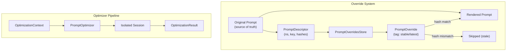

# Prompt Optimization Specification

## Purpose

Enable prompt iteration and enhancement without source file changes. This
specification covers the override system for replacing prompt content and the
optimizer abstraction for algorithmic prompt transformations.

## Guiding Principles

- **Stable identifiers**: Overrides anchor to deterministic keys and hashes.
- **Fail closed**: Stale or ambiguous edits fail rather than silently mutate.
- **Source of truth preserved**: Authored prompts remain canonical; overrides
  are opt-in layers.
- **Observable execution**: Optimizers emit events for tracing and debugging.



## Override System

### Terminology

- **Namespace (`ns`)** - Groups related prompts (e.g., `webapp/agents`)
- **Prompt key** - Machine identifier for each `Prompt`
- **Section key** - Machine identifier for each `Section`
- **Content hash** - SHA-256 of original section template
- **Tag** - Override variant label (e.g., `latest`, `stable`)

### Override Mechanisms

**Section Overrides:**

- Replace rendered body of hash-aware sections
- Identifiers: `(ns, prompt_key, section_path, expected_hash, tag)`
- Hashes must match descriptor; section paths use canonical keys

**Tool Overrides:**

- Patch model-facing descriptions and parameter annotations
- Identifiers: `(ns, prompt_key, tool_name, expected_contract_hash, tag)`
- Schema changes invalidate via contract hash

### Descriptor Contract

```python
@dataclass(slots=True)
class SectionDescriptor:
    path: tuple[str, ...]
    content_hash: HexDigest  # SHA-256 hex digest (64 chars)
    number: str

@dataclass(slots=True)
class ToolDescriptor:
    path: tuple[str, ...]
    name: str
    contract_hash: HexDigest  # SHA-256 hex digest (64 chars)

@dataclass(slots=True)
class PromptDescriptor:
    ns: str
    key: str
    sections: list[SectionDescriptor]
    tools: list[ToolDescriptor]
```

**Hash Computation:**

- Section: SHA-256 of original body template text only
- Tool contract: `hash(description :: params_schema :: result_schema)`

### Override Model

```python
@dataclass(slots=True)
class SectionOverride:
    expected_hash: str
    body: str

@dataclass(slots=True)
class ToolOverride:
    name: str
    expected_contract_hash: str
    description: str | None = None
    param_descriptions: dict[str, str] = field(default_factory=dict)

@dataclass(slots=True)
class PromptOverride:
    ns: str
    prompt_key: str
    tag: str
    sections: dict[tuple[str, ...], SectionOverride] = field(default_factory=dict)
    tool_overrides: dict[str, ToolOverride] = field(default_factory=dict)
```

### Storage Layout

```
.weakincentives/
  prompts/
    overrides/
      {ns_segments...}/
        {prompt_key}/
          {tag}.json
```

File format:

```json
{
  "version": 1,
  "ns": "demo",
  "prompt_key": "welcome",
  "tag": "stable",
  "sections": {
    "system": {
      "expected_hash": "...",
      "body": "You are an assistant."
    }
  },
  "tools": {
    "search": {
      "expected_contract_hash": "...",
      "description": "Search the index.",
      "param_descriptions": {"query": "Keywords"}
    }
  }
}
```

### Store Protocol

```python
class PromptOverridesStore(Protocol):
    def resolve(
        self,
        descriptor: PromptDescriptor,
        tag: str = "latest",
    ) -> PromptOverride | None: ...

    def upsert(
        self,
        descriptor: PromptDescriptor,
        override: PromptOverride,
    ) -> PromptOverride: ...

    def delete(
        self,
        *,
        ns: str,
        prompt_key: str,
        tag: str,
    ) -> None: ...

    def seed(
        self,
        prompt: PromptLike,  # Protocol for prompt-like objects
        *,
        tag: str = "latest",
    ) -> PromptOverride: ...

    def set_section_override(
        self,
        prompt: PromptLike,
        *,
        tag: str = "latest",
        path: tuple[str, ...],
        body: str,
    ) -> PromptOverride: ...
```

The `descriptor_for_prompt(prompt)` helper function computes and caches
descriptors on prompt objects for efficient lookup.

## Optimizer Abstraction

### PromptOptimizer Protocol

```python
class PromptOptimizer(Protocol[InputT, OutputT]):
    def optimize(
        self,
        prompt: Prompt[InputT],
        *,
        session: SessionProtocol,
    ) -> OutputT: ...
```

### OptimizationContext

```python
@dataclass(slots=True, frozen=True)
class OptimizationContext:
    adapter: ProviderAdapter[object]
    dispatcher: Dispatcher
    deadline: Deadline | None = None
    overrides_store: PromptOverridesStore | None = None
    overrides_tag: str = "latest"
    optimization_session: Session | None = None
```

### OptimizerConfig

```python
@dataclass(slots=True, frozen=True)
class OptimizerConfig:
    accepts_overrides: bool = True  # Whether optimizer participates in override system
```

### Base Optimizer

```python
class BasePromptOptimizer(ABC, Generic[InputT, OutputT]):
    def __init__(
        self,
        context: OptimizationContext,
        *,
        config: OptimizerConfig | None = None,
    ) -> None: ...

    @abstractmethod
    def optimize(
        self,
        prompt: Prompt[InputT],
        *,
        session: SessionProtocol,
    ) -> OutputT: ...

    def _create_optimization_session(
        self, prompt: Prompt[InputT]
    ) -> Session: ...
```

### WorkspaceDigestOptimizer

Generates task-agnostic workspace summaries:

```python
class WorkspaceDigestOptimizer(BasePromptOptimizer[object, WorkspaceDigestResult]):
    def __init__(
        self,
        context: OptimizationContext,
        *,
        store_scope: PersistenceScope = PersistenceScope.SESSION,
    ) -> None: ...
```

**Workflow:**

1. Locate `WorkspaceDigestSection` and workspace section
1. Create isolated optimization session
1. Clone session-aware sections
1. Compose optimization prompt with planning tools
1. Evaluate and extract digest
1. Persist based on scope (SESSION or GLOBAL)

**Result:**

```python
@dataclass(slots=True, frozen=True)
class WorkspaceDigestResult:
    response: PromptResponse[object]
    digest: str
    scope: PersistenceScope
    section_key: str
```

## Usage Examples

### Applying Overrides

```python
from weakincentives.prompt.overrides import LocalPromptOverridesStore
from weakincentives.prompt import Prompt

store = LocalPromptOverridesStore()

prompt = Prompt(template, overrides_store=store, overrides_tag="stable").bind(params)
response = adapter.evaluate(prompt, session=session)
```

### Running Optimization

```python
from weakincentives.optimizers import (
    OptimizationContext,
    PersistenceScope,
)
from weakincentives.contrib.optimizers import WorkspaceDigestOptimizer

context = OptimizationContext(
    adapter=adapter,
    dispatcher=bus,
    overrides_store=store,
)

optimizer = WorkspaceDigestOptimizer(
    context,
    store_scope=PersistenceScope.GLOBAL,
)

result = optimizer.optimize(prompt, session=session)
print(f"Digest stored at section: {result.section_key}")
```

### Seeding Overrides

```python
# Bootstrap override file from current prompt
override = store.seed(prompt, tag="v1")
```

## Validation Rules

### Override Validation

- Section paths must use canonical keys (not headings/titles)
- Hash mismatches are logged and the override is skipped
- Invalid identifiers raise `PromptOverridesError` before filesystem access
- Disabled sections stay disabled even with overrides

### Optimizer Constraints

- Must run synchronously and honor deadlines
- Results must be serializable
- Internal sessions must not mutate caller's session
- Adapter dependency injected at construction

## Events

Optimizers define event types for observability:

- `OptimizationStarted` - Captures prompt descriptor and optimizer type
- `OptimizationCompleted` - Result summary on success
- `OptimizationFailed` - Error context on exception

Note: Event publishing is available through `OptimizationContext.dispatcher` but
optimizers must explicitly emit events in their implementations.

## Limitations

- **No cross-repo portability**: Overrides are relative to project root
- **No auto-refresh**: Digests reflect workspace at optimization time
- **Override drift**: Workspace changes can invalidate overrides
- **Synchronous execution**: Long optimizations may need chunking
- **Alpha stability**: Interfaces may evolve without compatibility shims
