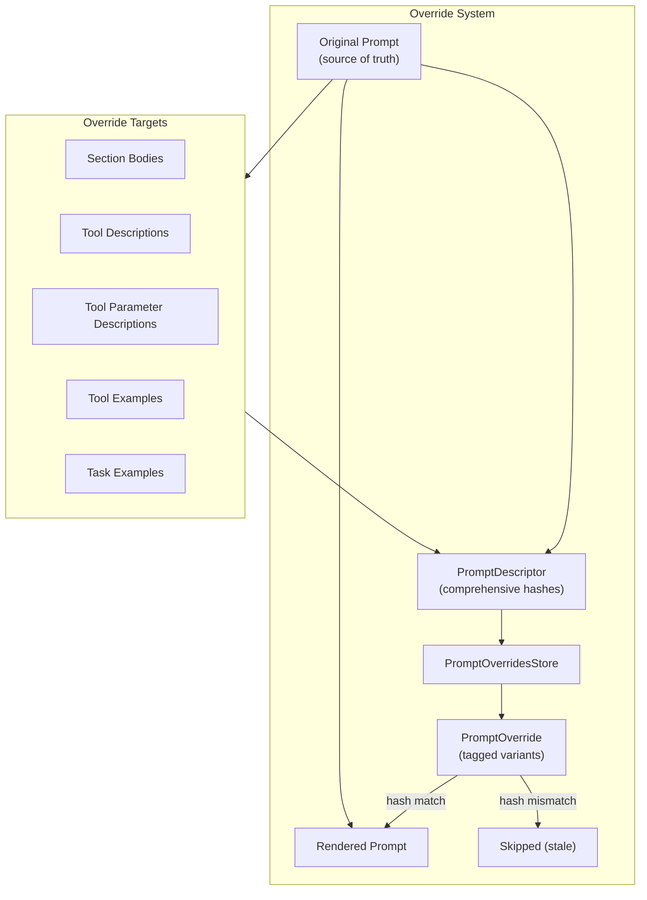

# Prompt Optimization Specification

## Purpose

Enable comprehensive prompt iteration and enhancement without source file
changes. This specification covers the override system for replacing all
string literals that impact agent performance, including tool examples and
task examples.

## Guiding Principles

- **Total coverage**: Every string literal that impacts model behavior is
  overridable.
- **Stable identifiers**: Overrides anchor to deterministic keys and hashes.
- **Fail closed**: Stale or ambiguous edits fail rather than silently mutate.
- **Source of truth preserved**: Authored prompts remain canonical; overrides
  are opt-in layers.



## Override Target Model

All overridable content falls into these categories:

| Target | Identifier | Hash Basis | Override Type |
| ---------------------- | ----------------- | ------------------------ | --------------------------------- |
| Section body | `(path,)` | Template text | `SectionOverride` |
| Tool description | `tool_name` | Contract (desc + schema) | `ToolOverride` |
| Tool param description | `tool_name.param` | Contract hash | `ToolOverride.param_descriptions` |
| Tool example | `tool_name#index` | Example content hash | `ToolExampleOverride` |
| Task example | `path#index` | Example content hash | `TaskExampleOverride` |

### What's Overridable

**Section Content:**

- Template text in `MarkdownSection` and other template-based sections
- Section summaries
- Any section implementing `render_override()`

**Tool Metadata:**

- Tool descriptions (1-200 ASCII chars)
- Parameter descriptions (per-field metadata)
- Tool examples: description, input, output (add/modify/remove)

**Task Examples:**

- Objective text
- Outcome text/structure
- Step descriptions and tool invocations (add/modify/remove)

### What's NOT Overridable

- Tool names (breaking change to schema)
- Tool parameter types/constraints (schema change)
- Section structure (add/remove sections)
- Tool availability (add/remove tools)

## Descriptor System

### Core Descriptors

```python
class HexDigest(str):
    """Validated lowercase hexadecimal SHA-256 digest (64 chars)."""

@dataclass(slots=True, frozen=True)
class SectionDescriptor:
    """Hash metadata for a single section within a prompt."""
    path: tuple[str, ...]
    content_hash: HexDigest  # SHA-256 of original body template
    number: str

@dataclass(slots=True, frozen=True)
class ToolDescriptor:
    """Metadata describing a tool exposed by a prompt."""
    path: tuple[str, ...]
    name: str
    contract_hash: HexDigest  # hash(description :: params_schema :: result_schema)
    example_hashes: tuple[HexDigest, ...]  # Per-example content hashes

@dataclass(slots=True, frozen=True)
class TaskExampleDescriptor:
    """Metadata describing a task example within a section."""
    path: tuple[str, ...]
    index: int
    content_hash: HexDigest  # hash(objective :: steps :: outcome)

@dataclass(slots=True, frozen=True)
class PromptDescriptor:
    """Complete metadata for a prompt and all overridable content."""
    ns: str
    key: str
    sections: list[SectionDescriptor]
    tools: list[ToolDescriptor]
    task_examples: list[TaskExampleDescriptor]
```

### Hash Computation

**Section hash:**

```python
hash_text(section.original_body_template())
```

**Tool contract hash:**

```python
hash_text("::".join([
    hash_text(tool.description),
    hash_json(params_schema),
    hash_json(result_schema),
]))
```

**Tool example hash:**

```python
hash_json({
    "description": example.description,
    "input": dump(example.input),
    "output": dump(example.output),
})
```

**Task example hash:**

```python
hash_json({
    "objective": example.objective,
    "steps": [
        {"tool": step.tool_name, "description": step.example.description}
        for step in example.steps
    ],
    "outcome": dump(example.outcome) if dataclass else example.outcome,
})
```

## Override Models

### Section Override

```python
@dataclass(slots=True, frozen=True)
class SectionOverride:
    """Override payload for a prompt section validated by hash."""
    path: tuple[str, ...]
    expected_hash: HexDigest
    body: str
```

### Tool Override

```python
@dataclass(slots=True, frozen=True)
class ToolExampleOverride:
    """Override for a single tool example."""
    index: int  # Original index, or -1 for append
    expected_hash: HexDigest | None  # None for new examples
    action: Literal["modify", "remove", "append"]
    description: str | None = None
    input_json: str | None = None  # JSON-serialized params
    output_json: str | None = None  # JSON-serialized result

@dataclass(slots=True, frozen=True)
class ToolOverride:
    """Description overrides validated against a tool contract hash."""
    name: str
    expected_contract_hash: HexDigest
    description: str | None = None
    param_descriptions: dict[str, str] = field(default_factory=dict)
    example_overrides: tuple[ToolExampleOverride, ...] = ()
```

### Task Example Override

```python
@dataclass(slots=True, frozen=True)
class TaskStepOverride:
    """Override for a single step within a task example."""
    index: int
    tool_name: str | None = None  # None = keep original
    description: str | None = None
    input_json: str | None = None
    output_json: str | None = None

@dataclass(slots=True, frozen=True)
class TaskExampleOverride:
    """Override for a task example within TaskExamplesSection."""
    path: tuple[str, ...]
    index: int  # Original index, or -1 for append
    expected_hash: HexDigest | None  # None for new examples
    action: Literal["modify", "remove", "append"]
    objective: str | None = None
    outcome: str | None = None  # String or JSON-serialized dataclass
    step_overrides: tuple[TaskStepOverride, ...] = ()
    steps_to_remove: tuple[int, ...] = ()  # Indices to remove
    steps_to_append: tuple[TaskStepOverride, ...] = ()  # New steps
```

### Prompt Override

```python
@dataclass(slots=True, frozen=True)
class PromptOverride:
    """Complete override specification for a prompt."""
    ns: str
    prompt_key: str
    tag: str
    sections: dict[tuple[str, ...], SectionOverride] = field(default_factory=dict)
    tool_overrides: dict[str, ToolOverride] = field(default_factory=dict)
    task_example_overrides: tuple[TaskExampleOverride, ...] = ()
```

## Storage Layout

```
.weakincentives/
  prompts/
    overrides/
      {ns_segments...}/
        {prompt_key}/
          {tag}.json
```

### File Format (v2)

```json
{
  "version": 2,
  "ns": "agents/code-review",
  "prompt_key": "review",
  "tag": "latest",
  "sections": {
    "system": {
      "path": ["system"],
      "expected_hash": "abc123...",
      "body": "You are a code review assistant..."
    }
  },
  "tools": {
    "suggest_fix": {
      "expected_contract_hash": "def456...",
      "description": "Suggest a code fix for the identified issue.",
      "param_descriptions": {
        "file_path": "Path to the file containing the issue",
        "line_number": "Line number where the issue occurs"
      },
      "example_overrides": [
        {
          "index": 0,
          "expected_hash": "ghi789...",
          "action": "modify",
          "description": "Fix unused import",
          "input_json": "{\"file_path\": \"src/main.py\", \"line_number\": 5}",
          "output_json": "{\"suggestion\": \"Remove unused import\"}"
        },
        {
          "index": -1,
          "expected_hash": null,
          "action": "append",
          "description": "Fix type annotation",
          "input_json": "{\"file_path\": \"src/utils.py\", \"line_number\": 10}",
          "output_json": "{\"suggestion\": \"Add return type annotation\"}"
        }
      ]
    }
  },
  "task_example_overrides": [
    {
      "path": ["task-examples", "fix-lint-errors"],
      "index": 0,
      "expected_hash": "jkl012...",
      "action": "modify",
      "objective": "Fix all lint errors in the utils module",
      "outcome": "All lint errors resolved, tests passing",
      "step_overrides": [
        {
          "index": 0,
          "description": "Identify lint errors using ruff"
        }
      ]
    }
  ]
}
```

## Store Protocol

```python
class PromptOverridesStore(Protocol):
    """Interface for prompt override persistence."""

    def resolve(
        self,
        descriptor: PromptDescriptor,
        tag: str = "latest",
    ) -> PromptOverride | None:
        """Load and filter override for descriptor.

        Returns None if no override exists or all entries are stale.
        Stale entries (hash mismatch) are filtered out silently.
        """
        ...

    def upsert(
        self,
        descriptor: PromptDescriptor,
        override: PromptOverride,
    ) -> PromptOverride:
        """Persist override, validating hashes match descriptor.

        Raises PromptOverridesError if any hash doesn't match.
        """
        ...

    def delete(
        self,
        *,
        ns: str,
        prompt_key: str,
        tag: str,
    ) -> None:
        """Remove override file."""
        ...

    def seed(
        self,
        prompt: PromptLike,
        *,
        tag: str = "latest",
    ) -> PromptOverride:
        """Bootstrap override file from current prompt state.

        Creates an override with current content as the override values,
        enabling immediate iteration without manual JSON editing.
        """
        ...

    def store(
        self,
        descriptor: PromptDescriptor,
        override: SectionOverride | ToolOverride | TaskExampleOverride,
        *,
        tag: str = "latest",
    ) -> PromptOverride:
        """Store a single override, dispatching by type.

        Takes a PromptDescriptor rather than a full Prompt because only
        validation metadata (ns, key, section hashes) is needed.

        Each override type is self-describing with its identifier:
        - SectionOverride: path
        - ToolOverride: name
        - TaskExampleOverride: path + index
        """
        ...

    def copy_tag(
        self,
        *,
        ns: str,
        prompt_key: str,
        from_tag: str,
        to_tag: str,
    ) -> PromptOverride:
        """Copy override from one tag to another."""
        ...

    def diff(
        self,
        *,
        ns: str,
        prompt_key: str,
        tag_a: str,
        tag_b: str,
    ) -> OverrideDiff:
        """Compare overrides between two tags."""
        ...
```

## Rendering Integration

### Override Application Order

1. Load `PromptOverride` from store for descriptor and tag
1. Filter stale entries (hash mismatches)
1. Apply section overrides to `render_override()` calls
1. Apply tool description/param overrides during tool rendering
1. Apply tool example overrides during example rendering
1. Apply task example overrides during TaskExample rendering

### Section Override Rendering

```python
# In MarkdownSection.render_override()
def render_override(
    self,
    body: str,
    params: ParamsT | None,
    *,
    visibility: SectionVisibility | None = None,
) -> str:
    """Render override body with parameter substitution."""
    effective = self.effective_visibility(override=visibility, params=params)
    if effective == SectionVisibility.SUMMARY and self.summary is not None:
        return self.summary
    template = string.Template(body)
    param_dict = _params_to_dict(params) if params else {}
    return template.safe_substitute(param_dict)
```

### Tool Example Override Application

```python
def apply_tool_example_overrides(
    tool: Tool[P, R],
    overrides: tuple[ToolExampleOverride, ...],
) -> tuple[ToolExample[P, R], ...]:
    """Apply example overrides to a tool's examples.

    Returns new tuple with modifications applied.
    """
    examples = list(tool.examples)

    # Process removals first (reverse order to preserve indices)
    for override in sorted(overrides, key=lambda o: o.index, reverse=True):
        if override.action == "remove" and 0 <= override.index < len(examples):
            examples.pop(override.index)

    # Process modifications
    for override in overrides:
        if override.action == "modify" and 0 <= override.index < len(examples):
            original = examples[override.index]
            examples[override.index] = _apply_example_override(original, override)

    # Process appends
    for override in overrides:
        if override.action == "append":
            examples.append(_create_example_from_override(override, tool))

    return tuple(examples)
```

### Task Example Override Application

```python
def apply_task_example_overrides(
    section: TaskExamplesSection[P],
    overrides: tuple[TaskExampleOverride, ...],
) -> TaskExamplesSection[P]:
    """Apply task example overrides to a section.

    Returns new section with modifications applied.
    """
    examples = list(section.children)

    # Similar logic: removals, modifications, appends
    ...

    return section.clone(examples=examples)
```

## Usage Examples

### Basic Override Application

```python
from weakincentives.contrib.overrides import LocalPromptOverridesStore
from weakincentives.prompt import Prompt

store = LocalPromptOverridesStore()

# Apply overrides from a specific tag
prompt = Prompt(
    template,
    overrides_store=store,
    overrides_tag="stable",
).bind(params)

response = adapter.evaluate(prompt, session=session)
```

### Seeding and Iterating

```python
from weakincentives.prompt.overrides import (
    PromptDescriptor,
    SectionOverride,
    ToolOverride,
)

# Bootstrap override file from current prompt
override = store.seed(prompt, tag="latest")

# Get descriptor for store() calls
descriptor = PromptDescriptor.from_prompt(prompt)

# Iterate on a specific section
store.store(descriptor, SectionOverride(
    path=("system",),
    expected_hash=descriptor.sections[0].content_hash,
    body="You are a helpful code review assistant. Focus on clarity and correctness.",
))

# Update a tool description
store.store(descriptor, ToolOverride(
    name="suggest_fix",
    expected_contract_hash=descriptor.tools[0].contract_hash,
    description="Suggest a targeted code fix for the identified issue.",
))
```

### Adding Tool Examples

```python
from weakincentives.prompt.overrides import ToolOverride, ToolExampleOverride

# Add a new tool example
store.store(descriptor, ToolOverride(
    name="suggest_fix",
    expected_contract_hash=contract_hash,
    example_overrides=(
        ToolExampleOverride(
            index=-1,
            expected_hash=None,
            action="append",
            description="Fix missing docstring",
            input_json='{"file": "main.py", "line": 10}',
            output_json='{"suggestion": "Add docstring describing function purpose"}',
        ),
    ),
))

# Modify an existing example
store.store(descriptor, ToolOverride(
    name="suggest_fix",
    expected_contract_hash=contract_hash,
    example_overrides=(
        ToolExampleOverride(
            index=0,
            expected_hash=existing_hash,
            action="modify",
            description="Fix unused import (improved)",
        ),
    ),
))

# Remove an example
store.store(descriptor, ToolOverride(
    name="suggest_fix",
    expected_contract_hash=contract_hash,
    example_overrides=(
        ToolExampleOverride(
            index=1,
            expected_hash=existing_hash,
            action="remove",
        ),
    ),
))
```

### Modifying Task Examples

```python
from weakincentives.prompt.overrides import TaskExampleOverride, TaskStepOverride

# Modify a task example's objective and a step
store.store(descriptor, TaskExampleOverride(
    path=("task-examples", "fix-lint-errors"),
    index=0,
    expected_hash=existing_hash,
    action="modify",
    objective="Fix all lint errors in the utils module using ruff",
    step_overrides=(
        TaskStepOverride(
            index=0,
            description="Run ruff check to identify all lint errors",
        ),
    ),
))

# Add a new task example
store.store(descriptor, TaskExampleOverride(
    path=("task-examples",),
    index=-1,
    expected_hash=None,
    action="append",
    objective="Add type annotations to untyped functions",
    outcome="All functions have complete type annotations",
    steps_to_append=(
        TaskStepOverride(
            index=0,
            tool_name="analyze_types",
            description="Identify functions missing type annotations",
            input_json='{"scope": "module"}',
            output_json='{"untyped_functions": ["foo", "bar"]}',
        ),
    ),
))
```

### Tag Management

```python
# Copy overrides between tags
store.copy_tag(
    ns="agents/code-review",
    prompt_key="review",
    from_tag="latest",
    to_tag="stable",
)

# Compare tags
diff = store.diff(
    ns="agents/code-review",
    prompt_key="review",
    tag_a="stable",
    tag_b="latest",
)
print(f"Sections changed: {diff.sections_changed}")
print(f"Tools changed: {diff.tools_changed}")
```

## Validation Rules

### Override Validation

- Section paths must use canonical keys (not headings/titles)
- Hash mismatches are logged and the override is skipped (lenient mode)
- Hash mismatches raise `PromptOverridesError` on write (strict mode)
- Invalid identifiers raise `PromptOverridesError` before filesystem access
- Disabled sections stay disabled even with overrides
- Example indices must be valid for modify/remove actions
- JSON in example overrides must be valid and match expected schema

### Seeding Behavior

- `seed()` creates override entries for all overridable content
- Existing override files are not overwritten (use `delete()` first)
- Seeded content uses current hashes, enabling immediate iteration

## Events

Stores may emit events for observability:

```python
@dataclass(slots=True, frozen=True)
class OverrideResolved:
    """Emitted when an override is successfully resolved."""
    prompt_ns: str
    prompt_key: str
    tag: str
    sections_applied: int
    tools_applied: int
    task_examples_applied: int
    stale_entries_skipped: int
    timestamp: datetime

@dataclass(slots=True, frozen=True)
class OverrideUpserted:
    """Emitted when an override is persisted."""
    prompt_ns: str
    prompt_key: str
    tag: str
    timestamp: datetime

@dataclass(slots=True, frozen=True)
class OverrideSeeded:
    """Emitted when an override file is bootstrapped."""
    prompt_ns: str
    prompt_key: str
    tag: str
    sections_count: int
    tools_count: int
    task_examples_count: int
    timestamp: datetime
```

## Limitations

- **No cross-repo portability**: Overrides are relative to project root
- **Override drift**: Source changes can invalidate overrides
- **Alpha stability**: Interfaces may evolve without compatibility shims
- **No partial example overrides**: Cannot override just input without output
