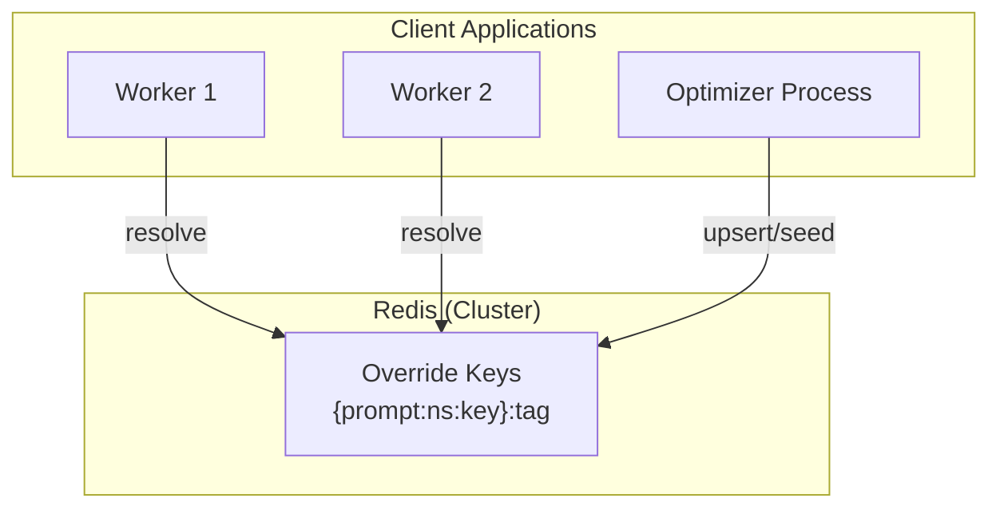

# Redis Prompt Overrides Store Specification

## Purpose

Provide a Redis-backed implementation of the `PromptOverridesStore` protocol,
enabling distributed prompt override storage for multi-worker deployments.
This complements the `LocalPromptOverridesStore` (filesystem-based) with a
centralized storage option suitable for production environments.

## Guiding Principles

- **Protocol compliance**: Implement the same `PromptOverridesStore` protocol
  as `LocalPromptOverridesStore`.
- **Consistency with Redis patterns**: Follow established patterns from
  `RedisMailbox` (TTL, Lua scripts, cluster compatibility).
- **Atomic operations**: Use Lua scripts for read-modify-write sequences.
- **TTL management**: Keys auto-expire unless refreshed by operations.
- **Cluster compatibility**: Use hash tags for key locality.

## Architecture



## Key Design

Keys use hash tags for Redis Cluster slot locality:

```
{prompt:<ns>:<key>}:<tag>
```

Example keys:

```
{prompt:agents/code-review:review}:latest
{prompt:agents/code-review:review}:stable
{prompt:agents/code-review:review}:v1.2.3
```

The hash tag `{prompt:<ns>:<key>}` ensures all tags for the same prompt
are co-located on the same Redis node in cluster deployments.

## Data Model

Each key stores a JSON-serialized `PromptOverride` payload (format v2):

```json
{
  "version": 2,
  "ns": "agents/code-review",
  "prompt_key": "review",
  "tag": "latest",
  "sections": { ... },
  "tools": { ... },
  "task_example_overrides": [ ... ]
}
```

## TTL Strategy

| Operation | TTL Behavior |
| --------- | ---------------------------------- |
| `resolve` | Refreshes TTL on read (touch) |
| `upsert` | Sets TTL on write |
| `delete` | N/A (key removed) |
| `store` | Refreshes TTL on read-modify-write |
| `seed` | Sets TTL on write |

Default TTL: 30 days (2592000 seconds). Active overrides stay alive
indefinitely through normal usage patterns. Stale overrides auto-expire.

## Atomic Operations

### Resolve (GET with TTL refresh)

```lua
-- KEYS: [override_key]
-- ARGV: [ttl]
local data = redis.call('GET', KEYS[1])
if data then
    local ttl = tonumber(ARGV[1])
    if ttl and ttl > 0 then
        redis.call('EXPIRE', KEYS[1], ttl)
    end
end
return data
```

### Upsert (SET with TTL)

```lua
-- KEYS: [override_key]
-- ARGV: [payload, ttl]
redis.call('SET', KEYS[1], ARGV[1])
local ttl = tonumber(ARGV[2])
if ttl and ttl > 0 then
    redis.call('EXPIRE', KEYS[1], ttl)
end
return 1
```

### Store (Read-Modify-Write)

```lua
-- KEYS: [override_key]
-- ARGV: [payload, ttl]
-- Note: Caller handles merge logic, this is the atomic write
redis.call('SET', KEYS[1], ARGV[1])
local ttl = tonumber(ARGV[2])
if ttl and ttl > 0 then
    redis.call('EXPIRE', KEYS[1], ttl)
end
return 1
```

For the `store` method's read-modify-write cycle, optimistic concurrency
is used:

1. Read current value (GET)
1. Merge new override
1. Write back (SET)

This is acceptable because:

- Override conflicts are rare (typically one optimizer process)
- Last-write-wins is acceptable for override updates
- Full isolation would require WATCH/MULTI which adds complexity

## Store Protocol Implementation

```python
class RedisPromptOverridesStore(PromptOverridesStore):
    """Redis-backed prompt overrides store.

    Attributes:
        client: Redis client (standalone or cluster).
        default_ttl: TTL in seconds for override keys (default: 30 days).
        key_prefix: Optional prefix for all keys (default: "prompt").
    """

    def resolve(
        self,
        descriptor: PromptDescriptor,
        tag: str = "latest",
    ) -> PromptOverride | None:
        """Load override from Redis, filtering stale entries.

        Returns None if key doesn't exist or all entries are stale.
        Refreshes TTL on successful read.
        """
        ...

    def upsert(
        self,
        descriptor: PromptDescriptor,
        override: PromptOverride,
    ) -> PromptOverride:
        """Persist override to Redis with validation.

        Validates all hashes match descriptor before writing.
        Raises PromptOverridesError on hash mismatch.
        """
        ...

    def delete(
        self,
        *,
        ns: str,
        prompt_key: str,
        tag: str,
    ) -> None:
        """Remove override key from Redis."""
        ...

    def store(
        self,
        prompt: PromptLike,
        override: SectionOverride | ToolOverride | TaskExampleOverride,
        *,
        tag: str = "latest",
    ) -> PromptOverride:
        """Store single override using read-modify-write.

        Uses optimistic concurrency (last-write-wins).
        """
        ...

    def seed(
        self,
        prompt: PromptLike,
        *,
        tag: str = "latest",
    ) -> PromptOverride:
        """Bootstrap override from current prompt state.

        Does not overwrite existing overrides (returns existing).
        """
        ...
```

## Factory Pattern

```python
class RedisPromptOverridesStoreFactory:
    """Factory for creating RedisPromptOverridesStore instances.

    Useful for dependency injection and testing.
    """

    def __init__(
        self,
        client: Redis[bytes] | RedisCluster[bytes],
        *,
        default_ttl: int = DEFAULT_TTL_SECONDS,
        key_prefix: str = "prompt",
    ) -> None: ...

    def create(self) -> RedisPromptOverridesStore:
        """Create a new store instance with shared client."""
        ...
```

## Error Handling

| Error | Behavior |
| --------------------- | ---------------------------- |
| Connection failure | Raise `PromptOverridesError` |
| JSON parse error | Raise `PromptOverridesError` |
| Hash mismatch (read) | Filter entry, log debug |
| Hash mismatch (write) | Raise `PromptOverridesError` |
| Version mismatch | Raise `PromptOverridesError` |
| Invalid identifier | Raise `PromptOverridesError` |

## Observability

Log events follow the existing pattern:

| Event | Level | Context |
| ------------------------------- | ----- | ------------------------- |
| `prompt_override_resolved` | INFO | ns, key, tag, counts |
| `prompt_override_persisted` | INFO | ns, key, tag, counts |
| `prompt_override_missing` | DEBUG | ns, key, tag |
| `prompt_override_stale_section` | DEBUG | path, expected/found hash |
| `prompt_override_stale_tool` | DEBUG | tool, expected/found hash |

## Usage Example

```python
from redis import Redis
from weakincentives.contrib.prompt_overrides import RedisPromptOverridesStore

client = Redis(host="localhost", port=6379)
store = RedisPromptOverridesStore(client=client)

# Use with Prompt
prompt = Prompt(
    template,
    overrides_store=store,
    overrides_tag="stable",
).bind(params)

# Seed overrides
store.seed(prompt, tag="latest")

# Store individual override
store.store(prompt, SectionOverride(
    path=("system",),
    expected_hash=hash,
    body="Updated instructions...",
))
```

## Testing

Tests should cover:

1. Basic CRUD operations (resolve, upsert, delete)
1. Store single override (section, tool, task example)
1. Seed behavior (new vs existing)
1. Hash validation (read filtering, write rejection)
1. TTL behavior (refresh on read, set on write)
1. Error handling (connection, parse, validation)
1. Cluster compatibility (hash tags)

Use `fakeredis` for unit tests, real Redis for integration tests.

## Migration from LocalPromptOverridesStore

To migrate existing overrides:

```python
local_store = LocalPromptOverridesStore()
redis_store = RedisPromptOverridesStore(client=client)

# For each prompt/tag combination
for meta in iter_override_files():
    descriptor = PromptDescriptor.from_prompt(prompt)
    override = local_store.resolve(descriptor, tag=meta.tag)
    if override:
        redis_store.upsert(descriptor, override)
```

## Limitations

- **No transactions**: Read-modify-write uses last-write-wins
- **No history**: Previous versions are not retained (use tags for variants)
- **Single cluster**: No cross-cluster replication
- **Memory bound**: Large overrides consume Redis memory
