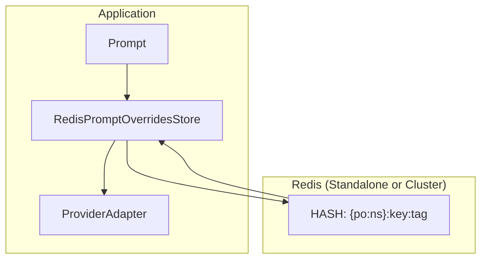

# Redis Prompt Overrides Store Specification

## Purpose

Provide a Redis-backed implementation of `PromptOverridesStore` that enables
centralized, distributed override storage for multi-process and multi-node
deployments. Supports both standalone Redis and Redis Cluster topologies.

## Guiding Principles

- **Protocol compliance**: Implements `PromptOverridesStore` protocol exactly.
- **Cluster compatibility**: Uses hash tags for key locality in Redis Cluster.
- **Atomic operations**: Lua scripts for multi-step operations where needed.
- **Fail-closed**: Connection errors surface immediately; no silent degradation.
- **Consistent serialization**: Reuses existing validation/serialization logic.

## Architecture Overview



## Key Design

### Hash Tag Strategy

All keys for a given override use a consistent hash tag to ensure cluster
slot locality. The hash tag uses the namespace as the routing key:

```
{po:<ns>}:<prompt_key>:<tag>
```

Where:
- `po:` is a fixed prefix for prompt overrides
- `<ns>` is the namespace (e.g., `webapp/agents`)
- `<prompt_key>` is the prompt identifier
- `<tag>` is the version tag (e.g., `latest`, `stable`)

Example keys:
```
{po:webapp/agents}:review:latest
{po:demo}:welcome:stable
```

### Data Structure

Each override is stored as a Redis HASH with the following fields:

| Field | Type | Description |
|-------|------|-------------|
| `version` | int | Format version (currently 1) |
| `ns` | string | Namespace |
| `prompt_key` | string | Prompt key |
| `tag` | string | Tag name |
| `sections` | JSON string | Serialized section overrides |
| `tools` | JSON string | Serialized tool overrides |

Using a HASH allows efficient partial reads and atomic field updates,
though the current implementation writes the entire override atomically.

## API Design

### RedisPromptOverridesStore

```python
@dataclass(slots=True)
class RedisPromptOverridesStore:
    """Redis-backed prompt overrides store.

    Supports both standalone Redis and Redis Cluster deployments.

    Example::

        from redis import Redis
        from weakincentives.contrib.prompt.overrides import RedisPromptOverridesStore

        client = Redis(host="localhost", port=6379)
        store = RedisPromptOverridesStore(client=client)

        # Use with prompts
        prompt = Prompt(
            ...,
            overrides_store=store,
            overrides_tag="stable",
        )
    """

    client: Redis[bytes] | RedisCluster[bytes]
    """Redis client instance."""

    key_prefix: str = "po"
    """Prefix for all Redis keys. Defaults to 'po' for prompt overrides."""

    def resolve(
        self,
        descriptor: PromptDescriptor,
        tag: str = "latest",
    ) -> PromptOverride | None:
        """Load and validate an override from Redis.

        Returns None if no override exists or all sections/tools are stale.
        """

    def upsert(
        self,
        descriptor: PromptDescriptor,
        override: PromptOverride,
    ) -> PromptOverride:
        """Persist an override to Redis.

        Validates sections and tools against the descriptor before writing.
        """

    def delete(
        self,
        *,
        ns: str,
        prompt_key: str,
        tag: str,
    ) -> None:
        """Remove an override from Redis."""

    def set_section_override(
        self,
        prompt: PromptLike,
        *,
        tag: str = "latest",
        path: tuple[str, ...],
        body: str,
    ) -> PromptOverride:
        """Update a single section override."""

    def seed(
        self,
        prompt: PromptLike,
        *,
        tag: str = "latest",
    ) -> PromptOverride:
        """Bootstrap an override from the current prompt state."""

    def list_overrides(
        self,
        *,
        ns: str | None = None,
        prompt_key: str | None = None,
    ) -> list[OverrideMetadata]:
        """List stored overrides with optional filtering.

        Note: Uses SCAN for iteration; safe for large keyspaces.
        """

    def close(self) -> None:
        """No-op. Does not close the Redis client (caller's responsibility)."""
```

### OverrideMetadata

```python
@dataclass(slots=True, frozen=True)
class OverrideMetadata:
    """Lightweight metadata for listing overrides."""

    ns: str
    prompt_key: str
    tag: str
    section_count: int
    tool_count: int
```

## Implementation Details

### Key Construction

```python
def _override_key(self, ns: str, prompt_key: str, tag: str) -> str:
    """Build Redis key with hash tag for cluster compatibility."""
    # Hash tag ensures all keys for a namespace route to same slot
    return f"{{{self.key_prefix}:{ns}}}:{prompt_key}:{tag}"
```

### Identifier Validation

Reuses the existing `IDENTIFIER_RE` pattern from `_fs.py`:

```python
IDENTIFIER_RE = re.compile(r"^[a-z0-9][a-z0-9._-]{0,63}$")
```

Applied to:
- Namespace segments (split by `/`)
- Prompt keys
- Tags

### Atomic Operations

For `resolve` and `upsert`, atomicity is achieved through Redis's HGETALL
and HSET operations which are inherently atomic. For `set_section_override`,
a Lua script ensures read-modify-write atomicity:

```lua
-- LUA_SET_SECTION: Atomic read-modify-write for section override
local key = KEYS[1]
local path = ARGV[1]
local expected_hash = ARGV[2]
local body = ARGV[3]

local exists = redis.call('EXISTS', key)
local sections = '{}'
local tools = '{}'

if exists == 1 then
    sections = redis.call('HGET', key, 'sections') or '{}'
    tools = redis.call('HGET', key, 'tools') or '{}'
end

-- Section update happens in caller; this just ensures atomicity
return {sections, tools}
```

However, for simplicity the initial implementation uses optimistic locking
with WATCH/MULTI/EXEC for read-modify-write operations.

### Connection Error Handling

All Redis operations wrap exceptions in `RedisPromptOverridesError`:

```python
class RedisPromptOverridesError(PromptOverridesError):
    """Raised when Redis operations fail."""
```

### Serialization Format

Uses the same JSON format as `LocalPromptOverridesStore` for sections and
tools fields, enabling portability between stores:

```json
{
  "sections": "{\"system\": {\"expected_hash\": \"...\", \"body\": \"...\"}}",
  "tools": "{\"search\": {\"expected_contract_hash\": \"...\", \"description\": \"...\", \"param_descriptions\": {}}}"
}
```

## Redis Cluster Considerations

### Hash Tags

The `{po:ns}` hash tag ensures all overrides for a namespace hash to the
same slot, enabling:
- Efficient SCAN operations within a namespace
- Atomic multi-key operations (if needed in future)

### Cross-Slot Operations

The `list_overrides` method uses SCAN with a pattern match. In Redis Cluster,
this requires scanning all nodes. The implementation handles this transparently
via the redis-py cluster client.

### Cluster vs Standalone

The implementation detects cluster mode via:

```python
def _is_cluster(self) -> bool:
    return hasattr(self.client, 'get_primaries')
```

No behavioral differences in the current design; both modes use the same
key structure and operations.

## Usage Examples

### Basic Usage

```python
from redis import Redis
from weakincentives.contrib.prompt.overrides import RedisPromptOverridesStore
from weakincentives.prompt import Prompt

# Create store
client = Redis(host="localhost", port=6379)
store = RedisPromptOverridesStore(client=client)

# Use with prompt
prompt = Prompt(
    ns="demo",
    key="greeting",
    ...,
    overrides_store=store,
    overrides_tag="latest",
)

# Seed initial override
override = store.seed(prompt)

# Update a section
store.set_section_override(
    prompt,
    path=("system",),
    body="You are a friendly assistant.",
)
```

### Redis Cluster

```python
from redis.cluster import RedisCluster
from weakincentives.contrib.prompt.overrides import RedisPromptOverridesStore

client = RedisCluster(
    host="redis-cluster.example.com",
    port=6379,
)
store = RedisPromptOverridesStore(client=client)
```

### Custom Key Prefix

```python
# Use custom prefix for namespacing in shared Redis
store = RedisPromptOverridesStore(
    client=client,
    key_prefix="myapp_po",
)
# Keys: {myapp_po:ns}:key:tag
```

## Testing Strategy

### Unit Tests

- Key construction with various namespace formats
- Identifier validation
- Serialization/deserialization round-trips
- Error handling for connection failures

### Integration Tests

Located in `integration-tests/test_redis_prompt_overrides.py`:

- Standalone Redis: Basic CRUD operations
- Redis Cluster: Cross-node operations, slot routing
- Concurrent access: Multiple clients writing same override
- Large payloads: Overrides with many sections/tools

Uses existing `redis_utils.py` context managers for test infrastructure.

## Migration Path

### From LocalPromptOverridesStore

```python
from weakincentives.prompt.overrides import LocalPromptOverridesStore
from weakincentives.contrib.prompt.overrides import RedisPromptOverridesStore

# Read from local, write to Redis
local_store = LocalPromptOverridesStore()
redis_store = RedisPromptOverridesStore(client=client)

for metadata in iter_override_files():
    # Load from local
    with open(metadata.path) as f:
        payload = json.load(f)

    # Reconstruct override
    override = PromptOverride(
        ns=payload["ns"],
        prompt_key=payload["prompt_key"],
        tag=payload["tag"],
        sections=load_sections(payload.get("sections"), descriptor),
        tool_overrides=load_tools(payload.get("tools"), descriptor),
    )

    # Write to Redis
    redis_store.upsert(descriptor, override)
```

## Limitations

- **No auto-expiry**: Overrides persist until explicitly deleted
- **No pub/sub notifications**: Changes require polling to detect
- **Memory bound**: Large numbers of overrides consume Redis memory
- **No compression**: Override bodies stored as-is
- **Cluster migrations**: Key hashing may change during resharding

## Future Considerations

- **TTL support**: Optional expiration for temporary overrides
- **Change notifications**: Pub/sub for override updates
- **Compression**: Optional gzip for large override bodies
- **Metrics**: Redis command latency and error rate tracking
- **Connection pooling**: Configurable pool sizes for high-throughput
