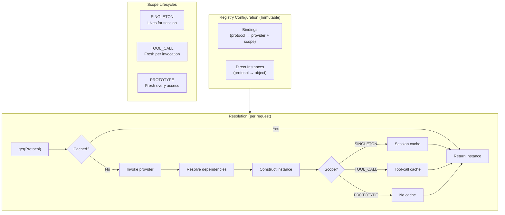

# Resource Registry Specification

## Purpose

This specification extends `ResourceRegistry` with provider-based lazy
construction and scope-aware lifecycle management. These additions enable
complex agent architectures where resources have dependencies on each other
and require different lifetimes (session-scoped singletons vs. per-tool-call
instances).

## Guiding Principles

- **Lazy by default**: Resources are constructed on first access, not upfront.
- **Explicit scopes**: Every binding declares its lifetime; no implicit behavior.
- **Dependency resolution**: Resources can depend on other resources; the
  registry resolves the graph automatically.
- **Cycle detection**: Circular dependencies fail fast with clear errors.
- **Backward compatible**: Existing `ResourceRegistry.build()` usage continues
  to work unchanged.
- **Immutable core**: The registry configuration is immutable; only scope
  caches are mutable.



## Scopes

Resources declare their lifetime via `Scope`:

```python
class Scope(Enum):
    """Determines instance lifetime and caching behavior."""

    SINGLETON = "singleton"
    """One instance per session. Created on first access, reused thereafter."""

    TOOL_CALL = "tool_call"
    """Fresh instance per tool invocation. Disposed after tool completes."""

    PROTOTYPE = "prototype"
    """Fresh instance on every access. Never cached."""
```

### Scope Selection Guidelines

| Scope | Use When | Examples |
|-------|----------|----------|
| `SINGLETON` | Expensive to create, stateless or thread-safe | HTTP clients, connection pools, config |
| `TOOL_CALL` | Needs fresh state per tool, or tracks tool-specific context | Request tracers, tool-scoped transactions |
| `PROTOTYPE` | Cheap to create, each caller needs independent instance | Builders, temporary buffers |

## Core Schemas

### Binding

`Binding[T]` describes how to obtain an instance of protocol `T`:

```python
Provider: TypeAlias = Callable[[ResourceResolver], T]

@dataclass(slots=True, frozen=True)
class Binding(Generic[T]):
    """Describes how to construct a resource and its lifetime."""

    protocol: type[T]
    """The protocol type this binding satisfies."""

    provider: Provider[T]
    """Factory function that constructs the instance."""

    scope: Scope = Scope.SINGLETON
    """Lifetime of constructed instances."""

    eager: bool = False
    """If True, instantiate during registry startup (SINGLETON only)."""
```

Provider signature:

```python
def my_provider(resolver: ResourceResolver) -> MyService:
    # Can request other dependencies from resolver
    config = resolver.get(Config)
    http = resolver.get(HTTPClient)
    return MyService(config=config, http=http)
```

### ResourceResolver Protocol

Passed to providers for dependency resolution:

```python
class ResourceResolver(Protocol):
    """Protocol for resolving dependencies during construction."""

    def get[T](self, protocol: type[T]) -> T:
        """Return the resource for the given protocol.

        Raises:
            UnboundResourceError: No binding exists for the protocol.
            CircularDependencyError: Dependency cycle detected.
        """
        ...

    def get_optional[T](self, protocol: type[T]) -> T | None:
        """Return the resource if bound, None otherwise."""
        ...
```

### ResourceRegistry (Extended)

```python
@dataclass(slots=True, frozen=True)
class ResourceRegistry:
    """Typed container for runtime resources with lazy construction."""

    _instances: Mapping[type[object], object] = field(
        default_factory=lambda: MappingProxyType({}),
    )
    _bindings: Mapping[type[object], Binding[object]] = field(
        default_factory=lambda: MappingProxyType({}),
    )

    # === Query API ===

    def get[T](self, protocol: type[T], default: T | None = None) -> T | None:
        """Return resource for protocol, or default if unbound.

        For lazy bindings, this returns None. Use a scoped context
        for lazy resolution.
        """
        ...

    def __contains__(self, protocol: type[object]) -> bool:
        """Check if protocol has an instance or binding."""
        return protocol in self._instances or protocol in self._bindings

    def has_binding(self, protocol: type[object]) -> bool:
        """Check if protocol has a lazy binding (vs direct instance)."""
        return protocol in self._bindings

    # === Construction API ===

    @staticmethod
    def build(
        instances: Mapping[type[object], object] | None = None,
        bindings: Sequence[Binding[object]] | None = None,
    ) -> ResourceRegistry:
        """Construct a registry from instances and/or bindings.

        Args:
            instances: Direct type-to-instance mapping (eager).
            bindings: Lazy provider bindings.

        Raises:
            DuplicateBindingError: Same protocol bound twice.
        """
        ...

    def merge(self, other: ResourceRegistry) -> ResourceRegistry:
        """Merge registries; other takes precedence on conflicts."""
        ...

    # === Scope Context Factory ===

    def scoped_context(
        self,
        *,
        singleton_cache: MutableMapping[type[object], object] | None = None,
    ) -> ScopedResourceContext:
        """Create a scoped resolution context.

        Args:
            singleton_cache: Shared cache for SINGLETON scope. If None,
                creates a new cache (typical for session start).

        Returns:
            Context that supports lazy resolution with scope awareness.
        """
        ...
```

### ScopedResourceContext

Mutable context that manages scope caches and performs resolution:

```python
@dataclass(slots=True)
class ScopedResourceContext:
    """Scoped resolution context with lifecycle management."""

    registry: ResourceRegistry
    """Immutable registry configuration."""

    _singleton_cache: MutableMapping[type[object], object]
    """Shared cache for SINGLETON-scoped resources."""

    _tool_call_cache: MutableMapping[type[object], object] = field(
        default_factory=dict,
    )
    """Per-tool-call cache, cleared on exit."""

    _resolving: set[type[object]] = field(default_factory=set)
    """Tracks in-flight resolutions for cycle detection."""

    # === Resolution API ===

    def get[T](self, protocol: type[T]) -> T:
        """Resolve and return resource for protocol.

        Resolution order:
        1. Direct instances in registry
        2. Tool-call cache (if TOOL_CALL scope)
        3. Singleton cache (if SINGLETON scope)
        4. Invoke provider and cache per scope

        Raises:
            UnboundResourceError: No binding exists.
            CircularDependencyError: Dependency cycle detected.
        """
        ...

    def get_optional[T](self, protocol: type[T]) -> T | None:
        """Resolve if bound, return None otherwise."""
        ...

    # === Lifecycle API ===

    def enter_tool_call(self) -> ToolCallScope:
        """Enter a tool-call scope. Returns context manager."""
        ...

    def instantiate_eager(self) -> None:
        """Instantiate all eager SINGLETON bindings.

        Call during session startup to fail fast on configuration errors.
        """
        ...

    def close(self) -> None:
        """Dispose all instantiated resources that implement Closeable."""
        ...
```

### ToolCallScope

Context manager for tool-call scoped resources:

```python
@dataclass(slots=True)
class ToolCallScope:
    """Context manager for tool-call scoped resource lifetime."""

    _context: ScopedResourceContext
    _previous_cache: MutableMapping[type[object], object]

    def __enter__(self) -> ResourceResolver:
        """Enter tool-call scope, returning resolver."""
        ...

    def __exit__(self, *exc: object) -> None:
        """Exit scope, disposing tool-call resources."""
        for resource in self._context._tool_call_cache.values():
            if isinstance(resource, Closeable):
                try:
                    resource.close()
                except Exception:
                    log.warning("Error closing resource", exc_info=True)
        self._context._tool_call_cache = self._previous_cache
```

## Lifecycle Protocols

### Closeable

Resources that need cleanup implement `Closeable`:

```python
class Closeable(Protocol):
    """Protocol for resources requiring cleanup."""

    def close(self) -> None:
        """Release resources. Called when scope ends."""
        ...
```

### PostConstruct

Resources needing initialization after construction:

```python
class PostConstruct(Protocol):
    """Protocol for post-construction initialization."""

    def post_construct(self) -> None:
        """Called after all dependencies are injected.

        Use for initialization that requires other resources.
        Failures here prevent the resource from being cached.
        """
        ...
```

## Resolution Algorithm

```python
def resolve[T](self, protocol: type[T]) -> T:
    # 1. Check direct instances (always win)
    if protocol in self.registry._instances:
        return cast(T, self.registry._instances[protocol])

    # 2. Check scope caches
    binding = self.registry._bindings.get(protocol)
    if binding is None:
        raise UnboundResourceError(f"No binding for {protocol.__name__}")

    cache = self._cache_for_scope(binding.scope)
    if cache is not None and protocol in cache:
        return cast(T, cache[protocol])

    # 3. Cycle detection
    if protocol in self._resolving:
        cycle = " -> ".join(t.__name__ for t in self._resolving)
        raise CircularDependencyError(f"Cycle: {cycle} -> {protocol.__name__}")

    # 4. Invoke provider
    self._resolving.add(protocol)
    try:
        instance = binding.provider(self)
    finally:
        self._resolving.discard(protocol)

    # 5. Post-construct hook
    if isinstance(instance, PostConstruct):
        instance.post_construct()

    # 6. Cache per scope
    if cache is not None:
        cache[protocol] = instance

    return cast(T, instance)

def _cache_for_scope(
    self, scope: Scope
) -> MutableMapping[type[object], object] | None:
    match scope:
        case Scope.SINGLETON:
            return self._singleton_cache
        case Scope.TOOL_CALL:
            return self._tool_call_cache
        case Scope.PROTOTYPE:
            return None
```

## Integration with ExecutionState

`ExecutionState` manages the scoped context lifecycle:

```python
@dataclass(slots=True)
class ExecutionState:
    session: SessionProtocol
    resources: ResourceRegistry
    _scoped_context: ScopedResourceContext | None = field(
        default=None, init=False
    )

    def start(self) -> None:
        """Initialize execution state. Call before first tool."""
        self._scoped_context = self.resources.scoped_context()
        self._scoped_context.instantiate_eager()

    def stop(self) -> None:
        """Cleanup execution state. Call after last tool."""
        if self._scoped_context is not None:
            self._scoped_context.close()
            self._scoped_context = None

    @contextmanager
    def tool_scope(self) -> Iterator[ResourceResolver]:
        """Enter tool-call scope for resource resolution."""
        if self._scoped_context is None:
            raise ExecutionStateError("ExecutionState not started")
        with self._scoped_context.enter_tool_call() as resolver:
            yield resolver

    # Existing snapshot/restore unchanged...
```

Tool execution integrates scopes:

```python
def execute_tool(
    tool: Tool[P, R],
    params: P,
    *,
    execution_state: ExecutionState,
) -> ToolResult[R]:
    snapshot = execution_state.snapshot()

    with execution_state.tool_scope() as resolver:
        context = ToolContext(
            # ... existing fields ...
            resolver=resolver,  # New: scoped resolver
        )
        try:
            result = tool.handler(params, context=context)
            if not result.success:
                execution_state.restore(snapshot)
            return result
        except Exception as e:
            execution_state.restore(snapshot)
            return ToolResult(message=str(e), value=None, success=False)
    # Tool-call scoped resources automatically disposed here
```

## ToolContext Extension

`ToolContext` gains access to scoped resolution:

```python
@dataclass(slots=True, frozen=True)
class ToolContext:
    # ... existing fields ...

    resolver: ResourceResolver | None = None
    """Scoped resolver for lazy resource access."""

    def require[T](self, protocol: type[T]) -> T:
        """Get required resource, raising if unavailable.

        Prefer this over resources.get() for required dependencies.
        """
        if self.resolver is not None:
            return self.resolver.get(protocol)
        instance = self.resources.get(protocol)
        if instance is None:
            raise UnboundResourceError(f"Required resource not bound: {protocol}")
        return instance
```

## Error Handling

```python
class ResourceError(WinkError, RuntimeError):
    """Base class for resource resolution errors."""


class UnboundResourceError(ResourceError):
    """No binding exists for the requested protocol."""

    protocol: type[object]


class CircularDependencyError(ResourceError):
    """Circular dependency detected during resolution."""

    cycle: tuple[type[object], ...]


class DuplicateBindingError(ResourceError):
    """Same protocol bound multiple times."""

    protocol: type[object]


class ProviderError(ResourceError):
    """Provider raised an exception during construction."""

    protocol: type[object]
    cause: Exception
```

## Usage Examples

### Basic Provider Binding

```python
from weakincentives.prompt.tool import Binding, Scope, ResourceRegistry

# Define bindings
config_binding = Binding(
    protocol=Config,
    provider=lambda r: Config.from_env(),
    scope=Scope.SINGLETON,
)

http_binding = Binding(
    protocol=HTTPClient,
    provider=lambda r: HTTPClient(
        base_url=r.get(Config).api_url,
        timeout=r.get(Config).timeout,
    ),
    scope=Scope.SINGLETON,
)

# Build registry
registry = ResourceRegistry.build(
    bindings=[config_binding, http_binding],
)

# Use in execution
with registry.scoped_context() as ctx:
    http = ctx.get(HTTPClient)  # Lazily constructs Config, then HTTPClient
```

### Tool-Call Scoped Resources

```python
# Request-scoped tracer
tracer_binding = Binding(
    protocol=RequestTracer,
    provider=lambda r: RequestTracer(
        client=r.get(HTTPClient),
        request_id=uuid4(),  # Fresh ID per tool call
    ),
    scope=Scope.TOOL_CALL,
)

# In tool handler
def my_handler(params: Params, *, context: ToolContext) -> ToolResult[Output]:
    tracer = context.require(RequestTracer)  # Fresh per invocation
    tracer.record("starting", params)
    # ...
```

### Mixing Direct Instances and Bindings

```python
# Some resources constructed externally
external_db = PostgresPool(connection_string)

registry = ResourceRegistry.build(
    instances={
        Database: external_db,  # Direct instance
    },
    bindings=[
        Binding(UserService, lambda r: UserService(r.get(Database))),
    ],
)
```

### Eager Initialization

```python
# Validate configuration at startup
config_binding = Binding(
    protocol=Config,
    provider=lambda r: Config.from_env(),  # May raise on invalid config
    scope=Scope.SINGLETON,
    eager=True,  # Instantiate during start()
)

# Fails fast if config invalid
execution_state.start()  # Raises here, not on first tool call
```

## Snapshotable Integration

Scoped contexts integrate with existing snapshot/restore:

```python
def snapshotable_resources(self) -> Mapping[type[object], Snapshotable]:
    """Return all instantiated snapshotable resources."""
    result: dict[type[object], Snapshotable] = {}

    # Direct instances
    for protocol, instance in self.registry._instances.items():
        if isinstance(instance, Snapshotable):
            result[protocol] = instance

    # Cached singletons (only if instantiated)
    for protocol, instance in self._singleton_cache.items():
        if isinstance(instance, Snapshotable):
            result[protocol] = instance

    return result
```

Tool-call scoped resources are not snapshotted—they're disposed on scope exit,
which happens before any restore would occur.

## Backward Compatibility

Existing code using `ResourceRegistry.build({...})` continues to work:

```python
# Old style (still works)
registry = ResourceRegistry.build({
    Filesystem: InMemoryFilesystem(),
    BudgetTracker: tracker,
})

# Equivalent to
registry = ResourceRegistry.build(
    instances={
        Filesystem: InMemoryFilesystem(),
        BudgetTracker: tracker,
    },
)
```

The `get()` method on `ResourceRegistry` returns direct instances only.
Lazy resolution requires a `ScopedResourceContext`.

## Acceptance Criteria

### Lazy Construction

```python
def test_lazy_construction():
    constructed = []

    def make_service(r: ResourceResolver) -> Service:
        constructed.append("service")
        return Service()

    registry = ResourceRegistry.build(
        bindings=[Binding(Service, make_service)],
    )

    # Not constructed yet
    assert constructed == []

    with registry.scoped_context() as ctx:
        _ = ctx.get(Service)

    assert constructed == ["service"]
```

### Dependency Resolution

```python
def test_dependency_resolution():
    registry = ResourceRegistry.build(
        bindings=[
            Binding(Config, lambda r: Config(value=42)),
            Binding(Service, lambda r: Service(config=r.get(Config))),
        ],
    )

    with registry.scoped_context() as ctx:
        service = ctx.get(Service)
        assert service.config.value == 42
```

### Cycle Detection

```python
def test_circular_dependency_detected():
    registry = ResourceRegistry.build(
        bindings=[
            Binding(A, lambda r: A(b=r.get(B))),
            Binding(B, lambda r: B(a=r.get(A))),
        ],
    )

    with registry.scoped_context() as ctx:
        with pytest.raises(CircularDependencyError) as exc:
            ctx.get(A)
        assert "A -> B -> A" in str(exc.value)
```

### Scope Isolation

```python
def test_tool_call_scope_isolation():
    call_count = 0

    def make_tracer(r: ResourceResolver) -> Tracer:
        nonlocal call_count
        call_count += 1
        return Tracer(id=call_count)

    registry = ResourceRegistry.build(
        bindings=[Binding(Tracer, make_tracer, scope=Scope.TOOL_CALL)],
    )

    ctx = registry.scoped_context()

    with ctx.enter_tool_call() as r1:
        t1 = r1.get(Tracer)
        assert t1.id == 1

    with ctx.enter_tool_call() as r2:
        t2 = r2.get(Tracer)
        assert t2.id == 2  # Fresh instance

    assert call_count == 2
```

### Singleton Sharing

```python
def test_singleton_shared_across_tool_calls():
    call_count = 0

    def make_pool(r: ResourceResolver) -> Pool:
        nonlocal call_count
        call_count += 1
        return Pool()

    registry = ResourceRegistry.build(
        bindings=[Binding(Pool, make_pool, scope=Scope.SINGLETON)],
    )

    ctx = registry.scoped_context()

    with ctx.enter_tool_call() as r1:
        p1 = r1.get(Pool)

    with ctx.enter_tool_call() as r2:
        p2 = r2.get(Pool)

    assert p1 is p2  # Same instance
    assert call_count == 1
```

### Resource Cleanup

```python
def test_closeable_resources_closed():
    closed = []

    class ClosingResource(Closeable):
        def __init__(self, id: int):
            self.id = id

        def close(self) -> None:
            closed.append(self.id)

    counter = itertools.count(1)
    registry = ResourceRegistry.build(
        bindings=[
            Binding(
                ClosingResource,
                lambda r: ClosingResource(next(counter)),
                scope=Scope.TOOL_CALL,
            ),
        ],
    )

    ctx = registry.scoped_context()

    with ctx.enter_tool_call() as r:
        _ = r.get(ClosingResource)

    assert closed == [1]  # Closed on scope exit

    with ctx.enter_tool_call() as r:
        _ = r.get(ClosingResource)

    assert closed == [1, 2]
```

## Limitations

- **Synchronous only**: Resolution is single-threaded; async providers not
  supported.
- **No conditional bindings**: Cannot bind different implementations based on
  runtime conditions (use explicit registry construction instead).
- **No interception**: No AOP-style interceptors on resource access.
- **No named bindings**: Use wrapper types or `Qualified[T]` pattern if needed
  (not built-in).

## Future Considerations

The following are explicitly out of scope for this phase but may be added:

- **Modules**: Grouping related bindings for composition.
- **Qualifiers**: Built-in support for distinguishing multiple implementations.
- **Async providers**: `async def provider(...)` with `await ctx.get_async(T)`.
- **Health checks**: Protocol for resource health monitoring.
- **Metrics**: Instrumentation for resolution timing and cache hit rates.
