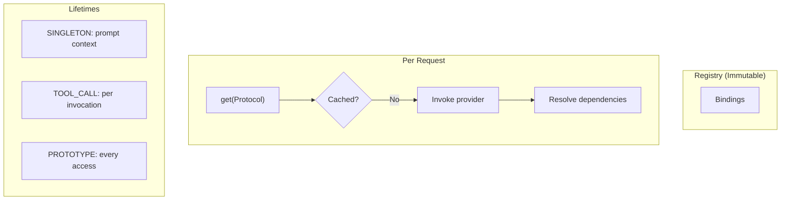

# Resource Registry Specification

Dependency injection with scope-aware lifecycle management.

**Source:** `src/weakincentives/resources/`

## Principles

- **Lazy by default**: Constructed on first access
- **Explicit scopes**: Every binding declares lifetime
- **Dependency resolution**: Graph resolved automatically
- **Cycle detection**: Circular dependencies fail fast
- **Prompt-owned lifecycle**: Context manager manages resources



## Scopes

**Definition:** `resources/scope.py:Scope`

| Scope | Lifetime | Use Case |
|-------|----------|----------|
| `SINGLETON` | Prompt context | HTTP clients, pools |
| `TOOL_CALL` | Per tool invocation | Request tracers |
| `PROTOTYPE` | Every access | Builders, buffers |

## Binding

**Definition:** `resources/binding.py:Binding`

```python
Binding[T](
    protocol: type[T],
    provider: Callable[[ResourceResolver], T],
    scope: Scope = Scope.SINGLETON,
    eager: bool = False,  # Instantiate during start()
)

Binding.instance(Protocol, pre_constructed_value)
```

## ResourceRegistry

**Definition:** `resources/registry.py:ResourceRegistry`

```python
registry = ResourceRegistry.of(
    Binding(Config, lambda r: Config.from_env()),
    Binding(Service, lambda r: Service(r.get(Config))),
)

registry.merge(other, strict=False)  # Compose registries
registry.conflicts(other)            # Check overlaps
```

## ScopedResourceContext

**Definition:** `resources/context.py:ScopedResourceContext`

```python
with registry.open() as ctx:
    service = ctx.get(Service)
    with ctx.tool_scope() as resolver:
        tracer = resolver.get(Tracer)  # Fresh per tool
```

## Lifecycle Protocols

### Snapshotable

```python
class Snapshotable(Protocol[T]):
    def snapshot(self, *, tag: str | None = None) -> T: ...
    def restore(self, snapshot: T) -> None: ...
```

### Closeable

```python
class Closeable(Protocol):
    def close(self) -> None: ...  # Cleanup in reverse order
```

## Prompt Integration

Prompts collect resources from template, sections, bind-time (later overrides):

```python
prompt = Prompt(template).bind(
    Params(...),
    resources={Clock: SystemClock()},
)

with prompt.resources:
    fs = prompt.resources.get(Filesystem)
    adapter.evaluate(prompt, session=session)
```

## Errors

| Error | Cause |
|-------|-------|
| `UnboundResourceError` | No binding for protocol |
| `CircularDependencyError` | Cycle in dependencies |
| `DuplicateBindingError` | Same protocol bound twice (strict) |
| `ProviderError` | Provider raised during construction |

## Limitations

- Synchronous only (no async providers)
- No conditional bindings
- No interception/AOP
- No named bindings (use wrapper types)
- Only SINGLETON resources snapshotted
