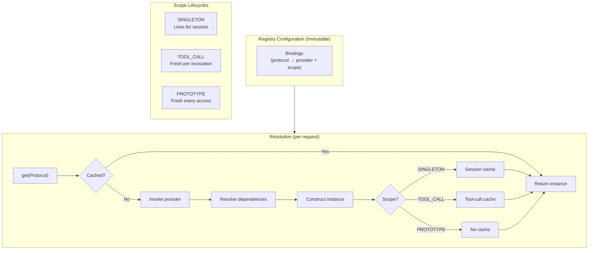

# Resource Registry Specification

## Purpose

This specification defines `weakincentives.resources`, a module providing
dependency injection with scope-aware lifecycle management. It enables complex
agent architectures where resources have dependencies on each other and require
different lifetimes (session-scoped singletons vs. per-tool-call instances).

## Guiding Principles

- **Lazy by default**: Resources are constructed on first access, not upfront.
- **Explicit scopes**: Every binding declares its lifetime; no implicit behavior.
- **Dependency resolution**: Resources can depend on other resources; the
  registry resolves the graph automatically.
- **Cycle detection**: Circular dependencies fail fast with clear errors.
- **Immutable configuration**: The registry is immutable; only scope caches are
  mutable.
- **Clean API**: Simple, focused interfaces without legacy cruft.



## Module Structure

```
weakincentives/resources/
├── __init__.py      # Public API exports
├── scope.py         # Scope enum
├── binding.py       # Binding dataclass, Provider type alias
├── protocols.py     # ResourceResolver, Closeable, PostConstruct
├── errors.py        # Error hierarchy
├── registry.py      # ResourceRegistry (immutable config)
└── context.py       # ScopedResourceContext (mutable resolution)
```

## Scopes

Resources declare their lifetime via `Scope`:

```python
class Scope(Enum):
    """Determines instance lifetime and caching behavior."""

    SINGLETON = "singleton"
    """One instance per session. Created on first access, reused thereafter."""

    TOOL_CALL = "tool_call"
    """Fresh instance per tool invocation. Disposed after tool completes."""

    PROTOTYPE = "prototype"
    """Fresh instance on every access. Never cached."""
```

### Scope Selection Guidelines

| Scope | Use When | Examples |
|-------|----------|----------|
| `SINGLETON` | Expensive to create, stateless or thread-safe | HTTP clients, connection pools, config |
| `TOOL_CALL` | Needs fresh state per tool, or tracks tool-specific context | Request tracers, tool-scoped transactions |
| `PROTOTYPE` | Cheap to create, each caller needs independent instance | Builders, temporary buffers |

## Core Types

### Binding

`Binding[T]` describes how to obtain an instance of protocol `T`:

```python
Provider = Callable[[ResourceResolver], T]

@dataclass(slots=True, frozen=True)
class Binding[T]:
    """Describes how to construct a resource and its lifetime."""

    protocol: type[T]
    """The protocol type this binding satisfies."""

    provider: Provider[T]
    """Factory function that constructs the instance."""

    scope: Scope = Scope.SINGLETON
    """Lifetime of constructed instances."""

    eager: bool = False
    """If True, instantiate during context startup (SINGLETON only)."""

    @staticmethod
    def instance[U](protocol: type[U], value: U) -> Binding[U]:
        """Create a binding for a pre-constructed instance.

        Returns an eager SINGLETON binding that returns the given instance.
        This is the canonical way to register existing objects.
        """
        ...
```

Provider signature:

```python
def my_provider(resolver: ResourceResolver) -> MyService:
    # Request dependencies from resolver
    config = resolver.get(Config)
    http = resolver.get(HTTPClient)
    return MyService(config=config, http=http)
```

### ResourceResolver Protocol

Passed to providers for dependency resolution:

```python
@runtime_checkable
class ResourceResolver(Protocol):
    """Protocol for resolving dependencies during construction."""

    def get[T](self, protocol: type[T]) -> T:
        """Return the resource for the given protocol.

        Raises:
            UnboundResourceError: No binding exists for the protocol.
            CircularDependencyError: Dependency cycle detected.
        """
        ...

    def get_optional[T](self, protocol: type[T]) -> T | None:
        """Return the resource if bound, None otherwise."""
        ...
```

### ResourceRegistry

Immutable configuration of resource bindings:

```python
@dataclass(slots=True, frozen=True)
class ResourceRegistry:
    """Immutable configuration of resource bindings."""

    _bindings: Mapping[type[object], Binding[object]]

    @staticmethod
    def of(*bindings: Binding[object]) -> ResourceRegistry:
        """Construct a registry from bindings.

        Raises:
            DuplicateBindingError: Same protocol bound twice.
        """
        ...

    @staticmethod
    def build(mapping: Mapping[type[object], object]) -> ResourceRegistry:
        """Convenience method to create a registry from pre-constructed instances.

        Equivalent to calling of() with Binding.instance() for each entry.
        None values are filtered out.
        """
        ...

    def __contains__(self, protocol: type[object]) -> bool:
        """Check if protocol has a binding."""
        ...

    def __len__(self) -> int:
        """Return number of bindings."""
        ...

    def __iter__(self) -> Iterator[type[object]]:
        """Iterate over bound protocol types."""
        ...

    def binding_for[T](self, protocol: type[T]) -> Binding[T] | None:
        """Return the binding for a protocol, or None if unbound."""
        ...

    def get[T](self, protocol: type[T], default: T | None = None) -> T | None:
        """Return the resource for the given protocol, or default if absent.

        Creates a temporary context, starts it, and resolves the protocol.
        """
        ...

    def get_all[T](self, predicate: Callable[[object], bool]) -> Mapping[type[T], T]:
        """Return all resolved instances matching a predicate.

        Creates a context, starts it (resolving all eager bindings),
        and returns instances from the singleton cache that match.

        Example:
            snapshotable = registry.get_all(
                lambda x: isinstance(x, Snapshotable)
            )
        """
        ...

    def merge(self, other: ResourceRegistry) -> ResourceRegistry:
        """Merge registries; other takes precedence on conflicts."""
        ...

    def eager_bindings(self) -> Sequence[Binding[object]]:
        """Return all bindings marked as eager."""
        ...

    def create_context(
        self,
        *,
        singleton_cache: dict[type[object], object] | None = None,
    ) -> ScopedResourceContext:
        """Create a scoped resolution context."""
        ...
```

### ScopedResourceContext

Mutable context that manages scope caches and performs resolution:

```python
@dataclass(slots=True)
class ScopedResourceContext:
    """Scoped resolution context with lifecycle management."""

    registry: ResourceRegistry
    """Immutable registry configuration."""

    singleton_cache: dict[type[object], object]
    """Cache for SINGLETON-scoped resources."""

    def get[T](self, protocol: type[T]) -> T:
        """Resolve and return resource for protocol.

        Raises:
            UnboundResourceError: No binding exists.
            CircularDependencyError: Dependency cycle detected.
            ProviderError: Provider raised an exception.
        """
        ...

    def get_optional[T](self, protocol: type[T]) -> T | None:
        """Resolve if bound, return None otherwise."""
        ...

    def start(self) -> None:
        """Initialize context and instantiate eager singletons."""
        ...

    def close(self) -> None:
        """Dispose all instantiated resources implementing Closeable."""
        ...

    @contextmanager
    def tool_scope(self) -> Iterator[ResourceResolver]:
        """Enter a tool-call scope.

        Resources with TOOL_CALL scope are fresh within this context
        and disposed on exit.
        """
        ...
```

## Lifecycle Protocols

### Closeable

Resources that need cleanup implement `Closeable`:

```python
@runtime_checkable
class Closeable(Protocol):
    """Protocol for resources requiring cleanup."""

    def close(self) -> None:
        """Release resources. Called when scope ends."""
        ...
```

### PostConstruct

Resources needing initialization after construction:

```python
@runtime_checkable
class PostConstruct(Protocol):
    """Protocol for post-construction initialization."""

    def post_construct(self) -> None:
        """Called after construction, before caching.

        Failures here prevent the resource from being cached
        and are wrapped in ProviderError.
        """
        ...
```

## Error Hierarchy

```python
class ResourceError(WinkError, RuntimeError):
    """Base class for resource resolution errors."""


class UnboundResourceError(ResourceError, LookupError):
    """No binding exists for the requested protocol."""
    protocol: type[object]


class CircularDependencyError(ResourceError):
    """Circular dependency detected during resolution."""
    cycle: tuple[type[object], ...]


class DuplicateBindingError(ResourceError, ValueError):
    """Same protocol bound multiple times."""
    protocol: type[object]


class ProviderError(ResourceError):
    """Provider raised an exception during construction."""
    protocol: type[object]
    cause: BaseException
```

## Usage Examples

### Basic Usage

```python
from weakincentives.resources import Binding, ResourceRegistry, Scope

# Define bindings with providers
registry = ResourceRegistry.of(
    Binding(Config, lambda r: Config.from_env()),
    Binding(HTTPClient, lambda r: HTTPClient(r.get(Config).url)),
)

# Create resolution context
ctx = registry.create_context()
ctx.start()

try:
    http = ctx.get(HTTPClient)  # Lazily constructs Config, then HTTPClient
finally:
    ctx.close()
```

### Pre-Constructed Instances

```python
# Use Binding.instance() for pre-constructed resources
fs = InMemoryFilesystem()
tracker = BudgetTracker(budget=Budget(max_tokens=1000))

registry = ResourceRegistry.of(
    Binding.instance(Filesystem, fs),
    Binding.instance(BudgetTracker, tracker),
    Binding(Service, lambda r: Service(r.get(Filesystem))),
)

# Or use the convenience build() method
registry = ResourceRegistry.build({
    Filesystem: fs,
    BudgetTracker: tracker,
})
```

### Introspecting Resources

```python
from weakincentives.runtime.snapshotable import Snapshotable

# Find all resources matching a predicate
registry = ResourceRegistry.build({
    Filesystem: InMemoryFilesystem(),  # Implements Snapshotable
    BudgetTracker: tracker,            # Does not implement Snapshotable
})

# get_all() scans resolved singletons
snapshotable = registry.get_all(lambda x: isinstance(x, Snapshotable))
assert Filesystem in snapshotable
assert BudgetTracker not in snapshotable
```

### Tool-Call Scoped Resources

```python
registry = ResourceRegistry.of(
    Binding(Config, lambda r: Config.from_env()),
    Binding(
        RequestTracer,
        lambda r: RequestTracer(request_id=uuid4()),
        scope=Scope.TOOL_CALL,
    ),
)

ctx = registry.create_context()
ctx.start()

# Each tool scope gets fresh TOOL_CALL resources
with ctx.tool_scope() as resolver:
    tracer1 = resolver.get(RequestTracer)

with ctx.tool_scope() as resolver:
    tracer2 = resolver.get(RequestTracer)

assert tracer1 is not tracer2  # Fresh instances

ctx.close()
```

### Eager Initialization

```python
# Validate configuration at startup
registry = ResourceRegistry.of(
    Binding(
        Config,
        lambda r: Config.from_env(),  # May raise on invalid config
        eager=True,  # Instantiate during start()
    ),
)

ctx = registry.create_context()
ctx.start()  # Raises here if config invalid, not on first use
```

### Registry Composition

```python
base = ResourceRegistry.of(
    Binding(Config, lambda r: Config(env="prod")),
)

test_override = ResourceRegistry.of(
    Binding(Config, lambda r: Config(env="test")),
)

merged = base.merge(test_override)  # test_override wins
```

## Acceptance Criteria

### Lazy Construction

```python
def test_lazy_construction():
    constructed = []

    def make_service(r: ResourceResolver) -> Service:
        constructed.append("service")
        return Service()

    registry = ResourceRegistry.of(Binding(Service, make_service))

    assert constructed == []

    ctx = registry.create_context()
    _ = ctx.get(Service)

    assert constructed == ["service"]
```

### Dependency Resolution

```python
def test_dependency_resolution():
    registry = ResourceRegistry.of(
        Binding(Config, lambda r: Config(value=42)),
        Binding(Service, lambda r: Service(config=r.get(Config))),
    )

    ctx = registry.create_context()
    service = ctx.get(Service)
    assert service.config.value == 42
```

### Cycle Detection

```python
def test_circular_dependency_detected():
    registry = ResourceRegistry.of(
        Binding(A, lambda r: A(b=r.get(B))),
        Binding(B, lambda r: B(a=r.get(A))),
    )

    ctx = registry.create_context()
    with pytest.raises(CircularDependencyError) as exc:
        ctx.get(A)
    assert A in exc.value.cycle
    assert B in exc.value.cycle
```

### Singleton Caching

```python
def test_singleton_cached():
    call_count = 0

    def make_service(r: ResourceResolver) -> Service:
        nonlocal call_count
        call_count += 1
        return Service()

    registry = ResourceRegistry.of(Binding(Service, make_service))
    ctx = registry.create_context()

    s1 = ctx.get(Service)
    s2 = ctx.get(Service)

    assert s1 is s2
    assert call_count == 1
```

### Tool-Call Scope Isolation

```python
def test_tool_call_fresh_per_scope():
    counter = itertools.count()

    registry = ResourceRegistry.of(
        Binding(Tracer, lambda r: Tracer(id=next(counter)), scope=Scope.TOOL_CALL)
    )

    ctx = registry.create_context()

    with ctx.tool_scope() as r1:
        t1 = r1.get(Tracer)

    with ctx.tool_scope() as r2:
        t2 = r2.get(Tracer)

    assert t1.id == 0
    assert t2.id == 1
```

### Resource Cleanup

```python
def test_closeable_disposed():
    registry = ResourceRegistry.of(
        Binding(CloseableResource, lambda r: CloseableResource())
    )

    ctx = registry.create_context()
    resource = ctx.get(CloseableResource)
    assert resource.closed is False

    ctx.close()
    assert resource.closed is True
```

### Reverse Order Cleanup

```python
def test_close_reverse_order():
    closed_order = []

    registry = ResourceRegistry.of(
        Binding(ResourceA, lambda r: ResourceA(on_close=lambda: closed_order.append("A"))),
        Binding(ResourceB, lambda r: ResourceB(a=r.get(ResourceA), on_close=lambda: closed_order.append("B"))),
    )

    ctx = registry.create_context()
    _ = ctx.get(ResourceB)  # Constructs A, then B
    ctx.close()

    assert closed_order == ["B", "A"]  # Reverse instantiation order
```

## Limitations

- **Synchronous only**: Resolution is single-threaded; async providers not
  supported.
- **No conditional bindings**: Cannot bind different implementations based on
  runtime conditions (use explicit registry construction instead).
- **No interception**: No AOP-style interceptors on resource access.
- **No named bindings**: Use wrapper types if you need multiple implementations
  of the same protocol.

## Future Considerations

The following are explicitly out of scope but may be added later:

- **Modules**: Grouping related bindings for composition.
- **Qualifiers**: Built-in support for distinguishing multiple implementations.
- **Async providers**: `async def provider(...)` with `await ctx.get_async(T)`.
- **Health checks**: Protocol for resource health monitoring.
- **Metrics**: Instrumentation for resolution timing and cache hit rates.
