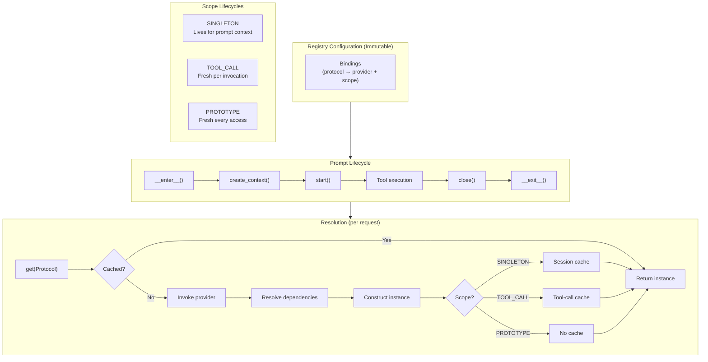

# Resource Registry Specification

## Purpose

This specification defines `weakincentives.resources`, a module providing
dependency injection with scope-aware lifecycle management. It enables complex
agent architectures where resources have dependencies on each other and require
different lifetimes (session-scoped singletons vs. per-tool-call instances).

## Guiding Principles

- **Lazy by default**: Resources are constructed on first access, not upfront.
- **Explicit scopes**: Every binding declares its lifetime; no implicit behavior.
- **Dependency resolution**: Resources can depend on other resources; the
  registry resolves the graph automatically.
- **Cycle detection**: Circular dependencies fail fast with clear errors.
- **Immutable configuration**: The registry is immutable; only scope caches are
  mutable.
- **Prompt-owned lifecycle**: Resource contexts are owned by prompts and managed
  via context manager.
- **Clean API**: Simple, focused interfaces without legacy cruft.



## Module Structure

```
weakincentives/resources/
├── __init__.py      # Public API exports
├── scope.py         # Scope enum
├── binding.py       # Binding dataclass, Provider type alias
├── protocols.py     # ResourceResolver, Closeable, PostConstruct, Snapshotable
├── errors.py        # Error hierarchy
├── registry.py      # ResourceRegistry (immutable config)
└── context.py       # ScopedResourceContext (mutable resolution)
```

> **Note:** Transactional snapshot/restore is handled by `runtime.transactions`
> module, which provides `CompositeSnapshot` combining session and resource
> snapshots. See `specs/RESOURCE_REGISTRY.md` for transactional patterns.

## Scopes

Resources declare their lifetime via `Scope`:

```python
class Scope(Enum):
    """Determines instance lifetime and caching behavior."""

    SINGLETON = "singleton"
    """One instance per prompt context. Created on first access, reused thereafter."""

    TOOL_CALL = "tool_call"
    """Fresh instance per tool invocation. Disposed after tool completes."""

    PROTOTYPE = "prototype"
    """Fresh instance on every access. Never cached."""
```

### Scope Selection Guidelines

| Scope | Use When | Examples |
| ----------- | ----------------------------------------------------------- | ----------------------------------------- |
| `SINGLETON` | Expensive to create, stateless or thread-safe | HTTP clients, connection pools, config |
| `TOOL_CALL` | Needs fresh state per tool, or tracks tool-specific context | Request tracers, tool-scoped transactions |
| `PROTOTYPE` | Cheap to create, each caller needs independent instance | Builders, temporary buffers |

## Core Types

### Binding

`Binding[T]` describes how to obtain an instance of protocol `T`:

```python
Provider = Callable[[ResourceResolver], T]

@dataclass(slots=True, frozen=True)
class Binding[T]:
    """Describes how to construct a resource and its lifetime."""

    protocol: type[T]
    """The protocol type this binding satisfies."""

    provider: Provider[T]
    """Factory function that constructs the instance."""

    scope: Scope = Scope.SINGLETON
    """Lifetime of constructed instances."""

    eager: bool = False
    """If True, instantiate during context startup (SINGLETON only)."""

    @staticmethod
    def instance[U](protocol: type[U], value: U) -> Binding[U]:
        """Create a binding for a pre-constructed instance."""
        ...
```

**Provider signature:**
```python
def my_provider(resolver: ResourceResolver) -> MyService:
    config = resolver.get(Config)
    return MyService(config=config)
```

### ResourceResolver Protocol

Passed to providers for dependency resolution:

```python
@runtime_checkable
class ResourceResolver(Protocol):
    """Protocol for resolving dependencies during construction."""

    def get[T](self, protocol: type[T]) -> T:
        """Return the resource for the given protocol.

        Raises:
            UnboundResourceError: No binding exists for the protocol.
            CircularDependencyError: Dependency cycle detected.
        """
        ...

    def get_optional[T](self, protocol: type[T]) -> T | None:
        """Return the resource if bound, None otherwise."""
        ...
```

### ResourceRegistry

Immutable configuration of resource bindings:

```python
@dataclass(slots=True, frozen=True)
class ResourceRegistry:
    """Immutable configuration of resource bindings."""

    _bindings: Mapping[type[object], Binding[object]]

    @staticmethod
    def of(*bindings: Binding[object]) -> ResourceRegistry:
        """Construct a registry from bindings."""
        ...

    @staticmethod
    def build(mapping: Mapping[type[object], object]) -> ResourceRegistry:
        """Convenience method to create a registry from pre-constructed instances.

        Equivalent to calling of() with Binding.instance() for each entry.
        """
        ...

    def merge(
        self, other: ResourceRegistry, *, strict: bool = False
    ) -> ResourceRegistry:
        """Merge registries; other takes precedence on conflicts.

        Args:
            strict: If True, raise DuplicateBindingError on conflicts.
        """
        ...

    def conflicts(self, other: ResourceRegistry) -> frozenset[type[object]]:
        """Return protocols bound in both registries."""
        ...

    def create_context(
        self,
        *,
        singleton_cache: dict[type[object], object] | None = None,
    ) -> ScopedResourceContext:
        """Create a scoped resolution context."""
        ...
```

**Key methods:**
- `of(*bindings)` - Create registry from bindings
- `build(mapping)` - Create from pre-constructed instances
- `merge(other, strict=False)` - Compose registries
- `conflicts(other)` - Inspect overlapping bindings
- `binding_for(protocol)` - Query binding configuration
- `eager_bindings()` - Get eager initialization list
- Standard Python protocols: `__contains__`, `__len__`, `__iter__`

### ScopedResourceContext

Mutable context that manages scope caches and performs resolution:

```python
@dataclass(slots=True)
class ScopedResourceContext:
    """Scoped resolution context with lifecycle management."""

    registry: ResourceRegistry
    singleton_cache: dict[type[object], object]

    def get[T](self, protocol: type[T]) -> T:
        """Resolve and return resource for protocol."""
        ...

    def get_optional[T](self, protocol: type[T]) -> T | None:
        """Resolve if bound, return None otherwise."""
        ...

    def start(self) -> None:
        """Initialize context and instantiate eager singletons."""
        ...

    def close(self) -> None:
        """Dispose all instantiated resources implementing Closeable."""
        ...

    @contextmanager
    def tool_scope(self) -> Iterator[ResourceResolver]:
        """Enter a tool-call scope for TOOL_CALL-scoped resources."""
        ...
```

> **Note:** Snapshot/restore operations are handled by `runtime.transactions`
> module via `create_snapshot()` and `restore_snapshot()` functions.

## Lifecycle Protocols

### Snapshotable

Resources that support transactional semantics implement `Snapshotable`:

```python
class Snapshotable(Protocol[SnapshotT]):
    """Protocol for state containers that support snapshot and restore."""

    def snapshot(self, *, tag: str | None = None) -> SnapshotT:
        """Capture current state as an immutable snapshot."""
        ...

    def restore(self, snapshot: SnapshotT) -> None:
        """Restore state from a snapshot."""
        ...
```

**Implementations:**

| Component | Snapshot Type | Storage Strategy |
| ------------------- | -------------------- | ------------------------------ |
| `InMemoryFilesystem` | `FilesystemSnapshot` | Structural sharing of file dicts |
| `HostFilesystem` | `FilesystemSnapshot` | Git commits |

### Closeable

Resources that need cleanup implement `Closeable`:

```python
@runtime_checkable
class Closeable(Protocol):
    """Protocol for resources requiring cleanup."""

    def close(self) -> None:
        """Release resources. Called when scope ends."""
        ...
```

**Cleanup order:** Resources are closed in reverse instantiation order to
respect dependencies.

### PostConstruct

Resources needing initialization after construction:

```python
@runtime_checkable
class PostConstruct(Protocol):
    """Protocol for post-construction initialization."""

    def post_construct(self) -> None:
        """Called after construction, before caching.

        Failures here prevent the resource from being cached
        and are wrapped in ProviderError.
        """
        ...
```

## Error Hierarchy

```python
class ResourceError(WinkError, RuntimeError):
    """Base class for resource resolution errors."""


class UnboundResourceError(ResourceError, LookupError):
    """No binding exists for the requested protocol."""
    protocol: type[object]


class CircularDependencyError(ResourceError):
    """Circular dependency detected during resolution."""
    cycle: tuple[type[object], ...]


class DuplicateBindingError(ResourceError, ValueError):
    """Same protocol bound multiple times."""
    protocol: type[object]


class ProviderError(ResourceError):
    """Provider raised an exception during construction."""
    protocol: type[object]
    cause: BaseException
```

## Integration with Prompts

Prompts own their resource lifecycle via context manager protocol:

**Pattern:**
1. Template defines base resources via `PromptTemplate.resources`
2. Sections contribute resources via their `resources()` method
3. Bind-time resources override via `prompt.bind(resources=...)`
4. Access resources within `with prompt.resources:` context

**Resource collection precedence (lowest to highest):**
1. Template resources - `PromptTemplate.resources`
2. Section resources - Each section's `resources()` method (depth-first)
3. Bind-time resources - Passed to `prompt.bind(resources=...)` (highest)

**Example structure:**
```python
# 1. Define template with resources
template = PromptTemplate[Output](
    resources=ResourceRegistry.of(
        Binding(HTTPClient, lambda r: HTTPClient(timeout=30)),
    ),
)

# 2. Bind with runtime resources
prompt = Prompt(template).bind(
    Params(...),
    resources={Clock: SystemClock()},  # Pass mapping, not ResourceRegistry
)

# 3. Use within context
with prompt.resources:
    fs = prompt.resources.get(Filesystem)
    result = adapter.evaluate(prompt, session=session)
# Resources cleaned up automatically
```

**Conflict detection:**
- Use `registry.conflicts(other)` to inspect overlaps
- Use `registry.merge(other, strict=True)` to enforce uniqueness during development

See `src/weakincentives/prompt/prompt.py` for full implementation.

## Usage Patterns

### Provider Patterns

**Simple provider:**
```python
Binding(Config, lambda r: Config.from_env())
```

**Provider with dependencies:**
```python
Binding(Service, lambda r: Service(
    config=r.get(Config),
    http=r.get(HTTPClient),
))
```

**Pre-constructed instance:**
```python
Binding.instance(Filesystem, InMemoryFilesystem())
# Or use convenience method:
ResourceRegistry.build({Filesystem: InMemoryFilesystem()})
```

**Eager initialization (validate at startup):**
```python
Binding(
    Config,
    lambda r: Config.from_env(),  # May raise if invalid
    eager=True,  # Fail fast during start()
)
```

### Resolution Patterns

**Basic resolution:**
```python
registry = ResourceRegistry.of(bindings...)
with registry.open() as ctx:
    service = ctx.get(Service)  # Lazy construction with dependencies
```

**Tool-call scope:**
```python
with registry.open() as ctx:
    with ctx.tool_scope() as resolver:
        tracer = resolver.get(RequestTracer)  # Fresh per tool
```

**Optional resolution:**
```python
fs = ctx.get_optional(Filesystem)
if fs is not None:
    # Use filesystem
```

### Transaction Patterns

Transactional rollback is handled by `runtime.transactions` module:

```python
from weakincentives.runtime.transactions import tool_transaction

with prompt.resources:
    with tool_transaction(session, prompt.resources.context, tag="my_tool") as snapshot:
        result = execute_tool(...)
        if not result.success:
            # Automatically restores on context exit
            ...
```

See `specs/SESSIONS.md` for full transaction semantics and `runtime/transactions.py`
for implementation.

## Testing Patterns

The resource registry supports testing via:

**Test doubles:**
```python
# Replace real implementations with mocks
test_registry = ResourceRegistry.build({
    HTTPClient: MockHTTPClient(),
    Filesystem: InMemoryFilesystem(),
})
```

**Cache inspection:**
```python
with registry.open() as ctx:
    service = ctx.get(Service)
    assert Service in ctx.singleton_cache  # Verify caching
```

**Lifecycle verification:**
```python
resource = CloseableResource()
registry = ResourceRegistry.of(Binding.instance(CloseableResource, resource))
with registry.open() as ctx:
    _ = ctx.get(CloseableResource)
assert resource.closed  # Verify cleanup
```

### Acceptance Criteria

The following scenarios are tested in `tests/test_resources/`:

| Scenario | Test Coverage |
| ----------------------------- | ------------------------------------------- |
| Lazy construction | Provider not invoked until first access |
| Dependency resolution | Transitive dependencies resolved correctly |
| Cycle detection | Circular dependencies raise error with path |
| Singleton caching | Same instance returned across calls |
| Tool-call scope isolation | Fresh instances per tool scope |
| Resource cleanup | Closeable resources disposed in reverse order |
| Eager initialization | Eager singletons instantiated during start() |
| Registry composition | merge() handles conflicts correctly |
| Snapshot/restore | Snapshotable resources support transactions |
| Error propagation | Provider failures wrapped in ProviderError |

See `tests/test_resources/test_registry.py` and related test files for complete
test suite.

## Limitations

- **Synchronous only**: Resolution is single-threaded; async providers not
  supported.
- **No conditional bindings**: Cannot bind different implementations based on
  runtime conditions (use explicit registry construction instead).
- **No interception**: No AOP-style interceptors on resource access.
- **No named bindings**: Use wrapper types if you need multiple implementations
  of the same protocol.
- **Snapshot scope**: Only SINGLETON resources are snapshotted; TOOL_CALL and
  PROTOTYPE resources are not tracked.

## Future Considerations

The following are explicitly out of scope but may be added later:

- **Modules**: Grouping related bindings for composition.
- **Qualifiers**: Built-in support for distinguishing multiple implementations.
- **Async providers**: `async def provider(...)` with `await ctx.get_async(T)`.
- **Health checks**: Protocol for resource health monitoring.
- **Metrics**: Instrumentation for resolution timing and cache hit rates.
