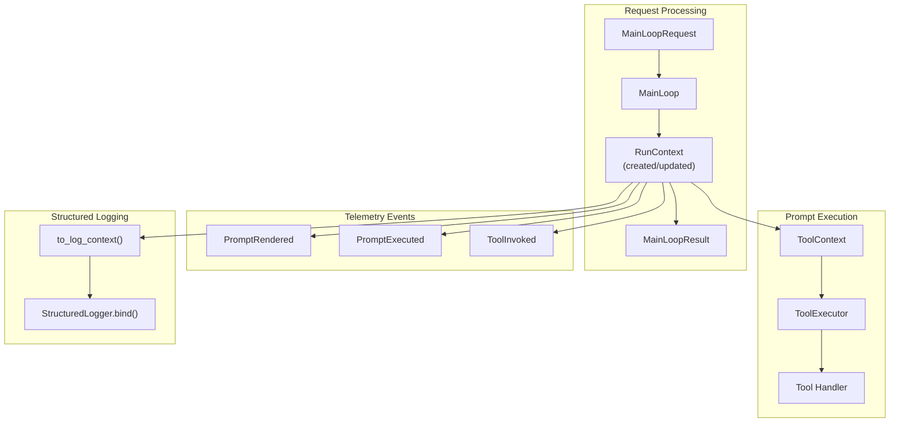

# RunContext Specification

## Purpose

`RunContext` provides immutable execution metadata that flows through the system
from `MainLoop` to tool handlers and telemetry events. It enables distributed
tracing, request correlation, and debugging across the execution lifecycle.

```python
from weakincentives.runtime import RunContext

ctx = RunContext(
    worker_id="worker-42",
    trace_id="abc-123",
    span_id="xyz-789",
)
```

**Use RunContext for:** Request correlation, distributed tracing, retry tracking,
worker identification, debugging multi-worker deployments.

## Core Type

### RunContext

```python
@FrozenDataclass()
class RunContext:
    """Immutable context capturing execution metadata for a single request run."""

    run_id: UUID = field(default_factory=uuid4)
    """Unique identifier for this execution run. Generated fresh for each run,
    distinct from request_id which may be retried."""

    request_id: UUID = field(default_factory=uuid4)
    """Correlates with MainLoopRequest.request_id. Stable across retries of
    the same logical request."""

    session_id: UUID | None = None
    """UUID of the session processing this request, if available."""

    attempt: int = 1
    """Delivery count from mailbox (1 = first attempt). Maps to
    Message.delivery_count for retry tracking."""

    worker_id: str = ""
    """Identifier for the worker processing this request. Useful for debugging
    which worker handled a request in multi-worker deployments."""

    trace_id: str | None = None
    """Optional distributed trace identifier (e.g., OpenTelemetry trace ID)."""

    span_id: str | None = None
    """Optional span identifier within the trace."""

    def to_log_context(self) -> dict[str, str | int | None]:
        """Return fields as a dict suitable for StructuredLogger.bind."""
        ...
```

## Data Flow

RunContext flows through the system at key integration points:



## Integration Points

### MainLoopRequest / MainLoopResult

Requests may include an optional `run_context` with trace/span IDs. MainLoop
creates or updates the context with execution-specific values:

```python
# Caller provides trace context
request = MainLoopRequest(
    request=MyRequest(...),
    run_context=RunContext(
        trace_id="trace-abc",
        span_id="span-xyz",
    ),
)
mailbox.send(request, reply_to=results)

# MainLoop creates full context for result
# - Fresh run_id per execution
# - request_id from input context or MainLoopRequest.request_id
# - session_id from Session
# - attempt from Message.delivery_count
# - worker_id from MainLoop
# - trace_id/span_id preserved from input
```

### ToolContext

Tool handlers receive RunContext through `ToolContext.run_context`:

```python
def my_handler(params: MyParams, *, context: ToolContext) -> ToolResult[MyOutput]:
    if context.run_context:
        log = logger.bind(**context.run_context.to_log_context())
        log.info("Processing tool call")
    return ToolResult.ok(MyOutput(...))
```

### Telemetry Events

All telemetry events include optional `run_context` for correlation:

- `PromptRendered` - emitted before prompt dispatch
- `PromptExecuted` - emitted after adapter evaluation
- `ToolInvoked` - emitted after tool handler execution

```python
# Events carry run_context for correlation
def on_tool_invoked(event: ToolInvoked) -> None:
    if event.run_context:
        print(f"Tool {event.name} in run {event.run_context.run_id}")
```

### StructuredLogger Integration

Use `to_log_context()` to bind RunContext fields to structured logs:

```python
from weakincentives.runtime import RunContext, get_logger

run_ctx = RunContext(worker_id="worker-1", trace_id="trace-abc")
log = get_logger(__name__)
bound_log = log.bind(**run_ctx.to_log_context())

bound_log.info("Processing request")
# Emits: {"run_id": "...", "request_id": "...", "attempt": 1,
#         "worker_id": "worker-1", "trace_id": "trace-abc", ...}
```

## Field Semantics

| Field | Lifecycle | Purpose |
|-------|-----------|---------|
| `run_id` | Fresh per execution | Unique execution identifier |
| `request_id` | Stable across retries | Logical request correlation |
| `session_id` | Set by MainLoop | Session correlation |
| `attempt` | From Message.delivery_count | Retry tracking |
| `worker_id` | From MainLoop | Worker identification |
| `trace_id` | Passed through | Distributed trace correlation |
| `span_id` | Passed through | Span within trace |

### run_id vs request_id

- **run_id**: Generated fresh for each execution. A retried message gets a new
  `run_id` but the same `request_id`.
- **request_id**: Stable identifier for the logical request. Preserved from
  `MainLoopRequest.request_id` or input `RunContext.request_id`.

```python
# First attempt
run_context.run_id = UUID("aaa...")  # fresh
run_context.request_id = UUID("bbb...")
run_context.attempt = 1

# Retry after visibility timeout
run_context.run_id = UUID("ccc...")  # fresh (different)
run_context.request_id = UUID("bbb...")  # same
run_context.attempt = 2
```

## Worker Configuration

Configure worker_id when creating MainLoop:

```python
loop = MyMainLoop(
    adapter=adapter,
    requests=mailbox,
    config=config,
    worker_id=f"worker-{hostname}-{pid}",
)

# Access via property
print(loop.worker_id)  # "worker-host1-1234"
```

## OpenTelemetry Integration

For OpenTelemetry integration, extract trace context before sending requests:

```python
from opentelemetry import trace

tracer = trace.get_tracer(__name__)

with tracer.start_as_current_span("process_request") as span:
    ctx = trace.get_current_span().get_span_context()
    run_context = RunContext(
        trace_id=format(ctx.trace_id, "032x"),
        span_id=format(ctx.span_id, "016x"),
    )
    request = MainLoopRequest(
        request=MyRequest(...),
        run_context=run_context,
    )
```

## Invariants

1. **Immutability**: RunContext is frozen; all fields are read-only after creation
1. **Fresh run_id per execution**: Each execution gets a new `run_id`, never reused
1. **Stable run_id during execution**: The same `run_id` is used from execution
   start through result - telemetry events during execution have the same
   `run_id` as the final `MainLoopResult`
1. **Preserved trace context**: `trace_id` and `span_id` pass through unchanged
1. **Optional everywhere**: All integration points accept `run_context: RunContext | None`

### run_id Preservation

MainLoop uses `dataclasses.replace()` to add `session_id` after execution
while preserving the same `run_id`:

```python
# Build once before execution
run_context = self._build_run_context(request_event, delivery_count, session_id=None)

# Pass to adapter during execution - telemetry events get this run_id
response, session = self._execute(request_event, run_context=run_context)

# Add session_id via replace() - preserves run_id for correlation
run_context = replace(run_context, session_id=session.session_id)
```

This ensures that `PromptRendered`, `ToolInvoked`, `PromptExecuted` events
dispatched during execution can be correlated with the final `MainLoopResult`
by `run_id`.

## Implementation Status

RunContext is fully integrated across all components:

- `ProviderAdapter.evaluate()` - accepts `run_context` parameter
- `MainLoop._handle_message()` - builds RunContext before execution
- `MainLoop._execute()` - passes `run_context` to adapter
- `InnerLoopConfig` - carries `run_context` through execution
- `ToolExecutor` - receives and propagates `run_context`
- `PromptRendered` events - includes `run_context`
- `PromptExecuted` events - includes `run_context`
- `ToolInvoked` events - includes `run_context`
- `ToolContext` - tool handlers access via `context.run_context`
- `MainLoopResult` - includes `run_context` on success and error paths

### Propagation Path

RunContext flows through the system as:

```
MainLoop._handle_message()
  └─ _build_run_context()           # Create before execution
  └─ _execute(run_context=...)
       └─ adapter.evaluate(run_context=...)
            └─ PromptRendered(run_context=...)
            └─ ToolExecutor(run_context=...)
                 └─ ToolContext(run_context=...)
                 └─ ToolInvoked(run_context=...)
            └─ PromptExecuted(run_context=...)
  └─ MainLoopResult(run_context=...)
```

### Adapter Support

All adapter implementations support `run_context`:

| Adapter | PromptRendered | ToolInvoked | PromptExecuted |
| --------------- | -------------- | ----------- | -------------- |
| OpenAI | ✓ | ✓ | ✓ |
| LiteLLM | ✓ | ✓ | ✓ |
| Claude Agent SDK | ✓ | ✓ | ✓ |

## See Also

- `specs/MAIN_LOOP.md` - MainLoop request processing
- `specs/MAILBOX.md` - Message delivery and retries
- `specs/LOGGING.md` - Structured logging
- `specs/TOOLS.md` - Tool handler context
