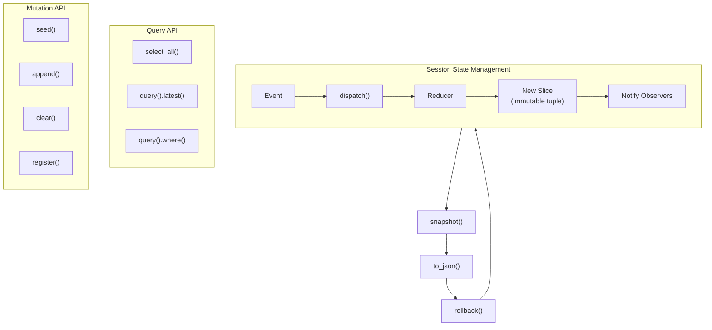
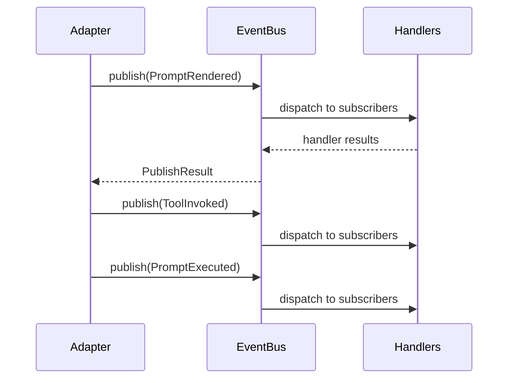

# Session Runtime Specification

## Purpose

Sessions provide a deterministic, side-effect-free container for the full
lifecycle of a prompt run. This specification covers session state management,
event emission and subscription, deadline enforcement, and budget tracking.

## Guiding Principles

- **Pure state transitions**: Reducers never mutate in place; every event
  produces a new tuple.
- **Typed first**: Event payloads route by concrete dataclass type.
- **Deterministic playback**: Sessions respond only to supported events, making
  state easy to reconstruct.
- **Publisher isolation**: Event dispatch is fire-and-forget; handler failures
  are logged and isolated.
- **No implicit globals**: Callers must provide an `EventBus` instance per
  evaluation.



## Session State

### Session

`Session` is an immutable container for accumulated dataclass instances:

```python
class Session:
    def __init__(
        self,
        *,
        bus: EventBus | None = None,  # Creates InProcessEventBus if None
        parent: Session | None = None,
        session_id: UUID | None = None,
        created_at: datetime | None = None,
        tags: Mapping[object, object] | None = None,
    ) -> None: ...

    # Properties
    @property
    def event_bus(self) -> EventBus: ...
    @property
    def parent(self) -> Session | None: ...
    @property
    def children(self) -> tuple[Session, ...]: ...
    @property
    def tags(self) -> Mapping[object, object]: ...

    def select_all[S](self, slice_type: type[S]) -> tuple[S, ...]: ...

    def query[T](self, slice_type: type[T]) -> QueryBuilder[T]: ...

    def mutate[T](self, slice_type: type[T]) -> MutationBuilder[T]: ...
    def mutate(self) -> GlobalMutationBuilder: ...

    def observe[T](self, slice_type: type[T], observer: SliceObserver[T]) -> Subscription: ...

    def snapshot(self) -> Snapshot: ...

    def clone(
        self,
        *,
        bus: EventBus,
        parent: Session | None = None,
        session_id: UUID | None = None,
        created_at: datetime | None = None,
        tags: Mapping[object, object] | None = None,
    ) -> "Session": ...
```

### Reducers

Pure functions that produce new slices from events:

```python
def reducer(
    slice_values: tuple[S, ...],
    event: DataEvent,
    *,
    context: ReducerContext,
) -> tuple[S, ...]: ...
```

Built-in reducers:

- `append` - Default, dedupes by equality
- `upsert_by(key_fn)` - Replaces items with matching key
- `replace_latest` - Stores only the most recent value
- `replace_latest_by(key_fn)` - Like `replace_latest` but keyed

### Query API

```python
latest_plan = session.query(Plan).latest()
all_results = session.query(SearchResult).all()
filtered = session.query(Issue).where(lambda i: i.severity == "high")
```

### Observer API

Observers enable reactive programming by notifying callbacks when slices change:

```python
def on_plan_change(old: tuple[Plan, ...], new: tuple[Plan, ...]) -> None:
    print(f"Plan changed: {len(old)} -> {len(new)} items")

subscription = session.observe(Plan, on_plan_change)

# Later, to stop observing:
subscription.unsubscribe()
```

**SliceObserver signature:**

```python
type SliceObserver[T] = Callable[[tuple[T, ...], tuple[T, ...]], None]
```

The observer receives `(old_values, new_values)` after each state update where the
slice actually changed.

**Subscription handle:**

```python
@dataclass
class Subscription:
    subscription_id: UUID

    def unsubscribe(self) -> bool:
        """Remove the observer. Returns True if successfully unsubscribed."""
```

**Observer behavior:**

- Observers are called synchronously after reducer execution
- Multiple observers for the same slice are called in registration order
- Observer exceptions are logged and isolated (do not affect other observers)
- Observers are only called when state actually changes (not on no-op updates)
- Observers are not copied during `session.clone()`

### Mutation API

The `mutate()` method provides a fluent interface for session state mutations:

```python
# Slice-specific mutations
session.mutate(Plan).seed(initial_plan)           # Initialize/replace slice
session.mutate(Plan).clear()                       # Remove all items
session.mutate(Plan).clear(lambda p: not p.active) # Predicate-based removal
session.mutate(Plan).dispatch(SetupPlan(...))      # Event-driven mutation
session.mutate(Plan).append(new_plan)              # Shorthand for dispatch
session.mutate(Plan).register(SetupPlan, reducer)  # Register reducer

# Session-wide mutations
session.mutate().reset()               # Clear all slices
session.mutate().rollback(snapshot)    # Restore from snapshot
```

**MutationBuilder methods:**

- `seed(values)` - Initialize or replace the slice with provided value(s). Bypasses
  reducers. Useful for initial state setup or restoration.
- `clear(predicate=None)` - Remove items from the slice. With a predicate, only
  matching items are removed. Bypasses reducers.
- `dispatch(event)` - Dispatch an event to registered reducers. This is the
  preferred mutation path as it maintains traceability.
- `append(value)` - Shorthand for dispatching when event type equals slice type.
  Uses the default `append` reducer.
- `register(data_type, reducer)` - Register a reducer for events of the given type.

**GlobalMutationBuilder methods:**

- `reset()` - Clear all stored slices while preserving reducer registrations.
- `rollback(snapshot)` - Restore session slices from the provided snapshot.

### Session Hierarchy

Sessions form a tree for nested orchestration:

```python
parent_session = Session(bus=bus)
child_session = Session(bus=bus, parent=parent_session)

# Traverse from leaves up
for session in iter_sessions_bottom_up(root_session):
    snapshot = session.snapshot()
```

## Event System



### Event Bus

In-process pub/sub for prompt lifecycle events:

```python
from weakincentives.runtime.events import InProcessEventBus

bus = InProcessEventBus()
bus.subscribe(PromptExecuted, handler)
result = bus.publish(event)

if not result.ok:
    result.raise_if_errors()  # Optional strict mode
```

### Event Types

**PromptRendered** - After render, before provider call:

```python
@FrozenDataclass()
class PromptRendered:
    prompt_ns: str
    prompt_key: str
    prompt_name: str | None
    adapter: AdapterName
    session_id: UUID | None
    render_inputs: tuple[Any, ...]
    rendered_prompt: str
    created_at: datetime
    descriptor: PromptDescriptor | None = None
    event_id: UUID = field(default_factory=uuid4)
```

**PromptExecuted** - After all tools and parsing:

```python
@FrozenDataclass()
class PromptExecuted:
    prompt_name: str
    adapter: AdapterName
    result: Any
    session_id: UUID | None
    created_at: datetime
    usage: TokenUsage | None = None
    value: Any | None = None
    event_id: UUID = field(default_factory=uuid4)
```

**ToolInvoked** - After each tool handler:

```python
@FrozenDataclass()
class ToolInvoked:
    prompt_name: str
    adapter: AdapterName
    name: str
    params: Any
    result: Any
    session_id: UUID | None
    created_at: datetime
    usage: TokenUsage | None = None
    value: Any | None = None
    rendered_output: str = ""
    call_id: str | None = None
    event_id: UUID = field(default_factory=uuid4)
```

### Publish Results

```python
@dataclass(slots=True, frozen=True)
class PublishResult:
    event: object
    handlers_invoked: tuple[EventHandler, ...]
    errors: tuple[HandlerFailure, ...]
    handled_count: int

    @property
    def ok(self) -> bool: ...

    def raise_if_errors(self) -> None: ...
```

### Delivery Semantics

- Events delivered synchronously on publisher thread
- In-order delivery per bus instance
- Handler exceptions logged and isolated (unless `raise_if_errors()` called)
- No persistence or cross-process forwarding (implement in subscribers)

## Snapshots

Capture and restore session state:

```python
# Capture
snapshot = session.snapshot()

# Serialize
json_str = snapshot.to_json()

# Restore
loaded = Snapshot.from_json(json_str)
session.mutate().rollback(loaded)
```

### Serialization

- Timestamps as timezone-aware ISO 8601
- Types as `"package.module:Class"`
- Items via dataclass serde helpers
- Schema version for compatibility

### Error Handling

- `SnapshotSerializationError` - Unsupported types or payloads
- `SnapshotRestoreError` - Incompatible schema or missing types

## Deadlines

Wall-clock limits for evaluation runs:

```python
from weakincentives.deadlines import Deadline

deadline = Deadline(expires_at=datetime.now(UTC) + timedelta(seconds=30))

response = adapter.evaluate(
    prompt,
    params,
    bus=bus,
    session=session,
    deadline=deadline,
)
```

### Deadline Object

```python
@dataclass(slots=True, frozen=True)
class Deadline:
    expires_at: datetime  # Must be timezone-aware, >1s in future

    def remaining(self, *, now: datetime | None = None) -> timedelta: ...
```

### Enforcement Checkpoints

1. **Before provider calls** - Raise if expired
1. **Before tool execution** - Raise if expired
1. **During response finalization** - Raise if expired
1. **Retry loops** - Re-check before each iteration

### Deadline Propagation

- Stored on `RenderedPrompt.deadline`
- Available via `ToolContext.deadline`

### DeadlineExceededError

```python
class DeadlineExceededError(RuntimeError):
    """Tool handler cannot complete before deadline."""
```

Converted to `PromptEvaluationError` with `phase="deadline"` by runtime.

## Budgets

Combined time and token limits:

```python
from weakincentives.budget import Budget, BudgetTracker

budget = Budget(
    deadline=Deadline(expires_at=...),
    max_total_tokens=10000,
    max_input_tokens=8000,
    max_output_tokens=2000,
)

tracker = BudgetTracker(budget)
```

### Budget Object

```python
@dataclass(slots=True, frozen=True)
class Budget:
    deadline: Deadline | None = None
    max_total_tokens: int | None = None
    max_input_tokens: int | None = None
    max_output_tokens: int | None = None
```

At least one limit must be set. Token limits must be positive.

### BudgetTracker

Thread-safe tracker for token consumption:

```python
@dataclass
class BudgetTracker:
    budget: Budget

    def record_cumulative(self, evaluation_id: str, usage: TokenUsage) -> None:
        """Record cumulative usage for an evaluation (replaces previous)."""

    @property
    def consumed(self) -> TokenUsage:
        """Sum usage across all evaluations."""

    def check(self) -> None:
        """Raise BudgetExceededError if any limit is breached."""
```

### Enforcement Checkpoints

1. **After every provider response** - Record usage, check limits
1. **After every tool call** - Check limits
1. **On evaluation completion** - Final check

### BudgetExceededError

```python
BudgetExceededDimension = Literal[
    "deadline", "total_tokens", "input_tokens", "output_tokens"
]

@FrozenDataclass()
class BudgetExceededError(WinkError, RuntimeError):
    budget: Budget
    consumed: TokenUsage
    exceeded_dimension: BudgetExceededDimension
```

Converted to `PromptEvaluationError` with `phase="budget"` by runtime.

## Usage Example

```python
from weakincentives.runtime.events import InProcessEventBus
from weakincentives.runtime.session import Session
from weakincentives.deadlines import Deadline
from weakincentives.budget import Budget, BudgetTracker

# Setup
bus = InProcessEventBus()
session = Session(bus=bus)

# Optional: register custom reducers
session.mutate(ResearchMetrics).register(ResearchSummary, update_metrics_reducer)

# Optional: observe state changes
def on_metrics_change(old: tuple[ResearchMetrics, ...], new: tuple[ResearchMetrics, ...]) -> None:
    if new:
        print(f"Metrics updated: {new[-1]}")

subscription = session.observe(ResearchMetrics, on_metrics_change)

# Configure limits
deadline = Deadline(expires_at=datetime.now(UTC) + timedelta(minutes=5))
budget = Budget(deadline=deadline, max_total_tokens=50000)
tracker = BudgetTracker(budget)

# Evaluate with constraints
response = adapter.evaluate(
    prompt,
    params,
    bus=bus,
    session=session,
    deadline=deadline,
)

# Query state
latest_plan = session.query(Plan).latest()
all_metrics = session.query(ResearchMetrics).all()

# Snapshot for persistence
snapshot = session.snapshot()
json_str = snapshot.to_json()

# Cleanup observers when done
subscription.unsubscribe()
```

## Limitations

- **Synchronous reducers**: Run on publisher thread; keep them lightweight
- **Synchronous observers**: Run after reducers on same thread; keep them lightweight
- **Dataclass focus**: Non-dataclass payloads only populate generic slices
- **No implicit eviction**: State grows; use `replace_latest` when needed
- **No mid-request cancellation**: Limits checked at checkpoints only
- **Clock synchronization**: Deadlines require synchronized UTC clocks
- **Observers not cloned**: `session.clone()` does not copy observer registrations
