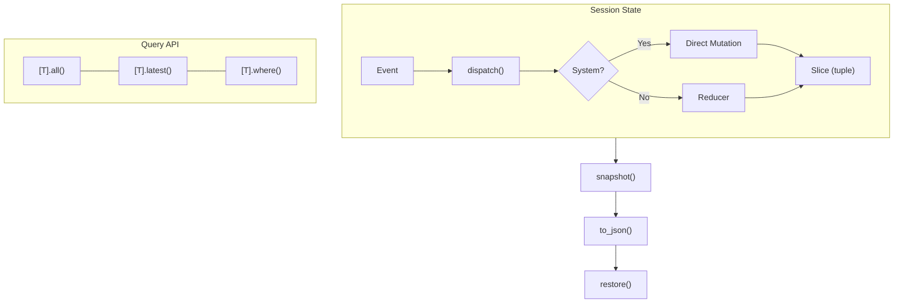

# Session Runtime Specification

Deterministic, side-effect-free container for prompt run lifecycle. Manages state
via immutable event ledgers, deadline enforcement, and budget tracking.

**Source:** `src/weakincentives/runtime/session/session.py`

## Principles

- **Pure transitions**: Reducers never mutate; every event produces a new tuple
- **Typed routing**: Events route by concrete dataclass type
- **Deterministic playback**: State reconstructs from event sequence
- **Publisher isolation**: Handler failures logged and isolated



## Session

**Definition:** `runtime/session/session.py:Session`

| Method | Description |
|--------|-------------|
| `__getitem__[T](type[T])` | Returns `SliceAccessor[T]` for queries |
| `dispatch(event)` | Broadcast event to all matching reducers |
| `snapshot()` | Capture session state |
| `restore(snapshot)` | Restore from snapshot |
| `reset()` | Clear all slices |
| `install(slice_type)` | Register declarative state slice |
| `clone(...)` | Create session with same reducers, fresh state |

## Reducers

Pure functions producing new slices. **Definition:** `runtime/session/_reducers.py`

| Built-in | Behavior |
|----------|----------|
| `append_all` | Ledger semantics, always appends (default) |
| `upsert_by(key_fn)` | Replace items with matching key |
| `replace_latest` | Store only most recent value |
| `replace_latest_by(key_fn)` | `replace_latest` with key function |

### Declarative Reducers

Co-locate reducers as methods on the dataclass using `@reducer`:

```python
@dataclass(frozen=True)
class AgentPlan:
    steps: tuple[str, ...] = ()

    @reducer(on=AddStep)
    def add_step(self, event: AddStep) -> "AgentPlan":
        return replace(self, steps=(*self.steps, event.step))

session.install(AgentPlan)  # Auto-registers all @reducer methods
```

## System Events

**Definition:** `runtime/session/session.py`

| Event | Purpose |
|-------|---------|
| `InitializeSlice[T]` | Replace all values in a slice |
| `ClearSlice[T]` | Remove items (optionally with predicate) |

Handled before normal reducer dispatch for consistent behavior.

## Event System

**Definition:** `runtime/events/`

| Event | When |
|-------|------|
| `PromptRendered` | After render, before provider call |
| `PromptExecuted` | After all tools and parsing |
| `ToolInvoked` | After each tool handler |

```python
dispatcher = InProcessDispatcher()
dispatcher.subscribe(PromptExecuted, handler)
result = dispatcher.dispatch(event)
result.raise_if_errors()  # Optional strict mode
```

**Delivery:** Synchronous, in-order, handler exceptions isolated.

## Snapshots

**Definition:** `runtime/session/_snapshot.py`

```python
snapshot = session.snapshot()
json_str = snapshot.to_json()
session.restore(Snapshot.from_json(json_str))
```

- Timestamps as timezone-aware ISO 8601
- Types as `"package.module:Class"`
- Schema version for compatibility

## Deadlines

**Definition:** `src/weakincentives/deadlines.py`

Wall-clock limits checked at: before provider calls, before tool execution,
during response finalization, retry loops.

```python
deadline = Deadline(expires_at=datetime.now(UTC) + timedelta(seconds=30))
response = adapter.evaluate(prompt, session=session, deadline=deadline)
```

Propagated via `RenderedPrompt.deadline` and `ToolContext.deadline`.

## Budgets

**Definition:** `src/weakincentives/budget.py`

Combined time and token limits:

```python
budget = Budget(
    deadline=Deadline(...),
    max_total_tokens=10000,
    max_input_tokens=8000,
    max_output_tokens=2000,
)
tracker = BudgetTracker(budget)
```

`BudgetTracker` is thread-safe. Records cumulative usage per evaluation ID.

**Checkpoints:** After every provider response, after every tool call, on
evaluation completion.

## Session Hierarchy

Sessions form trees for nested orchestration:

```python
child = Session(dispatcher=dispatcher, parent=parent_session)
for s in iter_sessions_bottom_up(root): s.snapshot()
```

## Errors

| Error | Cause |
|-------|-------|
| `SnapshotSerializationError` | Unsupported types |
| `SnapshotRestoreError` | Incompatible schema |
| `DeadlineExceededError` | Time budget exhausted |
| `BudgetExceededError` | Token limit breached |

## Limitations

- Synchronous reducers only
- Non-dataclass payloads use generic slices
- No implicit eviction (use `replace_latest`)
- Limits checked at checkpoints only
- Requires synchronized UTC clocks
